# WEBSERV - Diagramas de Flujo (Mermaid)

Este archivo contiene los diagramas de flujo del servidor webserv en formato Mermaid.
Para visualizarlos, usa un visor de Markdown compatible (VS Code, GitHub, etc.) o
copia el código a https://mermaid.live

---

## 1. Diagrama de Arquitectura General

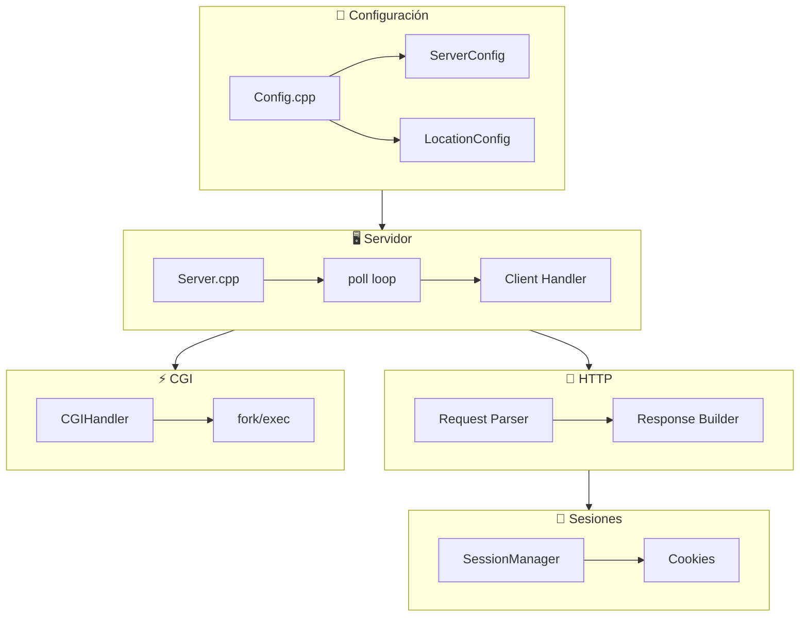

---

## 2. Bucle Principal del Servidor

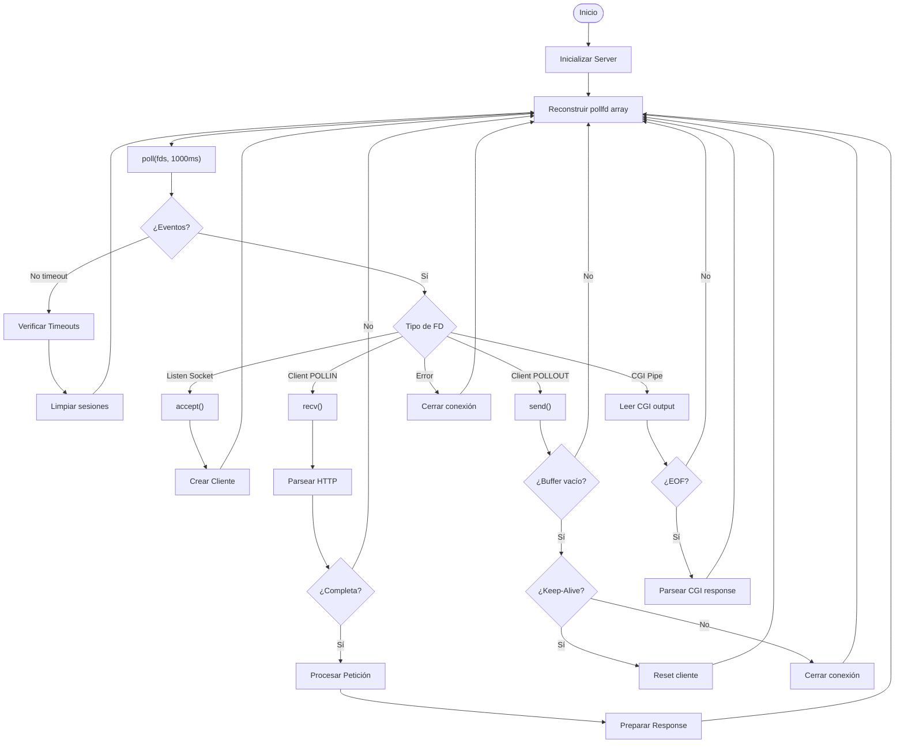

---

## 3. Procesamiento de Petición HTTP

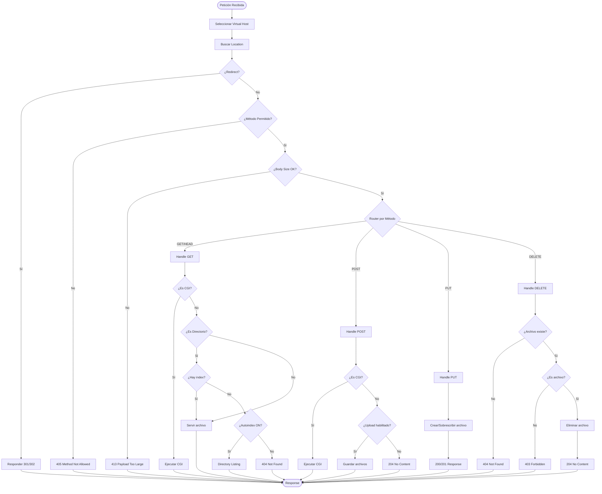

---

## 4. Parser de Request HTTP

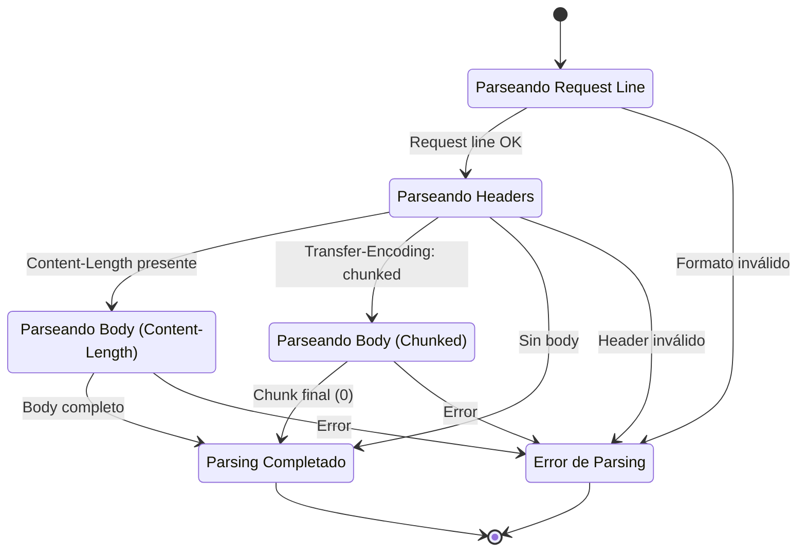

---

## 5. Ejecución de CGI

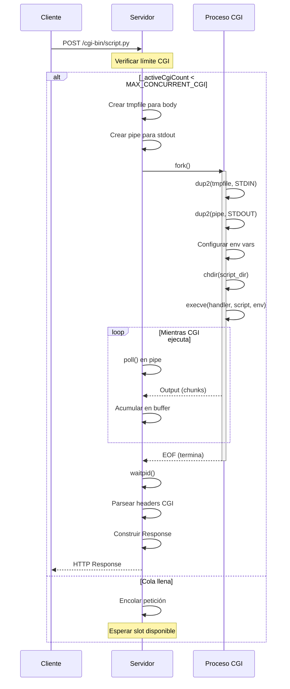

---

## 6. Gestión de Conexiones Keep-Alive

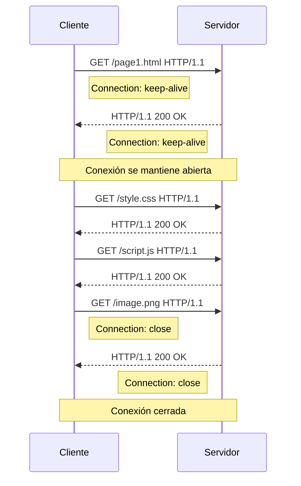

---

## 7. Selección de Virtual Host

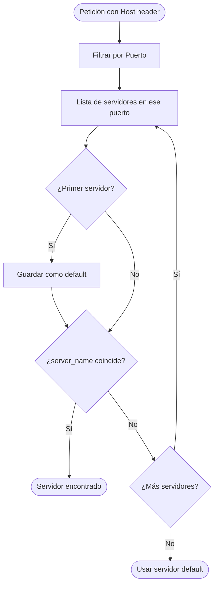

---

## 8. Estados del Cliente

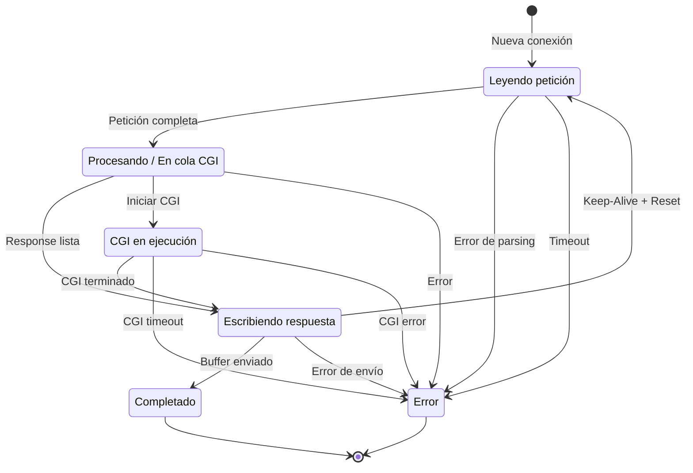

---

## 9. Parsing de Multipart/form-data

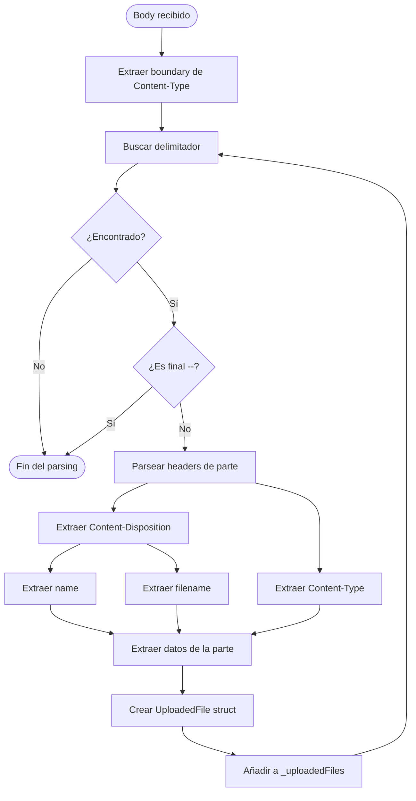

---

## 10. Timeouts y Limpieza

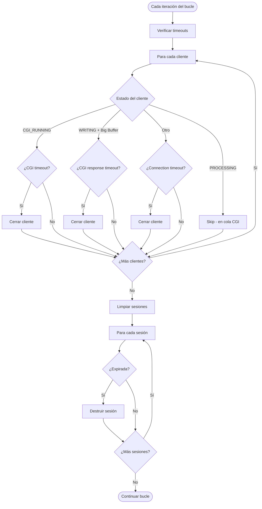

---

## 11. Secuencia de Petición HTTP Completa

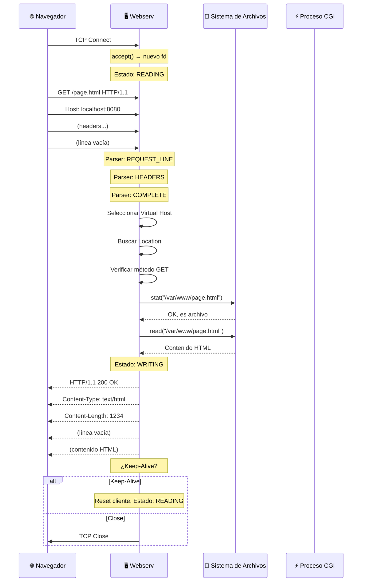

---

## Notas de Visualización

Para visualizar estos diagramas:

1. **VS Code**: Instala la extensión "Markdown Preview Mermaid Support"
2. **GitHub**: Los diagramas se renderizan automáticamente en archivos .md
3. **Online**: Copia el código a https://mermaid.live
4. **Obsidian**: Soporte nativo de Mermaid
5. **GitLab**: Soporte nativo en archivos Markdown

---

*Diagramas generados para la documentación de webserv - 42 Barcelona*
