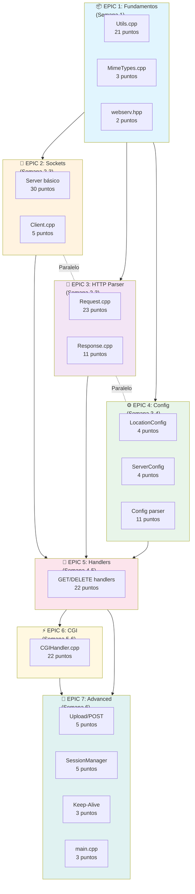

## Distribución Recomendada por Desarrollador

### Si son 3 desarrolladores:

```
┌──────────────────────────────────────────────────────────────────────────────┐
│                        TIMELINE DE DESARROLLO                                │
├──────────────────────────────────────────────────────────────────────────────┤
│                                                                              │
│  Semana    │ 1      │ 2      │ 3      │ 4      │ 5         │ 6      │ 7      │
│  ──────────┼────────┼────────┼────────┼────────┼───────────┼────────┼────────│
│  Dev A     │ Epic1  │ Epic3 ─────────►│ Epic5 ────────────►│ Epic7  │ Tests  │
│  (Parser)  │ Utils  │ Request/Response│ Handlers           │ K-Alive│        │
│            │        │                 │                    │        │        │
│  Dev B     │ Epic1  │ Epic2 ──────────────────►│ Epic5     │ Epic7  │ Tests  │
│  (Network) │ Utils  │ Server/Client/Poll       │ Handlers  │ Upload │        │
│            │        │                          │           │        │        │
│  Dev C     │ Epic1  │ Epic4 ─────────►│ Epic5  │ Epic6 ────────────►│ Tests  │
│  (Config)  │ MIME   │ Config parser   │ Errors │ CGI Handler        │        │
│            │        │                 │        │                    │        │
└──────────────────────────────────────────────────────────────────────────────┘
```

### Asignación detallada:

| Desarrollador | Issues Asignados                                           | Puntos Totales |
|---------------|------------------------------------------------------------|----------------|
| **Dev A**     | #15-20 (Request), #21-23 (Response), #28, #30, #41         | ~55 puntos     |
| **Dev B**     | #8-14 (Server/Client), #29, #31-33, #39                    | ~55 puntos     |
| **Dev C**     | #1-7 (Utils), #24-27 (Config), #32, #34-38 (CGI), #40, #42 | ~55 puntos     |

## Hitos de Integración

```
                    ┌──────────────────┐
                    │  Semana 2        │
                    │  INTEGRACIÓN 1   │
                    │  Server acepta   │
                    │  conexiones TCP  │
                    └────────┬─────────┘
                             │
                    ┌────────▼─────────┐
                    │  Semana 3        │
                    │  INTEGRACIÓN 2   │
                    │  Parser HTTP     │
                    │  funcional       │
                    └────────┬─────────┘
                             │
                    ┌────────▼─────────┐
                    │  Semana 4        │
                    │  INTEGRACIÓN 3   │
                    │  Config + GET    │
                    │  archivos        │
                    └────────┬─────────┘
                             │
                    ┌────────▼─────────┐
                    │  Semana 5        │
                    │  INTEGRACIÓN 4   │
                    │  CGI funcionando │
                    └────────┬─────────┘
                             │
                    ┌────────▼─────────┐
                    │  Semana 6-7      │
                    │  RELEASE         │
                    │  Servidor        │
                    │  completo        │
                    └──────────────────┘
```

## Criterios de Done por Epic

### Epic 1 - Fundamentos ✅
- [ ] Todos los tests de Utils pasan
- [ ] MimeTypes reconoce extensiones básicas
- [ ] No hay memory leaks

### Epic 2 - Sockets ✅
- [ ] Server escucha en puerto configurado
- [ ] Acepta múltiples conexiones
- [ ] Maneja SIGINT gracefully

### Epic 3 - HTTP Parser ✅
- [ ] Parsea peticiones GET, POST, DELETE
- [ ] Maneja chunked encoding
- [ ] Genera respuestas HTTP válidas

### Epic 4 - Config ✅
- [ ] Lee archivo de configuración NGINX-like
- [ ] Múltiples servers y locations
- [ ] Valida configuración

### Epic 5 - Handlers ✅
- [ ] Sirve archivos estáticos
- [ ] Directory listing funciona
- [ ] DELETE elimina archivos

### Epic 6 - CGI ✅
- [ ] Ejecuta scripts Python/PHP
- [ ] Pasa variables de entorno correctas
- [ ] Timeout de CGI funciona

### Epic 7 - Advanced ✅
- [ ] Upload de archivos funciona
- [ ] Keep-alive mantiene conexiones
- [ ] Sesiones funcionan
