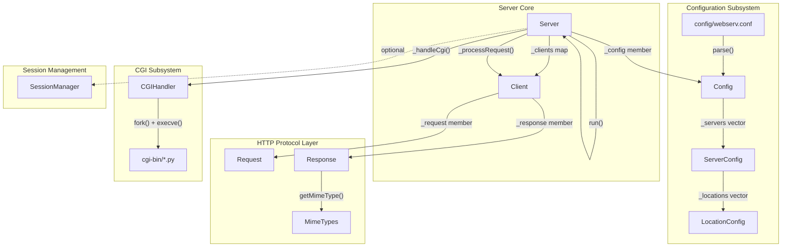
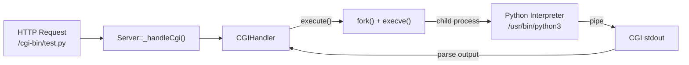
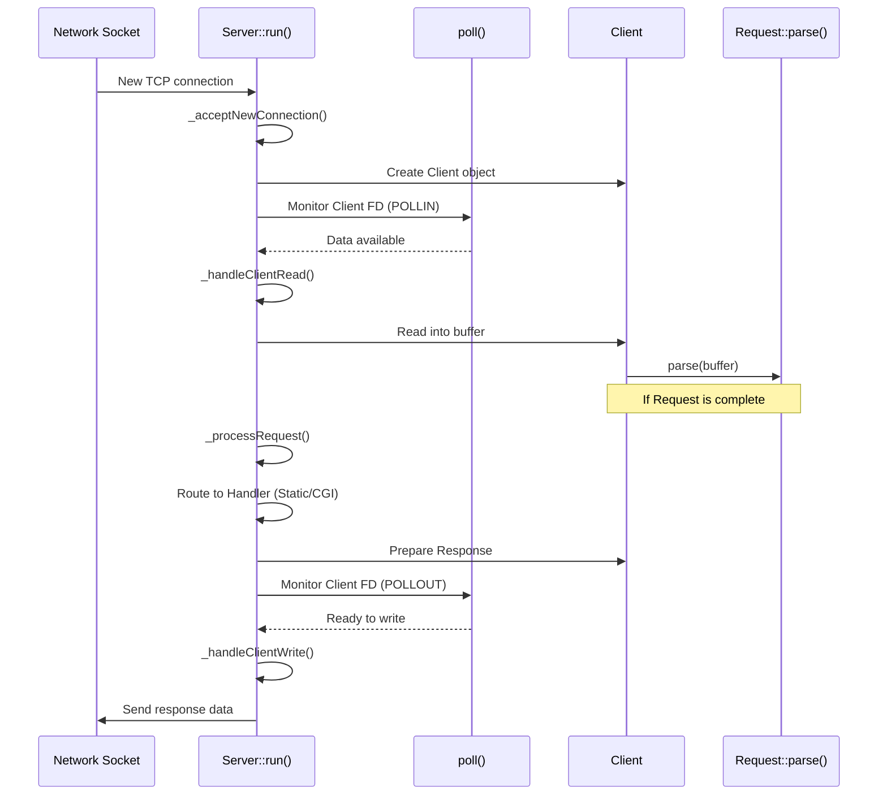

# Webserv Overview

<details>
<summary>Relevant source files</summary>

The following files were used as context for generating this page:

- [Makefile](Makefile)
- [inc/webserv.hpp](inc/webserv.hpp)
- [src/main.cpp](src/main.cpp)
- [www/index.html](www/index.html)

</details>


## Purpose and Scope

This page provides a high-level introduction to the webserv HTTP server project, explaining its purpose, architecture, and key capabilities. Webserv is a custom-built HTTP/1.1 server implementation written in C++98 that supports static file serving, CGI execution, file uploads, and virtual hosting.

Webserv is designed as a non-blocking, event-driven server that implements core web server functionality without relying on external libraries, adhering to the requirements of the 42 School's webserv project.

**Key characteristics:**
- **Event-driven architecture**: Uses `poll()` for I/O multiplexing across multiple connections [inc/webserv.hpp:42](), [src/server/Server.cpp]().
- **HTTP/1.1 compliant**: Implements GET, POST, PUT, DELETE methods with proper status codes [inc/webserv.hpp:74-97]().
- **CGI support**: Executes dynamic scripts (Python, PHP, etc.) via the CGI/1.1 protocol [inc/cgi/CGIHandler.hpp:1-60]().
- **Virtual hosting**: Supports multiple server configurations differentiated by the `Host` header [inc/config/Config.hpp:32-70]().
- **Configuration-driven**: Nginx-inspired configuration syntax for flexible server setup [src/main.cpp:149-164]().
- **Connection persistence**: HTTP/1.1 keep-alive support managed via connection timeouts [inc/webserv.hpp:68]().

**Sources:** [inc/webserv.hpp:13-111](), [src/main.cpp:110-190](), [inc/server/Server.hpp:25-107]()

---

## Core Components

Webserv consists of several subsystems. The following diagram maps high-level system concepts to their corresponding C++ classes and file structures:

### System Architecture with Code Entities



**Sources:** [inc/server/Server.hpp:25-107](), [inc/server/Client.hpp:31-123](), [inc/config/Config.hpp:32-70](), [inc/webserv.hpp:46-58]()

---

## Key Features

### HTTP Protocol Support

| Feature | Implementation | Reference |
|---------|---------------|-----------|
| **Methods** | GET, POST, PUT, DELETE | [inc/webserv.hpp:74-97]() |
| **Status Codes** | 200, 201, 204, 301, 400, 403, 404, 405, 413, 500, etc. | [inc/webserv.hpp:74-97]() |
| **Keep-Alive** | Persistent connections with configurable timeouts | [inc/webserv.hpp:68]() |
| **Chunked Transfer** | Parsing support for chunked request bodies | [inc/http/Request.hpp]() |

### Server Capabilities

| Capability | Description | Related Component |
|------------|-------------|-------------------|
| **Virtual Hosting** | Multiple servers on same port with different `server_name` | `Config` class |
| **Location Matching** | URI-based routing with prefix matching | `ServerConfig`, `LocationConfig` |
| **Auto-indexing** | Directory listing generation | `Server` class logic |
| **File Uploads** | Multipart form data and PUT method support | `upload.py`, `Request` class |
| **Error Pages** | Custom error pages via `error_page` directive | `ServerConfig` |

### CGI Execution

Webserv implements CGI/1.1 for executing dynamic scripts, primarily tested with Python scripts in the `cgi-bin/` directory.



**Sources:** [inc/cgi/CGIHandler.hpp:1-60](), [inc/webserv.hpp:66-70](), [www/index.html:118-126]()

---

## Request Processing Lifecycle

The following diagram traces an HTTP request through the server's event loop and internal state machine:



**Sources:** [src/main.cpp:183-187](), [inc/server/Server.hpp:38-106](), [inc/server/Client.hpp:22-29](), [inc/webserv.hpp:61-71]()

---

## Project Directory Structure

The codebase is organized into modular directories:

- **inc/**: Header files organized by module (config, http, server, cgi, session, utils) [inc/webserv.hpp:46-58]().
- **src/**: C++ implementation files matching the header structure [Makefile:15]().
- **config/**: Default configuration files like `webserv.conf` [src/main.cpp:22]().
- **cgi-bin/**: Python CGI scripts for testing (`test.py`, `upload.py`, `session.py`) [www/index.html:121-124]().
- **www/**: Static web root containing `index.html` and test assets [www/index.html:1-114]().
- **obj/ & dep/**: Build artifacts (objects and dependency files) [Makefile:16-17]().

**Sources:** [Makefile:13-17](), [inc/webserv.hpp:46-58](), [src/main.cpp:22-25]()

---

## Build and Execution

The project uses a standard `Makefile` for compilation and process management.

**Compilation targets:**
- `make`: Builds the `webserv` binary in the `bin/` directory [Makefile:87-90]().
- `make debug`: Compiles with `-g -O0 -DDEBUG_MODE` for debugging [Makefile:113-114]().
- `make clean/fclean`: Removes object files and binaries [Makefile:105-111]().
- `make run`: Builds and executes the server with the default config [Makefile:122-123]().

**Execution:**
The server accepts an optional path to a configuration file. If none is provided, it defaults to `./config/webserv.conf` [src/main.cpp:22](), [src/main.cpp:113-135]().

```bash
./bin/webserv [configuration_file]
```

**Sources:** [Makefile:1-138](), [src/main.cpp:110-145]()

---

## Key Design Patterns

| Pattern | Implementation | Purpose |
|---------|---------------|---------|
| **Event Loop** | `Server::run()` with `poll()` | Non-blocking handling of multiple clients [inc/webserv.hpp:42](). |
| **State Machine** | `Client` connection states | Manage transitions between reading, processing, and writing [inc/server/Client.hpp](). |
| **Singleton** | `MimeTypes`, `SessionManager` | Global access to MIME mappings and session data [inc/http/MimeTypes.hpp](), [inc/session/SessionManager.hpp](). |
| **RAII** | Socket and file descriptor management | Ensure resources are closed on object destruction [inc/server/Server.hpp](). |

**Sources:** [inc/webserv.hpp:46-58](), [src/main.cpp:169-183](), [inc/server/Server.hpp:25-107]()

---
