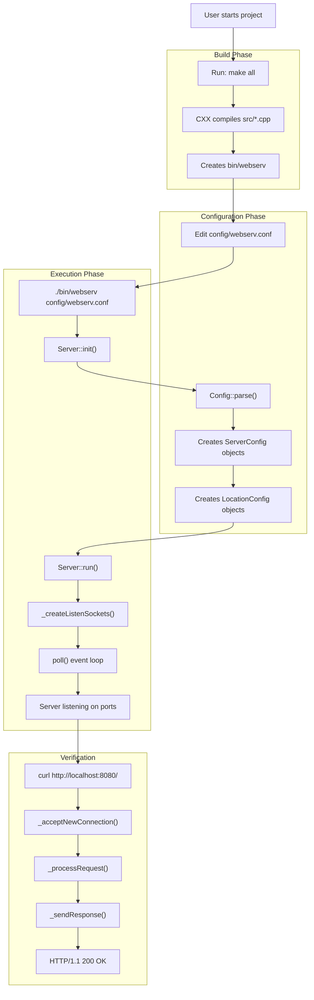
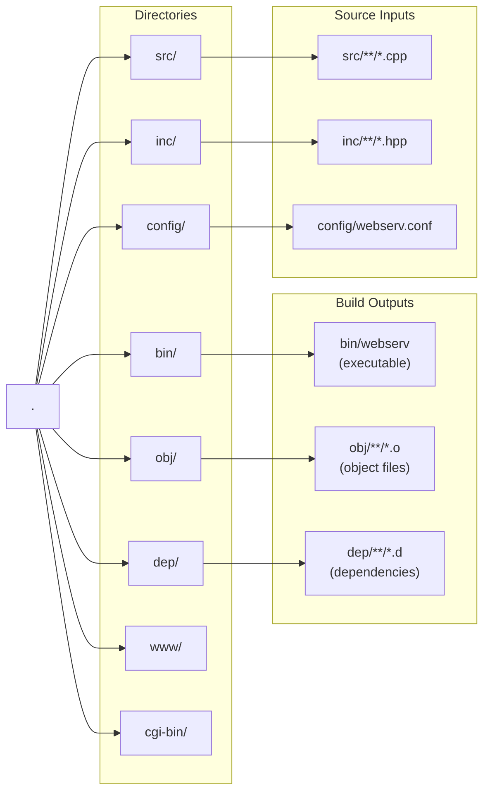
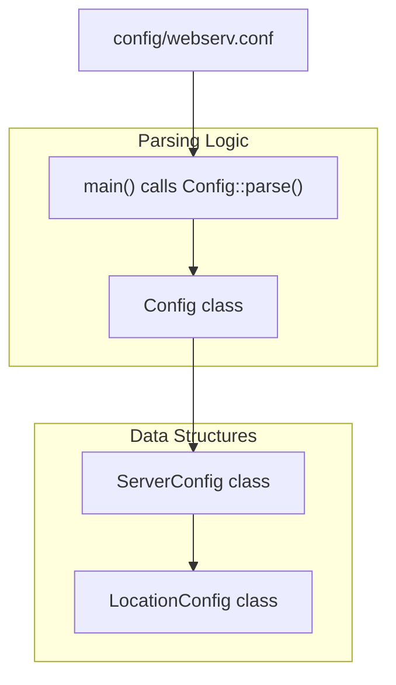

# Getting Started

<details>
<summary>Relevant source files</summary>

The following files were used as context for generating this page:

- [Makefile](Makefile)
- [config/webserv.conf](config/webserv.conf)
- [src/main.cpp](src/main.cpp)

</details>


## Purpose and Scope

This guide provides the essential steps to build, configure, and launch the webserv HTTP server. It covers the complete workflow from compilation to serving HTTP requests, including basic configuration and verification. For detailed information about specific topics:

- For build system details and compilation options, see [Building the Project](#2.1)
- For comprehensive configuration directives and syntax, see [Basic Configuration](#2.2) and [Configuration Reference](#7)
- For server management and monitoring, see [Running the Server](#2.3)
- For architectural internals, see [Architecture](#3)

---

## Quick Start Workflow

The following diagram illustrates the complete startup process, mapping user actions to code entities:



**Sources:** [Makefile:1-138](), [src/main.cpp:110-190](), [config/webserv.conf:1-220]()

---

## Prerequisites

Before building webserv, ensure the following are installed:

| Requirement | Purpose | Verification Command |
|------------|---------|---------------------|
| **C++ Compiler** | Compiles C++98 source code | `c++ --version` |
| **Make** | Executes build automation | `make --version` |
| **Python 3** | Runs CGI scripts (optional) | `python3 --version` |
| **PHP CGI** | Runs PHP CGI scripts (optional) | `php-cgi --version` |
| **Perl** | Runs Perl CGI scripts (optional) | `perl --version` |

**Note:** The server will compile and run without interpreters, but CGI functionality requires them as configured in the location blocks.

**Sources:** [Makefile:19-24](), [config/webserv.conf:85-89]()

---

## Building the Server

### Standard Build

The default build process creates the `bin/webserv` executable:

```bash
make all
```

This compiles all source files in `src/` (excluding tests) with the following flags specified in [Makefile:22]():
- `-Wall -Wextra -Werror`: Strict error checking.
- `-std=c++98`: C++98 standard compliance.
- `-pedantic-errors`: Enforce standard conformance.

### Build Targets

| Target | Command | Output | Purpose |
|--------|---------|--------|---------|
| **Default** | `make` or `make all` | `bin/webserv` | Standard production build [Makefile:87]() |
| **Debug** | `make debug` | `bin/webserv` (with symbols) | Includes `-g -O0 -DDEBUG_MODE` [Makefile:113-114]() |
| **Clean** | `make clean` | N/A | Removes object and dependency files [Makefile:105-106]() |
| **Full Clean** | `make fclean` | N/A | Removes all build artifacts [Makefile:108-109]() |
| **Rebuild** | `make re` | `bin/webserv` | Full clean + rebuild [Makefile:111]() |
| **Tests** | `make Utils_test1` | `bin/webserv_test1` | Builds unit test executable [Makefile:38-41]() |

### Directory Structure After Build



**Sources:** [Makefile:13-62](), [Makefile:89-116]()

For detailed compilation process and troubleshooting, see [Building the Project](#2.1).

---

## Configuration Overview

### Configuration File Structure

The server reads its configuration from `config/webserv.conf` by default [src/main.cpp:22](). The configuration hierarchy maps to C++ classes during parsing:



**Sources:** [src/main.cpp:150-159](), [config/webserv.conf:18-219]()

### Minimal Configuration

The simplest valid configuration requires a `server` block with a `listen` directive:

```
server {
    listen 0.0.0.0:8080;
    root ./www;
}
```

This configuration:
- Creates a listening socket on port 8080.
- Serves files from the `./www` directory.
- Defaults `autoindex` to off and `client_max_body_size` to 1MB [config/webserv.conf:27-29]().

### Essential Directives

| Directive | Scope | Purpose | Example |
|-----------|-------|---------|---------|
| `listen` | `server` | Binds to IP:port | `listen 0.0.0.0:8080;` [config/webserv.conf:19]() |
| `server_name` | `server` | Virtual host names | `server_name localhost;` [config/webserv.conf:21]() |
| `root` | `server`, `location` | Document root directory | `root ./www;` [config/webserv.conf:23]() |
| `methods` | `location` | Allowed HTTP methods | `methods GET POST;` [config/webserv.conf:39]() |
| `cgi` | `location` | CGI handler mapping | `cgi .py /usr/bin/python3;` [config/webserv.conf:85]() |
| `upload_store` | `location` | File upload directory | `upload_store ./www/uploads;` [config/webserv.conf:97]() |

**Sources:** [config/webserv.conf:18-135]()

For complete directive reference and advanced configuration patterns, see [Basic Configuration](#2.2) and [Configuration Reference](#7).

---

## Running the Server

### Starting the Server

After building, start the server with a configuration file:

```bash
./bin/webserv config/webserv.conf
```

If no argument is provided, the server defaults to `./config/webserv.conf` [src/main.cpp:22, 113](). Alternatively, use the make targets:

```bash
make run          # Runs with config/webserv.conf
make run-default  # Runs with default binary path
```

**Sources:** [Makefile:122-126](), [src/main.cpp:110-135]()

### Server Lifecycle

The server follows a structured lifecycle managed in `main.cpp`:

1.  **Signal Setup**: Sets up handlers for `SIGINT` and `SIGTERM` for graceful shutdown [src/main.cpp:46-65]().
2.  **Config Parsing**: Loads and validates the `.conf` file [src/main.cpp:150-161]().
3.  **Initialization**: The `Server` object initializes sockets based on the config [src/main.cpp:172-176]().
4.  **Execution**: Enters the `server.run()` event loop [src/main.cpp:183]().

### Verification

Once the server is running, verify functionality with basic HTTP requests:

```bash
# Test basic GET request
curl http://localhost:8080/

# Test virtual hosting (example.local)
curl -H "Host: example.local" http://localhost:8080/
```

Expected outputs:

| Request | Expected Status | Notes |
|---------|----------------|-------|
| `GET /` | 200 OK | Serves index.html from `./www` [config/webserv.conf:38-41]() |
| `POST /post_body` | 200/413 | Max body size 100 bytes [config/webserv.conf:61-64]() |
| `GET /nonexistent` | 404 Not Found | Uses custom error page [config/webserv.conf:31]() |

For detailed server management and monitoring, see [Running the Server](#2.3).

---

## Memory and Debugging

For development, use the built-in memory checking and debug targets:

```bash
make debug    # Rebuilds with -g and -DDEBUG_MODE [Makefile:113]
make valgrind # Runs server under valgrind with leak detection [Makefile:128]
```

The `valgrind` target uses a suppression file `.valgrind.supp` to ignore known system-level noise [Makefile:130]().

---

## Common Issues

### Build Failures
- **Compiler Missing**: Ensure `c++` (supporting C++98) is installed [Makefile:19]().
- **Clean Build**: If files are moved, run `make fclean` before `make` [Makefile:108]().

### Runtime Issues
- **Config Not Found**: Ensure the path passed to the binary is correct [src/main.cpp:141-145]().
- **Port Conflict**: Check if another process is using port 8080 [config/webserv.conf:19]().
- **Signal Handling**: The server ignores `SIGPIPE` to prevent crashes during socket writes [src/main.cpp:64]().

**Sources:** [Makefile:1-138](), [src/main.cpp:1-190](), [config/webserv.conf:1-220]()

---
