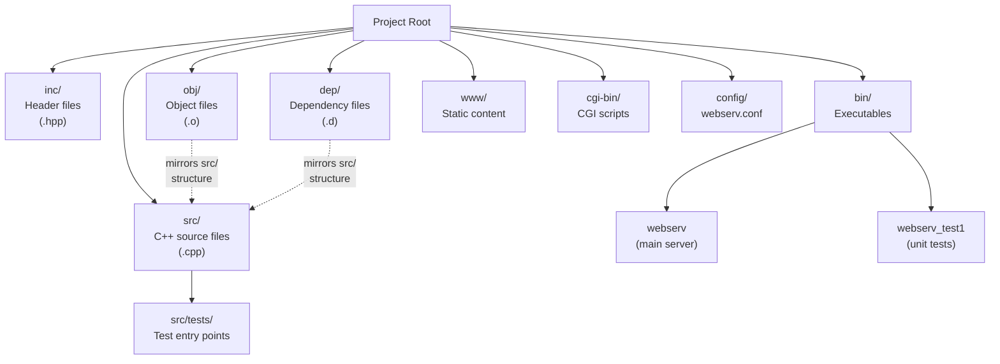
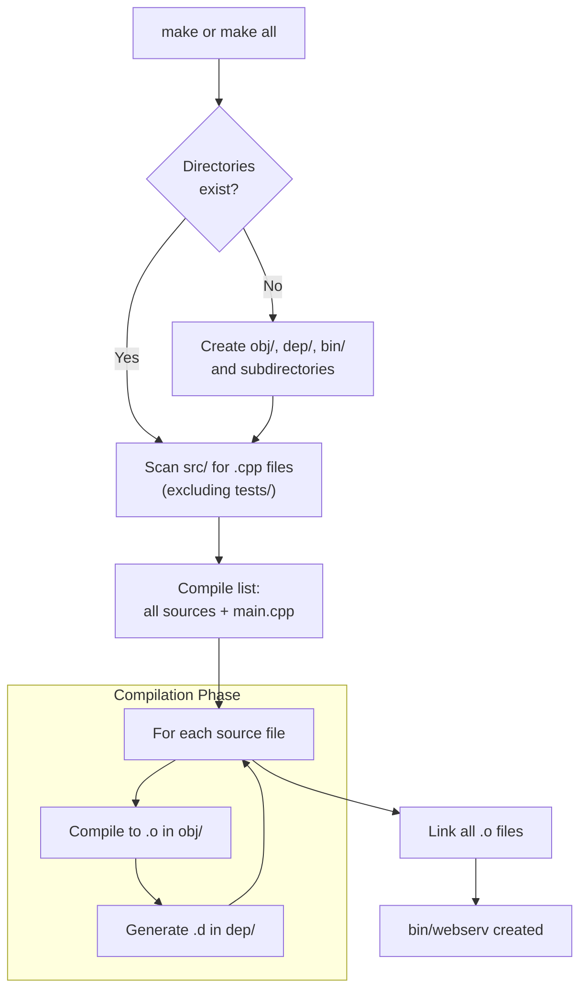
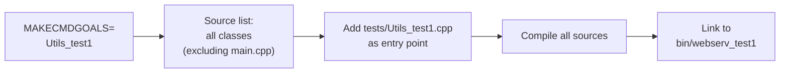
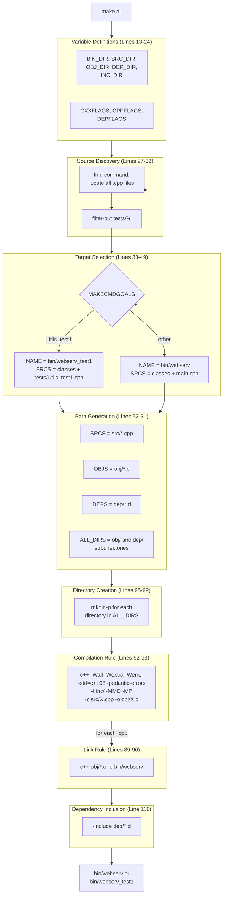

# Building the Project

<details>
<summary>Relevant source files</summary>

The following files were used as context for generating this page:

- [Makefile](Makefile)
- [inc/webserv.hpp](inc/webserv.hpp)

</details>


## Purpose and Scope

This page explains the webserv build system, including Makefile targets, compilation flags, directory organization, and the process of building both the main server executable and test binaries. For information on configuring the server after building, see [Basic Configuration](2.2). For running the compiled server, see [Running the Server](2.3).

---

## Build System Overview

The webserv project uses a GNU Make-based build system with automatic dependency tracking. The Makefile orchestrates compilation of C++ sources with strict compliance to the C++98 standard and 42 School coding requirements. It supports conditional compilation for different targets (main server vs. test executables) and generates build artifacts in parallel directory structures to keep the source tree clean.

The build system automatically:
- Creates necessary directories (`obj/`, `dep/`, `bin/`) [Makefile:13-17]()
- Compiles each `.cpp` file to a corresponding `.o` file [Makefile:92-93]()
- Tracks header dependencies to trigger recompilation when needed [Makefile:24, 116]()
- Links object files into the final executable [Makefile:89-90]()

**Sources:** [Makefile:1-138]()

---

## Directory Structure

The project follows a structured layout that separates sources, headers, build artifacts, and runtime resources:

### Project Layout Diagram


**Directory Definitions:**

| Directory | Purpose | Created By | Contents |
|-----------|---------|------------|----------|
| `src/` | Source files | Developer | All .cpp implementation files [Makefile:15]() |
| `inc/` | Header files | Developer | All .hpp interface files [Makefile:14]() |
| `obj/` | Object files | Makefile | Compiled .o files mirroring src/ structure [Makefile:16]() |
| `dep/` | Dependencies | Makefile | Auto-generated .d files for header tracking [Makefile:17]() |
| `bin/` | Executables | Makefile | webserv and test binaries [Makefile:13]() |
| `www/` | Static content | Developer | HTML, CSS, images for serving |
| `cgi-bin/` | CGI scripts | Developer | Python scripts for dynamic content [Makefile:78]() |
| `config/` | Configuration | Developer | webserv.conf and variants [Makefile:80]() |
| `src/tests/` | Test sources | Developer | Test entry points (excluded from main build) [Makefile:27]() |

**Sources:** [Makefile:13-17](), [Makefile:26-27](), [Makefile:56-61](), [Makefile:78-80]()

---

## Build Targets

The Makefile provides several targets for building, cleaning, and running the server:

### Standard Build Targets

| Target | Command | Output | Description |
|--------|---------|--------|-------------|
| `all` | `make` or `make all` | `bin/webserv` | Default target; builds main server executable [Makefile:87]() |
| `clean` | `make clean` | — | Removes obj/ and dep/ directories [Makefile:105-106]() |
| `fclean` | `make fclean` | — | Performs clean + removes bin/webserv [Makefile:108-109]() |
| `re` | `make re` | `bin/webserv` | Performs fclean + rebuilds (clean rebuild) [Makefile:111]() |
| `debug` | `make debug` | `bin/webserv` | Rebuilds with debug flags enabled [Makefile:113-114]() |

### Test Build Targets

| Target | Command | Output | Description |
|--------|---------|--------|-------------|
| `Utils_test1` | `make Utils_test1` | `bin/webserv_test1` | Builds unit test executable for Utils class [Makefile:38-41, 101]() |

### Run Targets

| Target | Command | Description |
|--------|---------|-------------|
| `run` | `make run` | Builds and runs server with config/webserv.conf [Makefile:122-123]() |
| `run-default` | `make run-default` | Builds and runs server with default configuration [Makefile:125-126]() |
| `valgrind` | `make valgrind` | Runs server under valgrind with full leak checking [Makefile:128-130]() |
| `valgrind-quiet` | `make valgrind-quiet` | Runs server under valgrind with summary output [Makefile:132-133]() |

**Sources:** [Makefile:87-137]()

---

## Compilation Flags

The build system enforces strict compilation standards for code quality and portability:

### Compiler Configuration

```makefile
CXX      := c++
CXXFLAGS := -Wall -Wextra -Werror -std=c++98 -pedantic-errors
CPPFLAGS := -I$(INC_DIR)
```

**Flag Explanations:**

| Flag | Purpose |
|------|---------|
| `-Wall` | Enable all common warnings [Makefile:22]() |
| `-Wextra` | Enable additional warnings beyond -Wall [Makefile:22]() |
| `-Werror` | Treat all warnings as compilation errors [Makefile:22]() |
| `-std=c++98` | Enforce C++98 standard (42 School requirement) [Makefile:22]() |
| `-pedantic-errors` | Strictly enforce ISO C++ standard compliance [Makefile:22]() |
| `-I$(INC_DIR)` | Add inc/ to include path for header resolution [Makefile:23]() |

### Debug Mode Flags

When building with `make debug`, additional flags are added:

| Flag | Purpose |
|------|---------|
| `-g` | Include debugging symbols for gdb/lldb [Makefile:113]() |
| `-O0` | Disable optimizations for accurate debugging [Makefile:113]() |
| `-DDEBUG_MODE` | Define DEBUG_MODE preprocessor macro [Makefile:113]() |

**Sources:** [Makefile:19-24](), [Makefile:113-114]()

---

## Building the Main Server

To build the main server executable:

```bash
make
# or explicitly
make all
```

This produces `bin/webserv`, which can be run with:

```bash
./bin/webserv config/webserv.conf
```

### Build Process Logic
The Makefile uses conditional logic to determine which sources to compile. For the default build, all sources except test files are compiled along with `main.cpp` as the entry point [Makefile:46-49]().



**Sources:** [Makefile:38-49](), [Makefile:87-93]()

---

## Building Test Executables

The build system supports compiling test executables with different entry points. Currently, the system supports `Utils_test1` [Makefile:38-41]().

```bash
make Utils_test1
```

This produces `bin/webserv_test1`, which contains all server classes but uses `src/tests/Utils_test1.cpp` as its entry point instead of `main.cpp` [Makefile:41]().

### Test Build Source Selection
The Makefile identifies the target goal and swaps the main entry point:



**Sources:** [Makefile:38-44](), [Makefile:101]()

---

## Automatic Dependency Tracking

The build system automatically tracks header dependencies to ensure correct incremental builds. When a header file (e.g., `inc/webserv.hpp`) changes, all source files that include it are recompiled [Makefile:24, 116]().

### Dependency File Generation

For each compiled source file, the compiler generates a corresponding `.d` file using `DEPFLAGS` [Makefile:24]():
- `-MMD`: Generate dependency file excluding system headers.
- `-MP`: Add phony targets for each dependency.
- `-MF`: Specify output file path.

### Dependency Inclusion

The generated `.d` files are included at the end of the Makefile using `-include $(DEPS)` [Makefile:116]().

**Sources:** [Makefile:24](), [Makefile:54](), [Makefile:116]()

---

## Build Process Compilation Flow

This diagram maps the Makefile's compilation process to specific code constructs and Makefile lines:



**Sources:** [Makefile:13-93](), [Makefile:116]()

---

## Summary

The webserv build system provides:

- **Strict C++98 compliance** with warning-as-error enforcement [Makefile:22]().
- **Automatic dependency tracking** via `.d` files [Makefile:24, 116]().
- **Conditional compilation** for main server vs. test executables [Makefile:38-49]().
- **Clean separation** of sources, build artifacts, and runtime resources [Makefile:13-17]().
- **Debugging support** via `make debug` with symbols and optimizations disabled [Makefile:113]().
- **Convenience targets** for running and memory checking via `valgrind` [Makefile:122-133]().

**Sources:** [Makefile:1-138]()

---
