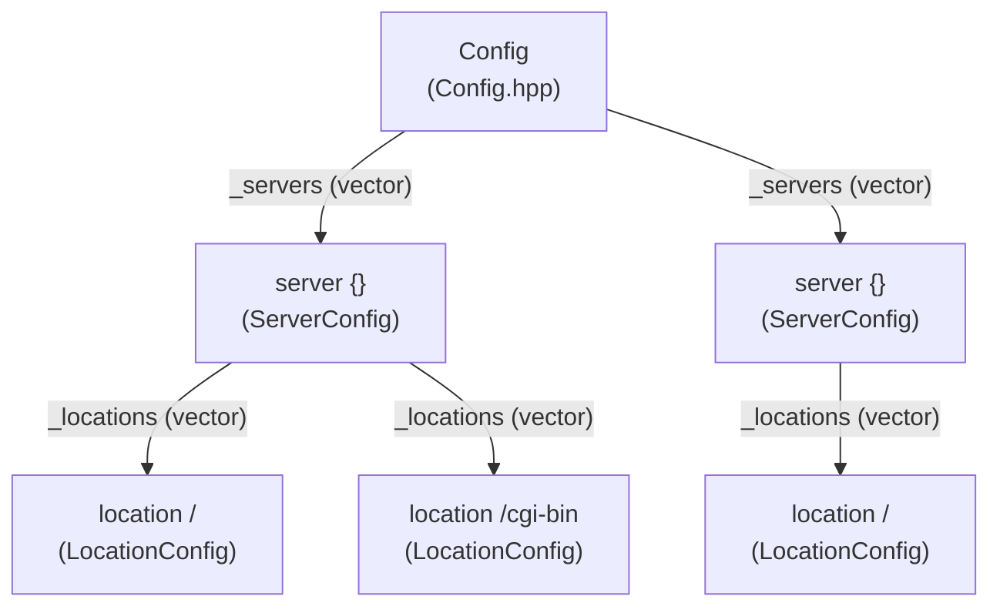
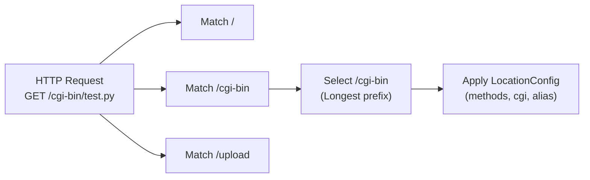
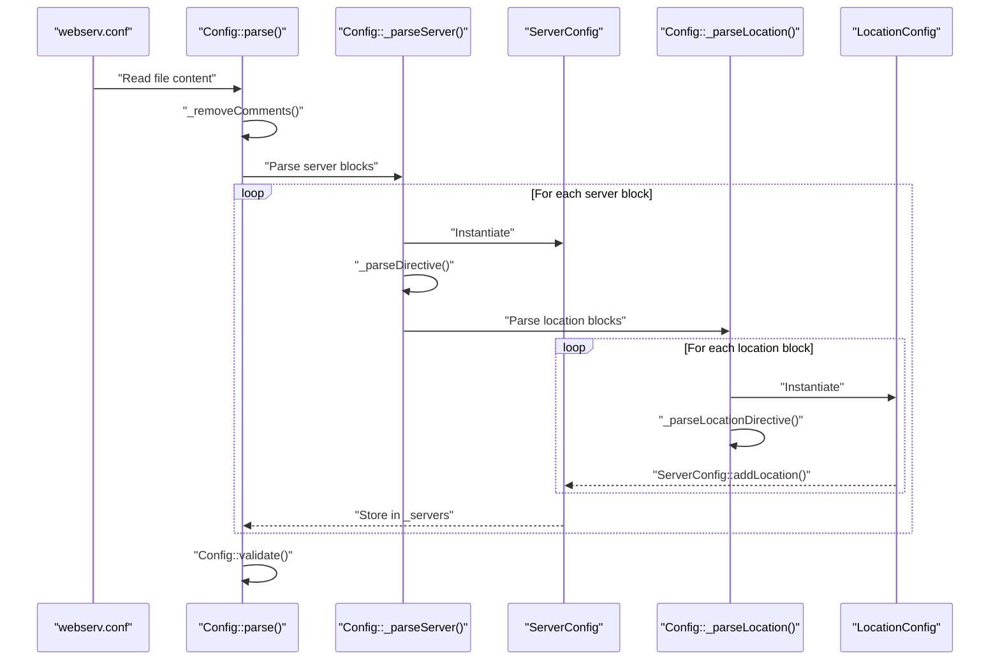
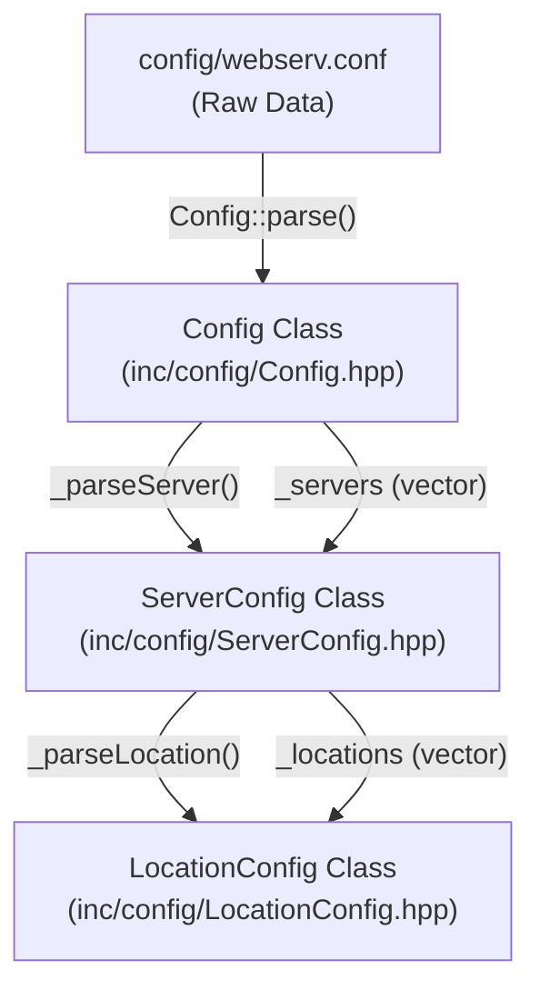

# Basic Configuration

<details>
<summary>Relevant source files</summary>

The following files were used as context for generating this page:

- [config/webserv.conf](config/webserv.conf)
- [inc/config/Config.hpp](inc/config/Config.hpp)
- [inc/config/LocationConfig.hpp](inc/config/LocationConfig.hpp)
- [inc/config/ServerConfig.hpp](inc/config/ServerConfig.hpp)

</details>


## Purpose and Scope

This guide introduces the `webserv.conf` configuration file syntax and structure, covering the essential directives needed to create a working server. It provides minimal working examples and explains the relationship between server and location blocks. For detailed architectural information about how configuration is parsed and applied, see [Configuration System](3.3). For a comprehensive reference of all available directives and their behavior, see [Configuration Reference](7).

---

## Configuration File Structure

The webserv configuration file (`config/webserv.conf`) uses a block-based syntax inspired by nginx. The file consists of one or more `server` blocks, each of which may contain multiple `location` blocks.

### Basic Hierarchy

Title: Configuration Object Hierarchy


**Sources:** [config/webserv.conf:18-135](), [inc/config/Config.hpp:32-68](), [inc/config/ServerConfig.hpp:21-67](), [inc/config/LocationConfig.hpp:21-77]()

---

## Server Blocks

A `server` block defines a virtual host that listens on a specific address and port combination. Each server block contains directives that apply to all requests handled by that server, unless overridden by location blocks.

### Minimal Server Example

```nginx
server {
    listen 0.0.0.0:8080;
    server_name localhost;
    root ./www;
    index index.html;
}
```

This minimal configuration creates a server that:
- Listens on all interfaces (`0.0.0.0`) on port `8080` [config/webserv.conf:19]()
- Responds to requests with `Host: localhost` [config/webserv.conf:21]()
- Serves files from the `./www` directory [config/webserv.conf:23]()
- Looks for `index.html` as the default file [config/webserv.conf:25]()

**Sources:** [config/webserv.conf:18-25](), [inc/config/ServerConfig.hpp:28-48]()

### Essential Server Directives

| Directive | Scope | Description | Example |
|-----------|-------|-------------|---------|
| `listen` | server | Address and port to bind | `listen 0.0.0.0:8080;` |
| `server_name` | server | Virtual host names (space-separated) | `server_name localhost example.com;` |
| `root` | server, location | Document root directory | `root ./www;` |
| `index` | server, location | Default file name | `index index.html index.htm;` |
| `client_max_body_size` | server, location | Maximum request body size in bytes | `client_max_body_size 1048576;` |
| `autoindex` | server, location | Enable directory listing | `autoindex off;` |
| `error_page` | server | Custom error page mapping | `error_page 404 /errors/404.html;` |

**Sources:** [config/webserv.conf:19-32](), [inc/config/ServerConfig.hpp:39-48](), [inc/config/LocationConfig.hpp:42-54]()

### Virtual Hosts

Multiple servers can listen on the same port with different `server_name` values to implement virtual hosting:

```nginx
server {
    listen 0.0.0.0:8080;
    server_name localhost;
    root ./www;
}

server {
    listen 0.0.0.0:8080;
    server_name example.local;
    root ./www/example;
}
```

The server is selected based on the `Host` header in the HTTP request via `ServerConfig::matchServerName` [inc/config/ServerConfig.hpp:53](). If no match is found, the first server block defined for that port is used as the default.

**Sources:** [config/webserv.conf:203-219](), [inc/config/ServerConfig.hpp:53]()

---

## Location Blocks

A `location` block defines path-specific configuration within a server. Locations are matched against the request URI using longest-prefix matching via `ServerConfig::findLocation` [inc/config/ServerConfig.hpp:52]().

### Minimal Location Example

```nginx
server {
    listen 0.0.0.0:8080;
    server_name localhost;
    root ./www;

    location / {
        methods GET;
    }
}
```

This configuration:
- Matches all URIs starting with `/` [config/webserv.conf:38]()
- Only allows the `GET` method (returns 405 for others) [config/webserv.conf:39]()
- Inherits `root ./www` from the server block [config/webserv.conf:23]()

**Sources:** [config/webserv.conf:38-41](), [inc/config/LocationConfig.hpp:21-77](), [inc/config/ServerConfig.hpp:52]()

### Essential Location Directives

| Directive | Description | Example |
|-----------|-------------|---------|
| `methods` | Allowed HTTP methods (space-separated) | `methods GET POST;` |
| `root` | Document root (overrides server root) | `root ./www/static;` |
| `alias` | Path substitution (replaces location path) | `alias ./YoupiBanane;` |
| `index` | Default file (overrides server index) | `index default.html;` |
| `autoindex` | Directory listing (overrides server setting) | `autoindex on;` |
| `cgi` | CGI handler mapping | `cgi .py /usr/bin/python3;` |
| `upload_store` | Upload directory for PUT and POST | `upload_store ./www/uploads;` |
| `redirect` | HTTP redirect | `redirect 301 /new-location;` |
| `client_max_body_size` | Max body size (overrides server setting) | `client_max_body_size 100;` |

**Sources:** [config/webserv.conf:38-134](), [inc/config/LocationConfig.hpp:42-62]()

### Location Matching Behavior

Title: Longest Prefix Matching Logic


The server evaluates all location paths using `ServerConfig::findLocation(const std::string& uri)` [inc/config/ServerConfig.hpp:52]() and selects the longest matching prefix.

**Sources:** [inc/config/ServerConfig.hpp:52]()

---

## Configuration Directives Reference

### Root vs Alias

The `root` and `alias` directives both specify filesystem paths, but they behave differently:

**`root`** - Appends the URI to the specified path [inc/config/LocationConfig.hpp:30]():
```nginx
location /static {
    root ./www;
}
# GET /static/image.png → ./www/static/image.png
```

**`alias`** - Replaces the location path with the specified path [inc/config/LocationConfig.hpp:40]():
```nginx
location /static {
    alias ./assets;
}
# GET /static/image.png → ./assets/image.png
```

**Sources:** [config/webserv.conf:71-74](), [inc/config/LocationConfig.hpp:30-40]()

### CGI Handler Mapping

The `cgi` directive maps file extensions to interpreter paths using `LocationConfig::addCgiHandler` [inc/config/LocationConfig.hpp:52]():

```nginx
location /cgi-bin {
    methods GET POST;
    alias ./cgi-bin;
    cgi .py /usr/bin/python3;
    cgi .bla ./testers/ubuntu_cgi_tester;
}
```

**Sources:** [config/webserv.conf:82-90](), [inc/config/LocationConfig.hpp:38-39](), [inc/config/LocationConfig.hpp:58-59]()

### Method Restrictions

The `methods` directive defines allowed HTTP methods via `LocationConfig::addAllowedMethod` [inc/config/LocationConfig.hpp:51]():

```nginx
location /readonly {
    methods GET;
}
```

**Sources:** [config/webserv.conf:39](), [config/webserv.conf:96](), [inc/config/LocationConfig.hpp:37](), [inc/config/LocationConfig.hpp:51]()

---

## Configuration Parsing Flow

Title: Configuration Parsing Sequence


The `Config` class handles the parsing lifecycle, using helper methods like `_getNextToken` [inc/config/Config.hpp:61]() and `_parseSize` [inc/config/Config.hpp:66]() to process the stream.

**Sources:** [inc/config/Config.hpp:41-67](), [inc/config/ServerConfig.hpp:47]()

---

## Code Entity Mapping

Title: Configuration Code Space Mapping


**Class Responsibilities:**
- `Config`: High-level parser and container for all virtual servers [inc/config/Config.hpp:32]().
- `ServerConfig`: Data container for `listen`, `server_name`, and `error_page` [inc/config/ServerConfig.hpp:21]().
- `LocationConfig`: Data container for route-specific logic like `methods`, `cgi`, and `upload_store` [inc/config/LocationConfig.hpp:21]().

**Sources:** [inc/config/Config.hpp:32-68](), [inc/config/ServerConfig.hpp:21-67](), [inc/config/LocationConfig.hpp:21-77]()

---

## Validation and Error Handling

The configuration parser performs validation during the parse phase and throws `ConfigException` [inc/config/Config.hpp:23]() for syntax errors or invalid values.

**Common Validation Checks:**
- `Config::validate()`: Checks for global consistency [inc/config/Config.hpp:50]().
- `ServerConfig::isValid()`: Ensures mandatory fields like port are set [inc/config/ServerConfig.hpp:55]().

**Sources:** [inc/config/Config.hpp:23-30](), [inc/config/Config.hpp:48-50](), [inc/config/ServerConfig.hpp:55]()

---
