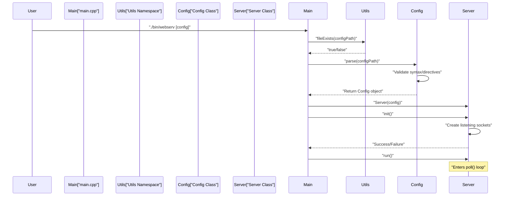
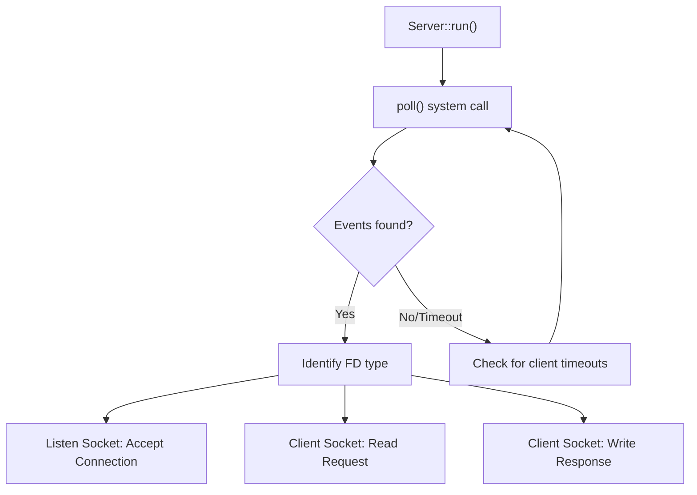
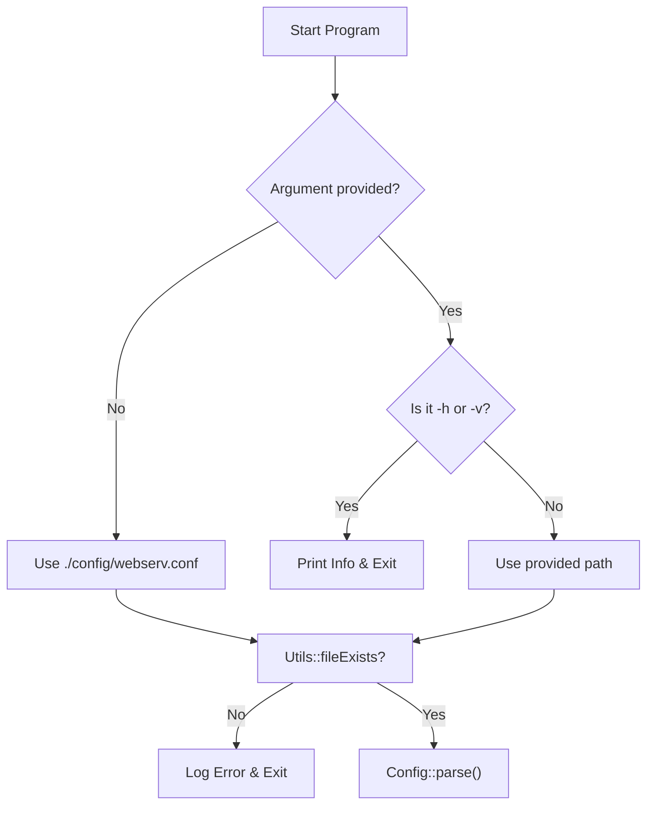

# Running the Server

<details>
<summary>Relevant source files</summary>

The following files were used as context for generating this page:

- [Makefile](Makefile)
- [inc/utils/Utils.hpp](inc/utils/Utils.hpp)
- [src/main.cpp](src/main.cpp)

</details>


## Purpose and Scope

This page explains how to start and run the `webserv` HTTP server after building it. It covers command-line invocation, configuration file specification, `make` targets for execution, debugging modes, and interpreting server output. The server is implemented as a non-blocking HTTP/1.1 server using the `poll()` system call for multiplexing.

---

## Basic Execution

### Direct Binary Execution

After building the project with `make all`, the server executable is located at `bin/webserv` [Makefile:46](). The server accepts an optional configuration file path as its first argument:

```bash
./bin/webserv config/webserv.conf
```

If no configuration file is specified, the server defaults to `./config/webserv.conf` [src/main.cpp:22,113]().

The executable supports basic flags for help and version information:
- `-h` or `--help`: Displays usage information [src/main.cpp:70-80]().
- `-v` or `--version`: Displays the version defined by `WEBSERV_VERSION` [src/main.cpp:85-90]().

**Sources:** [src/main.cpp:22,70-80,85-90,113](), [Makefile:46]()

### Using Make Targets

The `Makefile` provides convenient targets for running the server:

| Make Target | Command | Description |
|-------------|---------|-------------|
| `make run` | `./bin/webserv config/webserv.conf` | Run with the project's standard config file [Makefile:122-123]() |
| `make run-default` | `./bin/webserv` | Run and let the binary use its internal default path [Makefile:125-126]() |

**Sources:** [Makefile:122-126]()

---

## Server Startup Flow

### Startup Sequence Diagram

This diagram maps the high-level startup logic in `main.cpp` to the underlying class methods.



**Sources:** [src/main.cpp:110-183](), [inc/utils/Utils.hpp:46](), [src/main.cpp:153,169,172,183]()

### Initialization Process

The `main` function coordinates the startup sequence:

1.  **Argument Resolution**: Determines whether to use the user-provided path or `DEFAULT_CONFIG_PATH` [src/main.cpp:113-135]().
2.  **Configuration Loading**: Invokes `Config::parse()`. If parsing fails, it catches the exception and logs a "Configuration error" [src/main.cpp:151-159]().
3.  **Signal Setup**: Calls `setupSignals()` to handle `SIGINT`, `SIGTERM`, and ignore `SIGPIPE` to prevent crashes during socket writes [src/main.cpp:46-65,166]().
4.  **Server Instantiation**: Creates the `Server` object with the loaded `Config` [src/main.cpp:169]().
5.  **Network Setup**: Calls `server.init()`. This is where the server binds to ports and prepares the `pollfd` structures [src/main.cpp:172]().

**Sources:** [src/main.cpp:46-65,113-135,151-159,166,169,172]()

---

## Runtime Operation

### Server Event Loop

Once `server.run()` is called, the server enters a continuous loop that monitors file descriptors.



**Sources:** [src/main.cpp:183](), [inc/utils/Utils.hpp:71-75]()

### Console Output and Logging

The server uses the `Utils` namespace for standardized logging to `stdout` and `stderr`.

- **Informational**: `Utils::logInfo` displays startup status, config paths, and shutdown signals [src/main.cpp:35,147,161,178]().
- **Errors**: `Utils::logError` displays missing files or failed initializations [src/main.cpp:55,143,157,174]().
- **Requests**: The server logs incoming HTTP requests including method, URI, and status code [inc/utils/Utils.hpp:75]().

**Sources:** [src/main.cpp:35,55,143,147,157,161,174,178](), [inc/utils/Utils.hpp:71-75]()

---

## Debug Mode

### Building with Debug Symbols

The `Makefile` includes a specific `debug` target to facilitate troubleshooting:

```bash
make debug
```

This target performs the following:
1.  **Clean Build**: Runs `fclean` to ensure no stale object files remain [Makefile:114]().
2.  **Compiler Flags**: Appends `-g` (debug symbols), `-O0` (no optimization), and `-DDEBUG_MODE` (preprocessor macro) to `CXXFLAGS` [Makefile:113]().

**Sources:** [Makefile:113-114]()

---

## Memory Leak Detection with Valgrind

The project is designed to be memory-leak free. The `Makefile` includes targets to run the server through Valgrind with specific suppressions.

| Target | Valgrind Options | Use Case |
|--------|------------------|----------|
| `make valgrind` | `--leak-check=full --show-leak-kinds=all --track-origins=yes` | Deep inspection of memory leaks and uninitialized variables [Makefile:128-130](). |
| `make valgrind-quiet` | `--leak-check=summary` | Quick verification of memory status [Makefile:132-133](). |

Both targets use `.valgrind.supp` to ignore known system-level noise [Makefile:130]().

**Sources:** [Makefile:128-133]()

---

## Stopping the Server

### Signal Handling

The server handles termination signals gracefully to ensure all sockets are closed and resources freed.

| Signal | Logic | Result |
|--------|-------|--------|
| `SIGINT` (Ctrl+C) | `signalHandler` calls `g_server->stop()` | Server stops accepting new connections and exits the loop [src/main.cpp:30-41](). |
| `SIGTERM` | `signalHandler` calls `g_server->stop()` | Same as SIGINT [src/main.cpp:32,58](). |
| `SIGPIPE` | `SIG_IGN` | Prevents the server from crashing if it writes to a socket that the client closed prematurely [src/main.cpp:64](). |

**Sources:** [src/main.cpp:30-41,46-65]()

---

## Command-Line Interface Reference

### Server Binary Arguments

```text
Usage: webserv [configuration file]

Options:
  -h, --help     Display help message
  -v, --version  Display version information
```

### Exit Codes

- `EXIT_SUCCESS` (0): Server stopped gracefully via signal [src/main.cpp:189]().
- `EXIT_FAILURE` (1): Configuration file not found, syntax error in config, or failure to bind to ports [src/main.cpp:144,158,175]().

**Sources:** [src/main.cpp:123,130,144,158,175,189]()

---

## Configuration Resolution

The server determines which configuration to use based on the following logic in `main.cpp`:



**Sources:** [src/main.cpp:113-153](), [inc/utils/Utils.hpp:46]()

---
