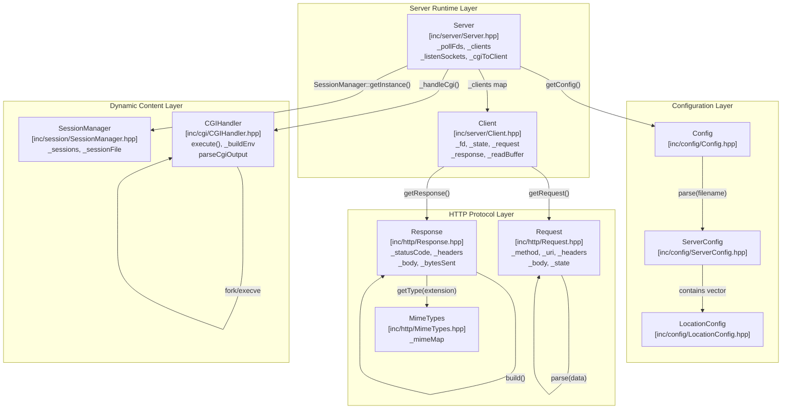
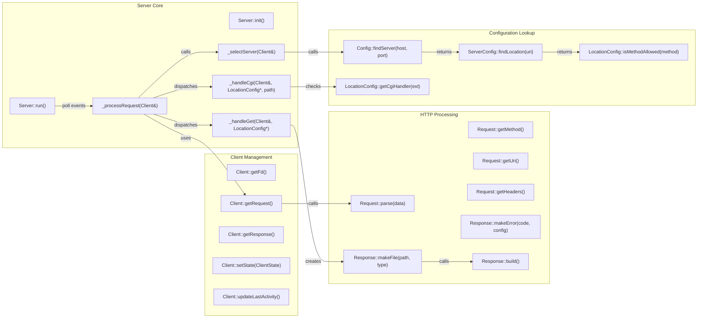
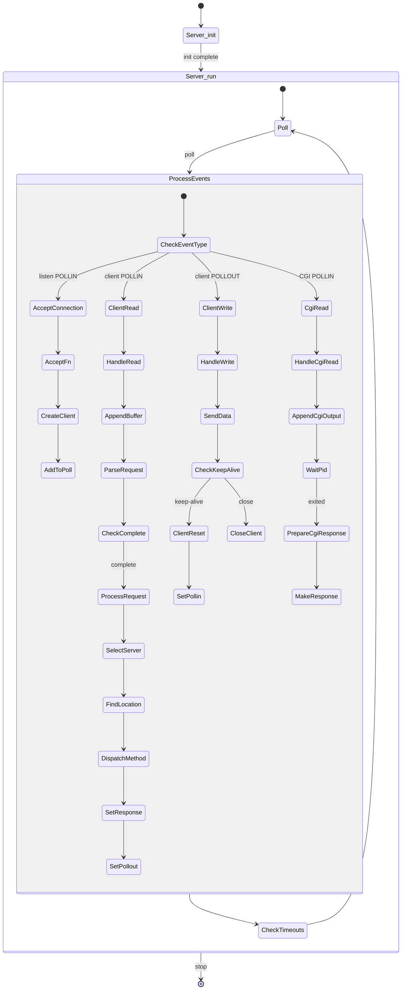
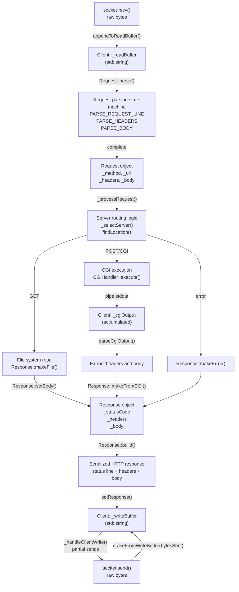
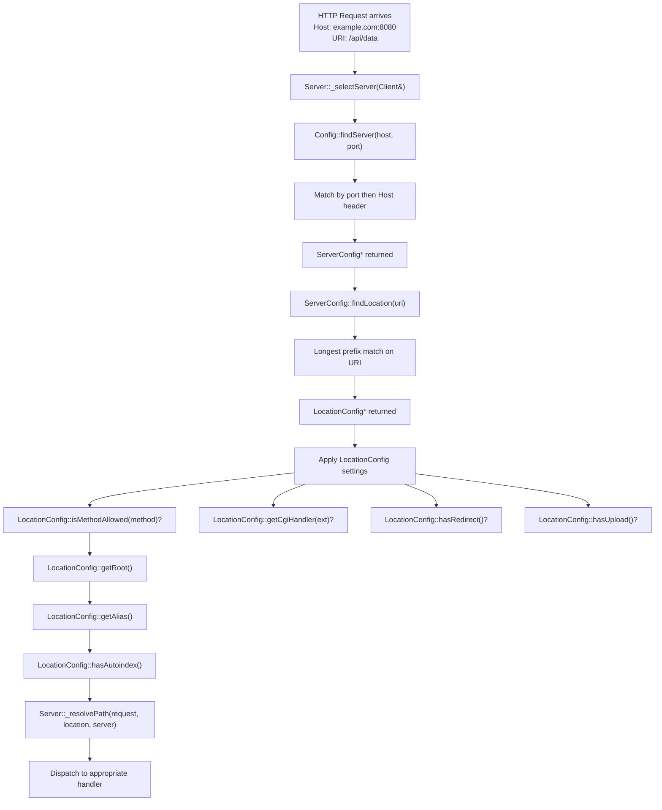

# Architecture

<details>
<summary>Relevant source files</summary>

The following files were used as context for generating this page:

- [inc/server/Server.hpp](inc/server/Server.hpp)
- [inc/webserv.hpp](inc/webserv.hpp)
- [src/main.cpp](src/main.cpp)
- [src/server/Server.cpp](src/server/Server.cpp)

</details>


## Purpose and Scope

This document provides a comprehensive architectural overview of the webserv HTTP/1.1 server implementation. It describes the layered design, component interactions, data flow patterns, and key design decisions that govern how the system processes HTTP requests. This page focuses on high-level structure and relationships between major subsystems.

For detailed implementation of specific components, see:
- Server event loop and connection lifecycle: [Server and Client Management](#3.1)
- HTTP parsing and response generation: [HTTP Protocol Implementation](#3.2)
- Configuration parsing and application: [Configuration System](#3.3)
- CGI subprocess management: [CGI Execution Architecture](#3.4)

---

## Layered Architecture Overview

The webserv system follows a six-layer architecture that separates concerns and enables modular development. Each layer has specific responsibilities and well-defined interfaces to adjacent layers.

**Diagram: System Layers and Core Classes**



**Layer Descriptions:**

| Layer | Primary Classes | Responsibilities |
|-------|----------------|------------------|
| **Configuration Layer** | `Config`, `ServerConfig`, `LocationConfig` | Parse `webserv.conf`, validate directives, provide lookup methods for server selection and location matching |
| **Server Runtime Layer** | `Server`, `Client` | Manage I/O multiplexing with `poll()`, accept connections, track client state, coordinate request/response lifecycle |
| **HTTP Protocol Layer** | `Request`, `Response`, `MimeTypes` | Parse HTTP/1.1 request line, headers, and body (including chunked/multipart); build compliant responses with proper status codes and headers |
| **Dynamic Content Layer** | `CGIHandler`, `SessionManager` | Execute CGI scripts with proper environment setup; manage session persistence across requests |

Sources: [inc/config/Config.hpp:13-70](), [inc/server/Server.hpp:13-107](), [inc/server/Client.hpp:13-123](), [inc/http/Request.hpp:13-126](), [inc/http/Response.hpp:13-74](), [inc/http/MimeTypes.hpp:13-50]()

---

## Component Interaction Model

The following diagram shows how the core components interact during typical operations, using actual class names and key methods from the codebase.

**Diagram: Component Relationships and Key Methods**



Sources: [inc/server/Server.hpp:25-107](), [inc/server/Client.hpp:31-121](), [inc/http/Request.hpp:38-124](), [inc/http/Response.hpp:22-73](), [inc/config/Config.hpp:32-68]()

---

## Event-Driven Processing Model

The webserv server uses an event-driven architecture built on the `poll()` system call. This model enables efficient handling of multiple concurrent connections without threading.

**Diagram: Server Event Loop and State Machine**



**State Transitions in Client Objects:**

The `Client` class maintains state through the `ClientState` enum ([inc/server/Client.hpp:22-29]()):

| State | Description | Next State |
|-------|-------------|------------|
| `CLIENT_READING` | Accumulating request data in `_readBuffer` | `CLIENT_PROCESSING` when request complete |
| `CLIENT_PROCESSING` | Executing request handler logic | `CLIENT_WRITING` or `CLIENT_CGI_RUNNING` |
| `CLIENT_CGI_RUNNING` | Waiting for CGI subprocess output | `CLIENT_WRITING` when CGI completes |
| `CLIENT_WRITING` | Transmitting response from `_writeBuffer` | `CLIENT_READING` (keep-alive) or `CLIENT_DONE` |
| `CLIENT_DONE` | Connection complete, ready for cleanup | Destroyed |
| `CLIENT_ERROR` | Error state, immediate cleanup | Destroyed |

Sources: [inc/server/Server.hpp:37-102](), [inc/server/Client.hpp:22-97](), [inc/http/Request.hpp:22-29]()

---

## Data Flow Architecture

This diagram traces data movement through the system from socket input to socket output, showing buffer management and transformation stages.

**Diagram: Data Flow Through System Components**



**Buffer Management:**

- **Read Buffer** ([inc/server/Client.hpp:108]()): Accumulates incoming data until a complete HTTP request is parsed. Cleared after successful parsing.
- **Write Buffer** ([inc/server/Client.hpp:109]()): Holds serialized response data. Drained incrementally as `send()` succeeds. Supports partial writes for large responses.
- **CGI Output Buffer** ([inc/server/Client.hpp:115]()): Accumulates CGI subprocess stdout until process exits, then parsed once.

Sources: [inc/server/Client.hpp:70-87](), [inc/http/Request.hpp:46-83](), [inc/http/Response.hpp:29-62](), [inc/server/Server.hpp:71-99]()

---

## Key Design Patterns

### Singleton Pattern

Two classes use the singleton pattern to provide global access to shared resources:

- **`MimeTypes`** ([inc/http/MimeTypes.hpp]()): Maintains a static map of file extensions to MIME types. Accessed via `MimeTypes::getInstance()`.
- **`SessionManager`** ([inc/session/SessionManager.hpp]()): Manages session data persistence. Single instance ensures consistent session state across all requests.

### Factory Pattern

The `Response` class provides static factory methods for common response types ([inc/http/Response.hpp:56-61]()):

```cpp
Response::makeError(int code, const ServerConfig* config)
Response::makeRedirect(int code, const std::string& location)
Response::makeFile(const std::string& path, const std::string& contentType)
Response::makeDirectoryListing(const std::string& path, const std::string& uri)
Response::makeFromCGI(const std::string& cgiOutput)
```

These methods encapsulate response construction logic and ensure consistent header generation.

### State Machine Pattern

Both `Request` and `Client` use state machines:

- **`Request`** ([inc/http/Request.hpp:22-29]()): `ParseState` enum tracks parsing progress through request line, headers, body (including chunked encoding).
- **`Client`** ([inc/server/Client.hpp:22-29]()): `ClientState` enum manages connection lifecycle from reading through processing to writing.

### Strategy Pattern

Request handling is dispatched based on HTTP method and configuration:

```cpp
Server::_processRequest() determines:
  - _handleGet() for GET requests
  - _handlePost() for POST requests
  - _handlePut() for PUT requests
  - _handleDelete() for DELETE requests
  - _handleCgi() for CGI-enabled paths
  - _handleRedirect() for redirect directives
```

Each handler implements a specific strategy for processing the request type.

### Observer Pattern (Implicit)

The `poll()` mechanism implements an implicit observer pattern where the `Server` observes file descriptor events:

- Listen sockets: observed for `POLLIN` (new connections)
- Client sockets: observed for `POLLIN` (data to read) or `POLLOUT` (ready to write)
- CGI pipes: observed for `POLLIN` (CGI output available)

The `_pollFds` vector ([inc/server/Server.hpp:51]()) maintains the observable set, rebuilt when sockets are added or removed.

Sources: [inc/http/Response.hpp:56-61](), [inc/server/Server.hpp:79-92](), [inc/server/Client.hpp:22-29](), [inc/http/Request.hpp:22-29]()

---

## Configuration-Driven Behavior

The architecture emphasizes configuration-driven behavior, where `Config`, `ServerConfig`, and `LocationConfig` objects control server behavior without code changes.

**Diagram: Configuration Application Flow**



**Configuration Hierarchy:**

1. **Config** level: Multiple `ServerConfig` objects, each representing a virtual host
2. **ServerConfig** level: Port binding, server names, error pages, client body size limits, multiple `LocationConfig` objects
3. **LocationConfig** level: Path-specific allowed methods, root/alias, CGI handlers, upload settings, redirects, autoindex

This three-tier hierarchy enables fine-grained control. For example, different locations within the same server can have different allowed methods, CGI interpreters, or upload directories.

Sources: [inc/config/Config.hpp:40-53](), [inc/config/ServerConfig.hpp:13-70](), [inc/config/LocationConfig.hpp:13-70](), [inc/server/Server.hpp:79-96]()

---

## Concurrency Model

The webserv architecture is **single-threaded** with **non-blocking I/O** and **event multiplexing**:

- **No threads**: All operations occur in the main event loop within `Server::run()` ([inc/server/Server.hpp:38]()).
- **Non-blocking sockets**: All file descriptors are set to `O_NONBLOCK` via `Server::_setNonBlocking()` ([src/server/Server.cpp:210-216]()).
- **Event multiplexing**: `poll()` system call monitors multiple file descriptors simultaneously ([src/server/Server.cpp:30]()).
- **CGI isolation**: CGI scripts run in separate processes (via `fork()`), but I/O with them is managed via pipes and added to the `poll()` loop.

**Benefits:**

- Simplified synchronization (no mutexes required)
- Predictable resource usage (single process, bounded memory)
- Efficient for I/O-bound workloads (typical web serving)

**CGI Queue Management:**

To prevent resource exhaustion, the server implements CGI process limiting:

- `_activeCgiCount` ([inc/server/Server.hpp:55]()): Tracks running CGI processes, limited by `MAX_CONCURRENT_CGI` ([inc/webserv.hpp:67]()).
- `_cgiQueue` ([inc/server/Server.hpp:56]()): Queues client FDs waiting for CGI execution.
- `_processNextCgiFromQueue()` ([inc/server/Server.hpp:101]()): Processes queued requests when slots become available.

Sources: [inc/server/Server.hpp:37-102](), [inc/server/Server.hpp:55-56](), [inc/webserv.hpp:67]()

---

## Error Handling Architecture

The system uses multiple error handling strategies appropriate to each layer:

**Configuration Layer:**

- **`ConfigException`** ([inc/config/Config.hpp:23-30]()): Thrown during parsing for invalid directives, missing required fields, or malformed syntax. Caught in `main()` ([src/main.cpp:151-160]()) to prevent server startup with bad configuration.

**HTTP Protocol Layer:**

- **Request parsing errors**: `Request::_errorCode` ([inc/http/Request.hpp:105]()) stores HTTP error codes (400, 414, 431, etc.). State transitions to `PARSE_ERROR`.
- **Response generation**: `Response::makeError()` creates error responses with configurable error pages from `ServerConfig`.

**Server Runtime Layer:**

- **Timeouts**: `Client::hasTimedOut()` ([inc/server/Client.hpp:67]()) checks elapsed time since last activity. Triggers cleanup via `Server::_checkTimeouts()`.
- **CGI timeouts**: `Client::hasCgiTimedOut()` ([inc/server/Client.hpp:90]()) limits CGI execution time.
- **Socket errors**: `POLLERR` and `POLLHUP` events trigger immediate client cleanup.

Sources: [inc/config/Config.hpp:23-30](), [inc/http/Request.hpp:49-50](), [inc/server/Client.hpp:64-90](), [inc/server/Server.hpp:76-98]()

---

## Summary

The webserv architecture achieves several design goals:

- **Modularity**: Clear separation between configuration, protocol handling, server runtime, and dynamic content layers.
- **Extensibility**: Factory methods and strategy pattern enable easy addition of new response types and request handlers.
- **Efficiency**: Event-driven model with non-blocking I/O handles multiple connections with minimal resource overhead.
- **Standards compliance**: HTTP/1.1 protocol layer implements RFC-compliant request parsing and response generation.
- **Configurability**: Three-tier configuration hierarchy provides fine-grained control without code changes.

The next sections ([Server and Client Management](#3.1), [HTTP Protocol Implementation](#3.2), [Configuration System](#3.3), [CGI Execution Architecture](#3.4)) provide detailed implementation specifics for each major subsystem.

---
