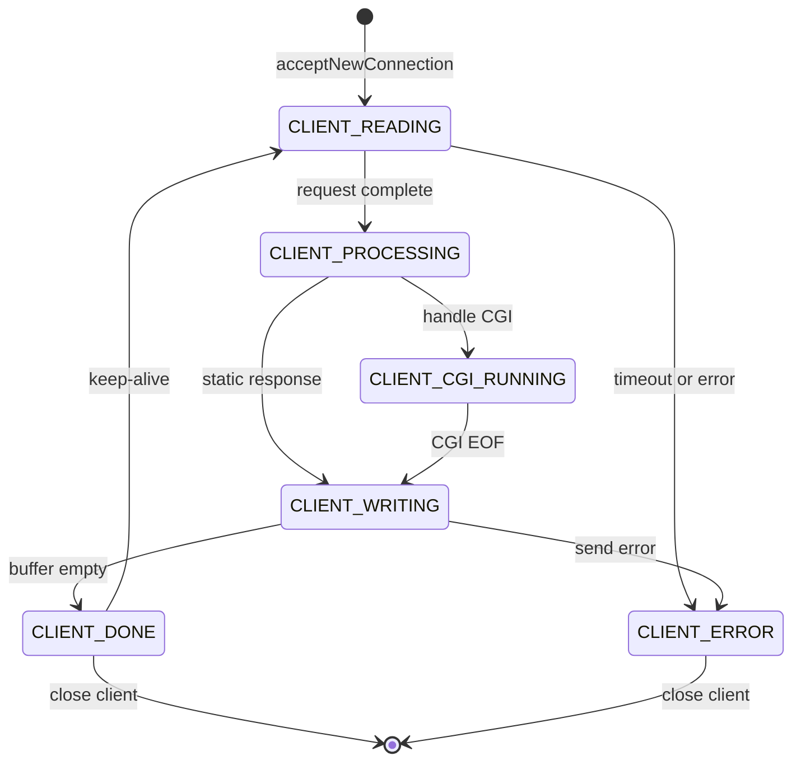
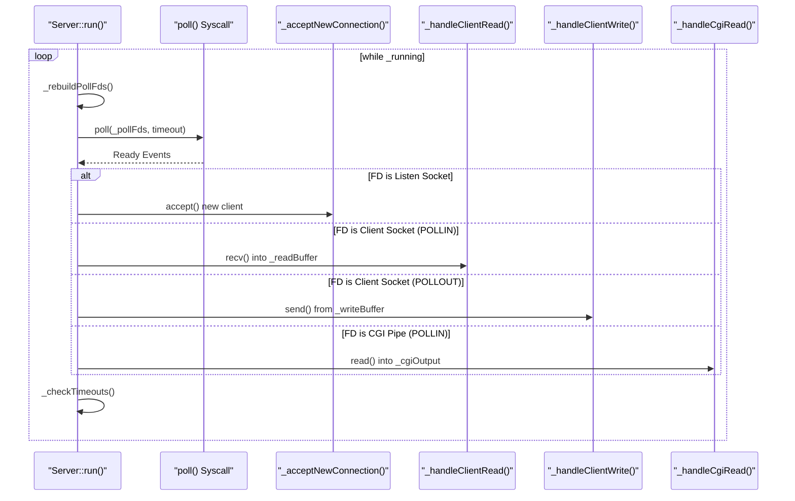

# Server and Client Management

Relevant source files

The following files were used as context for generating this page:

- [inc/server/Client.hpp](inc/server/Client.hpp)
- [inc/server/Server.hpp](inc/server/Server.hpp)
- [src/server/Client.cpp](src/server/Client.cpp)
- [src/server/Server.cpp](src/server/Server.cpp)

## Purpose and Scope

This document explains how the `Server` class manages multiple concurrent client connections using `poll`-based I/O multiplexing. It covers the architecture of connection handling, the `Client` state machine, the event loop implementation, timeout management, and integration with CGI processes.

For detailed API documentation of the `Server` class itself, see page 4.1. For detailed API documentation of the `Client` class, see page 4.2.

---

## Architecture Overview

The webserv server implements a single-threaded, event-driven architecture using the `poll()` system call for I/O multiplexing. A single `Server` instance manages multiple listening sockets (one per configured host/port pair) and multiple `Client` instances.

### Server Class Internal Data Structures

```mermaid
graph TB
    Server["Server class"]
    Config["_config<br/>Config object"]
    PollFds["_pollFds<br/>std::vector&lt;struct pollfd&gt;"]
    Clients["_clients<br/>std::map&lt;int, Client&gt;"]
    ListenSockets["_listenSockets<br/>std::map&lt;int, int&gt;"]
    CgiToClient["_cgiToClient<br/>std::map&lt;int, int&gt;"]
    CgiQueue["_cgiQueue<br/>std::vector&lt;int&gt;"]
    ActiveCgi["_activeCgiCount<br/>size_t"]

    Server --> Config
    Server --> PollFds
    Server --> Clients
    Server --> ListenSockets
    Server --> CgiToClient
    Server --> CgiQueue
    Server --> ActiveCgi

    Clients --> Client1["Client object<br/>_fd=5<br/>_state=CLIENT_READING"]
    Clients --> Client2["Client object<br/>_fd=6<br/>_state=CLIENT_WRITING"]
    Clients --> Client3["Client object<br/>_fd=7<br/>_state=CLIENT_CGI_RUNNING"]

    ListenSockets --> Listen1["listen fd=3 → port 8080"]
    ListenSockets --> Listen2["listen fd=4 → port 8081"]

    CgiToClient --> CgiMapping["CGI stdout fd=10 → client fd=7"]

    PollFds --> PollEntry1["pollfd struct<br/>fd=3, events=POLLIN"]
    PollFds --> PollEntry2["pollfd struct<br/>fd=5, events=POLLIN"]
    PollFds --> PollEntry3["pollfd struct<br/>fd=6, events=POLLOUT"]
    PollFds --> PollEntry4["pollfd struct<br/>fd=10, events=POLLIN"]
```

**Sources:** [inc/server/Server.hpp:49-56](), [inc/server/Client.hpp:100-120]()

### Key Data Structures

| Data Structure | Type | Purpose |
|----------------|------|---------|
| `_pollFds` | `std::vector<struct pollfd>` | Array of file descriptors monitored by `poll()` [inc/server/Server.hpp:51]() |
| `_clients` | `std::map<int, Client>` | Maps client socket FD to its `Client` state object [inc/server/Server.hpp:52]() |
| `_listenSockets` | `std::map<int, int>` | Maps listening socket FD to its associated port [inc/server/Server.hpp:53]() |
| `_cgiToClient` | `std::map<int, int>` | Maps CGI output pipe FD back to the requesting client's FD [inc/server/Server.hpp:54]() |
| `_activeCgiCount` | `size_t` | Tracks number of currently running CGI child processes [inc/server/Server.hpp:55]() |
| `_cgiQueue` | `std::vector<int>` | Queue of client FDs waiting for a CGI execution slot [inc/server/Server.hpp:56]() |

---

## Client State Machine

Each `Client` maintains an internal state that dictates how the `Server` event loop interacts with its file descriptor.

### State Transitions

**Sources:** [inc/server/Client.hpp:22-29](), [src/server/Client.cpp:152-176]()

### Client State Definitions

| State | Enum Value | Description |
|-------|------------|-------------|
| `CLIENT_READING` | 0 | Actively reading request data from the socket [inc/server/Client.hpp:23]() |
| `CLIENT_PROCESSING` | 1 | Request received; server is determining the response [inc/server/Client.hpp:24]() |
| `CLIENT_WRITING` | 2 | Actively sending response data from `_writeBuffer` [inc/server/Client.hpp:25]() |
| `CLIENT_CGI_RUNNING` | 3 | Waiting for output from a forked CGI process [inc/server/Client.hpp:26]() |
| `CLIENT_DONE` | 4 | Response fully sent; awaiting next step (close or keep-alive) [inc/server/Client.hpp:27]() |
| `CLIENT_ERROR` | 5 | Terminal error state leading to connection closure [inc/server/Client.hpp:28]() |

---

## The Event Loop (poll)

The `Server::run()` method implements the core event loop. It continuously rebuilds the `pollfd` array, waits for events, and dispatches them to specific handlers.

### Event Loop Execution Flow

**Sources:** [src/server/Server.cpp:251-300](), [inc/server/Server.hpp:65-76]()

### Poll Management Methods

*   **`_rebuildPollFds()`**: Clears and repopulates the `_pollFds` vector. It adds listening sockets with `POLLIN`, clients in `CLIENT_READING` with `POLLIN`, clients in `CLIENT_WRITING` with `POLLOUT`, and CGI pipes with `POLLIN`. [src/server/Server.cpp:251-285]()
*   **`_setEvents(fd, events)`**: Modifies the requested events for an existing FD in the `pollfd` array. [src/server/Server.cpp:314-324]()

---

## Connection Lifecycle

### 1. Acceptance
When a listening socket is ready, `_acceptNewConnection()` calls `accept()`, sets the new socket to non-blocking via `_setNonBlocking()`, and creates a new `Client` object in the `CLIENT_READING` state. [src/server/Server.cpp:330-365]()

### 2. Request Reading
`_handleClientRead()` reads data into the client's `_readBuffer`. It then calls `_request.parse()` to incrementally build the HTTP request. Once `_request.isComplete()` returns true, the state changes to `CLIENT_PROCESSING`. [src/server/Server.cpp:367-410]()

### 3. Processing and Routing
`_processRequest()` analyzes the completed request. It selects the appropriate `ServerConfig` based on the `Host` header via `_selectServer()` and then routes to method handlers like `_handleGet()`, `_handlePost()`, or `_handleCgi()`. [src/server/Server.cpp:484-550]()

### 4. Response Writing
`_handleClientWrite()` attempts to `send()` the contents of `_writeBuffer` to the socket. If only a partial write occurs, the remaining data stays in the buffer for the next `POLLOUT` event. Once empty, the state transitions to `CLIENT_DONE`. [src/server/Server.cpp:412-445]()

---

## Timeout and Keep-Alive Management

### Timeout Management
The server monitors two types of timeouts during `_checkTimeouts()`:
1.  **Connection Timeout**: If `(now - _lastActivity) > timeout`, the connection is closed. [src/server/Server.cpp:460-482](), [inc/server/Client.hpp:67]()
2.  **CGI Timeout**: If a CGI process exceeds its time limit, the server kills the child PID and sends a 504 Gateway Timeout. [src/server/Server.cpp:470-475](), [inc/server/Client.hpp:90]()

### Keep-Alive Support
If the `_keepAlive` flag is true (determined during request parsing), the server does not close the connection after `CLIENT_DONE`. Instead, it calls `Client::reset()`, which:
*   Clears `_request` and `_response`. [src/server/Client.cpp:282-297]()
*   Clears I/O buffers. [src/server/Client.cpp:290-291]()
*   Increments `_requestCount`. [src/server/Client.cpp:278-280]()
*   Sets the state back to `CLIENT_READING`. [src/server/Client.cpp:295]()

**Sources:** [inc/server/Client.hpp:93-98](), [src/server/Client.cpp:278-297](), [src/server/Server.cpp:440-444]()

---

## CGI and Concurrency

The server limits concurrent CGI processes to prevent resource exhaustion.

*   **`_activeCgiCount`**: Tracks currently running processes. [inc/server/Server.hpp:55]()
*   **`_cgiQueue`**: If the limit is reached, client FDs are pushed here. [inc/server/Server.hpp:56]()
*   **`_processNextCgiFromQueue()`**: Called when a CGI process finishes to start the next one in line. [src/server/Server.cpp:880-900]()

**Sources:** [inc/server/Server.hpp:54-57](), [src/server/Server.cpp:880-900]()

---
