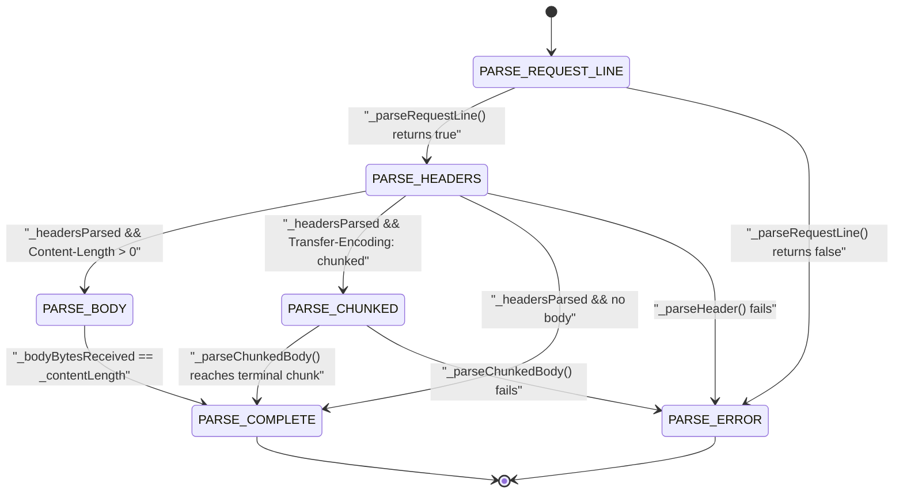
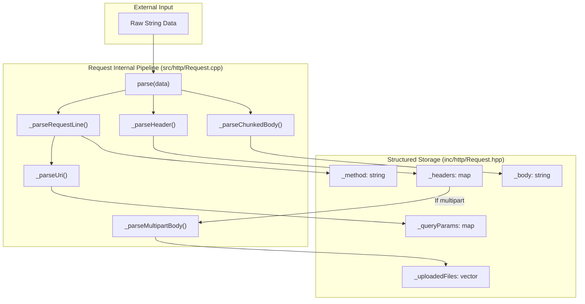
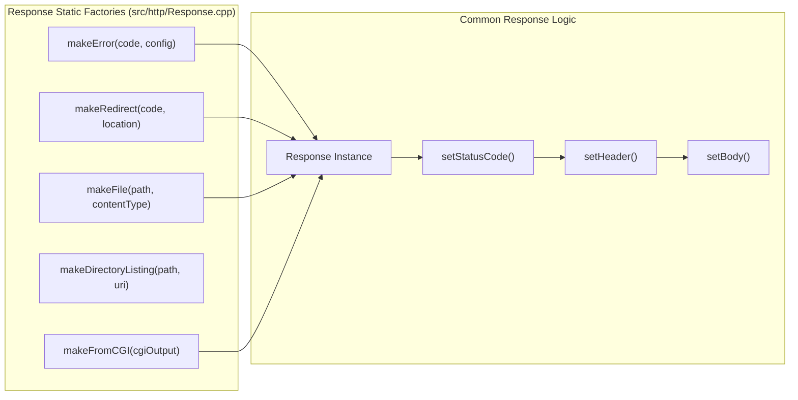
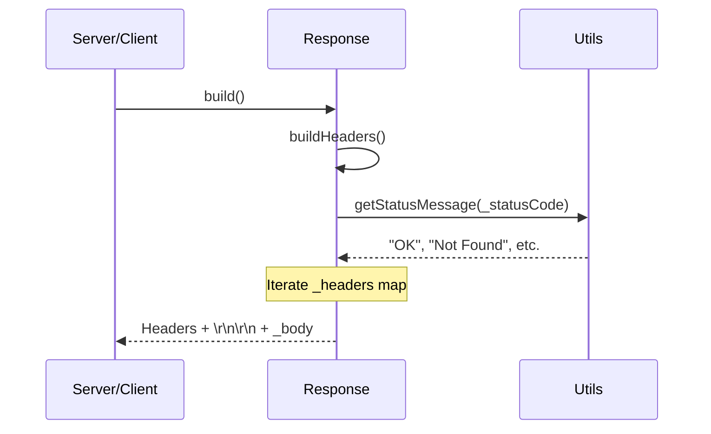

# HTTP Protocol Implementation

Relevant source files

The following files were used as context for generating this page:

- [inc/http/MimeTypes.hpp](inc/http/MimeTypes.hpp)
- [inc/http/Request.hpp](inc/http/Request.hpp)
- [inc/http/Response.hpp](inc/http/Response.hpp)
- [src/http/MimeTypes.cpp](src/http/MimeTypes.cpp)
- [src/http/Request.cpp](src/http/Request.cpp)
- [src/http/Response.cpp](src/http/Response.cpp)

## Purpose and Scope

This document provides an architectural overview of webserv's HTTP/1.1 protocol implementation, covering request parsing, response generation, and content type handling. The HTTP subsystem is responsible for translating raw socket data into structured request objects and generating RFC-compliant HTTP responses.

The implementation is centered around three primary classes:
- `Request`: An incremental parser that converts raw data into a structured representation.
- `Response`: A builder and factory for constructing HTTP responses.
- `MimeTypes`: A singleton registry for mapping file extensions to media types.

**Sources:** [inc/http/Request.hpp:1-126](), [inc/http/Response.hpp:1-74](), [inc/http/MimeTypes.hpp:1-44]()

---

## HTTP Protocol Standards Compliance

The webserv HTTP implementation adheres to the following specifications:

| Standard | Coverage | Notes |
|----------|----------|-------|
| **HTTP/1.1** | RFC 2616 / 7230 | Core protocol, methods, headers, and connection management |
| **Status Codes** | RFC 2616 | Standard status code handling via `Utils::getStatusMessage` |
| **Chunked Transfer**| RFC 7230 §4.1 | Incremental body transmission and decoding |
| **Multipart Forms** | RFC 2388 / 7578 | File upload support via boundary parsing |
| **MIME Types** | RFC 2046 | Content-Type classification via `MimeTypes` registry |
| **Cookies** | RFC 6265 | Cookie parsing (`Cookie` header) and generation (`Set-Cookie`) |

**Sources:** [inc/http/Request.hpp:1-126](), [inc/http/Response.hpp:1-74](), [src/http/Request.cpp:124-133]()

---

## Request Parsing Architecture

### State Machine Overview

The `Request` class implements a multi-stage state machine for incremental HTTP request parsing. The `ParseState` enum [inc/http/Request.hpp:22-29]() defines six states, and the `_state` member [inc/http/Request.hpp:104]() tracks current progress.

**Diagram: ParseState enum state machine transitions in Request::parse**

State transitions are driven by the `parse()` method [src/http/Request.cpp:91-174]() which processes incoming data incrementally by looking for delimiters like `\r\n` [src/http/Request.cpp:103]().

| State | Parsing Method | Completion Condition |
|-------|----------------|---------------------|
| `PARSE_REQUEST_LINE` | `_parseRequestLine()` | Extracts `_method`, `_uri`, `_version` [src/http/Request.cpp:111]() |
| `PARSE_HEADERS` | `_parseHeader()` | Populates `_headers` until empty line [src/http/Request.cpp:117-118]() |
| `PARSE_BODY` | Direct buffer append | `_bodyBytesReceived` equals `_contentLength` [src/http/Request.cpp:150]() |
| `PARSE_CHUNKED` | `_parseChunkedBody()` | Processes chunks until size 0 is encountered [src/http/Request.cpp:159-162]() |
| `PARSE_COMPLETE` | N/A | Request ready for processing via `isComplete()` [inc/http/Request.hpp:48]() |

**Sources:** [inc/http/Request.hpp:22-29](), [src/http/Request.cpp:91-174](), [inc/http/Request.hpp:113-122]()

---

### Request Class Data Flow

**Diagram: Request class data flow from socket buffer to structured members**

The `Request` class [inc/http/Request.hpp:38-124]() maintains private state members [inc/http/Request.hpp:85-111]() populated by specialized parsing methods:

- **Header Normalization**: `_normalizeHeaderName()` [inc/http/Request.hpp:123]() ensures header keys are handled case-insensitively.
- **URI Decomposition**: `_parseUri()` [inc/http/Request.hpp:116]() extracts path, query, and fragments.
- **Multipart Extraction**: If `Content-Type` contains `multipart/form-data`, `_parseMultipartBody()` [src/http/Request.cpp:153]() is triggered to populate the `UploadedFile` vector.

**Sources:** [inc/http/Request.hpp:38-124](), [src/http/Request.cpp:91-174](), [inc/http/Request.hpp:113-124]()

---

## Response Generation Architecture

### Factory Pattern Implementation

The `Response` class implements a factory pattern with static builder methods for common response types. This centralizes response construction logic and ensures consistency.

**Diagram: Response Factory Pattern and Construction Flow**

The static builders [inc/http/Response.hpp:57-61]() handle distinct scenarios:
- **makeError**: Looks up custom error pages in `ServerConfig` [src/http/Response.cpp:186]() or falls back to `_getDefaultErrorPage` [src/http/Response.cpp:196]().
- **makeFile**: Reads file content via `Utils::readFile` [src/http/Response.cpp:222]() and sets the appropriate MIME type.
- **makeFromCGI**: Parses raw CGI output to extract headers and body [inc/http/Response.hpp:61]().

**Sources:** [inc/http/Response.hpp:57-61](), [src/http/Response.cpp:179-245]()

---

### Response Building Process

The `build()` method [src/http/Response.cpp:97-103]() serializes the response into a raw string for transmission.

**Diagram: Response serialization sequence**

The `Response` class also tracks transmission state using `_sent` [inc/http/Response.hpp:67]() and `_bytesSent` [inc/http/Response.hpp:68](), which is essential for non-blocking `send()` operations where the full buffer might not be sent at once.

**Sources:** [src/http/Response.cpp:97-121](), [inc/http/Response.hpp:48-54]()

---

## MIME Type System

### MimeTypes Singleton

The `MimeTypes` class [inc/http/MimeTypes.hpp:19-42]() uses the Singleton pattern to provide a global registry of file extensions to MIME types.

| Feature | Implementation |
|---------|----------------|
| **Access** | `MimeTypes::getInstance()` [src/http/MimeTypes.cpp:23-27]() |
| **Storage** | `std::map<std::string, std::string> _mimeTypes` [inc/http/MimeTypes.hpp:39]() |
| **Initialization** | `_initMimeTypes()` populates over 100 common types [src/http/MimeTypes.cpp:57-190]() |
| **Default** | Returns `application/octet-stream` for unknown extensions [src/http/MimeTypes.cpp:17]() |

The `Response::makeFile` factory uses `getMimeTypeByFile()` [inc/http/MimeTypes.hpp:26]() to automatically set the `Content-Type` header based on the requested file's extension.

**Sources:** [inc/http/MimeTypes.hpp:19-42](), [src/http/MimeTypes.cpp:1-190]()

---

## Protocol Features Support

### Chunked Transfer Encoding

`Request` supports chunked encoding by parsing hex sizes and accumulating data until a zero-size chunk is reached.
- **Detection**: Triggered if `Transfer-Encoding: chunked` is present [src/http/Request.cpp:125-127]().
- **Parsing**: `_parseChunkedBody()` [src/http/Request.cpp:160]() handles the CRLF-delimited chunk structure.
- **State**: Tracked via `_isChunked`, `_currentChunkSize`, and `_currentChunk` [inc/http/Request.hpp:108-110]().

### Multipart Form Data

The `UploadedFile` struct [inc/http/Request.hpp:31-36]() stores components of a multipart upload:
- `name`: Form field name.
- `filename`: Original name of the uploaded file.
- `contentType`: MIME type of the part.
- `data`: The raw content of the file.

### Cookie Handling

- **Parsing**: `_parseCookies()` [src/http/Request.cpp:122]() parses the `Cookie` header into the `_cookies` map.
- **Setting**: `Response::setCookie()` [src/http/Response.cpp:72-86]() builds the `Set-Cookie` header with attributes like `Path`, `Max-Age`, `HttpOnly`, and `Secure`.

**Sources:** [src/http/Request.cpp:121-133](), [src/http/Response.cpp:72-86](), [inc/http/Request.hpp:31-36]()

---

## Summary

The HTTP implementation provides a robust foundation for the webserv project by decoupling protocol logic from network I/O. By using a state-machine parser (`Request`) and a factory-based generator (`Response`), the server can handle complex HTTP features like chunked encoding and multipart uploads while maintaining a clean, maintainable interface for the core server loop.

**Sources:** [inc/http/Request.hpp:1-126](), [inc/http/Response.hpp:1-74](), [inc/http/MimeTypes.hpp:1-44]()

---
