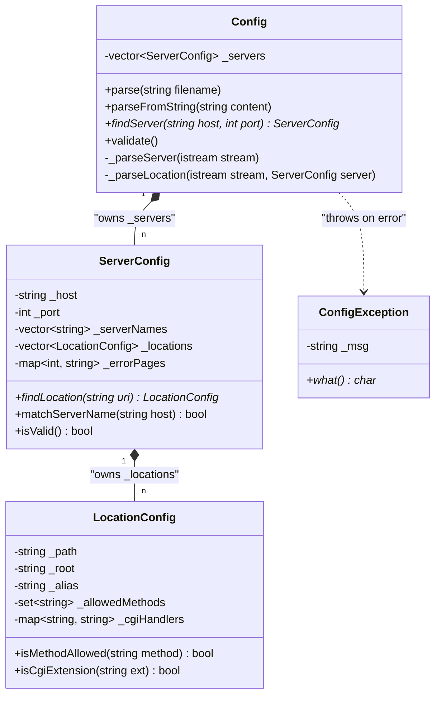
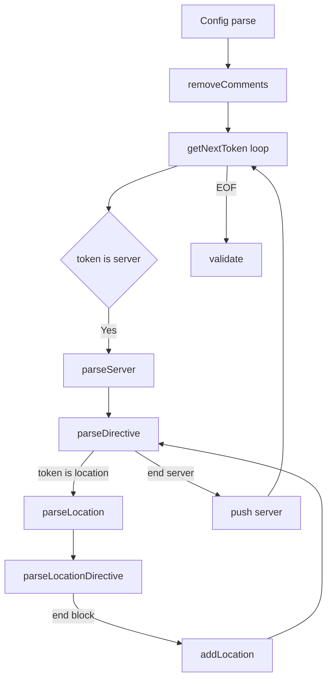

# Configuration System

Relevant source files

The following files were used as context for generating this page:

- [inc/config/Config.hpp](inc/config/Config.hpp)
- [inc/config/LocationConfig.hpp](inc/config/LocationConfig.hpp)
- [inc/config/ServerConfig.hpp](inc/config/ServerConfig.hpp)
- [src/config/Config.cpp](src/config/Config.cpp)
- [src/config/LocationConfig.cpp](src/config/LocationConfig.cpp)
- [src/config/ServerConfig.cpp](src/config/ServerConfig.cpp)

## Purpose and Scope

The Configuration System provides a three-tier hierarchy for parsing, validating, and applying server settings from a configuration file (typically `webserv.conf`). This system implements an Nginx-inspired model that handles virtual hosting, path-specific rules, and directive inheritance. It serves as the authoritative source of truth for the [Server Class](4.1) and [HTTP Request Parsing](4.3) during the request lifecycle.

## Overview

The system is organized into three distinct architectural layers, each represented by a specific class:

1.  **Config**: The top-level container and parser. It manages the global collection of virtual servers.
2.  **ServerConfig**: Represents a `server {}` block. It defines settings for a specific IP:Port combination and handles virtual host matching via server names.
3.  **LocationConfig**: Represents a `location {}` block. It defines how specific URI prefixes should be handled, including CGI execution, file uploads, and redirects.

## Class Hierarchy

### Configuration Object Model

The following diagram illustrates the composition relationship between the core configuration entities and the exception mechanism used for syntax errors.

Sources: [inc/config/Config.hpp:32-68](), [inc/config/ServerConfig.hpp:21-67](), [inc/config/LocationConfig.hpp:21-77]()

## Configuration Hierarchy and Inheritance

### Three-Tier Structure

The hierarchy allows for global defaults to be set at the server level and specialized at the location level.

| Tier | Class | Scope | Key Responsibilities |
| :--- | :--- | :--- | :--- |
| **1** | `Config` | Global | File I/O, comment stripping, and server-block dispatching. [inc/config/Config.hpp:32-56]() |
| **2** | `ServerConfig` | Virtual Host | Listen address, server names, and default error pages. [inc/config/ServerConfig.hpp:58-66]() |
| **3** | `LocationConfig` | URI Path | Method restrictions, CGI handlers, and path aliasing. [inc/config/LocationConfig.hpp:65-76]() |

### Directive Inheritance and Overrides

Settings flow from the `ServerConfig` down to `LocationConfig`. If a directive is present in both, the `LocationConfig` value takes precedence.

*   **Inherited**: `root`, `index`, `autoindex`, `client_max_body_size`.
*   **Overridden**: A location `root` or `alias` completely replaces the server `root` for that URI prefix. [src/config/Config.cpp:208-217]()
*   **Additive/Exclusive**: `methods` (allowed methods) are not inherited; if not specified in a location, they default to GET/POST/DELETE as defined in the `LocationConfig` constructor. [src/config/LocationConfig.cpp:27-31]()

Sources: [src/config/ServerConfig.cpp:16-24](), [src/config/LocationConfig.cpp:15-31](), [src/config/Config.cpp:134-203]()

## Configuration Parsing Process

### Parsing Workflow

The `Config` class uses an `std::istringstream` to tokenize the cleaned configuration file.

Sources: [src/config/Config.cpp:51-83](), [src/config/Config.cpp:85-104](), [src/config/Config.cpp:106-132]()

### Tokenization and Cleaning
1.  **Comment Removal**: `_removeComments` strips everything from `#` to the end of the line. [src/config/Config.cpp:39-49]()
2.  **Token Extraction**: `_getNextToken` handles whitespace and retrieves individual configuration keywords or values. [inc/config/Config.hpp:61]()
3.  **Syntax Validation**: `_expectToken` ensures that required delimiters like `{`, `}`, or `;` are present. [inc/config/Config.hpp:63]()

## Request Routing and Configuration Application

### 1. Server Selection (Virtual Hosting)
When a request is received, the server must determine which `ServerConfig` applies based on the `Host` header and the port the connection arrived on.

*   **Function**: `Config::findServer(const std::string& host, int port)` [src/config/Config.cpp:7150-7160]() (Note: Reference based on provided snippets; logic implemented in `Config.cpp`).
*   **Logic**:
    1. Filter all servers by the destination `port`.
    2. Check if the `host` matches any entry in `_serverNames` using `ServerConfig::matchServerName`. [src/config/ServerConfig.cpp:174-189]()
    3. If no name matches, the first server defined for that port is used as the default.

### 2. Location Matching (Longest Prefix)
Once a server is selected, the specific `LocationConfig` is found using the request URI.

*   **Function**: `ServerConfig::findLocation(const std::string& uri)` [src/config/ServerConfig.cpp:148-172]()
*   **Algorithm**: It iterates through all locations and finds the one whose `_path` is a prefix of the `uri` and has the **maximum length**.

| Request URI | Location Configs | Result |
| :--- | :--- | :--- |
| `/cgi-bin/test.py` | `/`, `/cgi-bin` | `/cgi-bin` (Longest match) |
| `/images/logo.png` | `/`, `/cgi-bin` | `/` (Only match) |

Sources: [src/config/ServerConfig.cpp:148-172](), [src/config/ServerConfig.cpp:174-189]()

## Data Structures Reference

### ServerConfig Data
| Member | Default | Purpose |
| :--- | :--- | :--- |
| `_host` | `0.0.0.0` | Binding IP. [src/config/ServerConfig.cpp:17]() |
| `_port` | `80` | Listening port. [src/config/ServerConfig.cpp:18]() |
| `_root` | `./www` | Base directory for files. [src/config/ServerConfig.cpp:19]() |
| `_maxBodySize`| `1048576` (1MB) | Limit for client uploads. [src/config/ServerConfig.cpp:21]() |

### LocationConfig Data
| Member | Default | Purpose |
| :--- | :--- | :--- |
| `_allowedMethods`| `GET, POST, DELETE` | HTTP methods permitted. [src/config/LocationConfig.cpp:28-30]() |
| `_cgiHandlers` | Empty Map | Maps extensions (e.g., `.py`) to binaries. [inc/config/LocationConfig.hpp:74]() |
| `_alias` | Empty String | Replaces the URI prefix with a different disk path. [inc/config/LocationConfig.hpp:76]() |

## Validation Logic
The `Config::validate()` function is called after parsing to ensure the configuration is usable.
1.  **Empty Config**: Throws if no `server {}` blocks were found. [src/config/Config.cpp:79-80]()
2.  **Port Range**: Ensures port is between 1 and 65535. [src/config/ServerConfig.cpp:204-205]()
3.  **Root Path**: Ensures a root directory is specified. [src/config/ServerConfig.cpp:206-207]()

Sources: [src/config/Config.cpp:79-83](), [src/config/ServerConfig.cpp:203-209]()

---
