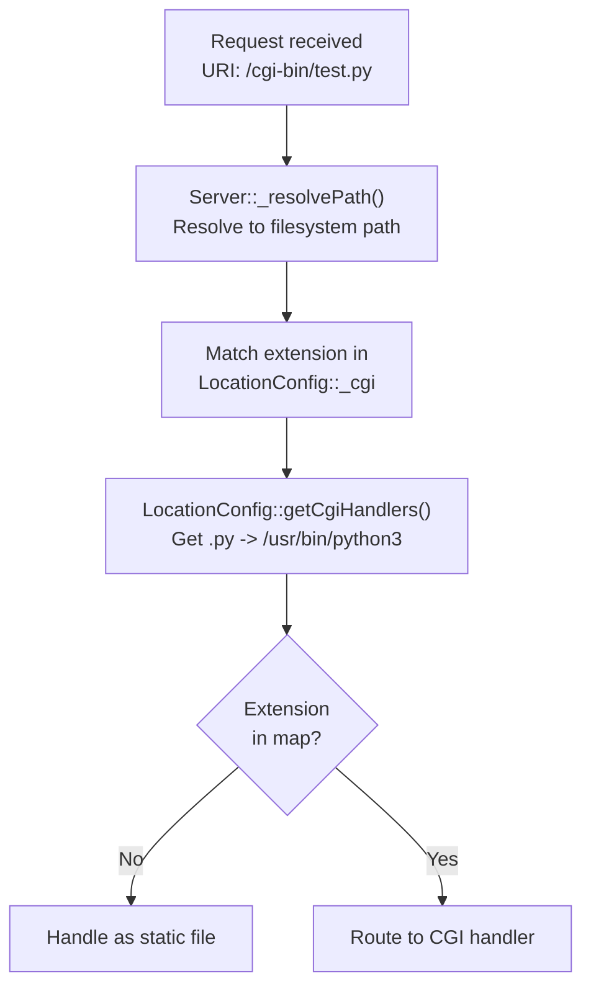
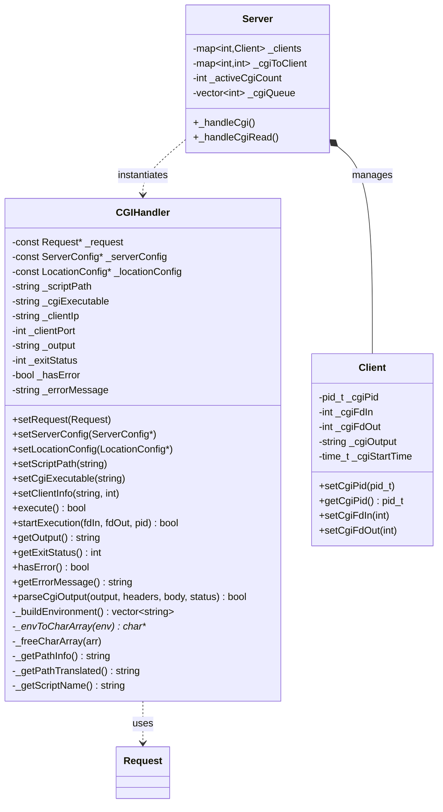
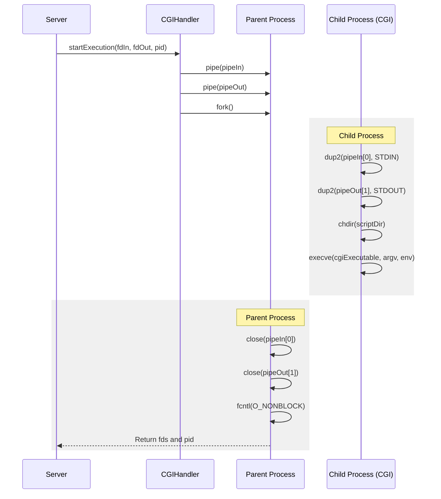

# CGI Execution Architecture

Relevant source files

The following files were used as context for generating this page:

- [inc/cgi/CGIHandler.hpp](inc/cgi/CGIHandler.hpp)
- [src/cgi/CGIHandler.cpp](src/cgi/CGIHandler.cpp)
- [src/server/Server.cpp](src/server/Server.cpp)

## Purpose and Scope

This document details the Common Gateway Interface (CGI) execution subsystem within webserv. It covers how the server detects CGI requests, constructs RFC 3875-compliant environments, manages process execution through forking, handles I/O redirection, parses CGI output, and controls concurrency through queue management.

The implementation is primarily contained within the `CGIHandler` class [inc/cgi/CGIHandler.hpp:26-78](), which manages the lifecycle of a single CGI execution, and the `Server` class [src/server/Server.cpp:13-20](), which orchestrates multiple concurrent CGI processes.

---

## CGI Request Detection

The server identifies CGI requests by examining the file extension of the requested resource against the `cgi` directives configured in the matching `LocationConfig`. When a request's URI resolves to a file with an extension mapped to a CGI interpreter (e.g., `.py` → `/usr/bin/python3`), the request is routed to CGI processing.

The detection logic is integrated into the request routing phase where the server matches the request to a `LocationConfig` [inc/cgi/CGIHandler.hpp:36]().

**Detection Flow:**

**Sources:** [inc/cgi/CGIHandler.hpp:34-38](), [src/cgi/CGIHandler.cpp:75-85]()

---

## CGIHandler Architecture

The `CGIHandler` class encapsulates all CGI execution logic. It is constructed and configured by the `Server` when processing a CGI request, then executes the script and captures output.

### Class Structure

**Sources:** [inc/cgi/CGIHandler.hpp:26-78](), [src/server/Server.cpp:56-60](), [src/cgi/CGIHandler.cpp:18-26]()

---

## Environment Construction

The `CGIHandler` constructs a complete CGI environment conforming to RFC 3875. The environment includes meta-variables describing the request, server, and client.

### Environment Variables

| Variable | Source | Implementation |
|----------|--------|----------------|
| `REQUEST_METHOD` | `Request::getMethod()` | [src/cgi/CGIHandler.cpp:183]() |
| `QUERY_STRING` | `Request::getQueryString()` | [src/cgi/CGIHandler.cpp:183]() |
| `CONTENT_TYPE` | `Request::getHeader("Content-Type")` | [src/cgi/CGIHandler.cpp:183]() |
| `CONTENT_LENGTH` | `Request::getBody().length()` | [src/cgi/CGIHandler.cpp:183]() |
| `PATH_INFO` | `_getPathInfo()` | [src/cgi/CGIHandler.cpp:75]() |
| `SCRIPT_NAME` | `_getScriptName()` | [src/cgi/CGIHandler.cpp:77]() |
| `REMOTE_ADDR` | `_clientIp` | [src/cgi/CGIHandler.cpp:87-90]() |
| `SERVER_PORT` | `ServerConfig::getPort()` | [src/cgi/CGIHandler.cpp:71-73]() |

### Build Process

The method `CGIHandler::_buildEnvironment()` [inc/cgi/CGIHandler.hpp:70]() iterates through all required variables. The results are stored in a `std::vector<std::string>` before being converted to a null-terminated `char**` array via `_envToCharArray()` [src/cgi/CGIHandler.cpp:184]() for use with `execve`.

**Sources:** [inc/cgi/CGIHandler.hpp:69-77](), [src/cgi/CGIHandler.cpp:182-184]()

---

## Process Execution Flow

CGI execution involves forking a child process, setting up I/O redirection through pipes, and invoking the script via `execve()`.

### Execution Sequence

**Sources:** [src/cgi/CGIHandler.cpp:132-214]()

### Fork and Exec Details

The child process execution in `startExecution` [src/cgi/CGIHandler.cpp:132-214]() follows this pattern:
1. **Redirection:** `dup2` is used to map the pipes to `STDIN_FILENO` and `STDOUT_FILENO` [src/cgi/CGIHandler.cpp:167-168]().
2. **Directory Change:** The process changes directory to the script's location using `chdir` to support relative path resource access within scripts [src/cgi/CGIHandler.cpp:174-180]().
3. **Execution:** `execve` is called with the absolute path to the CGI executable (e.g., `/usr/bin/python3`) [src/cgi/CGIHandler.cpp:194]().

---

## I/O Management

The server manages CGI I/O asynchronously using non-blocking pipes and the `poll()` event loop.

### Pipe Configuration

The parent process sets both the input and output pipe ends to `O_NONBLOCK` [src/cgi/CGIHandler.cpp:210-211](). This prevents the server from hanging if a CGI script is slow to consume input or produce output.

### I/O Operations

- **Input:** If the request has a body, it is written to the `fdIn` pipe [src/cgi/CGIHandler.cpp:104-106]().
- **Output:** The server reads from `fdOut` into a buffer [src/cgi/CGIHandler.cpp:110-115]().
- **Cleanup:** All CGI-related pipes are tracked in `_cgiToClient` [src/server/Server.cpp:237-242]() and closed during server shutdown or client cleanup.

**Sources:** [src/cgi/CGIHandler.cpp:104-115](), [src/server/Server.cpp:237-242]()

---

## Output Parsing

CGI scripts generate output consisting of HTTP headers followed by an optional body. The `CGIHandler::parseCgiOutput()` method parses this output.

### Parsing Algorithm

1. **Header/Body Split:** Locates the double newline (`\r\n\r\n` or `\n\n`) separating headers from the body [src/cgi/CGIHandler.cpp:246-248]().
2. **Status Extraction:** Specifically looks for the `Status:` header to set the HTTP response code [src/cgi/CGIHandler.cpp:243]().
3. **Header Mapping:** Parses all other lines into a `std::map<std::string, std::string>` [src/cgi/CGIHandler.cpp:241]().

**Sources:** [src/cgi/CGIHandler.cpp:240-254]()

---

## Queue Management and Concurrency Control

The `Server` class maintains an `_activeCgiCount` [src/server/Server.cpp:56]() to limit the number of simultaneous child processes.

- **Queueing:** If the maximum limit is reached, new CGI requests are added to `_cgiQueue` [src/server/Server.cpp:251-260]().
- **Reaping:** The server monitors child processes. When one exits, `_activeCgiCount` is decremented, and the next item in `_cgiQueue` is processed.
- **Cleanup:** `waitpid` with the `pid` returned by `startExecution` is used to prevent zombie processes [src/cgi/CGIHandler.cpp:119]().

**Sources:** [src/server/Server.cpp:56, 237-242](), [src/cgi/CGIHandler.cpp:119]()

---
