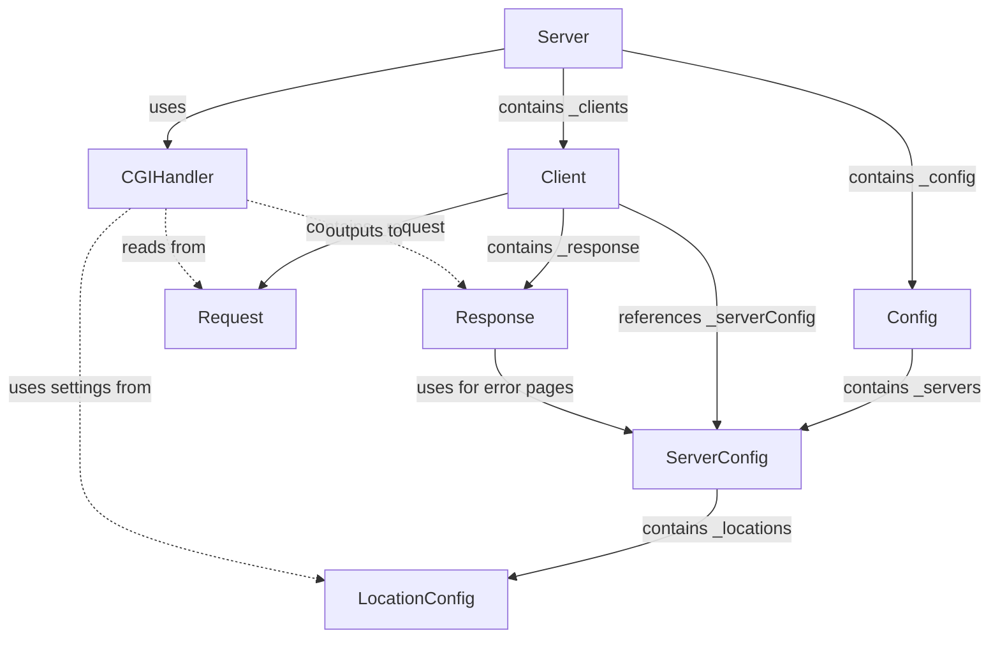
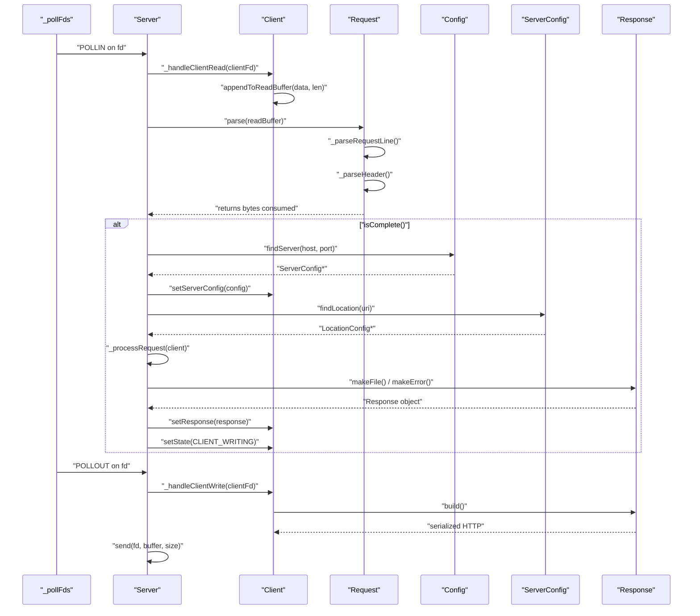
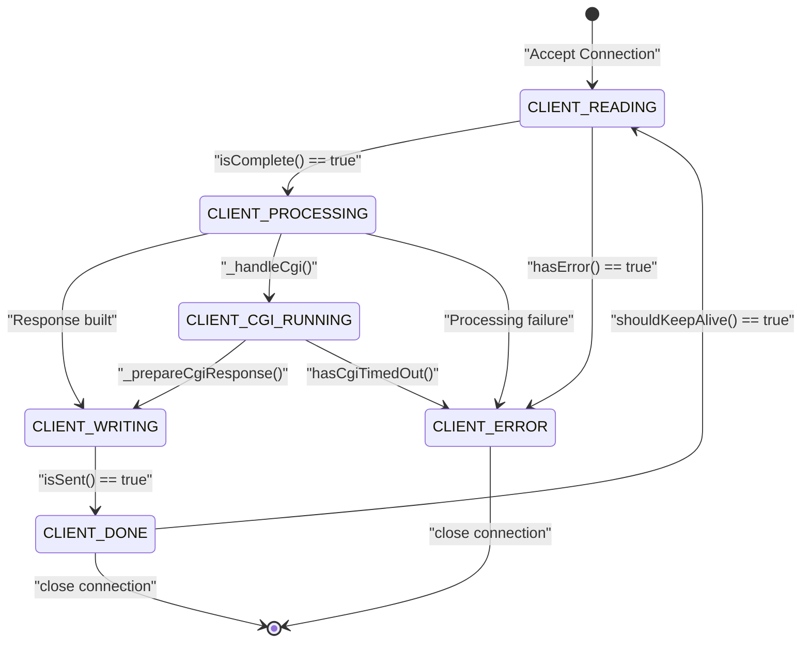

# Core Components Reference

Relevant source files

The following files were used as context for generating this page:

- [inc/config/Config.hpp](inc/config/Config.hpp)
- [inc/http/Request.hpp](inc/http/Request.hpp)
- [inc/http/Response.hpp](inc/http/Response.hpp)
- [inc/server/Client.hpp](inc/server/Client.hpp)
- [inc/server/Server.hpp](inc/server/Server.hpp)

## Purpose and Scope

This page provides a comprehensive reference for the core C++ classes that implement the webserv HTTP/1.1 server. These components handle configuration parsing, HTTP protocol implementation, connection management, request routing, and response generation.

For detailed architectural patterns and system design, see [Architecture](#3). For implementation details of specific components, see the subsections: [Server Class](#4.1), [Client Class](#4.2), [HTTP Request Parsing](#4.3), [HTTP Response Generation](#4.4), [Configuration Parser](#4.5), [Server Configuration](#4.6), and [Location Configuration](#4.7). For CGI-specific functionality, see [CGI Support](#5).

---

## Core Component Overview

The webserv server is built from primary classes that form a layered architecture:

| Component | Header File | Primary Responsibility | Key Dependencies |
|-----------|-------------|------------------------|------------------|
| `Config` | [inc/config/Config.hpp:32-68]() | Parse configuration files and manage server definitions | `ServerConfig` |
| `ServerConfig` | [inc/config/ServerConfig.hpp:1-100]() | Store server-level settings (host, port, server names) | `LocationConfig` |
| `LocationConfig` | [inc/config/LocationConfig.hpp:1-100]() | Store path-specific rules (methods, CGI, uploads) | None |
| `Server` | [inc/server/Server.hpp:25-107]() | Manage event loop, socket I/O, connection lifecycle | `Config`, `Client`, `CGIHandler` |
| `Client` | [inc/server/Client.hpp:31-121]() | Track per-connection state and buffers | `Request`, `Response`, `ServerConfig` |
| `Request` | [inc/http/Request.hpp:38-124]() | Parse HTTP requests incrementally | None |
| `Response` | [inc/http/Response.hpp:22-72]() | Build HTTP responses with headers and body | `ServerConfig` |

**Sources:** [inc/config/Config.hpp:1-70](), [inc/server/Server.hpp:1-107](), [inc/server/Client.hpp:1-123](), [inc/http/Request.hpp:1-126](), [inc/http/Response.hpp:1-74]()

---

## Class Hierarchy and Composition

The following diagram illustrates the structural relationships between core components, showing composition (contains) and usage (uses) patterns:

**Composition relationships:**
- `Config` owns a vector of `ServerConfig` objects ([inc/config/Config.hpp:56]())
- `Server` owns a `Config` instance and a map of `Client` instances ([inc/server/Server.hpp:49-52]())
- `Client` owns `Request` and `Response` instances ([inc/server/Client.hpp:103-104]())

**Reference relationships:**
- `Client` holds a pointer to its associated `ServerConfig` ([inc/server/Client.hpp:105]())
- `Response` accepts optional `ServerConfig` pointer for error page customization ([inc/http/Response.hpp:57]())

**Sources:** [inc/config/Config.hpp:32-68](), [inc/server/Server.hpp:25-107](), [inc/server/Client.hpp:31-121]()

---

## Request Processing Data Flow

This diagram shows how data flows through core components during a complete request-response cycle:

**Key data transformations:**
1. Raw socket data → `_readBuffer` ([inc/server/Client.hpp:108]())
2. `_readBuffer` → parsed `Request` object via `parse()` ([inc/http/Request.hpp:46]())
3. Request + Config → selected `ServerConfig` ([inc/server/Server.hpp:80]())
4. Request → `Response` object via static builders ([inc/http/Response.hpp:56-61]())
5. `Response` → serialized bytes in `_writeBuffer` ([inc/server/Client.hpp:109]())

**Sources:** [inc/server/Server.hpp:71-101](), [inc/server/Client.hpp:31-121](), [inc/http/Request.hpp:38-124](), [inc/http/Response.hpp:22-72]()

---

## Client State Machine

The `Client` class maintains state throughout the request-response lifecycle using the `ClientState` enumeration:

**State definitions** ([inc/server/Client.hpp:22-29]()):

| State | Purpose | Next States |
|-------|---------|-------------|
| `CLIENT_READING` | Receiving HTTP request data | `CLIENT_PROCESSING`, `CLIENT_ERROR` |
| `CLIENT_PROCESSING` | Routing request and generating response | `CLIENT_WRITING`, `CLIENT_CGI_RUNNING`, `CLIENT_ERROR` |
| `CLIENT_CGI_RUNNING` | Waiting for CGI subprocess output | `CLIENT_WRITING`, `CLIENT_ERROR` |
| `CLIENT_WRITING` | Sending HTTP response to client | `CLIENT_DONE`, `CLIENT_ERROR` |
| `CLIENT_DONE` | Transaction complete | `CLIENT_READING` (keep-alive), `[*]` |
| `CLIENT_ERROR` | Error occurred | `[*]` |

**Sources:** [inc/server/Client.hpp:22-29](), [inc/server/Client.hpp:56-62]()

---

## Core Component Interfaces

### Configuration Layer

#### Config Class
Parses `webserv.conf` and provides server lookups.
- `parse(filename)`: Parse file into `_servers` ([inc/config/Config.hpp:41]())
- `findServer(host, port)`: Returns matching `ServerConfig` ([inc/config/Config.hpp:46]())
- `validate()`: Checks config validity ([inc/config/Config.hpp:50]())

#### ServerConfig & LocationConfig
Store hierarchical settings.
- `ServerConfig` handles host/port/server_names ([inc/config/ServerConfig.hpp]())
- `LocationConfig` handles path-specific methods/CGI/uploads ([inc/config/LocationConfig.hpp]())

**Sources:** [inc/config/Config.hpp:32-68]()

---

### Server Runtime Layer

#### Server Class
Implements the main event loop using `poll()`.
- `run()`: Starts the server loop ([inc/server/Server.hpp:38]())
- `_handleClientRead(fd)`: Reads data and triggers `Request::parse` ([inc/server/Server.hpp:72]())
- `_processRequest(client)`: Dispatches to method handlers like `_handleGet` ([inc/server/Server.hpp:79-86]())
- `_checkTimeouts()`: Cleans up idle connections ([inc/server/Server.hpp:76]())

#### Client Class
Manages per-connection state and buffers.
- `getRequest()` / `getResponse()`: Access protocol objects ([inc/server/Client.hpp:46-49]())
- `getReadBuffer()` / `getWriteBuffer()`: Manage raw data ([inc/server/Client.hpp:70-71]())
- `setCgiPid(pid)`: Track active CGI processes ([inc/server/Client.hpp:80]())
- `shouldKeepAlive()`: Check if connection persists ([inc/server/Client.hpp:93]())

**Sources:** [inc/server/Server.hpp:25-107](), [inc/server/Client.hpp:31-121]()

---

### HTTP Protocol Layer

#### Request Class
Incremental parser for HTTP requests.
- `parse(data)`: State-machine based parsing ([inc/http/Request.hpp:46]())
- `getMethod()`, `getPath()`, `getHeaders()`: Accessors for parsed data ([inc/http/Request.hpp:54-62]())
- `getUploadedFiles()`: Access multipart data ([inc/http/Request.hpp:77]())
- `isComplete()`: True when `PARSE_COMPLETE` reached ([inc/http/Request.hpp:48]())

#### Response Class
Builder for HTTP responses.
- `setStatusCode(code)`: Set HTTP status ([inc/http/Response.hpp:30]())
- `build()`: Serialize to string for transmission ([inc/http/Response.hpp:40]())
- `makeError(code, config)`: Static factory for error pages ([inc/http/Response.hpp:57]())
- `makeFromCGI(output)`: Static factory for CGI results ([inc/http/Response.hpp:61]())

**Sources:** [inc/http/Request.hpp:38-124](), [inc/http/Response.hpp:22-72]()

---

## Error Handling and Memory

- **Exceptions**: Used primarily in configuration parsing via `ConfigException` ([inc/config/Config.hpp:23-30]()).
- **Ownership**: `Server` owns `Client` objects in a map ([inc/server/Server.hpp:52]()). `Client` owns `Request` and `Response` by value ([inc/server/Client.hpp:103-104]()).
- **Concurrency**: Single-threaded `poll()` loop ([inc/server/Server.hpp:51]()). CGI concurrency is limited by `_activeCgiCount` ([inc/server/Server.hpp:55]()).

**Sources:** [inc/server/Server.hpp:49-56](), [inc/server/Client.hpp:100-105](), [inc/config/Config.hpp:56]()

---
