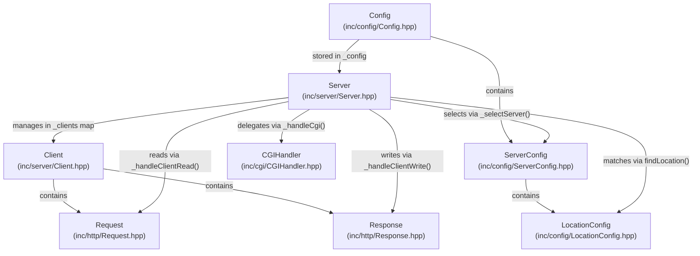
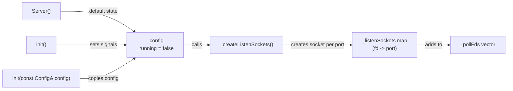
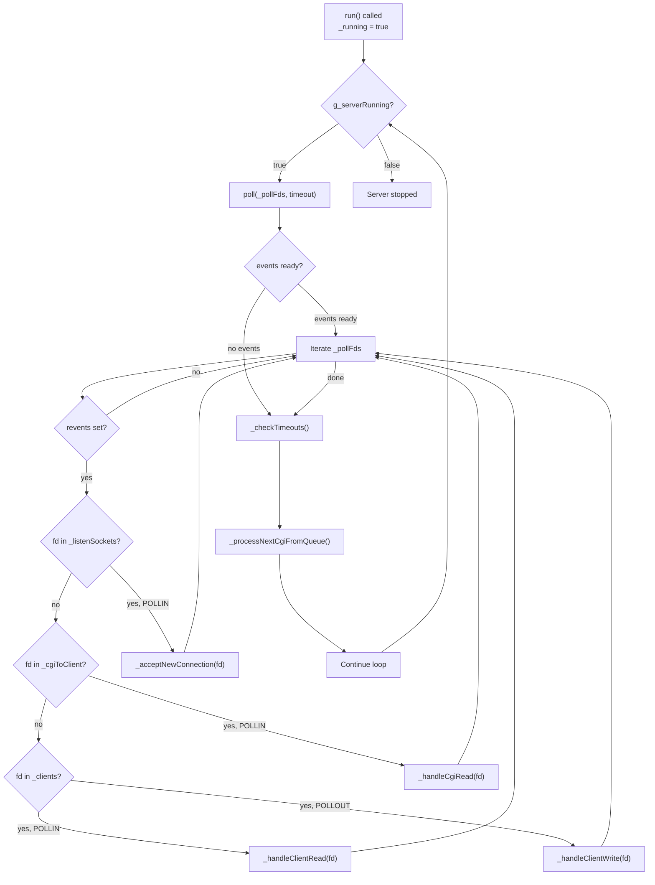
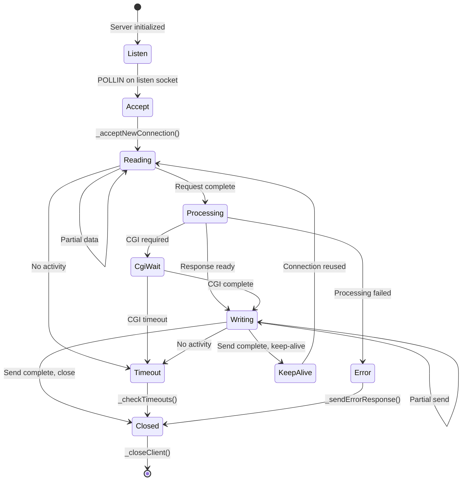
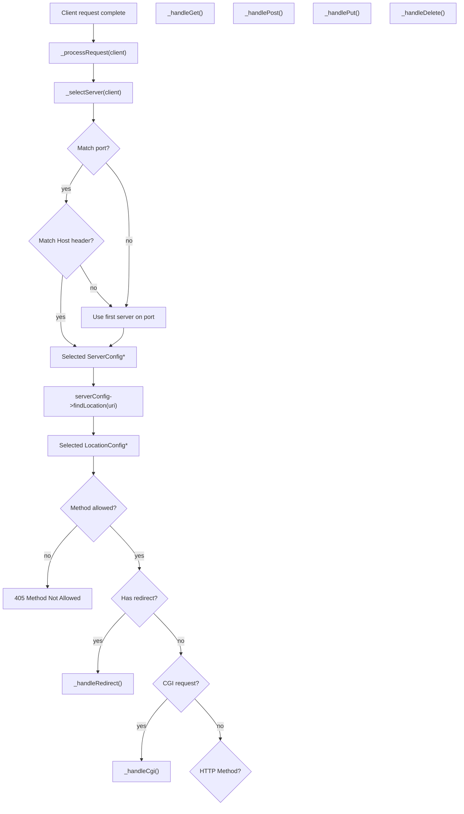

# Server Class

Relevant source files

The following files were used as context for generating this page:

- [inc/server/Server.hpp](inc/server/Server.hpp)
- [src/server/Server.cpp](src/server/Server.cpp)

## Purpose and Scope

The `Server` class is the central orchestrator of the webserv HTTP server, responsible for managing all network connections, routing incoming requests, and coordinating response generation. This document provides a complete reference for the `Server` class implementation, including its event loop architecture, connection management, request routing logic, and integration with other core components.

The class utilizes `poll()` for I/O multiplexing, allowing it to handle multiple concurrent connections and CGI processes within a single thread. It maintains the state of all active clients and manages the lifecycle of each HTTP transaction from initial socket acceptance to final response transmission.

**Sources:** [inc/server/Server.hpp:25-107](), [src/server/Server.cpp:1-40]()

---

## Class Overview

The `Server` class implements a non-blocking, poll-based HTTP server. It serves as the main entry point for the webserv executable and coordinates all subsystems.

### Key Responsibilities

| Responsibility | Description | Related Methods |
|---------------|-------------|-----------------|
| **Connection Management** | Accepting new connections, maintaining client state, handling disconnections | `_acceptNewConnection()`, `_closeClient()`, `_checkTimeouts()` |
| **Event Loop** | Poll-based I/O multiplexing for handling multiple file descriptors | `run()`, `_rebuildPollFds()`, `_addToPoll()` |
| **Request Routing** | Virtual host selection and location matching | `_selectServer()`, `_processRequest()` |
| **Response Handling** | Delegating to appropriate handlers based on HTTP method and configuration | `_handleGet()`, `_handlePost()`, `_handleCgi()`, etc. |
| **CGI Management** | Tracking concurrent CGI processes and managing execution queue | `_handleCgi()`, `_processNextCgiFromQueue()` |
| **Socket Management** | Creating listen sockets, setting non-blocking mode | `_createListenSockets()`, `_setNonBlocking()` |

**Sources:** [inc/server/Server.hpp:58-93](), [src/server/Server.cpp:247-450]()

---

## Architecture and Design

### Server's Role in the System

The `Server` class acts as the central hub, maintaining the `_config` object for routing decisions [inc/server/Server.hpp:49](), a `_clients` map for per-connection state [inc/server/Server.hpp:52](), and `_pollFds` for event multiplexing [inc/server/Server.hpp:51](). It consults configuration objects to route requests and delegates to specialized handlers for response generation.

**Sources:** [inc/server/Server.hpp:48-57](), [src/server/Server.cpp:642-680]()

---

## Core Components

### Configuration and Initialization

The `Server` class stores a `Config` object that contains all server and location configurations parsed from `webserv.conf`.

| Method | Purpose | Returns |
|--------|---------|---------|
| `Server()` | Default constructor, initializes empty server [src/server/Server.cpp:56-58]() | N/A |
| `init()` | Setup signals and create listen sockets [src/server/Server.cpp:90-101]() | `bool` - success status |
| `_createListenSockets()` | Iterates config to bind sockets to ports [src/server/Server.cpp:109-154]() | `bool` - success status |

Initialization sets up signal handlers for `SIGINT` and `SIGTERM` to allow graceful shutdown [src/server/Server.cpp:93-97](). It ignores `SIGPIPE` to prevent server crashes on broken client connections [src/server/Server.cpp:98]().

**Sources:** [src/server/Server.cpp:56-107](), [src/server/Server.cpp:109-154]()

---

### Event Loop System

The `Server` implements a poll-based event loop in `run()` that monitors multiple file descriptors simultaneously.

#### Event Loop Flow

The event loop relies on the global `g_serverRunning` flag [src/server/Server.cpp:40](), which is toggled by the `_signalHandler` [src/server/Server.cpp:46-50]().

**Sources:** [src/server/Server.cpp:247-320](), [inc/server/Server.hpp:38-39]()

---

### Socket Management

The `Server` manages listen sockets and client sockets using non-blocking I/O.

| Method | Purpose | Details |
|--------|---------|---------|
| `_createSocket()` | Create, bind, and listen on a socket [src/server/Server.cpp:156-208]() | Uses `SO_REUSEADDR` and sets `O_NONBLOCK` |
| `_setNonBlocking()` | Set `O_NONBLOCK` on a file descriptor [src/server/Server.cpp:210-216]() | Uses `fcntl()` |
| `_closeAllSockets()` | Cleanup all FDs (listen, client, CGI) [src/server/Server.cpp:218-245]() | Called in destructor |

Listen sockets are mapped to their respective ports in `_listenSockets` [inc/server/Server.hpp:53](), which allows the server to identify which virtual host group a new connection belongs to.

**Sources:** [src/server/Server.cpp:156-245](), [inc/server/Server.hpp:59-62]()

---

### Poll Management

The `Server` maintains a `std::vector<struct pollfd>` [inc/server/Server.hpp:51]() that is dynamically updated as file descriptors are added or removed.

| Method | Purpose | Implementation |
|--------|---------|-------------|
| `_rebuildPollFds()` | Sync `_pollFds` with all active maps [src/server/Server.cpp:322-355]() | Clears and repopulates vector |
| `_addToPoll()` | Add a single FD to the vector [src/server/Server.cpp:357-362]() | `push_back` a new `pollfd` |
| `_removeFromPoll()` | Remove FD from the vector [src/server/Server.cpp:364-374]() | Erases from vector |
| `_setEvents()` | Update `events` (e.g., `POLLIN` to `POLLOUT`) [src/server/Server.cpp:376-386]() | Updates existing `pollfd` in vector |

**Sources:** [src/server/Server.cpp:322-386](), [inc/server/Server.hpp:64-68]()

---

### Client Connection Lifecycle

The `Server` manages client connections through a state machine handled during the event loop.

#### Connection States and Transitions

When `_acceptNewConnection()` is called [src/server/Server.cpp:388-417](), a new `Client` object is created and stored in the `_clients` map [inc/server/Server.hpp:52](). The client's socket is immediately set to non-blocking mode [src/server/Server.cpp:407]().

**Sources:** [src/server/Server.cpp:388-510](), [inc/server/Server.hpp:70-76]()

---

### Request Processing Pipeline

Once a complete HTTP request is received (determined by `client.getRequest().isComplete()`), the `Server` routes it.

#### Request Routing Flow

The `_selectServer()` method [src/server/Server.cpp:642-680]() performs virtual host matching by comparing the `Host` header against `server_name` directives. If no match is found, it defaults to the first server block defined for that port [src/server/Server.cpp:679]().

**Sources:** [src/server/Server.cpp:584-640](), [src/server/Server.cpp:642-680]()

---

### Response Handlers

The `Server` provides specialized handler methods for different request types.

| Method | HTTP Method | Purpose | Key Actions |
|--------|-------------|---------|-------------|
| `_handleGet()` | GET | Serve static files/dirs [src/server/Server.cpp:682-736]() | Path resolution, directory listing check |
| `_handlePost()` | POST | Process data/uploads [src/server/Server.cpp:738-765]() | Check for CGI or file upload |
| `_handlePut()` | PUT | Create/Replace files [src/server/Server.cpp:767-802]() | Write body to file system |
| `_handleDelete()` | DELETE | Remove files [src/server/Server.cpp:804-830]() | `unlink()` target file |
| `_handleCgi()` | Any | Execute scripts [src/server/Server.cpp:832-886]() | Forking and pipe management |

**Sources:** [src/server/Server.cpp:682-950]()

---

### CGI Process Management

The `Server` limits concurrent CGI executions via `_activeCgiCount` [inc/server/Server.hpp:55]() and maintains a `_cgiQueue` [inc/server/Server.hpp:56]().

When a CGI request is initiated in `_handleCgi()`:
1. If `_activeCgiCount` is at its limit, the client FD is added to `_cgiQueue` [src/server/Server.cpp:837-842]().
2. Otherwise, a `CGIHandler` is used to fork the process [src/server/Server.cpp:858-874]().
3. The CGI output pipe is added to `_cgiToClient` mapping [src/server/Server.cpp:878]().
4. When `_handleCgiRead()` detects completion, `_processNextCgiFromQueue()` is called to drain the queue [src/server/Server.cpp:1037-1053]().

**Sources:** [src/server/Server.cpp:832-886](), [src/server/Server.cpp:1037-1053]()

---

## Data Structures

### Private Member Variables

| Member | Type | Purpose |
|--------|------|---------|
| `_config` | `Config` | Stores all server and location configurations [inc/server/Server.hpp:49]() |
| `_pollFds` | `std::vector<struct pollfd>` | File descriptors monitored by `poll()` [inc/server/Server.hpp:51]() |
| `_clients` | `std::map<int, Client>` | Maps client socket FD to `Client` object [inc/server/Server.hpp:52]() |
| `_listenSockets` | `std::map<int, int>` | Maps listen socket FD to port number [inc/server/Server.hpp:53]() |
| `_cgiToClient` | `std::map<int, int>` | Maps CGI pipe FD to client FD [inc/server/Server.hpp:54]() |
| `_activeCgiCount` | `size_t` | Concurrent CGI process tracker [inc/server/Server.hpp:55]() |

**Sources:** [inc/server/Server.hpp:48-57]()

---

## Public API Reference

| Method | Return Type | Purpose |
|--------|-------------|---------|
| `init(const Config&)` | `bool` | Initializes server with config [src/server/Server.cpp:103-107]() |
| `run()` | `void` | Starts the event loop [src/server/Server.cpp:247-320]() |
| `stop()` | `void` | Signals the server to stop [src/server/Server.cpp:46-50]() |
| `isRunning()` | `bool` | Returns server status [src/server/Server.cpp:317]() |
| `getClientCount()` | `size_t` | Returns number of active clients [src/server/Server.cpp:320]() |

**Sources:** [inc/server/Server.hpp:26-47](), [src/server/Server.cpp:42-107]()

---
