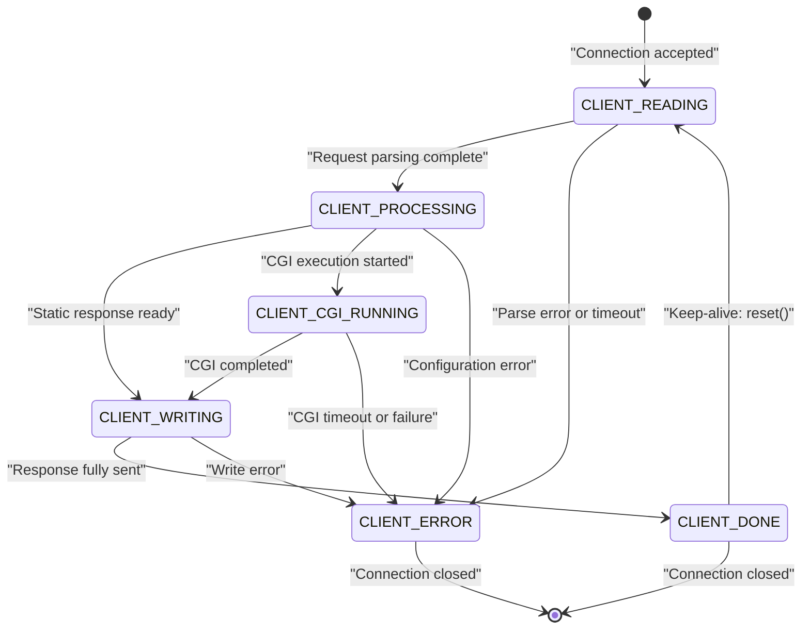
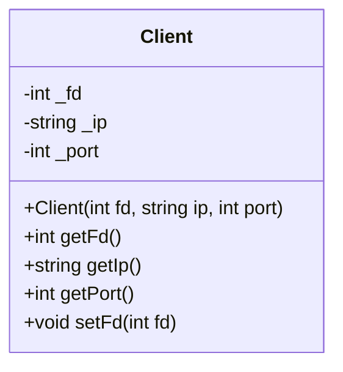
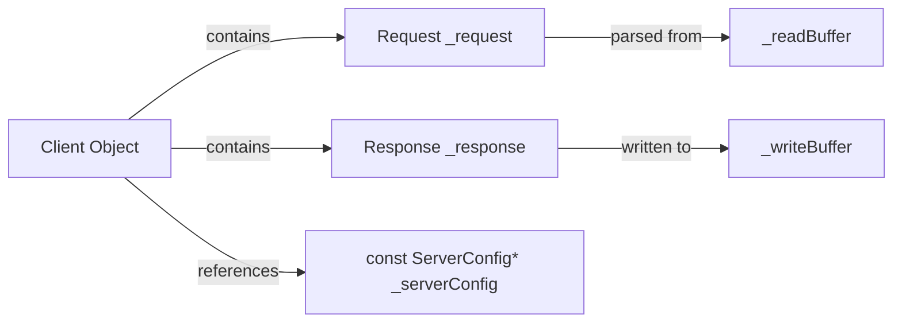
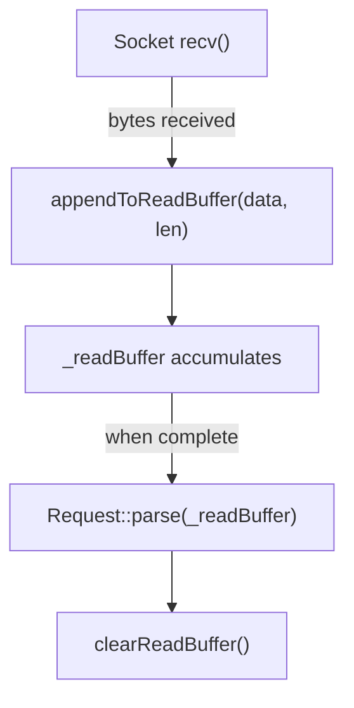
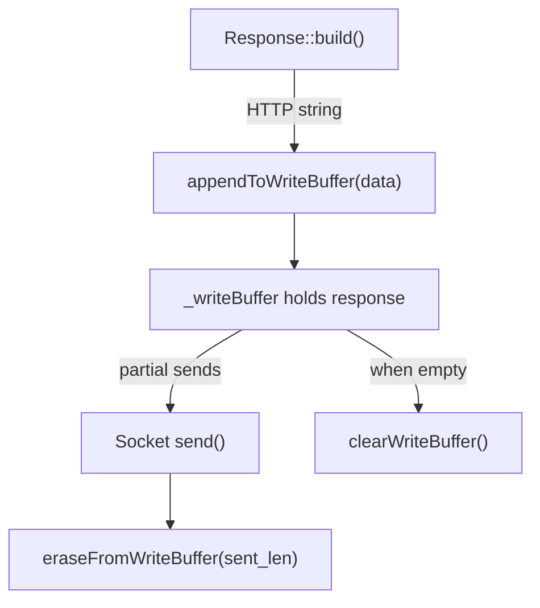
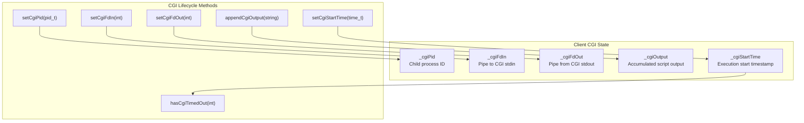

# Client Class

<details>
<summary>Relevant source files</summary>

The following files were used as context for generating this page:

- [inc/server/Client.hpp](inc/server/Client.hpp)
- [src/server/Client.cpp](src/server/Client.cpp)

</details>


## Purpose and Scope

The `Client` class represents a single client connection in the webserv HTTP server. It encapsulates all per-connection state, including socket information, request parsing state, response generation state, I/O buffers, and CGI execution tracking. Each `Client` instance manages the complete lifecycle of one HTTP connection, from initial socket acceptance through request processing to response transmission, with support for HTTP keep-alive allowing multiple request/response cycles on a single connection.

This document covers the `Client` class implementation, its state machine, buffer management, and integration with Request/Response objects. For server-level connection management, see [Server Class](#4.1). For request parsing details, see [HTTP Request Parsing](#4.3). For response generation, see [HTTP Response Generation](#4.4).

**Sources:** [inc/server/Client.hpp:1-123]()

---

## Class Overview

The `Client` class is defined in [inc/server/Client.hpp:31-121]() and serves as a container for all data associated with a client connection. It aggregates several key components:

| Component | Type | Purpose |
|-----------|------|---------|
| Socket Information | `int _fd`, `std::string _ip`, `int _port` | Identifies the client connection |
| HTTP Objects | `Request _request`, `Response _response` | Holds parsed request and generated response |
| Configuration | `const ServerConfig* _serverConfig` | Server block configuration for this connection |
| State Machine | `ClientState _state` | Current processing state |
| I/O Buffers | `std::string _readBuffer`, `std::string _writeBuffer` | Temporary storage for network I/O |
| Timing | `time_t _lastActivity` | Connection timeout tracking |
| CGI Data | `pid_t _cgiPid`, `int _cgiFdIn/Out`, `std::string _cgiOutput` | CGI execution state |
| Keep-Alive | `bool _keepAlive`, `int _requestCount` | Connection reuse support |

**Sources:** [inc/server/Client.hpp:99-121]()

---

## Client State Machine

The `Client` class uses the `ClientState` enumeration [inc/server/Client.hpp:22-29]() to track the current processing phase of a connection:



### State Descriptions

| State | Description | Methods |
|-------|-------------|---------|
| `CLIENT_READING` | Receiving HTTP request data from socket | `isReadyToRead()` returns `true` |
| `CLIENT_PROCESSING` | Determining response type (static/CGI/error) | Server routing logic active |
| `CLIENT_WRITING` | Transmitting HTTP response to socket | `isReadyToWrite()` returns `true` |
| `CLIENT_CGI_RUNNING` | Waiting for CGI script to complete | `getCgiPid()` is valid |
| `CLIENT_DONE` | Request/response cycle complete | `isDone()` returns `true` |
| `CLIENT_ERROR` | Error condition encountered | `hasError()` returns `true` |

State transitions are managed through `setState()` [src/server/Client.cpp:158-160]() and queried via state check methods [src/server/Client.cpp:162-176]().

**Sources:** [inc/server/Client.hpp:22-29](), [inc/server/Client.hpp:57-62](), [src/server/Client.cpp:154-176]()

---

## Connection Information

The `Client` class stores socket-level connection details provided during construction:



The constructor [src/server/Client.cpp:31-45]() accepts:
- **File Descriptor (`fd`)**: The socket file descriptor for network I/O
- **IP Address (`ip`)**: Client's IP address as a string (e.g., "192.168.1.100")
- **Port (`port`)**: Client's source port number

These values are initialized in the constructor and accessed via getters [src/server/Client.cpp:98-108](). The `_fd` can be updated via `setFd()` [src/server/Client.cpp:110-112]().

**Sources:** [inc/server/Client.hpp:34](), [inc/server/Client.hpp:40-43](), [inc/server/Client.hpp:100-102](), [src/server/Client.cpp:31-45](), [src/server/Client.cpp:98-112]()

---

## HTTP Request and Response Objects

Each `Client` instance contains dedicated `Request` and `Response` objects that represent the current HTTP transaction:



### Request Management

The `Request` object [inc/server/Client.hpp:103]() is accessed through:
- `getRequest()` [src/server/Client.cpp:118-120]() - Returns mutable reference for parsing
- `getRequest() const` [src/server/Client.cpp:122-124]() - Returns const reference for reading

The `Request` is incrementally populated as data arrives in `_readBuffer` during the `CLIENT_READING` state.

### Response Management

The `Response` object [inc/server/Client.hpp:104]() is accessed through:
- `getResponse()` [src/server/Client.cpp:126-128]() - Returns mutable reference for building
- `getResponse() const` [src/server/Client.cpp:130-132]() - Returns const reference for reading
- `setResponse(const Response&)` [src/server/Client.cpp:134-136]() - Replaces the entire response

The `Response` is constructed during `CLIENT_PROCESSING` and transmitted from `_writeBuffer` during `CLIENT_WRITING`.

### Server Configuration

The `_serverConfig` pointer [inc/server/Client.hpp:105]() links this client to its matched virtual host configuration:
- `setServerConfig(const ServerConfig*)` [src/server/Client.cpp:142-144]() - Assigns configuration after server selection
- `getServerConfig()` [src/server/Client.cpp:146-148]() - Retrieves configuration for routing

**Sources:** [inc/server/Client.hpp:46-54](), [inc/server/Client.hpp:103-105](), [src/server/Client.cpp:118-148]()

---

## Buffer Management

The `Client` class maintains separate buffers for input and output to handle non-blocking I/O:

| Buffer | Type | Purpose | Key Methods |
|--------|------|---------|-------------|
| `_readBuffer` | `std::string` | Accumulates incoming HTTP request data | `appendToReadBuffer()`, `clearReadBuffer()`, `getReadBuffer()` |
| `_writeBuffer` | `std::string` | Stages outgoing HTTP response data | `appendToWriteBuffer()`, `eraseFromWriteBuffer()`, `clearWriteBuffer()` |

### Read Buffer Operations

[src/server/Client.cpp:198-216]()



Methods:
- `getReadBuffer()` [src/server/Client.cpp:198-200]() - Direct access to buffer
- `appendToReadBuffer(const char*, size_t)` [src/server/Client.cpp:206-208]() - Adds data from socket
- `clearReadBuffer()` [src/server/Client.cpp:214-216]() - Empties buffer after request parsing

### Write Buffer Operations

[src/server/Client.cpp:202-228]()



Methods:
- `getWriteBuffer()` [src/server/Client.cpp:202-204]() - Direct access to buffer
- `appendToWriteBuffer(const std::string&)` [src/server/Client.cpp:210-212]() - Adds response data
- `getWriteBufferSize()` [src/server/Client.cpp:222-224]() - Returns bytes remaining to send
- `eraseFromWriteBuffer(size_t)` [src/server/Client.cpp:226-228]() - Removes sent bytes from front
- `clearWriteBuffer()` [src/server/Client.cpp:218-220]() - Empties buffer after completion

**Sources:** [inc/server/Client.hpp:69-77](), [inc/server/Client.hpp:108-109](), [src/server/Client.cpp:198-228]()

---

## Timeout Management

The `Client` class tracks activity timestamps to detect idle connections and enforce timeout policies:

### Activity Tracking

[src/server/Client.cpp:182-192]()

- `_lastActivity` [inc/server/Client.hpp:107]() - Timestamp of last I/O operation
- `updateLastActivity()` [src/server/Client.cpp:182-184]() - Sets `_lastActivity` to current time
- `getLastActivity()` [src/server/Client.cpp:186-188]() - Retrieves timestamp

This timestamp is updated whenever data is successfully read from or written to the socket.

### Timeout Detection

[src/server/Client.cpp:190-192]()

```cpp
bool hasTimedOut(int timeout) const;
```

Compares `(current_time - _lastActivity)` against the provided `timeout` in seconds. Returns `true` if the connection has been idle beyond the threshold. The `Server` class uses this to close stale connections.

**Sources:** [inc/server/Client.hpp:65-67](), [inc/server/Client.hpp:107](), [src/server/Client.cpp:182-192]()

---

## CGI Execution Support

When a request requires CGI script execution, the `Client` tracks the subprocess and its I/O channels:



### CGI State Variables

[inc/server/Client.hpp:112-116]()

| Variable | Type | Purpose |
|----------|------|---------|
| `_cgiPid` | `pid_t` | Process ID of forked CGI script |
| `_cgiFdIn` | `int` | File descriptor for writing to CGI stdin |
| `_cgiFdOut` | `int` | File descriptor for reading from CGI stdout |
| `_cgiOutput` | `std::string` | Buffer accumulating CGI script output |
| `_cgiStartTime` | `time_t` | When CGI execution started (for timeout) |

### CGI Methods

[src/server/Client.cpp:234-278]()

**Process Control:**
- `setCgiPid(pid_t)` / `getCgiPid()` [src/server/Client.cpp:234-240]() - Manage child process ID

**I/O Channels:**
- `setCgiFdIn(int)` / `getCgiFdIn()` [src/server/Client.cpp:242-252]() - Pipe for sending request body to CGI
- `setCgiFdOut(int)` / `getCgiFdOut()` [src/server/Client.cpp:246-256]() - Pipe for receiving CGI output

**Output Collection:**
- `getCgiOutput()` [src/server/Client.cpp:258-260]() - Access accumulated output buffer
- `appendCgiOutput(const std::string&)` [src/server/Client.cpp:262-264]() - Add data read from `_cgiFdOut`

**Timeout Tracking:**
- `setCgiStartTime(time_t)` / `getCgiStartTime()` [src/server/Client.cpp:266-272]() - When script execution began
- `hasCgiTimedOut(int)` [src/server/Client.cpp:274-278]() - Check if CGI has exceeded timeout duration

**Sources:** [inc/server/Client.hpp:79-90](), [inc/server/Client.hpp:112-116](), [src/server/Client.cpp:234-278]()

---

## Keep-Alive Connection Support

The `Client` class implements HTTP persistent connections, allowing multiple request/response cycles on a single TCP connection.

### Keep-Alive State and Methods

[src/server/Client.cpp:284-315]()

- `_keepAlive` (bool) [inc/server/Client.hpp:119]() - Whether keep-alive is enabled.
- `_requestCount` (int) [inc/server/Client.hpp:120]() - Number of requests processed on this connection.
- `shouldKeepAlive()` [src/server/Client.cpp:284-286]() - Returns `true` if connection should persist.
- `setKeepAlive(bool)` [src/server/Client.cpp:288-290]() - Explicitly sets keep-alive status.
- `incrementRequestCount()` [src/server/Client.cpp:296-298]() - Increments after each request.

### Reset Operation

The `reset()` method [src/server/Client.cpp:300-315]() prepares the `Client` for the next HTTP request on a keep-alive connection:

1. Calls `_request.reset()` to clear parser state.
2. Calls `_response.reset()` to clear previous response data.
3. Sets `_state` to `CLIENT_READING`.
4. Updates `_lastActivity` timestamp.
5. Clears all buffers (`_readBuffer`, `_writeBuffer`, `_cgiOutput`).
6. Resets CGI state (`_cgiPid`, `_cgiFdIn`, `_cgiFdOut`, `_cgiStartTime`).

**Sources:** [inc/server/Client.hpp:92-97](), [inc/server/Client.hpp:119-120](), [src/server/Client.cpp:284-315]()

---

## Summary Table: Client Class API

| Category | Methods | Purpose |
|----------|---------|---------|
| **Construction** | `Client()`, `Client(fd, ip, port)`, `~Client()` | Object lifecycle |
| **Socket Info** | `getFd()`, `getIp()`, `getPort()`, `setFd()` | Connection identification |
| **HTTP Objects** | `getRequest()`, `getResponse()`, `setResponse()` | Access request/response |
| **Configuration** | `setServerConfig()`, `getServerConfig()` | Virtual host association |
| **State Management** | `getState()`, `setState()`, `isReadyToRead()`, `isReadyToWrite()`, `isDone()`, `hasError()` | State machine control |
| **Timeout** | `updateLastActivity()`, `getLastActivity()`, `hasTimedOut()` | Connection timeout |
| **Read Buffer** | `getReadBuffer()`, `appendToReadBuffer()`, `clearReadBuffer()` | Incoming data |
| **Write Buffer** | `getWriteBuffer()`, `appendToWriteBuffer()`, `clearWriteBuffer()`, `getWriteBufferSize()`, `eraseFromWriteBuffer()` | Outgoing data |
| **CGI State** | `setCgiPid()`, `getCgiPid()`, `setCgiFdIn/Out()`, `getCgiFdIn/Out()` | Process tracking |
| **CGI I/O** | `getCgiOutput()`, `appendCgiOutput()`, `setCgiStartTime()`, `getCgiStartTime()`, `hasCgiTimedOut()` | CGI output/timeout |
| **Keep-Alive** | `shouldKeepAlive()`, `setKeepAlive()`, `getRequestCount()`, `incrementRequestCount()`, `reset()` | Persistent connections |

**Sources:** [inc/server/Client.hpp:39-97](), [src/server/Client.cpp:15-315]()

---
