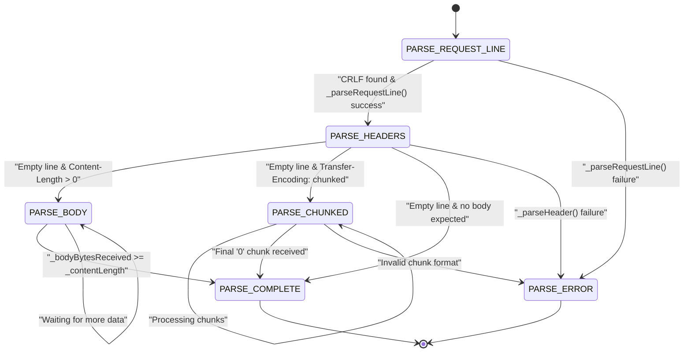
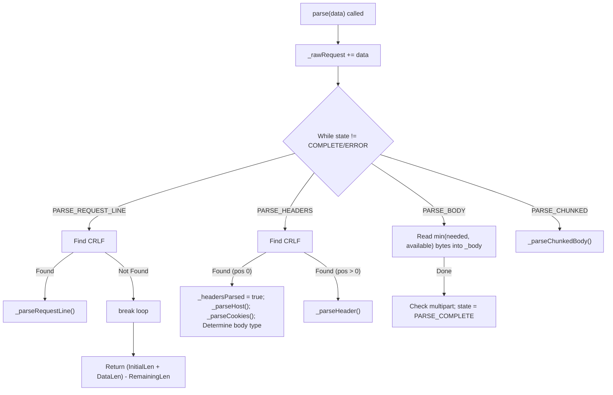

# HTTP Request Parsing

Relevant source files

The following files were used as context for generating this page:

- [inc/http/Request.hpp](inc/http/Request.hpp)
- [src/http/Request.cpp](src/http/Request.cpp)

## Purpose and Scope

This document provides detailed technical documentation of the `Request` class, which implements HTTP/1.1 request parsing for the webserv server. The `Request` class handles incremental parsing of HTTP requests through a state machine, extracting request lines, headers, and bodies into structured data. It is designed to work with non-blocking I/O, allowing data to be processed as it arrives from the socket.

**Sources:** [inc/http/Request.hpp:1-126](), [src/http/Request.cpp:1-85]()

---

## Class Overview

The `Request` class is responsible for parsing raw HTTP data received from client connections. It implements a non-blocking, incremental parser that can handle partial data arrival, which is essential for network I/O operations using `poll()`.

**Key Responsibilities:**
- Parse HTTP request lines (method, URI, version).
- Extract and normalize HTTP headers.
- Handle request bodies with various transfer encodings (Content-Length and Chunked).
- Parse query strings and URI components.
- Extract cookies from `Cookie` headers.
- Parse `multipart/form-data` for file uploads.
- Validate HTTP protocol compliance.
- Maintain parsing state across multiple data chunks via an internal buffer.

**Sources:** [inc/http/Request.hpp:38-43](), [inc/http/Request.hpp:84-124]()

---

## Parsing State Machine

The `Request` class implements a state machine defined by the `ParseState` enumeration. This allows the parser to resume processing from where it left off when more data arrives.

### State Transitions

### State Enumeration

| State | Value | Description |
|-------|-------|-------------|
| `PARSE_REQUEST_LINE` | 0 | Initial state, parsing first line (Method URI Version) |
| `PARSE_HEADERS` | 1 | Parsing header lines until a blank line (`\r\n\r\n`) is encountered |
| `PARSE_BODY` | 2 | Reading body based on `Content-Length` |
| `PARSE_CHUNKED` | 3 | Reading body using chunked transfer encoding |
| `PARSE_COMPLETE` | 4 | Parsing finished successfully |
| `PARSE_ERROR` | 5 | Parsing error encountered (e.g., malformed syntax) |

**Sources:** [inc/http/Request.hpp:22-29](), [src/http/Request.cpp:99-165]()

---

## Incremental Parsing Architecture

The `Request` class uses an incremental parsing approach. The primary parsing interface consists of `parse(const std::string& data)`, which appends new data to an internal buffer (`_rawRequest`) and processes as much as possible according to the current state.

### Implementation of `parse()`

The `parse` method calculates how many bytes were actually consumed from the stream by comparing the buffer size before and after processing.

**Sources:** [src/http/Request.cpp:91-174](), [inc/http/Request.hpp:46-47]()

---

## Request Components and Extraction

### Request Line and URI
The request line is split into method, URI, and version. The URI is further decomposed by `_parseUri()` into path, query string, and fragment. Query strings are parsed into the `_queryParams` map by `_parseQueryString()`.

**Sources:** [inc/http/Request.hpp:114-117](), [src/http/Request.cpp:180-193]()

### Header Normalization and Special Headers
Headers are stored in a map. The `_normalizeHeaderName()` function ensures case-insensitive matching by converting names to a standard format (e.g., `Content-Length`).
- **Host**: Extracted by `_parseHost()` to determine `_host` and `_port`.
- **Cookies**: Extracted by `_parseCookies()` from the `Cookie` header into the `_cookies` map.

**Sources:** [inc/http/Request.hpp:118-119](), [inc/http/Request.hpp:123](), [src/http/Request.cpp:121-122]()

---

## Body Handling: Chunked and Multipart

### Chunked Transfer Encoding
If `Transfer-Encoding: chunked` is detected, the parser enters `PARSE_CHUNKED`. It uses `_parseChunkedBody()` to read hex-encoded chunk sizes followed by the chunk data, finally reaching a `0` size chunk to signal completion.

**Sources:** [inc/http/Request.hpp:109-110](), [inc/http/Request.hpp:121](), [src/http/Request.cpp:124-127]()

### Multipart Form Data
For `POST` requests with `Content-Type: multipart/form-data`, the `_parseMultipartBody()` method extracts individual files and form fields into the `_uploadedFiles` vector of `UploadedFile` structures.

**Sources:** [inc/http/Request.hpp:31-36](), [inc/http/Request.hpp:101](), [inc/http/Request.hpp:120](), [src/http/Request.cpp:151-154]()

---

## Data Access Interface

The `Request` class provides getters for all components.

| Component | Method | Source |
|-----------|--------|--------|
| **Method** | `getMethod()` | [inc/http/Request.hpp:54]() |
| **Path** | `getPath()` | [inc/http/Request.hpp:56]() |
| **Headers** | `getHeader(name)`, `getHeaders()` | [inc/http/Request.hpp:62-63]() |
| **Body** | `getBody()` | [inc/http/Request.hpp:67]() |
| **Query Params** | `getQueryParams()` | [inc/http/Request.hpp:74]() |
| **Cookies** | `getCookie(name)`, `getCookies()` | [inc/http/Request.hpp:75-76]() |
| **Files** | `getUploadedFiles()` | [inc/http/Request.hpp:77]() |
| **State** | `isComplete()`, `hasError()`, `getErrorCode()` | [inc/http/Request.hpp:48-50]() |

---

## Error Handling and Validation

Validation occurs via `_validateRequest()`. If the request violates HTTP/1.1 syntax or server limits (like `client_max_body_size`), the state is set to `PARSE_ERROR` and an appropriate `_errorCode` (e.g., 400, 413, 501) is assigned.

**Sources:** [inc/http/Request.hpp:105](), [inc/http/Request.hpp:122](), [src/http/Request.cpp:111]()

---

## Connection Reuse

The `reset()` method is critical for keep-alive connections. It clears all internal buffers and maps, resetting the state to `PARSE_REQUEST_LINE` to prepare for the next request on the same socket.

**Sources:** [inc/http/Request.hpp:51](), [src/http/Request.cpp:27-28]() (constructor logic reused in reset)

---
