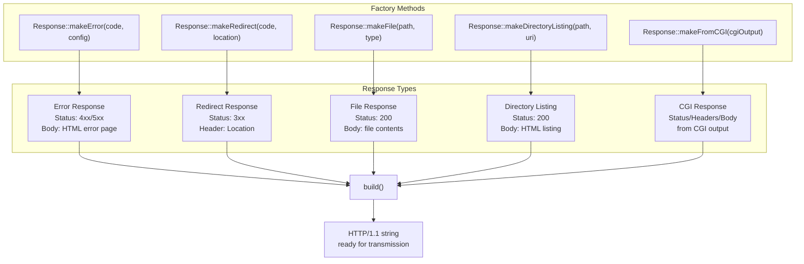
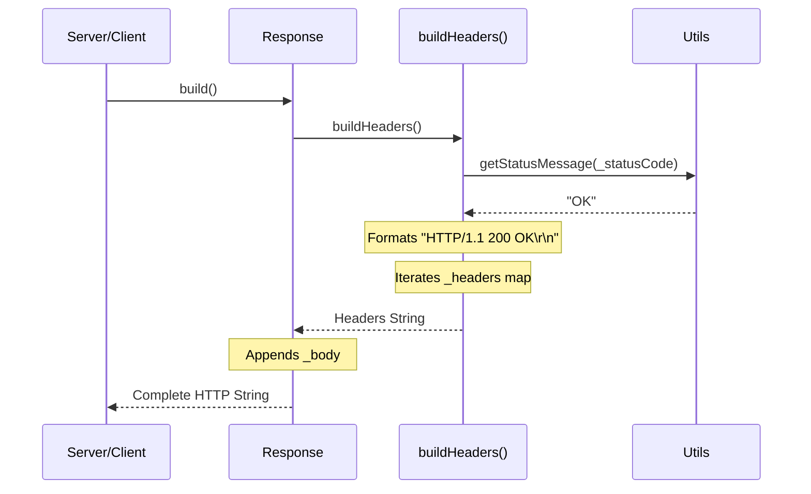
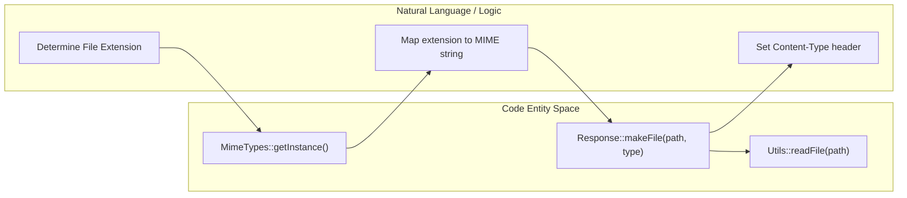

# HTTP Response Generation

<details>
<summary>Relevant source files</summary>

The following files were used as context for generating this page:

- [inc/http/Response.hpp](inc/http/Response.hpp)
- [src/http/Response.cpp](src/http/Response.cpp)

</details>


## Purpose and Scope

This document details the `Response` class and its role in generating HTTP responses within the webserv server. The `Response` class is responsible for constructing well-formed HTTP/1.1 responses, including status lines, headers, and message bodies. It provides both low-level methods for manual response construction and high-level factory methods for common response types (errors, redirects, file serving, directory listings, and CGI output).

The class also manages transmission state, tracking how many bytes have been sent to the client to handle non-blocking socket writes where a full response might not be sent in a single operation.

**Sources:** [inc/http/Response.hpp:1-74](), [src/http/Response.cpp:1-49]()

---

## Response Class Structure

The `Response` class maintains the complete state of an HTTP response and provides methods to construct and serialize it. The class follows a builder pattern, allowing incremental construction before final serialization.

### Core Data Members

| Member | Type | Purpose |
|--------|------|---------|
| `_statusCode` | `int` | HTTP status code (200, 404, 500, etc.). Defaults to 200. |
| `_headers` | `std::map<std::string, std::string>` | HTTP response headers as key-value pairs. |
| `_body` | `std::string` | Response body content. |
| `_sent` | `bool` | Flag indicating if the response has been fully transmitted. |
| `_bytesSent` | `size_t` | Number of bytes transmitted so far to the client socket. |

**Sources:** [inc/http/Response.hpp:64-68](), [src/http/Response.cpp:20-26]()

---

## Response Construction Methods

The `Response` class provides setter methods for building responses incrementally. These methods allow the server to construct responses programmatically before serialization.

### Status Code and Headers

```cpp
void setStatusCode(int code);
void setHeader(const std::string& name, const std::string& value);
void setContentType(const std::string& type);
```

The `setStatusCode()` method establishes the HTTP status code [src/http/Response.cpp:55-57](). The `setHeader()` method adds or updates individual headers in the `_headers` map [src/http/Response.cpp:59-61](). The `setContentType()` method is a convenience wrapper for setting the `Content-Type` header [src/http/Response.cpp:68-70]().

### Body Management

```cpp
void setBody(const std::string& body);
void appendBody(const std::string& data);
```

The `setBody()` method replaces the entire response body and automatically updates the `Content-Length` header [src/http/Response.cpp:63-66](). `appendBody()` allows incremental construction of bodies, also updating `Content-Length` [src/http/Response.cpp:88-91]().

### Cookie Support

```cpp
void setCookie(const std::string& name, const std::string& value,
               const std::string& path = "/", int maxAge = -1,
               bool httpOnly = false, bool secure = false);
```

The `setCookie()` method constructs RFC 6265-compliant `Set-Cookie` headers. It supports optional attributes such as `Path`, `Max-Age`, `HttpOnly`, and `Secure` [src/http/Response.cpp:72-86]().

**Sources:** [inc/http/Response.hpp:30-37](), [src/http/Response.cpp:55-91]()

---

## Factory Methods for Common Responses

The `Response` class provides static factory methods that construct complete, ready-to-send responses for common scenarios.



### makeError()
Constructs error responses. It attempts to load custom error pages from the `ServerConfig` using `config->getErrorPage(code)`. If no custom page is found or readable, it falls back to a default HTML error page generated by `_getDefaultErrorPage(code)` [src/http/Response.cpp:179-201]().

### makeRedirect()
Creates redirect responses (e.g., 301, 302). It sets the `Location` header and generates a basic HTML body containing a link to the new location [src/http/Response.cpp:203-217]().

### makeFile()
Serves static files. It reads the file content using `Utils::readFile()` and sets the `Content-Type` based on the provided parameter. If file reading fails despite the file having size, it returns a 500 error response [src/http/Response.cpp:219-232]().

### makeDirectoryListing()
Generates an HTML representation of a directory's contents. It includes file names, sizes, and modification dates, formatting them into a table for the browser [src/http/Response.cpp:234-245]().

### makeFromCGI()
Parses raw output from a CGI script. It extracts headers (delimited by `\r\n\r\n` or `\n\n`), identifies the `Status` header to set the HTTP status code, and treats the remainder of the output as the response body [inc/http/Response.hpp:61]().

**Sources:** [inc/http/Response.hpp:56-61](), [src/http/Response.cpp:179-245]()

---

## Building HTTP Response Strings

The `Response` class serializes its internal state into HTTP/1.1-compliant strings.

### Serialization Logic

The `build()` method [src/http/Response.cpp:97-103]() coordinates the generation of the full response string. It calls `buildHeaders()` to create the status line and header block.



1.  **Status Line:** `HTTP/1.1 [code] [message]\r\n` using `Utils::getStatusMessage()` [src/http/Response.cpp:109]().
2.  **Headers:** Iterates through the `_headers` map, appending `Key: Value\r\n` for each entry [src/http/Response.cpp:112-115]().
3.  **Separator:** Appends the mandatory `\r\n` to end the header section [src/http/Response.cpp:118]().
4.  **Body:** Appends `_body` unless `excludeBody` is true (used for HEAD requests) [src/http/Response.cpp:99-102]().

**Sources:** [src/http/Response.cpp:97-121]()

---

## State Management and Transmission Tracking

To handle non-blocking I/O, the `Response` class tracks how much of the serialized string has been successfully written to the client's socket.

### Transmission Tracking

*   **`_bytesSent`**: Incremented via `addBytesSent(size_t bytes)` whenever a `write()` or `send()` call succeeds [src/http/Response.cpp:162-164]().
*   **`_sent`**: Set to `true` via `markAsSent()` once the entire response string has been accepted by the kernel buffer [src/http/Response.cpp:158-160]().
*   **`isSent()`**: Returns the completion status [src/http/Response.cpp:147-149]().

### Reset and Reuse
The `reset()` method clears the status code, headers, and body, and resets transmission counters. It also calls `_setDefaultHeaders()` to prepare the object for a new request on a persistent (keep-alive) connection [src/http/Response.cpp:166-173]().

**Sources:** [inc/http/Response.hpp:48-54](), [src/http/Response.cpp:147-173]()

---

## MIME Type Integration

The `Response` class relies on the `MimeTypes` singleton to set appropriate `Content-Type` headers when serving files or directory listings.



When `makeFile` is called, the caller typically uses `MimeTypes::getMimeTypeByFile()` to resolve the extension to a string like `text/html` or `image/jpeg`, which is then passed to the `Response` object [src/http/Response.cpp:219-232]().

**Sources:** [src/http/Response.cpp:15](), [src/http/Response.cpp:219-232]()

---

## Default Headers

Every response is initialized with a set of default headers via `_setDefaultHeaders()`. While the provided code snippet for the implementation of `_setDefaultHeaders` is truncated, the header file and constructor confirm its role in ensuring that basic HTTP requirements (like `Date` or `Server` identification) are met by default [src/http/Response.cpp:25](), [inc/http/Response.hpp:70]().

**Sources:** [inc/http/Response.hpp:70](), [src/http/Response.cpp:20-26]()

---
