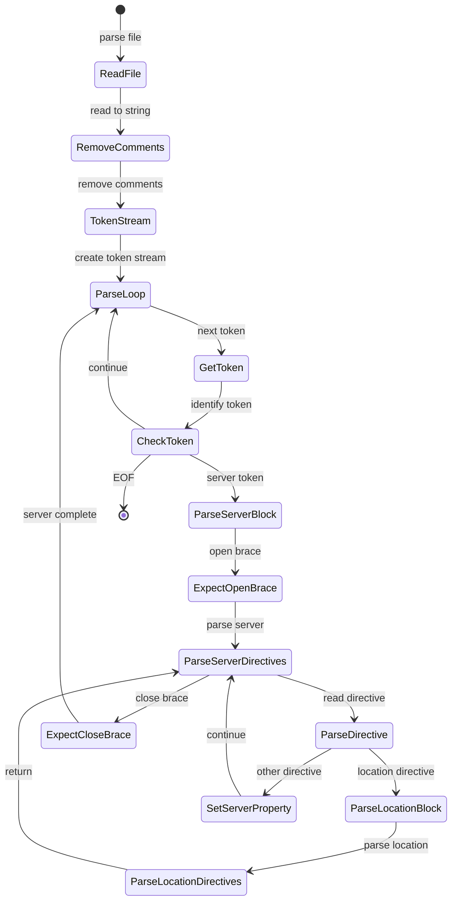
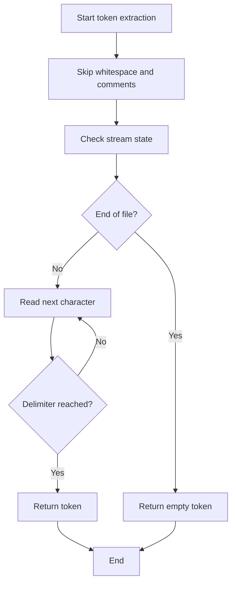
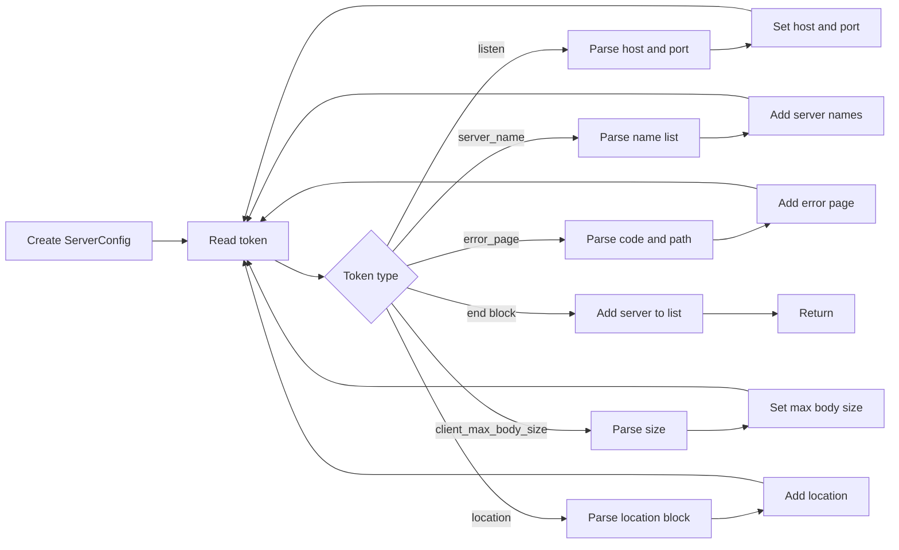
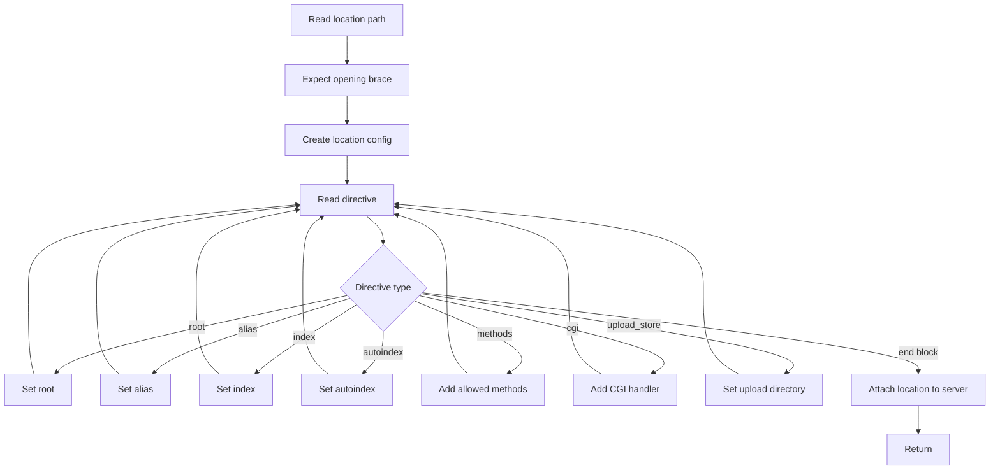
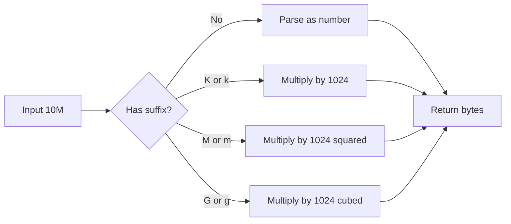
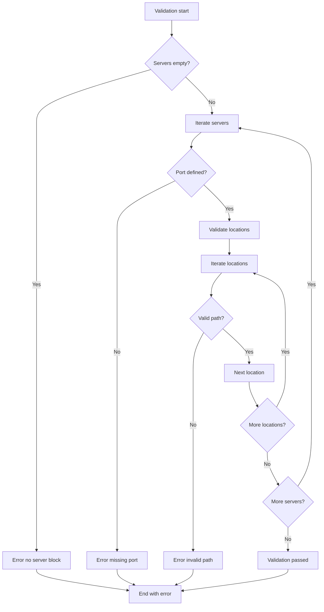
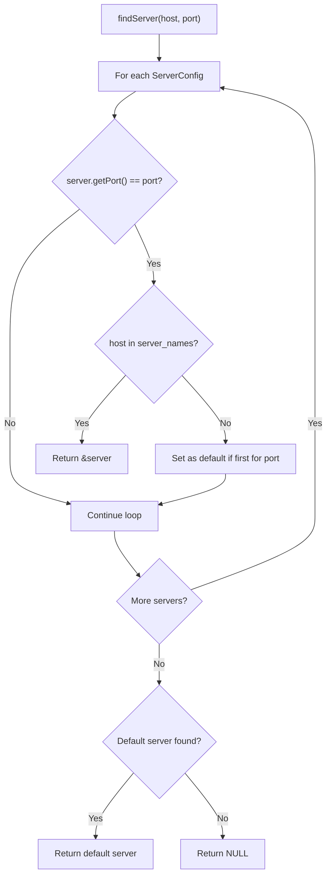

# Configuration Parser

<details>
<summary>Relevant source files</summary>

The following files were used as context for generating this page:

- [inc/config/Config.hpp](inc/config/Config.hpp)
- [src/config/Config.cpp](src/config/Config.cpp)

</details>


**Purpose**: Documents the `Config` class and `ConfigException` class, which handle parsing `webserv.conf` files, validating configuration syntax and semantics, and providing runtime access to parsed server configurations.

For architectural overview and integration with the request processing pipeline, see [Configuration System](#3.3). For details on the server-level configuration structure, see [Server Configuration](#4.6). For location-specific configuration details, see [Location Configuration](#4.7). For complete syntax reference and directive documentation, see [Configuration Reference](#7).

---

## Overview

The `Config` class is responsible for:
- Reading and parsing configuration files in webserv.conf format.
- Constructing a hierarchy of `ServerConfig` objects containing `LocationConfig` blocks. [inc/config/Config.hpp:56-60]()
- Validating configuration syntax and semantic constraints. [src/config/Config.cpp:82-83]()
- Providing runtime lookup of servers by host and port. [inc/config/Config.hpp:46]()
- Error reporting via `ConfigException`. [inc/config/Config.hpp:23-30]()

Sources: [inc/config/Config.hpp:32-68](), [src/config/Config.cpp:1-83]()

---

## Class Structure

### Config Class

The `Config` class [inc/config/Config.hpp:32-68]() is the top-level parser and container for server configurations.

**Key Data Members**:
- `_servers`: `std::vector<ServerConfig>` - Collection of all parsed server blocks. [inc/config/Config.hpp:56]()

**Public Interface**:

| Method | Purpose |
|--------|---------|
| `Config()` | Default constructor. [src/config/Config.cpp:17-18]() |
| `Config(const std::string& filename)` | Parse configuration from file during construction. [src/config/Config.cpp:20-22]() |
| `parse(const std::string& filename)` | Parse configuration file into `_servers` vector. [src/config/Config.cpp:51-62]() |
| `parseFromString(const std::string& content)` | Parse configuration from string (for testing). [src/config/Config.cpp:64-83]() |
| `getServers()` | Return const reference to all parsed servers. [inc/config/Config.hpp:45]() |
| `findServer(const std::string& host, int port)` | Lookup server by host and port for request routing. [inc/config/Config.hpp:46]() |
| `isValid()` | Check if configuration passes all validation rules. [inc/config/Config.hpp:49]() |
| `validate()` | Validate configuration, throwing `ConfigException` on error. [inc/config/Config.hpp:50]() |
| `print()` | Output parsed configuration for debugging. [inc/config/Config.hpp:53]() |

Sources: [inc/config/Config.hpp:32-68](), [src/config/Config.cpp:17-83]()

### ConfigException Class

The `ConfigException` class [inc/config/Config.hpp:23-30]() provides structured error reporting during configuration parsing and validation.

**Class Hierarchy**:

```mermaid
graph TD
    A[std::exception] --> B[ConfigException]

    B --> C[Constructor: ConfigException]
    B --> D[Method: what()]
    B --> E[Member: _msg string]
```

**Usage Pattern**:
```cpp
try {
    Config config("webserv.conf");
    config.validate();
} catch (const ConfigException& e) {
    std::cerr << "Configuration error: " << e.what() << std::endl;
}
```

Sources: [inc/config/Config.hpp:23-30]()

---

## Parsing Architecture

### Parsing State Machine

The parsing process operates as a recursive descent parser that tokenizes the input stream and builds the configuration hierarchy.



**Key Parsing Methods**:

| Method | Responsibility |
|--------|----------------|
| `_getNextToken()` | Extract next whitespace-delimited token from stream. [src/config/Config.cpp:241-267]() |
| `_skipWhitespaceAndComments()` | Advance stream past whitespace and `#` comments. [src/config/Config.cpp:231-239]() |
| `_expectToken()` | Verify next token matches expected value, throw on mismatch. [src/config/Config.cpp:269-275]() |
| `_parseServer()` | Parse server block directives into `ServerConfig`. [src/config/Config.cpp:85-104]() |
| `_parseLocation()` | Parse location block directives into `LocationConfig`. [src/config/Config.cpp:106-132]() |
| `_parseDirective()` | Dispatch server-level directive to appropriate setter. [src/config/Config.cpp:134-203]() |
| `_parseLocationDirective()` | Dispatch location-level directive to appropriate setter. [src/config/Config.cpp:205-229]() |
| `_parseSize()` | Parse size strings like "10M" or "1024" into bytes. [src/config/Config.cpp:277-295]() |
| `_removeComments()` | Strip `#` comment lines before parsing. [src/config/Config.cpp:39-49]() |

Sources: [src/config/Config.cpp:39-295]()

### Token Extraction Flow



**Token Delimiters**:
- Whitespace (space, tab, newline) [src/config/Config.cpp:232-233]()
- Semicolon `;` (directive terminator) [src/config/Config.cpp:254-255]()
- Braces `{` `}` (block delimiters) [src/config/Config.cpp:254-255]()

Sources: [src/config/Config.cpp:231-267]()

---

## Directive Parsing

### Server Block Parsing

The `_parseServer()` method [src/config/Config.cpp:85-104]() processes directives within a `server {}` block by delegating to `_parseDirective()` [src/config/Config.cpp:134-203]():



**Supported Server Directives**:
- `listen`: Host and port binding. [src/config/Config.cpp:137-148]()
- `server_name`: Virtual host names. [src/config/Config.cpp:149-153]()
- `root`: Default document root. [src/config/Config.cpp:154-158]()
- `index`: Default index files. [src/config/Config.cpp:159-173]()
- `client_max_body_size`: Upload size limit. [src/config/Config.cpp:174-178]()
- `error_page`: Custom error page mappings. [src/config/Config.cpp:179-194]()
- `autoindex`: Directory listing toggle. [src/config/Config.cpp:195-199]()

Sources: [src/config/Config.cpp:134-203]()

### Location Block Parsing

The `_parseLocation()` method [src/config/Config.cpp:106-132]() processes directives within a `location {}` block by delegating to `_parseLocationDirective()` [src/config/Config.cpp:205-229]():



Sources: [src/config/Config.cpp:106-132](), [src/config/Config.cpp:205-229]()

---

## Size Parsing

### Size String Conversion

The `_parseSize()` method [src/config/Config.cpp:277-295]() converts size strings with optional suffixes into byte counts:



**Supported Suffixes**:

| Suffix | Multiplier | Example |
|--------|------------|---------|
| None | 1 | `1024` = 1024 bytes |
| K, k | 1024 | `10K` = 10240 bytes |
| M, m | 1024² | `10M` = 10485760 bytes |
| G, g | 1024³ | `1G` = 1073741824 bytes |

Sources: [src/config/Config.cpp:277-295]()

---

## Validation System

### Validation Process

The `validate()` method [src/config/Config.cpp:322-358]() performs semantic validation after parsing:



Sources: [src/config/Config.cpp:322-358]()

### Validation vs Parsing

The configuration system uses a two-phase approach:

| Phase | Method | Error Type | Purpose |
|-------|--------|------------|---------|
| **Parsing** | `parse()` | `ConfigException` | Syntax errors (missing braces, unknown directives). [src/config/Config.cpp:51-83]() |
| **Validation** | `validate()` | `ConfigException` | Semantic errors (invalid values, missing required port). [src/config/Config.cpp:322-358]() |

Sources: [src/config/Config.cpp:51-358]()

---

## Server Lookup

### Runtime Server Selection

The `findServer()` method [src/config/Config.cpp:305-320]() implements the server selection algorithm used during request routing:



Sources: [src/config/Config.cpp:305-320]()

---

## Usage Patterns

### Basic Parsing Workflow

1.  **Construct** `Config` object with filename. [src/config/Config.cpp:20-22]()
2.  **Read and Clean**: `_removeComments()` strips `#` lines. [src/config/Config.cpp:39-49]()
3.  **Tokenize and Parse**: `parseFromString()` creates a stream and loops until EOF. [src/config/Config.cpp:64-83]()
4.  **Validate**: `validate()` checks required fields and semantic correctness. [src/config/Config.cpp:322-358]()
5.  **Access**: Use `findServer()` during request processing to route to the correct block. [src/config/Config.cpp:305-320]()

Sources: [src/config/Config.cpp:20-358]()

### Debug Output

The `print()` method [src/config/Config.cpp:360-365]() iterates through all `ServerConfig` objects and calls their respective `print()` methods to display the full parsed state.

Sources: [src/config/Config.cpp:360-365]()

---

## Related Classes

| Class | Purpose | Reference Page |
|-------|---------|----------------|
| `ServerConfig` | Server block configuration data. [inc/config/ServerConfig.hpp:25]() | [Server Configuration](#4.6) |
| `LocationConfig` | Location block configuration data. [inc/config/LocationConfig.hpp:25]() | [Location Configuration](#4.7) |
| `ConfigException` | Error reporting. [inc/config/Config.hpp:23]() | This page |

Sources: [inc/config/Config.hpp:21-23]()

---
