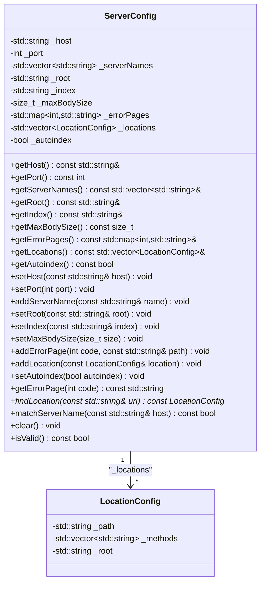
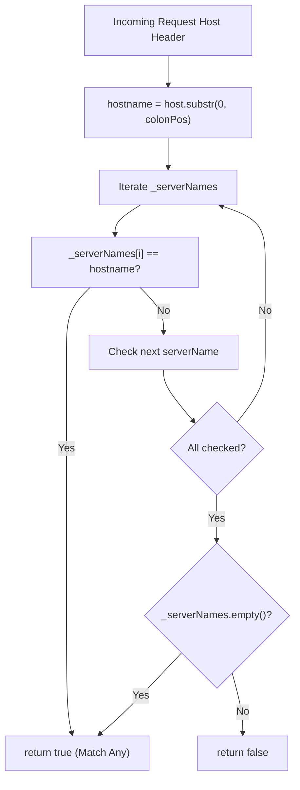
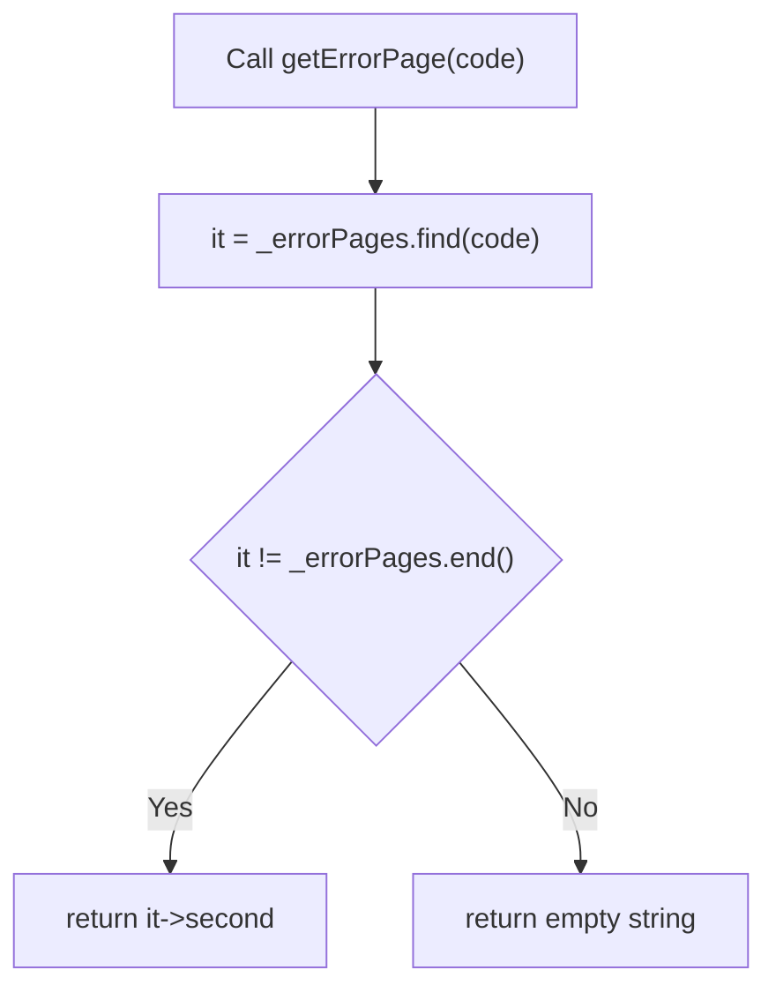
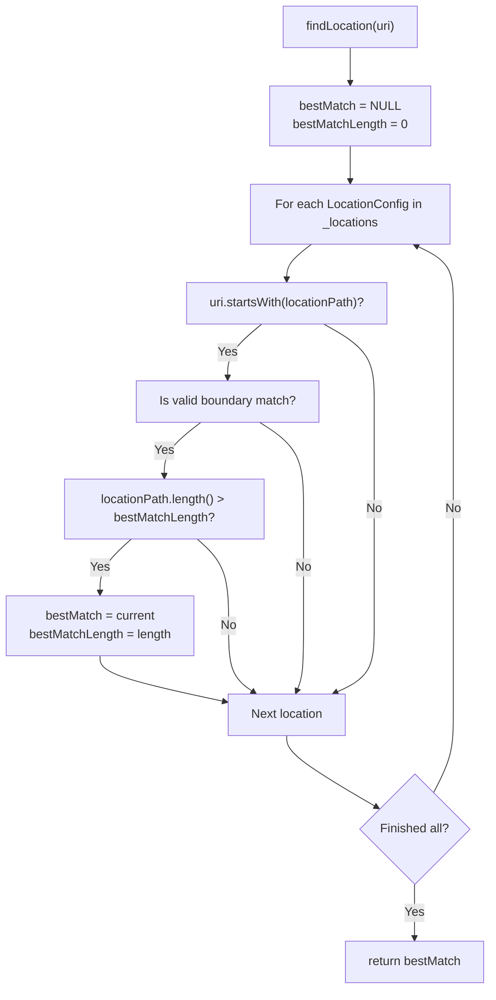

# Server Configuration

Relevant source files

The following files were used as context for generating this page:

- [inc/config/ServerConfig.hpp](inc/config/ServerConfig.hpp)
- [src/config/ServerConfig.cpp](src/config/ServerConfig.cpp)

## Purpose and Scope

The `ServerConfig` class [inc/config/ServerConfig.hpp:21-67]() represents server-level configuration for a single `server { }` block. It stores network binding parameters (`_host`, `_port`), virtual host identifiers (`_serverNames`), document root settings (`_root`, `_index`), client limits (`_maxBodySize`), custom error pages (`_errorPages`), directory listing configuration (`_autoindex`), and child `LocationConfig` objects (`_locations`).

The class provides methods for request matching (`findLocation()`, `matchServerName()`), error page lookup (`getErrorPage()`), and configuration validation (`isValid()`).

**Sources:** [inc/config/ServerConfig.hpp:21-67]()

---

## ServerConfig Class Overview

The `ServerConfig` class is defined in [inc/config/ServerConfig.hpp:21-67]() and serves as the container for all server-level directives. Each instance represents one `server { }` block.

The constructor [src/config/ServerConfig.cpp:16-24]() initializes the object with the following defaults:
- `_host`: "0.0.0.0"
- `_port`: 80
- `_root`: "./www"
- `_index`: "index.html"
- `_maxBodySize`: 1048576 (1MB)
- `_autoindex`: false

**Class Diagram: ServerConfig Data Members and Methods**

**Sources:** [inc/config/ServerConfig.hpp:21-67](), [src/config/ServerConfig.cpp:16-24]()

---

## Server-Level Directives

The `ServerConfig` class supports the following directives, which map directly to configuration file syntax:

| Directive | Member Variable | Type | Description |
|-----------|----------------|------|-------------|
| `listen` | `_host`, `_port` | `std::string`, `int` | IP address and port to bind [src/config/ServerConfig.cpp:101-107]() |
| `server_name` | `_serverNames` | `std::vector<std::string>` | Virtual host identifiers [src/config/ServerConfig.cpp:109-111]() |
| `root` | `_root` | `std::string` | Document root directory [src/config/ServerConfig.cpp:113-115]() |
| `index` | `_index` | `std::string` | Default file to serve [src/config/ServerConfig.cpp:117-119]() |
| `client_max_body_size` | `_maxBodySize` | `size_t` | Maximum request body size [src/config/ServerConfig.cpp:121-123]() |
| `error_page` | `_errorPages` | `std::map<int, std::string>` | Custom error pages [src/config/ServerConfig.cpp:125-127]() |
| `autoindex` | `_autoindex` | `bool` | Enable directory listings [src/config/ServerConfig.cpp:133-135]() |
| `location` | `_locations` | `std::vector<LocationConfig>` | Path-specific configurations [src/config/ServerConfig.cpp:129-131]() |

**Sources:** [inc/config/ServerConfig.hpp:58-66](), [src/config/ServerConfig.cpp:101-135]()

---

## Virtual Hosting Mechanism

Webserv supports name-based virtual hosting. The `matchServerName(const std::string& host)` method [src/config/ServerConfig.cpp:174-189]() determines if a specific `ServerConfig` should handle a request based on the `Host` header.

**Virtual Host Selection Logic**

The implementation [src/config/ServerConfig.cpp:178-179]() ensures that port numbers in the `Host` header (e.g., `localhost:8080`) are stripped before comparison. If no server names are defined for a block, it acts as a default match for that IP/Port [src/config/ServerConfig.cpp:188]().

**Sources:** [src/config/ServerConfig.cpp:174-189]()

---

## Error Page Configuration

The `_errorPages` map [inc/config/ServerConfig.hpp:64]() associates HTTP status codes with custom error page paths.

**Error Page Lookup via getErrorPage()**

The `getErrorPage(int code)` method [src/config/ServerConfig.cpp:141-146]() queries the map and returns the relative path to the custom error file. If not found, it returns an empty string, signaling the server to use its internal default error page.

**Sources:** [src/config/ServerConfig.cpp:141-146](), [inc/config/ServerConfig.hpp:64]()

---

## Location Management and Request Matching

Each `ServerConfig` maintains a vector of `LocationConfig` objects [inc/config/ServerConfig.hpp:65](). The `findLocation(const std::string& uri)` method [src/config/ServerConfig.cpp:148-172]() implements the longest-prefix matching algorithm.

**Matching Algorithm Details**

The algorithm iterates through all locations and checks if the URI starts with the location path [src/config/ServerConfig.cpp:156](). To avoid partial word matches (e.g., `/images` matching `/imagination`), it validates the match boundary [src/config/ServerConfig.cpp:158-161]():
1. Exact match (`uri.length() == locationPath.length()`)
2. Location path ends in `/`
3. URI continues with `/` after the match
4. Location is the root `/`

**Longest-Prefix Match Flow**

**Sources:** [src/config/ServerConfig.cpp:148-172]()

---

## Configuration Validation

The `isValid()` method [src/config/ServerConfig.cpp:203-209]() performs basic sanity checks on the server configuration:
- `_port` must be within the valid TCP range (1-65535) [src/config/ServerConfig.cpp:204-205]().
- `_root` must not be empty [src/config/ServerConfig.cpp:206-207]().

The `clear()` method [src/config/ServerConfig.cpp:191-201]() resets the object to its default state, clearing vectors and maps.

**Sources:** [src/config/ServerConfig.cpp:191-209]()

---

## Member Accessors

| Method | Role | Source |
|--------|------|--------|
| `getHost()` | Returns `_host` string | [src/config/ServerConfig.cpp:61-63]() |
| `getPort()` | Returns `_port` integer | [src/config/ServerConfig.cpp:65-67]() |
| `getServerNames()` | Returns `std::vector<std::string>` | [src/config/ServerConfig.cpp:69-71]() |
| `getRoot()` | Returns `_root` directory | [src/config/ServerConfig.cpp:73-75]() |
| `getIndex()` | Returns default `_index` file | [src/config/ServerConfig.cpp:77-79]() |
| `getMaxBodySize()` | Returns `_maxBodySize` limit | [src/config/ServerConfig.cpp:81-83]() |
| `getErrorPages()` | Returns map of error pages | [src/config/ServerConfig.cpp:85-87]() |
| `getLocations()` | Returns vector of child locations | [src/config/ServerConfig.cpp:89-91]() |
| `getAutoindex()` | Returns directory listing status | [src/config/ServerConfig.cpp:93-95]() |

**Sources:** [src/config/ServerConfig.cpp:61-95]()

---
