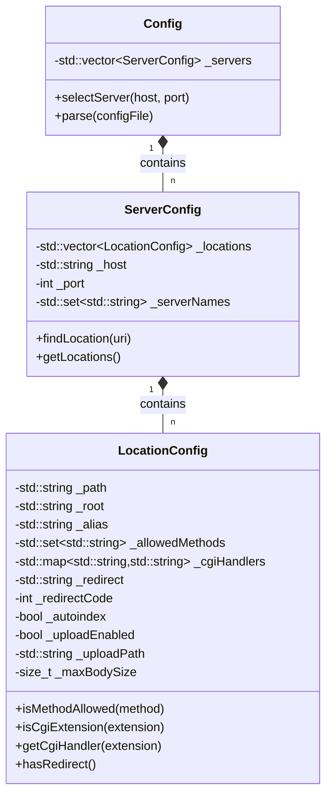
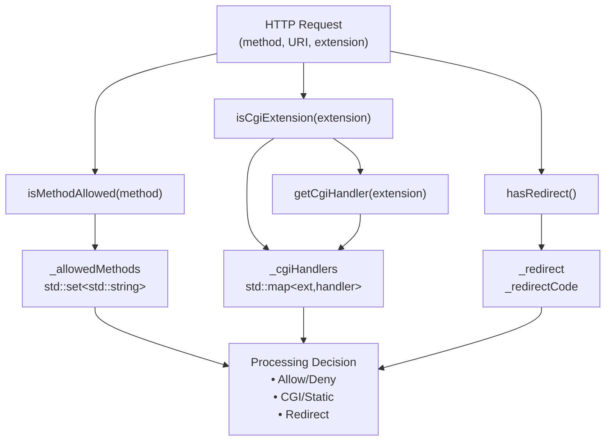
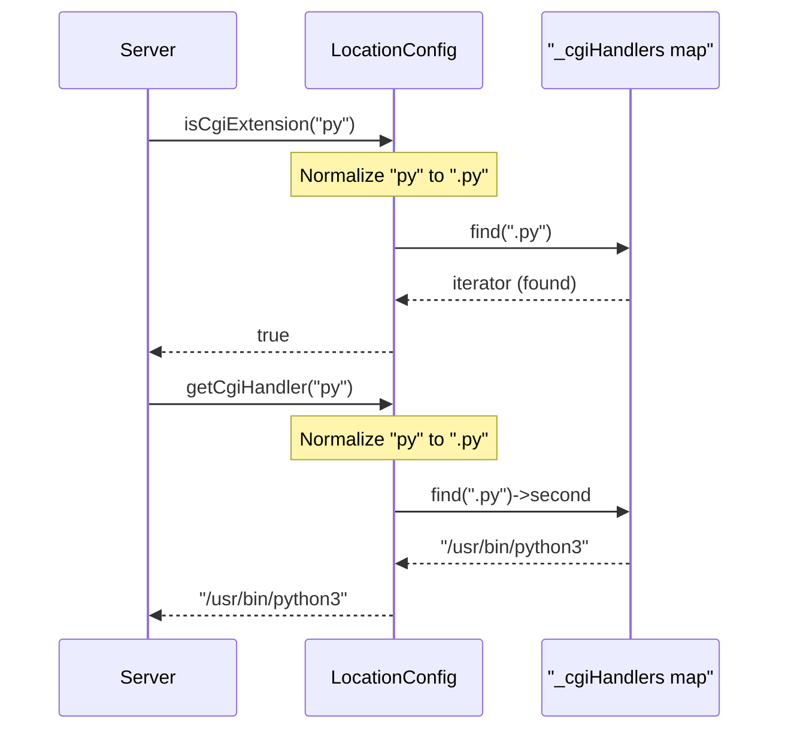
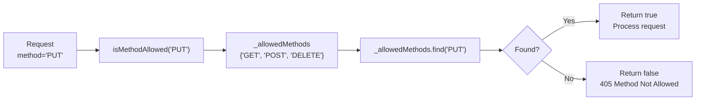
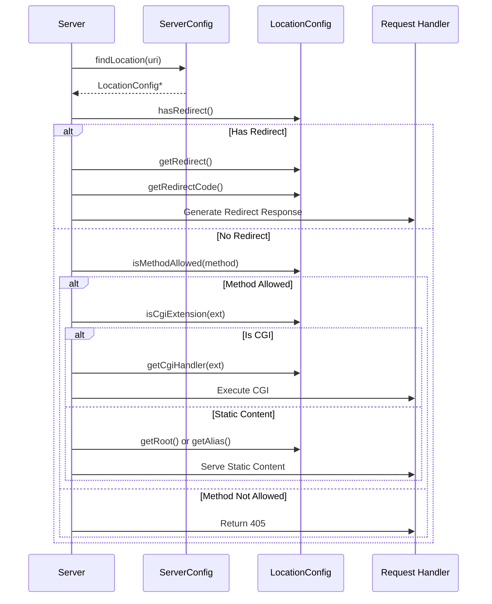

# Location Configuration

<details>
<summary>Relevant source files</summary>

The following files were used as context for generating this page:

- [inc/config/LocationConfig.hpp](inc/config/LocationConfig.hpp)
- [src/config/LocationConfig.cpp](src/config/LocationConfig.cpp)

</details>


## Purpose and Scope

This page documents the `LocationConfig` class, which represents path-specific configuration settings within a server block. `LocationConfig` defines rules that apply to requests matching a specific URI path prefix, including allowed HTTP methods, CGI handler mappings, file upload settings, redirects, and filesystem path resolution.

For information about the broader configuration system and how `LocationConfig` instances are parsed from `webserv.conf`, see [Configuration System](#3.3). For documentation of the parent `ServerConfig` class that contains location blocks, see [Server Configuration](#4.6). For details on how locations are matched and applied during request processing, see [Request Processing Lifecycle](#8).

## Class Overview

The `LocationConfig` class encapsulates all path-specific directives that can appear within a `location` block in the configuration file. Each instance represents a single location rule, and multiple `LocationConfig` objects can exist within a single `ServerConfig` to define different behaviors for different URI paths.

**Sources:** [inc/config/LocationConfig.hpp:21-77]()

### LocationConfig in the Configuration Hierarchy



**Sources:** [inc/config/LocationConfig.hpp:21-77]()

## Data Members and Configuration Directives

Each private data member in `LocationConfig` corresponds to a configuration directive that can appear in a location block. The following table documents each member's purpose and how it affects request processing:

| Member | Type | Purpose | Configuration Directive |
|--------|------|---------|------------------------|
| `_path` | `std::string` | The URI path prefix this location matches | `location /path` block header |
| `_root` | `std::string` | Filesystem directory to resolve request paths against | `root /var/www/html;` |
| `_alias` | `std::string` | Alternative path mapping that replaces the location path | `alias /other/directory;` |
| `_index` | `std::string` | Default file to serve for directory requests | `index index.html;` |
| `_allowedMethods` | `std::set<std::string>` | HTTP methods permitted for this location | `methods GET POST;` |
| `_cgiHandlers` | `std::map<std::string, std::string>` | Maps file extensions to interpreter paths | `cgi .py /usr/bin/python3;` |
| `_redirect` | `std::string` | Target URL for redirect responses | `redirect 301 https://newsite.com;` |
| `_redirectCode` | `int` | HTTP status code for redirects (301, 302, etc.) | `redirect 301 ...;` |
| `_autoindex` | `bool` | Whether to generate directory listings | `autoindex on;` |
| `_uploadEnabled` | `bool` | Whether file uploads are permitted | `upload_enable on;` |
| `_uploadPath` | `std::string` | Directory to store uploaded files | `upload_store /var/uploads;` |
| `_maxBodySize` | `size_t` | Maximum allowed request body size in bytes | `client_max_body_size 10M;` |

**Sources:** [inc/config/LocationConfig.hpp:65-76](), [src/config/LocationConfig.cpp:15-31]()

### Path Resolution: root vs alias

The `_root` and `_alias` members provide different mechanisms for mapping URI paths to filesystem paths:

- **root**: Appends the full URI path to the root directory.
  - Example: `root /var/www;` with URI `/images/logo.png` → `/var/www/images/logo.png`

- **alias**: Replaces the location path with the alias directory.
  - Example: `location /static { alias /data/files; }` with URI `/static/logo.png` → `/data/files/logo.png`

**Sources:** [inc/config/LocationConfig.hpp:66,76](), [src/config/LocationConfig.cpp:78-80,119-120]()

## Public Interface

### Constructors and Assignment

```cpp
LocationConfig();                                    // Default constructor
LocationConfig(const LocationConfig& other);        // Copy constructor
LocationConfig& operator=(const LocationConfig& other); // Assignment operator
~LocationConfig();                                  // Destructor
```

The default constructor initializes `_path` to `"/"`, `_index` to `"index.html"`, and sets the default allowed methods to `GET`, `POST`, and `DELETE`.

**Sources:** [src/config/LocationConfig.cpp:15-31](), [src/config/LocationConfig.cpp:33-47](), [src/config/LocationConfig.cpp:49-65]()

### Accessor Methods (Getters)

All configuration values can be retrieved through const getter methods:

| Method | Return Type | Description |
|--------|-------------|-------------|
| `getPath()` | `const std::string&` | Returns the location path prefix |
| `getRoot()` | `const std::string&` | Returns the root directory path |
| `getAlias()` | `const std::string&` | Returns the alias directory path |
| `getIndex()` | `const std::string&` | Returns the default index file name |
| `getAllowedMethods()` | `const std::set<std::string>&` | Returns the set of allowed HTTP methods |
| `getCgiHandlers()` | `const std::map<std::string, std::string>&` | Returns the complete extension-to-interpreter map |
| `getRedirect()` | `const std::string&` | Returns the redirect target URL |
| `getRedirectCode()` | `int` | Returns the redirect HTTP status code |
| `getAutoindex()` | `bool` | Returns whether directory listing is enabled |
| `getUploadEnabled()` | `bool` | Returns whether file uploads are permitted |
| `getUploadPath()` | `const std::string&` | Returns the upload storage directory |
| `getMaxBodySize()` | `size_t` | Returns the maximum request body size |

**Sources:** [src/config/LocationConfig.cpp:74-120]()

### Mutator Methods (Setters)

Configuration values are set during parsing via setter methods:

```cpp
void setPath(const std::string& path);
void setRoot(const std::string& root);
void setAlias(const std::string& alias);
void setIndex(const std::string& index);
void setRedirect(const std::string& redirect);
void setRedirectCode(int code);
void setAutoindex(bool autoindex);
void setUploadEnabled(bool enabled);
void setUploadPath(const std::string& path);
void setMaxBodySize(size_t size);
void addAllowedMethod(const std::string& method);
void addCgiHandler(const std::string& extension, const std::string& handler);
```

**Sources:** [src/config/LocationConfig.cpp:126-173]()

### Query Methods for Request Processing

The `LocationConfig` class provides several query methods used during request processing to determine how to handle incoming requests:

```cpp
bool isMethodAllowed(const std::string& method) const;
bool isCgiExtension(const std::string& extension) const;
std::string getCgiHandler(const std::string& extension) const;
bool hasRedirect() const;
```

**Sources:** [src/config/LocationConfig.cpp:178-201]()

### Request Processing Query Methods



**Sources:** [src/config/LocationConfig.cpp:178-201](), [inc/config/LocationConfig.hpp:73-76]()

## CGI Handler Configuration

The `_cgiHandlers` map associates file extensions with interpreter paths. The class automatically handles the leading dot in extensions during lookups.

1. **`isCgiExtension(extension)`**: Checks if the file extension has a registered CGI handler. It prepends a `.` to the extension if it is missing before searching the map.
2. **`getCgiHandler(extension)`**: Retrieves the interpreter path for a given extension.

**Sources:** [src/config/LocationConfig.cpp:182-197]()

### CGI Handler Lookup Flow



**Sources:** [src/config/LocationConfig.cpp:182-197]()

## Method Restriction and Validation

The `_allowedMethods` set controls which HTTP methods are permitted. By default, `GET`, `POST`, and `DELETE` are allowed unless cleared.

### Method Checking Process



**Sources:** [src/config/LocationConfig.cpp:178-180](), [src/config/LocationConfig.cpp:28-30]()

## Redirect Configuration

The `_redirect` and `_redirectCode` members define HTTP redirects. `hasRedirect()` returns true if `_redirect` is not an empty string.

**Sources:** [src/config/LocationConfig.cpp:199-201]()

## Utility Methods

### clear() and clearAllowedMethods()

```cpp
void clear();                    // Resets all members to default values
void clearAllowedMethods();      // Empties the _allowedMethods set
```

`clear()` resets the location to a default state, including resetting `_path` to `"/"`, `_index` to `"index.html"`, and restoring the default `GET`, `POST`, and `DELETE` methods.

**Sources:** [src/config/LocationConfig.cpp:203-223]()

## Integration with Request Processing

The following diagram shows how `LocationConfig` methods are used during the request processing lifecycle:



**Sources:** [src/config/LocationConfig.cpp:178-201](), [inc/config/LocationConfig.hpp:57-60]()

---

**Related Pages:**
- [Configuration System](#3.3) - Overall architecture and parsing
- [Server Configuration](#4.6) - Parent configuration class
- [Configuration Parser](#4.5) - Parsing logic that populates LocationConfig
- [Request Processing Lifecycle](#8) - How LocationConfig is used during request handling
- [CGI Handler Implementation](#5.1) - Consumer of CGI handler mappings

---
