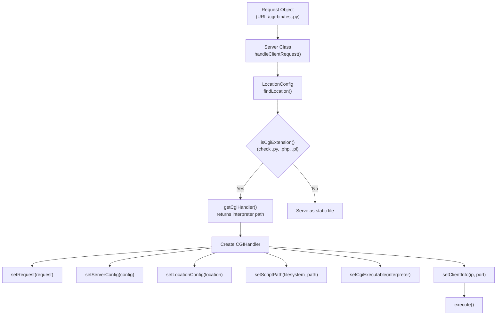
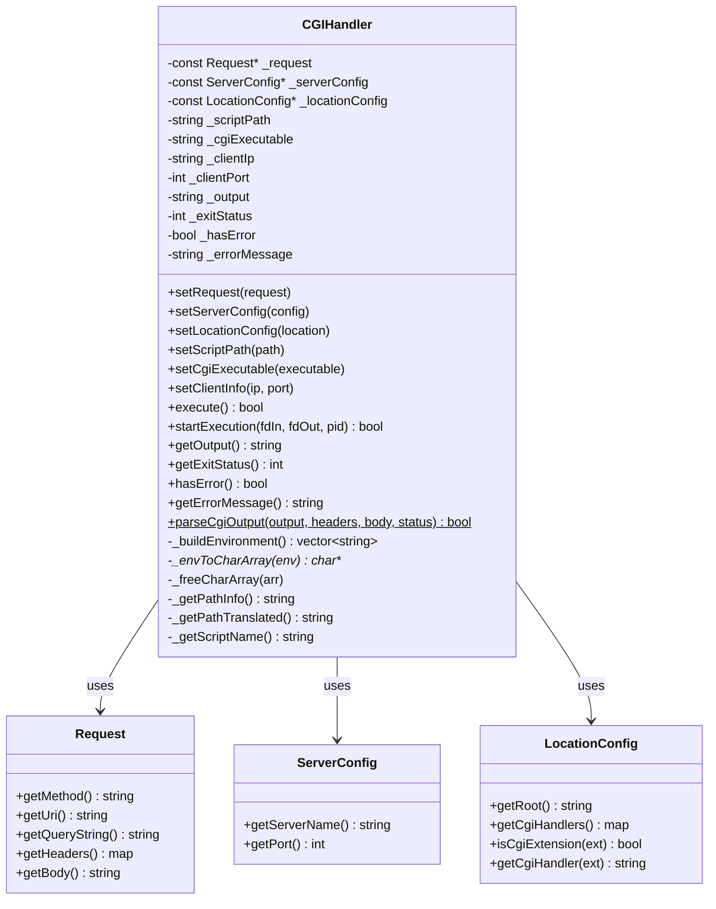
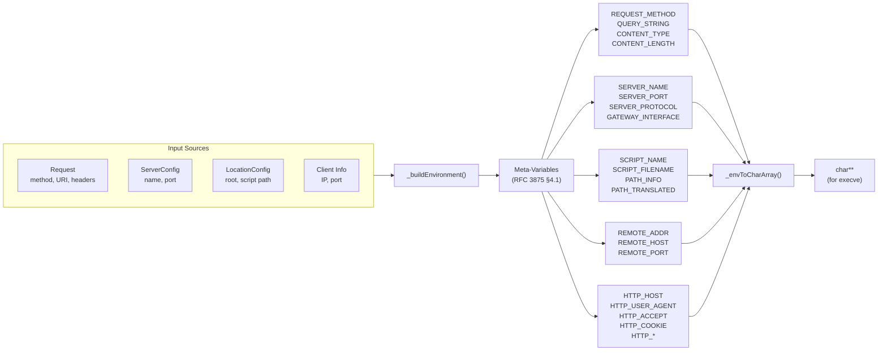
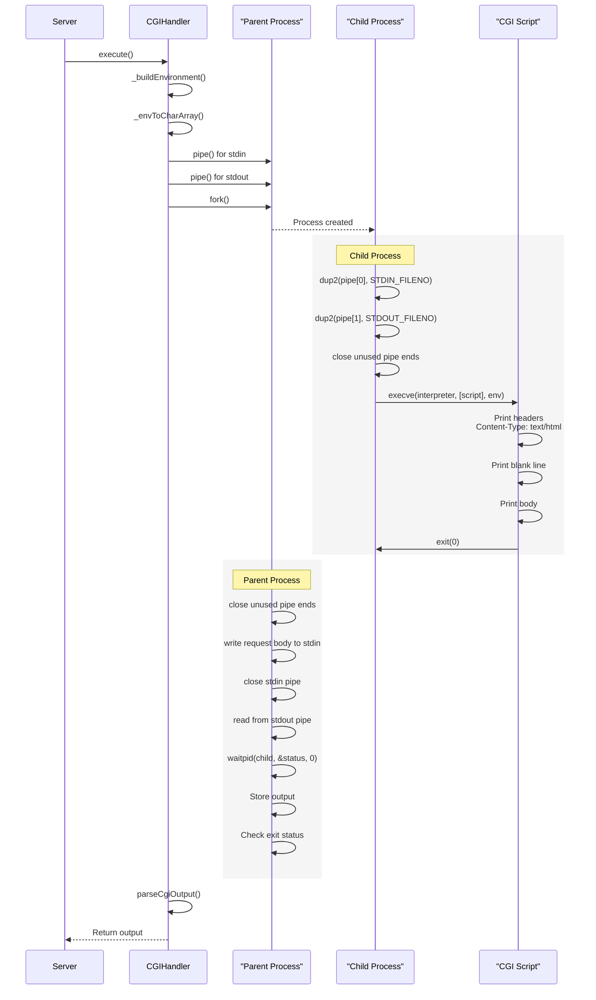
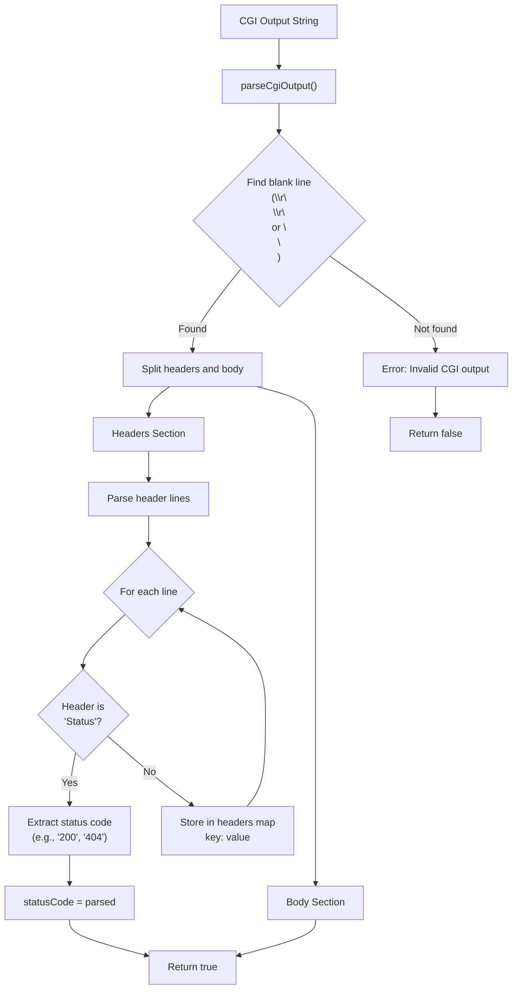

# CGI Support

<details>
<summary>Relevant source files</summary>

The following files were used as context for generating this page:

- [cgi-bin/env.py](cgi-bin/env.py)
- [cgi-bin/info.py](cgi-bin/info.py)
- [cgi-bin/session.py](cgi-bin/session.py)
- [cgi-bin/test.py](cgi-bin/test.py)
- [cgi-bin/upload.py](cgi-bin/upload.py)
- [inc/cgi/CGIHandler.hpp](inc/cgi/CGIHandler.hpp)
- [src/cgi/CGIHandler.cpp](src/cgi/CGIHandler.cpp)

</details>


## Purpose and Scope

This document provides a comprehensive overview of Common Gateway Interface (CGI) support in webserv, including request routing, process execution, environment setup, and output handling. It explains how webserv executes external CGI scripts (Python, PHP, Perl) to generate dynamic content.

For detailed API documentation of the `CGIHandler` class, see [CGI Handler Implementation](#5.1). For information about the included demonstration scripts, see [Example CGI Scripts](#5.2).

**Sources:** [inc/cgi/CGIHandler.hpp:1-80](), [src/cgi/CGIHandler.cpp:1-256](), [cgi-bin/env.py:1-100](), [cgi-bin/test.py:1-236]()

---

## Overview

CGI (Common Gateway Interface) is a standard protocol for web servers to execute external programs and return dynamic content. Webserv implements CGI/1.1 per RFC 3875, supporting multiple interpreters (Python, PHP, Perl) configured through file extension mapping.

When a request matches a CGI-enabled location with a recognized extension, webserv:
1. Creates a `CGIHandler` object [src/cgi/CGIHandler.cpp:18-26]()
2. Builds RFC 3875-compliant environment variables [src/cgi/CGIHandler.cpp:183-185]()
3. Forks a child process to execute the interpreter [src/cgi/CGIHandler.cpp:150-161]()
4. Captures output via pipes [src/cgi/CGIHandler.cpp:133-148]()
5. Parses CGI headers and body [src/cgi/CGIHandler.cpp:240-256]()
6. Returns the result as an HTTP response

**Key Components:**
- `CGIHandler` class: Manages CGI execution lifecycle [inc/cgi/CGIHandler.hpp:26-78]()
- Location configuration: Defines CGI extension mappings
- Environment builder: Constructs CGI environment variables [src/cgi/CGIHandler.cpp:183-185]()
- Output parser: Extracts HTTP headers from CGI output [src/cgi/CGIHandler.cpp:240-256]()

**Sources:** [inc/cgi/CGIHandler.hpp:26-78](), [src/cgi/CGIHandler.cpp:18-256]()

---

## CGI Request Detection and Routing



**Diagram: CGI Request Routing Flow**

The server uses `LocationConfig::isCgiExtension()` to determine if a file extension requires CGI processing. The `cgi_handlers` map in the location configuration stores the mapping from extensions to interpreter paths. The `CGIHandler` is then initialized with the specific request and configuration context [src/cgi/CGIHandler.cpp:67-90]().

**Sources:** [inc/cgi/CGIHandler.hpp:34-39](), [src/cgi/CGIHandler.cpp:67-90]()

---

## CGI Handler Architecture



**Diagram: CGI Handler Class Structure**

The `CGIHandler` class encapsulates all logic for CGI script execution [inc/cgi/CGIHandler.hpp:26-78](). It requires configuration from three sources:
- **Request**: HTTP method, URI, query string, headers, and body [src/cgi/CGIHandler.cpp:67-69]()
- **ServerConfig**: Server name, port, and protocol information [src/cgi/CGIHandler.cpp:71-73]()
- **LocationConfig**: Document root, CGI handler mappings [src/cgi/CGIHandler.cpp:75-77]()

The class provides both synchronous (`execute()`) and asynchronous (`startExecution()`) execution methods [src/cgi/CGIHandler.cpp:96-214]().

**Sources:** [inc/cgi/CGIHandler.hpp:26-78](), [src/cgi/CGIHandler.cpp:18-90]()

---

## Environment Variable Setup



**Diagram: Environment Variable Building Process**

The `CGIHandler::_buildEnvironment()` method constructs a complete set of CGI environment variables per RFC 3875 [inc/cgi/CGIHandler.hpp:70]().

### Required Meta-Variables

The following variables are typically set based on the incoming request and server configuration [cgi-bin/env.py:19-38]():

| Variable | Source | Purpose |
|----------|--------|---------|
| `REQUEST_METHOD` | `Request::getMethod()` | HTTP method (GET, POST, etc.) |
| `QUERY_STRING` | `Request::getQueryString()` | URI query parameters |
| `CONTENT_TYPE` | Request header | Body content type |
| `CONTENT_LENGTH` | Request body | Body size in bytes |
| `SERVER_NAME` | `ServerConfig::getServerName()` | Virtual host name |
| `SERVER_PORT` | `ServerConfig::getPort()` | Listening port |
| `SERVER_PROTOCOL` | Fixed | "HTTP/1.1" |
| `GATEWAY_INTERFACE` | Fixed | "CGI/1.1" |
| `SCRIPT_NAME` | `_getScriptName()` | URI path to script |
| `SCRIPT_FILENAME` | `_scriptPath` | Filesystem path to script |
| `PATH_INFO` | `_getPathInfo()` | Extra path after script name |
| `PATH_TRANSLATED` | `_getPathTranslated()` | Filesystem path for PATH_INFO |
| `REMOTE_ADDR` | `_clientIp` | Client IP address |
| `REMOTE_HOST` | `_clientIp` | Client hostname (same as ADDR) |
| `REMOTE_PORT` | `_clientPort` | Client port number |

### HTTP Headers

All HTTP request headers are converted to environment variables with the `HTTP_` prefix [cgi-bin/env.py:75-79](). Header names are uppercased and hyphens are replaced with underscores.

**Sources:** [inc/cgi/CGIHandler.hpp:70-72](), [src/cgi/CGIHandler.cpp:183-185](), [cgi-bin/env.py:19-38]()

---

## Process Execution Flow



**Diagram: CGI Process Execution Sequence**

### Execution Steps

1. **Pipe Creation**: Two pipes are created for bidirectional communication [src/cgi/CGIHandler.cpp:136-148]().
2. **Fork**: `fork()` creates a child process [src/cgi/CGIHandler.cpp:150]().
3. **Child Process Setup**:
   - `dup2()` redirects stdin/stdout to pipes [src/cgi/CGIHandler.cpp:167-168]().
   - `execve()` replaces process with the configured interpreter [src/cgi/CGIHandler.cpp:194]().
4. **Parent Process Handling**:
   - Writes POST/PUT body to child's stdin [src/cgi/CGIHandler.cpp:104-106]().
   - Reads all output from stdout pipe [src/cgi/CGIHandler.cpp:110-114]().
   - `waitpid()` waits for child to complete [src/cgi/CGIHandler.cpp:119]().

**Sources:** [src/cgi/CGIHandler.cpp:96-214]()

---

## CGI Output Parsing



**Diagram: CGI Output Parsing Logic**

The static method `CGIHandler::parseCgiOutput()` parses CGI script output according to CGI/1.1 specification [src/cgi/CGIHandler.cpp:240-256](). It identifies the blank line delimiter to separate headers from the response body.

**Sources:** [inc/cgi/CGIHandler.hpp:52-54](), [src/cgi/CGIHandler.cpp:240-256]()

---

## Example CGI Scripts

Webserv includes demonstration CGI scripts in `cgi-bin/`:

| Script | Purpose | HTTP Methods | Key Features |
|--------|---------|--------------|--------------|
| [env.py - Environment Variable Reporter](#5.2.1) | Environment reporter | GET | RFC 3875 compliance testing [cgi-bin/env.py:19-38]() |
| [info.py - System Information Display](#5.2.2) | System information | GET | Python and platform details [cgi-bin/info.py:51-58]() |
| [session.py - Session Management Demo](#5.2.3) | Session management | GET, POST | Cookie-based session tracking [cgi-bin/session.py:118-121]() |
| [test.py - CGI Protocol Tester](#5.2.4) | Protocol testing | GET, POST | Interactive forms and method handling [cgi-bin/test.py:148-175]() |
| [upload.py - File Upload Handler](#5.2.5) | File upload handler | GET, POST | Multipart form data processing [cgi-bin/upload.py:55-84]() |

### Script Requirements

All CGI scripts must:
1. **Print headers first**: At minimum, `Content-Type` [cgi-bin/env.py:16]().
2. **Print blank line**: Separates headers from body [cgi-bin/env.py:17]().
3. **Have shebang line**: Specifies interpreter [cgi-bin/env.py:1]().

**Sources:** [cgi-bin/env.py:1-100](), [cgi-bin/info.py:1-108](), [cgi-bin/session.py:1-241](), [cgi-bin/test.py:1-236](), [cgi-bin/upload.py:1-235]()

---

## Error Handling

The `CGIHandler` provides error detection for process failures and malformed output:

### Error Conditions

| Error | Detection | Response |
|-------|-----------|----------|
| Fork failure | `fork() < 0` [src/cgi/CGIHandler.cpp:151]() | 500 Internal Server Error |
| Pipe failure | `pipe() < 0` [src/cgi/CGIHandler.cpp:136]() | 500 Internal Server Error |
| Exec failure | `execve()` returns [src/cgi/CGIHandler.cpp:194-199]() | 500 Internal Server Error |
| Abnormal exit | `!WIFEXITED(status)` [src/cgi/CGIHandler.cpp:121-127]() | 500 Internal Server Error |

### Error State Methods

```cpp
bool hasError() const;           // Returns true if execution failed [src/cgi/CGIHandler.cpp:229-231]
string getErrorMessage() const;  // Returns human-readable error [src/cgi/CGIHandler.cpp:233-235]
int getExitStatus() const;       // Returns child process exit code [src/cgi/CGIHandler.cpp:225-227]
```

**Sources:** [inc/cgi/CGIHandler.hpp:46-49](), [src/cgi/CGIHandler.cpp:121-235]()

---

## Summary

CGI support in webserv enables dynamic content generation through external scripts. The `CGIHandler` class manages the complete execution lifecycle, from environment setup to process management and output parsing.

For implementation details, see [CGI Handler Implementation](#5.1). For practical examples, explore the scripts documented in [Example CGI Scripts](#5.2).

**Sources:** [inc/cgi/CGIHandler.hpp:1-80](), [src/cgi/CGIHandler.cpp:1-256](), all CGI script files

---
