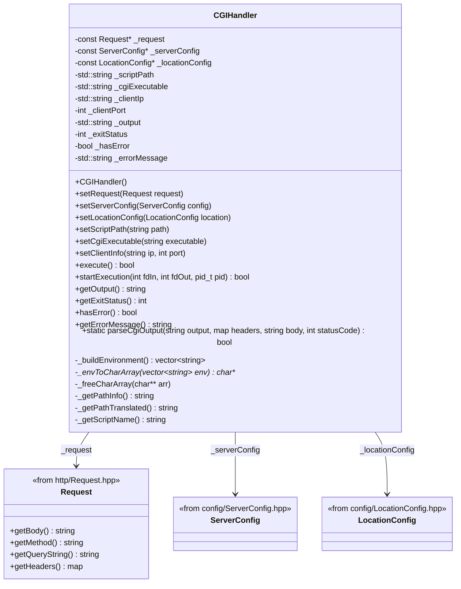
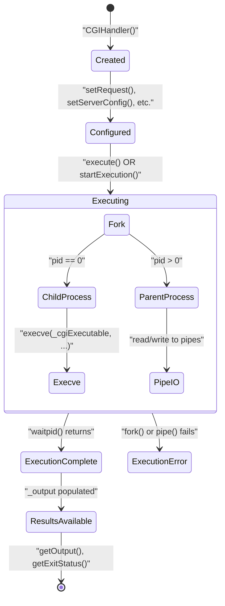
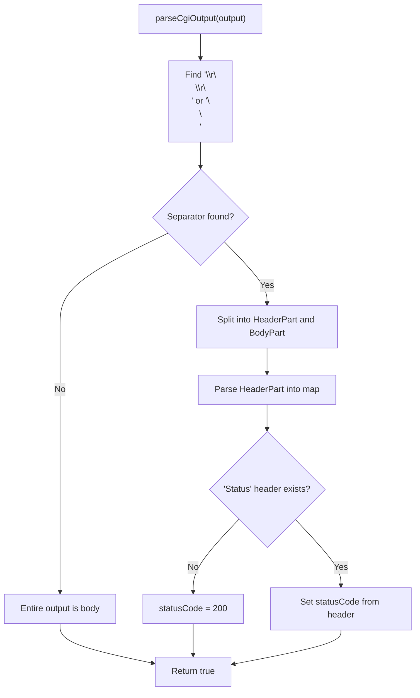

# CGI Handler Implementation

Relevant source files

The following files were used as context for generating this page:

- [inc/cgi/CGIHandler.hpp](inc/cgi/CGIHandler.hpp)
- [src/cgi/CGIHandler.cpp](src/cgi/CGIHandler.cpp)

## Purpose and Scope

This document provides detailed technical documentation of the `CGIHandler` class, which implements Common Gateway Interface (CGI) script execution in webserv. The `CGIHandler` is responsible for:

- Configuring CGI execution parameters from request and server configuration
- Building RFC 3875-compliant environment variables
- Managing process forking and script execution via pipes
- Parsing CGI script output into HTTP-compatible format
- Handling errors and exit statuses during CGI execution

For information about how CGI requests are routed to the handler, see [CGI Execution Architecture](#3.4). For details on the example CGI scripts included with webserv, see [Example CGI Scripts](#5.2).

**Sources:** [inc/cgi/CGIHandler.hpp:1-80](), [src/cgi/CGIHandler.cpp:1-26]()

---

## Class Overview

The `CGIHandler` class is defined in [inc/cgi/CGIHandler.hpp:26-78]() and provides a complete CGI execution subsystem. It follows a setup-execute-retrieve pattern where configuration is provided through setter methods, execution is triggered explicitly, and results are accessed through getter methods.

### Class Structure

The class maintains pointers to configuration objects ([inc/cgi/CGIHandler.hpp:57-59]()) rather than copying them. Execution results are stored internally ([inc/cgi/CGIHandler.hpp:64-67]()) for retrieval after execution completes.

**Sources:** [inc/cgi/CGIHandler.hpp:26-78](), [src/cgi/CGIHandler.cpp:18-26]()

---

## CGI Handler Lifecycle

The `CGIHandler` follows a distinct three-phase lifecycle: configuration, execution, and result retrieval.

### Lifecycle Phases

### Configuration Methods

The handler provides setter methods defined in [src/cgi/CGIHandler.cpp:67-90]():

| Method | Parameter | Purpose |
|--------|-----------|---------|
| `setRequest()` | `const Request&` | Provides HTTP request data (method, headers, body) [src/cgi/CGIHandler.cpp:67]() |
| `setServerConfig()` | `const ServerConfig*` | Provides server-level configuration [src/cgi/CGIHandler.cpp:71]() |
| `setLocationConfig()` | `const LocationConfig*` | Provides location-specific settings [src/cgi/CGIHandler.cpp:75]() |
| `setScriptPath()` | `const std::string&` | Sets filesystem path to CGI script [src/cgi/CGIHandler.cpp:79]() |
| `setCgiExecutable()` | `const std::string&` | Sets interpreter path (e.g., `/usr/bin/python3`) [src/cgi/CGIHandler.cpp:83]() |
| `setClientInfo()` | `const std::string&, int` | Sets client IP and port for environment variables [src/cgi/CGIHandler.cpp:87]() |

**Sources:** [src/cgi/CGIHandler.cpp:67-90]()

---

## Process Execution and I/O Management

The `CGIHandler` manages the complexity of inter-process communication using pipes and non-blocking I/O.

### Synchronous Execution: `execute()`

The `execute()` method [src/cgi/CGIHandler.cpp:96-130]() provides a blocking interface for CGI execution:
1. It calls `startExecution()` to handle the fork and pipe setup [src/cgi/CGIHandler.cpp:100]().
2. It writes the request body to the CGI script's input pipe [src/cgi/CGIHandler.cpp:104-106]().
3. It reads the script's output from the output pipe into the `_output` buffer [src/cgi/CGIHandler.cpp:110-114]().
4. It waits for the child process to terminate and captures the exit status [src/cgi/CGIHandler.cpp:118-127]().

### Asynchronous Execution: `startExecution()`

The `startExecution()` method [src/cgi/CGIHandler.cpp:132-214]() performs the low-level system calls:
- **Pipes:** Creates two pipes (`pipeIn`, `pipeOut`) for bidirectional communication [src/cgi/CGIHandler.cpp:136-148]().
- **Fork:** Spawns a child process [src/cgi/CGIHandler.cpp:150]().
- **Child Context:**
    - Redirects `STDIN_FILENO` and `STDOUT_FILENO` using `dup2()` [src/cgi/CGIHandler.cpp:167-168]().
    - Changes the working directory to the script's location [src/cgi/CGIHandler.cpp:174-180]().
    - Builds the environment and executes the script via `execve()` [src/cgi/CGIHandler.cpp:183-194]().
- **Parent Context:**
    - Sets the pipes to non-blocking mode using `fcntl` [src/cgi/CGIHandler.cpp:210-211]().
    - Returns the file descriptors and PID to the caller [src/cgi/CGIHandler.cpp:206-207]().

**Sources:** [src/cgi/CGIHandler.cpp:96-214]()

---

## Output Parsing

CGI scripts communicate with the server by outputting headers followed by a body, separated by a blank line. The static `parseCgiOutput()` method [src/cgi/CGIHandler.cpp:240-254]() (and continuing logic) handles this.

### Parsing Logic

The parser specifically looks for the `Status` header to set the HTTP response code [src/cgi/CGIHandler.cpp:243](). If no headers are detected (no blank line separator), the entire output is treated as the response body [src/cgi/CGIHandler.cpp:250-253]().

**Sources:** [src/cgi/CGIHandler.cpp:240-254]()

---

## Environment and Path Handling

The handler constructs the CGI environment according to RFC 3875.

### Path Resolution Helpers

Internal helpers manage the mapping between URI paths and filesystem paths:
- `_getScriptName()`: Identifies the script portion of the URI [inc/cgi/CGIHandler.hpp:77]().
- `_getPathInfo()`: Extracts extra path information following the script name [inc/cgi/CGIHandler.hpp:75]().
- `_getPathTranslated()`: Maps `PATH_INFO` to a physical filesystem path [inc/cgi/CGIHandler.hpp:76]().

### Memory Management

Since `execve` requires a `char**` array, the handler converts its internal `std::vector<std::string>` using `_envToCharArray()` [inc/cgi/CGIHandler.hpp:71]() and ensures memory is released via `_freeCharArray()` [inc/cgi/CGIHandler.hpp:72]().

**Sources:** [inc/cgi/CGIHandler.hpp:69-78](), [src/cgi/CGIHandler.cpp:183-199]()

---

## Integration and Error Handling

The `CGIHandler` provides feedback on the execution state through several getters:

| Method | Source | Description |
|--------|--------|-------------|
| `getOutput()` | [src/cgi/CGIHandler.cpp:220]() | Returns the raw string output from the script |
| `getExitStatus()` | [src/cgi/CGIHandler.cpp:224]() | Returns the numeric exit code of the child |
| `hasError()` | [src/cgi/CGIHandler.cpp:228]() | Returns true if fork/pipe/exec failed |
| `getErrorMessage()` | [src/cgi/CGIHandler.cpp:232]() | Returns a string describing the internal error |

If a script terminates abnormally (e.g., via a signal), `_hasError` is set to true and an appropriate message is stored [src/cgi/CGIHandler.cpp:123-126]().

**Sources:** [src/cgi/CGIHandler.cpp:220-234](), [src/cgi/CGIHandler.cpp:121-127]()

---
