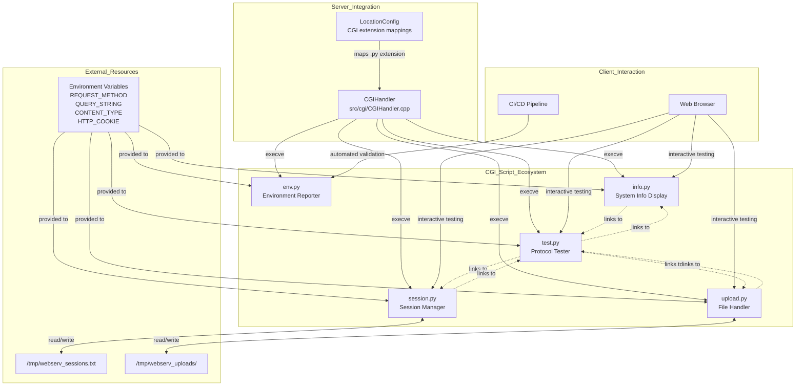
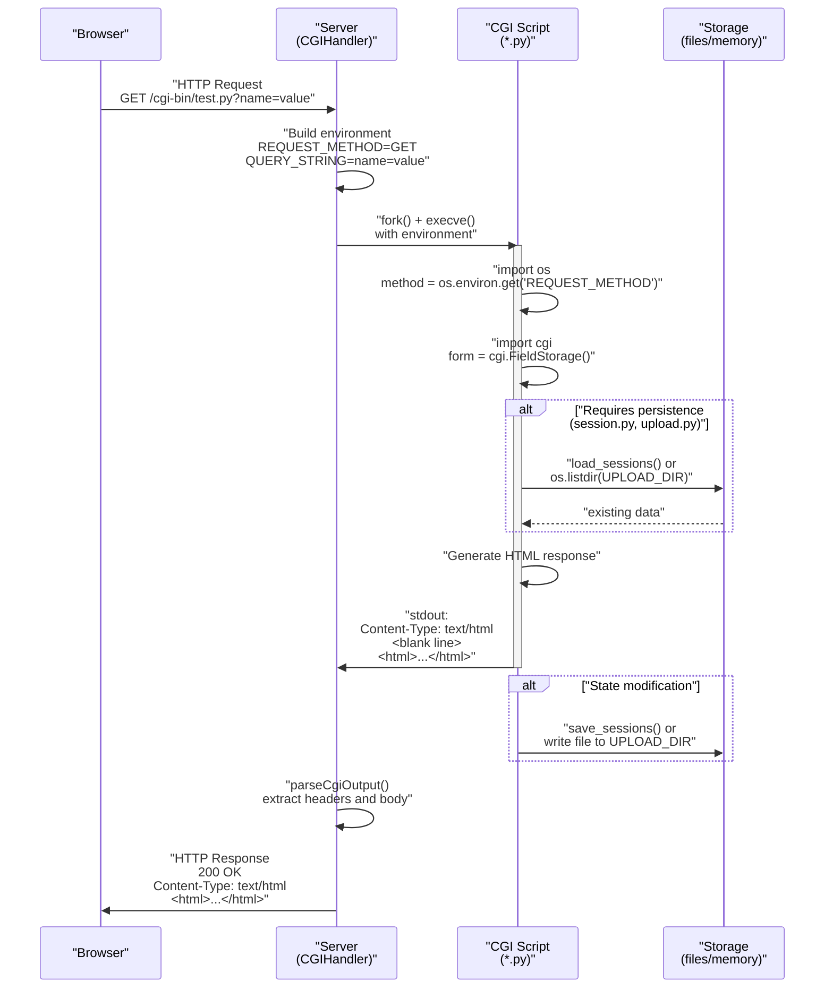
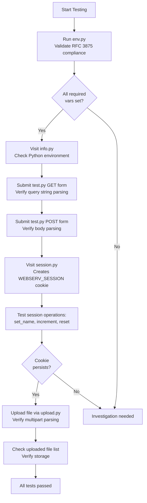

# Example CGI Scripts

<details>
<summary>Relevant source files</summary>

The following files were used as context for generating this page:

- [cgi-bin/env.py](cgi-bin/env.py)
- [cgi-bin/info.py](cgi-bin/info.py)
- [cgi-bin/session.py](cgi-bin/session.py)
- [cgi-bin/test.py](cgi-bin/test.py)
- [cgi-bin/upload.py](cgi-bin/upload.py)

</details>


## Purpose and Scope

This document provides an overview of the Python CGI scripts included in the `cgi-bin/` directory for testing and demonstrating the webserv CGI implementation. These scripts serve as both functional tests and reference implementations for CGI applications. Each script demonstrates different aspects of CGI functionality including environment variable handling, form processing, session management, and file uploads.

For details on the C++ CGI execution architecture and how these scripts are invoked by the server, see [CGI Handler Implementation](#5.1). For comprehensive documentation of each individual script's functionality, see sections [env.py - Environment Variable Reporter](#5.2.1) through [upload.py - File Upload Handler](#5.2.5).

**Sources:** [cgi-bin/env.py](), [cgi-bin/info.py](), [cgi-bin/session.py](), [cgi-bin/test.py](), [cgi-bin/upload.py]()

---

## Script Portfolio

The webserv project includes five Python CGI scripts, each designed to test specific CGI capabilities:

| Script | Primary Purpose | HTTP Methods | Key Features | Output Format |
|--------|----------------|--------------|--------------|---------------|
| `env.py` | RFC 3875 compliance verification | GET | Environment variable validation, CI/CD friendly | `text/plain` |
| `info.py` | System diagnostics | GET | Python version, platform info, CGI variables | `text/html` |
| `session.py` | Session persistence demo | GET, POST | Cookie management, file-based storage | `text/html` |
| `test.py` | Interactive CGI testing | GET, POST | Form submission, request inspection | `text/html` |
| `upload.py` | File upload handling | GET, POST | Multipart form data, file storage | `text/html` |

**Sources:** [cgi-bin/env.py:16-100](), [cgi-bin/info.py:12-107](), [cgi-bin/session.py:60-241](), [cgi-bin/test.py:17-236](), [cgi-bin/upload.py:45-235]()

---

## Script Interaction Model



**Diagram: CGI Script Ecosystem and Integration Points**

This diagram illustrates how the CGI scripts integrate with the server and external resources. The `CGIHandler` spawns each script via `execve()`, providing RFC 3875-compliant environment variables. Scripts that maintain state (`session.py`, `upload.py`) interact with filesystem storage. Navigation links create a web of interconnected test pages.

**Sources:** [cgi-bin/env.py:12-99](), [cgi-bin/session.py:19-59](), [cgi-bin/upload.py:15-107](), [cgi-bin/test.py:223-229]()

---

## Common Implementation Patterns

All CGI scripts share foundational patterns that demonstrate correct CGI protocol implementation:

### CGI Header Output

Every script outputs proper HTTP headers before content, following the CGI specification:

```python
# Content-Type header with charset
print("Content-Type: text/html; charset=utf-8")
print()  # Mandatory blank line separating headers from body
```

**Sources:** [cgi-bin/test.py:19-20](), [cgi-bin/info.py:13-14](), [cgi-bin/upload.py:110-111]()

### Environment Variable Access

Scripts access CGI environment variables via `os.environ`:

```python
method = os.environ.get('REQUEST_METHOD', 'GET')
query_string = os.environ.get('QUERY_STRING', '')
content_type = os.environ.get('CONTENT_TYPE', '')
```

**Sources:** [cgi-bin/test.py:23-24](), [cgi-bin/env.py:52-53](), [cgi-bin/upload.py:48-53]()

### Form Data Parsing

Scripts using Python's `cgi.FieldStorage()` for form handling:

```python
import cgi
form = cgi.FieldStorage()
value = form.getvalue('fieldname', 'default')
```

**Sources:** [cgi-bin/test.py:27](), [cgi-bin/session.py:61](), [cgi-bin/upload.py:57]()

### Cookie Management

The `session.py` script demonstrates cookie extraction and setting:

```python
# Reading cookies
cookies = os.environ.get('HTTP_COOKIE', '')
# Setting cookies
print(f"Set-Cookie: WEBSERV_SESSION={session_id}; Path=/; HttpOnly")
```

**Sources:** [cgi-bin/session.py:28-35](), [cgi-bin/session.py:120]()

---

## Request Processing Flow



**Diagram: CGI Script Request Processing Sequence**

This sequence shows the complete lifecycle of a CGI request from browser to response. The server prepares the environment, forks and executes the script, captures stdout, and parses the output. Scripts with persistence requirements interact with external storage before responding.

**Sources:** [cgi-bin/test.py:17-28](), [cgi-bin/session.py:60-115](), [cgi-bin/upload.py:45-93]()

---

## Script Categories and Use Cases

### Diagnostic Scripts

**`env.py`** - Automated Testing and Validation

The `env.py` script outputs plain text for programmatic parsing, making it ideal for CI/CD pipelines. It validates RFC 3875 required variables:

```python
REQUIRED_VARS = [
    'REQUEST_METHOD', 'QUERY_STRING', 'CONTENT_TYPE', 'CONTENT_LENGTH',
    'SERVER_NAME', 'SERVER_PORT', 'SERVER_PROTOCOL', 'GATEWAY_INTERFACE',
    'SCRIPT_NAME', 'PATH_INFO', 'PATH_TRANSLATED',
    'REMOTE_ADDR', 'REMOTE_HOST', 'HTTP_HOST', 'HTTP_USER_AGENT',
    'HTTP_ACCEPT', 'HTTP_COOKIE'
]
```

The script reports which variables are set versus missing, providing compliance verification.

**Sources:** [cgi-bin/env.py:20-38](), [cgi-bin/env.py:48-66]()

**`info.py`** - Human-Readable System Information

The `info.py` script generates styled HTML showing Python environment details, platform information, and all CGI variables in a tabular format. It demonstrates HTML generation and environment introspection.

**Sources:** [cgi-bin/info.py:12-107]()

### Interactive Test Scripts

**`test.py`** - Comprehensive Protocol Testing

The `test.py` script provides interactive forms for testing both GET and POST methods. It displays:
- Request method and parameters
- Server configuration variables
- Submitted form data
- HTTP client headers

It serves as the primary entry point for manual CGI testing with navigation links to all other scripts.

**Sources:** [cgi-bin/test.py:112-232]()

### Stateful Feature Demonstrations

**`session.py`** - Cookie-Based Session Management

Implements file-based session storage at `/tmp/webserv_sessions.txt` with operations:
- `generate_session_id()`: Creates 32-character random IDs
- `get_cookie()`: Parses `HTTP_COOKIE` environment variable
- `load_sessions()` / `save_sessions()`: Persistent storage
- Session actions: set name, increment counter, reset data, destroy session

**Sources:** [cgi-bin/session.py:19-59](), [cgi-bin/session.py:88-115]()

**`upload.py`** - Multipart File Upload Handling

Processes `multipart/form-data` submissions with security considerations:
- `ensure_upload_dir()`: Creates `/tmp/webserv_uploads/` if needed
- `get_safe_filename()`: Sanitizes filenames, adds timestamps
- `format_size()`: Human-readable size formatting
- Supports single and multiple file uploads
- Lists previously uploaded files with metadata

**Sources:** [cgi-bin/upload.py:15-107]()

---

## Environment Variable Dependencies

Each script relies on specific CGI environment variables set by the `CGIHandler`:

| Variable | env.py | info.py | test.py | session.py | upload.py | Purpose |
|----------|--------|---------|---------|------------|-----------|---------|
| `REQUEST_METHOD` | ✓ | ✓ | ✓ | ✓ | ✓ | Determines GET/POST handling |
| `QUERY_STRING` | ✓ | ✓ | ✓ | - | - | GET parameter extraction |
| `CONTENT_TYPE` | ✓ | ✓ | ✓ | - | ✓ | Validates multipart forms |
| `CONTENT_LENGTH` | ✓ | ✓ | ✓ | - | ✓ | Request body size |
| `HTTP_COOKIE` | ✓ | ✓ | - | ✓ | - | Session identification |
| `SERVER_NAME` | ✓ | ✓ | ✓ | - | - | Virtual host info |
| `SERVER_PORT` | ✓ | ✓ | ✓ | - | - | Port identification |
| `SCRIPT_NAME` | ✓ | ✓ | ✓ | - | - | Self-referencing URLs |

**Sources:** [cgi-bin/env.py:20-37](), [cgi-bin/info.py:68-76](), [cgi-bin/test.py:128-137](), [cgi-bin/session.py:28](), [cgi-bin/upload.py:48-53]()

---

## HTML Response Structure

Scripts generating HTML (`info.py`, `test.py`, `session.py`, `upload.py`) share consistent styling patterns:

### Embedded CSS Styling

All HTML scripts use embedded `<style>` blocks with common patterns:
- Card-based layouts with shadows and rounded corners
- Responsive max-width containers (800-900px)
- Gradient backgrounds (linear-gradient)
- Form input styling with focus states
- Table formatting for data display

**Sources:** [cgi-bin/test.py:36-103](), [cgi-bin/info.py:22-45](), [cgi-bin/session.py:133-179](), [cgi-bin/upload.py:119-175]()

### Navigation Links

Interactive scripts provide cross-navigation:

```python
# test.py navigation section
<div class="nav">
    <a href="/">🏠 Home</a>
    <a href="/cgi-bin/info.py">ℹ️ System Info</a>
    <a href="/cgi-bin/env.py">🔧 Environment</a>
    <a href="/cgi-bin/session.py">🍪 Session Demo</a>
    <a href="/cgi-bin/upload.py">📤 File Upload</a>
</div>
```

**Sources:** [cgi-bin/test.py:222-229](), [cgi-bin/info.py:101](), [cgi-bin/session.py:234](), [cgi-bin/upload.py:228]()

---

## Configuration Requirements

For these scripts to execute, the webserv configuration must include appropriate CGI mappings. The `LocationConfig` stores these mappings in `_cgiExtensions` (map of extension to interpreter path), which the `CGIHandler` uses to determine script execution.

**Referenced:** See [Location Configuration](#4.7) and [CGI Handler Implementation](#5.1)

---

## Error Handling Patterns

Scripts implement defensive coding with try-except blocks:

### File I/O Protection

```python
# session.py load_sessions()
def load_sessions():
    sessions = {}
    try:
        with open(SESSION_FILE, 'r') as f:
            # parse file content
    except:
        pass  # Return empty dict on failure
    return sessions
```

**Sources:** [cgi-bin/session.py:37-49]()

### Form Processing Safety

```python
# upload.py file processing
try:
    form = cgi.FieldStorage()
    # Process file upload
except Exception as e:
    error_message = f"Error processing upload: {str(e)}"
```

**Sources:** [cgi-bin/upload.py:56-90]()

### HTML Escaping

Scripts using `html.escape()` to prevent XSS vulnerabilities:

```python
import html
print(f'<td>{html.escape(value)}</td>')
```

**Sources:** [cgi-bin/test.py:115-157](), [cgi-bin/session.py:91-92](), [cgi-bin/upload.py:181-186]()

---

## Testing Workflow



**Diagram: Recommended CGI Testing Workflow**

This workflow demonstrates progressive testing from basic environment validation through complex stateful operations. Start with `env.py` for automated validation, then proceed through interactive tests, and conclude with persistence features.

**Sources:** [cgi-bin/env.py:40-99](), [cgi-bin/test.py:196-219](), [cgi-bin/session.py:88-110](), [cgi-bin/upload.py:52-93]()

---

## File System Interactions

Two scripts create persistent state on the filesystem:

### Session Storage

**Path:** `/tmp/webserv_sessions.txt`
**Format:** `sessionId|timestamp|key=value&key=value`
**Operations:** Created/read/written by `session.py`
**Cleanup:** Manual deletion required

```python
SESSION_FILE = '/tmp/webserv_sessions.txt'

def save_sessions(sessions):
    with open(SESSION_FILE, 'w') as f:
        for sid, info in sessions.items():
            f.write(f"{sid}|{info['timestamp']}|{info['data']}\n")
```

**Sources:** [cgi-bin/session.py:19](), [cgi-bin/session.py:51-58]()

### Upload Directory

**Path:** `/tmp/webserv_uploads/`
**Format:** Binary files with sanitized names
**Operations:** Created/written/listed by `upload.py`
**Naming:** `originalname_timestamp.ext`

```python
UPLOAD_DIR = '/tmp/webserv_uploads'

def ensure_upload_dir():
    if not os.path.exists(UPLOAD_DIR):
        os.makedirs(UPLOAD_DIR)
```

**Sources:** [cgi-bin/upload.py:15](), [cgi-bin/upload.py:17-23]()

---

## Security Considerations

The example scripts implement several security measures:

### Filename Sanitization

`upload.py` prevents path traversal and dangerous characters:

```python
def get_safe_filename(filename):
    filename = os.path.basename(filename)  # Remove path
    safe_chars = 'abcdefghijklmnopqrstuvwxyzABCDEFGHIJKLMNOPQRSTUVWXYZ0123456789.-_'
    result = ''.join(c if c in safe_chars else '_' for c in filename)
    timestamp = str(int(time.time()))
    name, ext = os.path.splitext(result)
    return f"{name}_{timestamp}{ext}"
```

**Sources:** [cgi-bin/upload.py:25-35]()

### XSS Prevention

All scripts displaying user input use `html.escape()`:

```python
print(f'<td>{html.escape(user_input)}</td>')
```

**Sources:** [cgi-bin/test.py:15](), [cgi-bin/session.py:11](), [cgi-bin/upload.py:11]()

### Cookie Security

`session.py` sets `HttpOnly` flag to prevent JavaScript access:

```python
print(f"Set-Cookie: WEBSERV_SESSION={session_id}; Path=/; HttpOnly")
```

**Sources:** [cgi-bin/session.py:120]()

---

## Integration with Server Components

The CGI scripts interface with server components through well-defined protocols:

### CGIHandler Execution

The `CGIHandler` prepares the environment and executes scripts by constructing RFC 3875 environment variables, forking a child process, and executing via `execve()`.

**Referenced:** See [CGI Handler Implementation](#5.1) for detailed execution flow

### Response Integration

The server parses CGI output by reading headers until a blank line and treating the remainder as the response body.

**Referenced:** See [HTTP Response Generation](#4.4) for response building

### Session Manager Bonus

While `session.py` implements file-based sessions independently, the server also provides a `SessionManager` singleton for C++-level session management.

**Referenced:** See [Session Management](#6.1) for server-side session support

---

## Summary

The five Python CGI scripts form a comprehensive testing suite that validates all aspects of the webserv CGI implementation:

- **`env.py`**: Automated RFC 3875 compliance checking
- **`info.py`**: Human-readable environment diagnostics
- **`test.py`**: Interactive GET/POST testing with forms
- **`session.py`**: Cookie-based session persistence
- **`upload.py`**: Multipart file upload handling

Each script demonstrates correct CGI protocol implementation with proper header output, environment variable access, form parsing, and HTML generation.

**Sources:** [cgi-bin/env.py](), [cgi-bin/info.py](), [cgi-bin/session.py](), [cgi-bin/test.py](), [cgi-bin/upload.py]()

---
