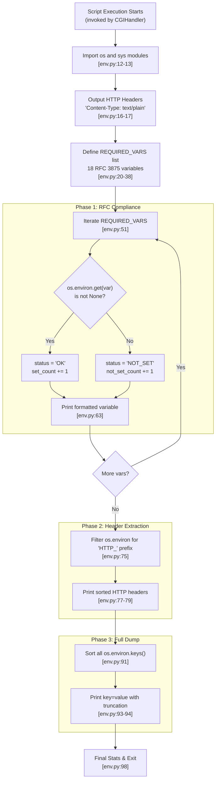
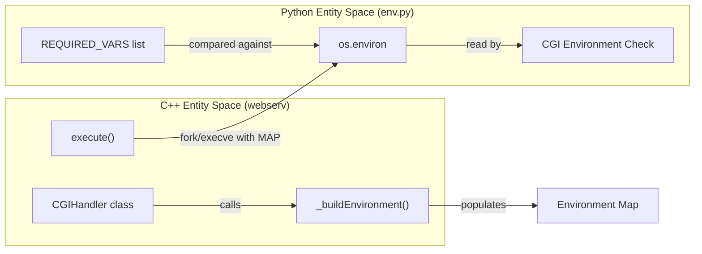

# env.py - Environment Variable Reporter

Relevant source files

The following files were used as context for generating this page:

- [cgi-bin/env.py](cgi-bin/env.py)

## Purpose and Scope

The `env.py` script is a diagnostic CGI utility designed to display all environment variables passed to a CGI process by the **Webserv** HTTP server. It provides a plain-text report of CGI environment variables, HTTP headers, and system environment variables specifically formatted for debugging and validation purposes.

The script's primary role is to verify **RFC 3875** compliance within the server's CGI implementation. By outputting plain text instead of HTML, it allows for easy parsing in CI/CD pipelines to ensure the server correctly populates the execution environment for external processes.

**Sources:** [cgi-bin/env.py:1-10]() | [cgi-bin/env.py:15-17]()

---

## Script Overview

The `env.py` script serves as a standards-compliant reporter. It defines a set of required variables and checks their presence in the current execution environment.

### Key Characteristics

| Feature | Description |
|---------|-------------|
| **File Path** | `cgi-bin/env.py` |
| **Interpreter** | Python 3 (via `#!/usr/bin/env python3`) |
| **Content-Type** | `text/plain; charset=utf-8` |
| **Logic** | Iterative environment inspection using `os.environ` |
| **Compliance** | Checks for 18 specific RFC 3875 variables |

**Sources:** [cgi-bin/env.py:1-17]() | [cgi-bin/env.py:20-38]()

---

## Script Structure and Execution Flow

The script follows a linear execution path, categorized into three reporting phases: Required Variables, HTTP Headers, and All Variables.

### Execution Flow Diagram

**Sources:** [cgi-bin/env.py:12-17](), [cgi-bin/env.py:51-66](), [cgi-bin/env.py:75-81](), [cgi-bin/env.py:91-98]()

---

## Environment Variable Categories

The script organizes environment variables into three distinct categories for reporting:

### 1. Required CGI Variables (RFC 3875)

The script explicitly tracks 18 variables defined as mandatory or common in the CGI/1.1 specification:

| Category | Variables Defined in `REQUIRED_VARS` [cgi-bin/env.py:20-38]() |
| :--- | :--- |
| **Request Meta** | `REQUEST_METHOD`, `QUERY_STRING`, `CONTENT_TYPE`, `CONTENT_LENGTH` |
| **Server Meta** | `SERVER_NAME`, `SERVER_PORT`, `SERVER_PROTOCOL`, `GATEWAY_INTERFACE` |
| **Script/Path** | `SCRIPT_NAME`, `PATH_INFO`, `PATH_TRANSLATED` |
| **Client Meta** | `REMOTE_ADDR`, `REMOTE_HOST` |
| **HTTP Headers** | `HTTP_HOST`, `HTTP_USER_AGENT`, `HTTP_ACCEPT`, `HTTP_COOKIE` |

The script uses `os.environ.get(var)` to check for existence [cgi-bin/env.py:52](). If a variable is missing, it is flagged as `NOT_SET` [cgi-bin/env.py:59]().

### 2. HTTP Headers Section

The script isolates variables that represent the original HTTP request headers. Per CGI specification, headers are prefixed with `HTTP_`, converted to uppercase, and hyphens become underscores. The script uses a list comprehension to filter these [cgi-bin/env.py:75]().

### 3. Full Environment Dump

Finally, the script iterates through every key in `os.environ` [cgi-bin/env.py:91](). This includes variables not explicitly mentioned in the RFC but passed by the `CGIHandler` (such as `PATH` or `SystemRoot`).

**Sources:** [cgi-bin/env.py:20-38](), [cgi-bin/env.py:51-63](), [cgi-bin/env.py:75](), [cgi-bin/env.py:91-94]()

---

## Integration with CGIHandler

The following diagram maps the relationship between the C++ `CGIHandler` class and the `env.py` script's reporting:

**Diagram: Bridge between CGIHandler and env.py**

When the server receives a request for `/cgi-bin/env.py`, the `CGIHandler` invokes `_buildEnvironment()` to populate a `char** envp` array. This array is passed to `execve()`. Once `env.py` starts, Python's `os.environ` becomes a wrapper around this array.

**Sources:** [cgi-bin/env.py:1-100]()

---

## Formatting and Truncation

To ensure the output remains readable in terminal-based CI/CD logs, the script implements strict formatting and truncation:

*   **Required Variables:** Values exceeding 50 characters are truncated [cgi-bin/env.py:57]().
*   **HTTP Headers:** Values exceeding 50 characters are truncated [cgi-bin/env.py:78]().
*   **Full Dump:** Values exceeding 60 characters are truncated [cgi-bin/env.py:93]().
*   **Status Indicators:** Each required variable is prefixed with a fixed-width status tag: `[OK     ]` or `[NOT_SET]` [cgi-bin/env.py:63]().

**Sources:** [cgi-bin/env.py:57](), [cgi-bin/env.py:63](), [cgi-bin/env.py:78](), [cgi-bin/env.py:93]()

---

## Summary Statistics

At the end of each section and the script itself, summary counts are provided to allow automated tools to quickly verify the health of the CGI environment:

*   **Required Summary:** Reports `set_count` out of the total `REQUIRED_VARS` [cgi-bin/env.py:66]().
*   **Total Count:** Reports the absolute number of variables in the environment [cgi-bin/env.py:98]().

**Sources:** [cgi-bin/env.py:66](), [cgi-bin/env.py:98]()

---
