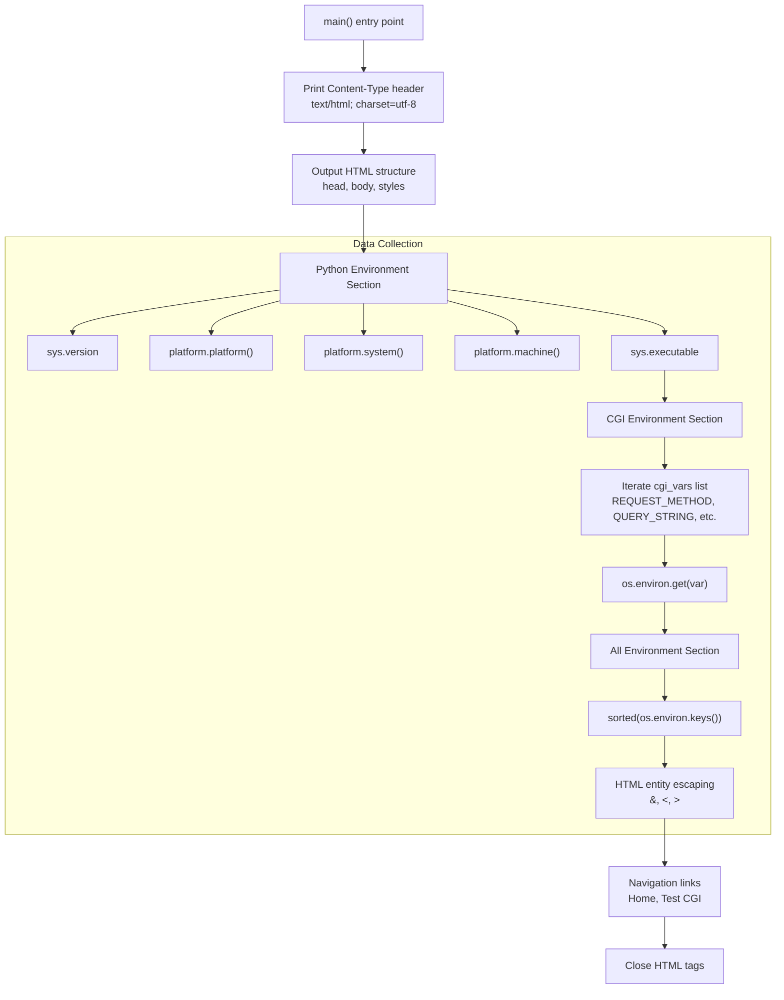
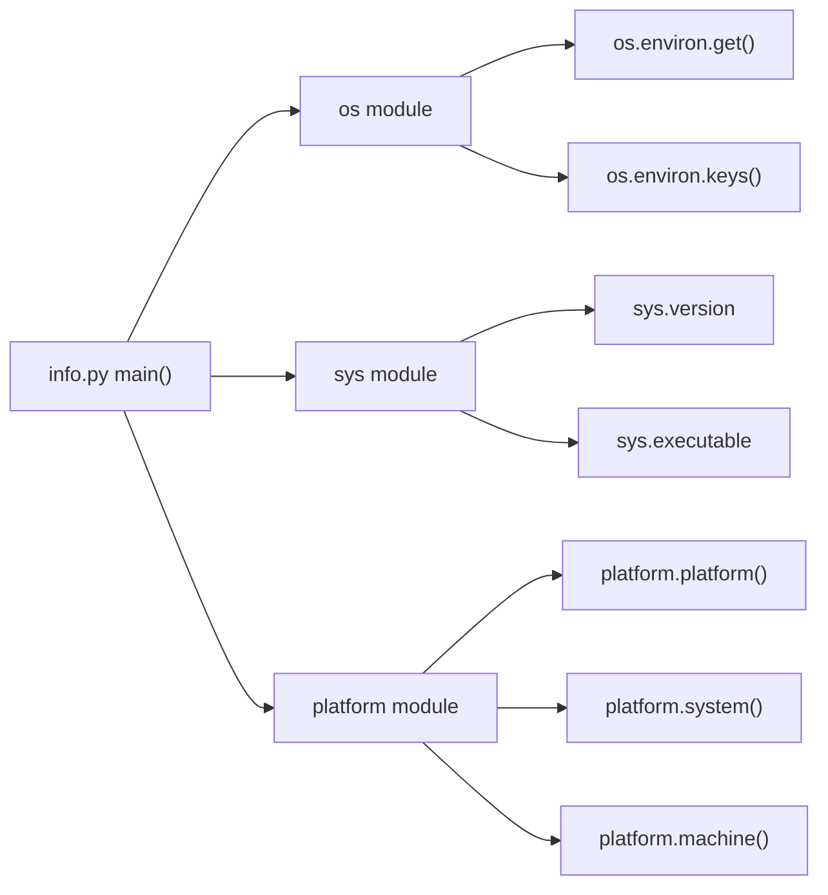
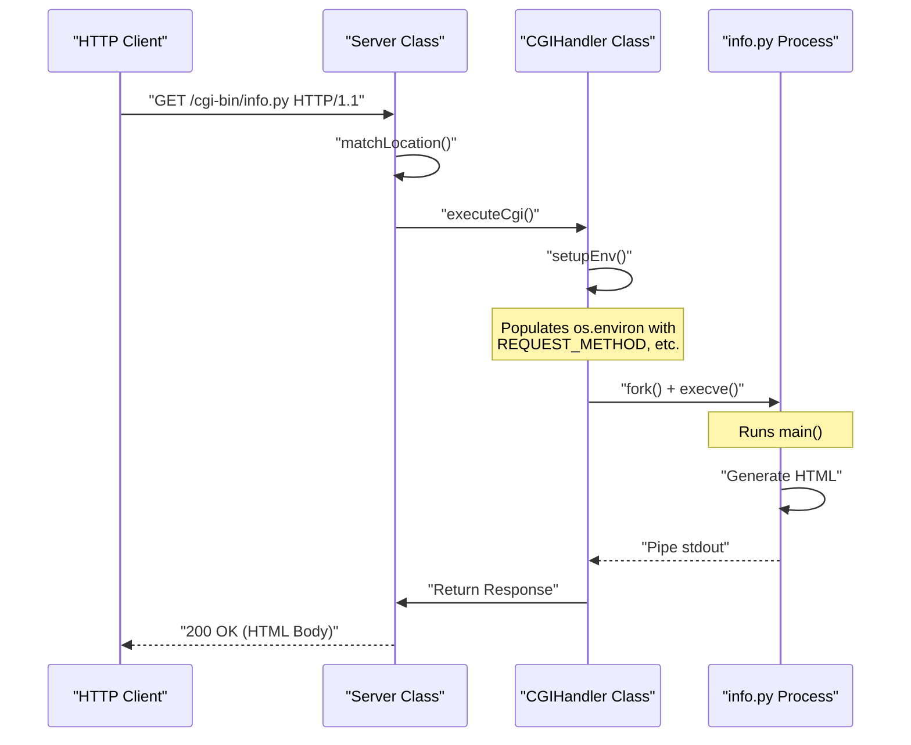

# info.py - System Information Display

<details>
<summary>Relevant source files</summary>

The following files were used as context for generating this page:

- [cgi-bin/info.py](cgi-bin/info.py)

</details>


## Purpose and Scope

This page documents `info.py`, a Python CGI script that provides comprehensive system and environment information in an HTML interface. The script is designed for debugging, system inspection, and verification of the CGI execution environment within the `webserv` project.

It serves as a visual diagnostic tool to confirm that the C++ `CGIHandler` correctly populates the process environment according to RFC 3875 and that the Python interpreter is correctly configured on the host system.

**Sources:** [cgi-bin/info.py:1-11]()

---

## Script Overview

The `info.py` script generates a formatted HTML page displaying three distinct categories of information:

| Category | Content | Purpose |
|----------|---------|---------|
| **Python Environment** | Version, platform, architecture, executable path | Verify Python interpreter configuration and host system specs. |
| **CGI Environment Variables** | Standard CGI/1.1 variables (RFC 3875) | Inspect the specific CGI execution context provided by `webserv`. |
| **All Environment Variables** | Complete environment key-value pairs | Debug the full process environment and variable propagation. |

The script follows the CGI protocol by outputting a `Content-Type: text/html; charset=utf-8` header followed by a mandatory empty line before the HTML body [cgi-bin/info.py:13-14]().

**Sources:** [cgi-bin/info.py:12-107]()

---

## Execution Flow

The following diagram illustrates how `info.py` processes environment data and generates its HTML output:

**Diagram: info.py Execution Flow**



**Sources:** [cgi-bin/info.py:12-107]()

---

## Module Dependencies and Imports

The script utilizes standard Python library modules to gather system-level data:

**Diagram: Module Dependencies**



The script is standalone and requires no third-party packages, ensuring it runs reliably in restricted environments [cgi-bin/info.py:8-10]().

**Sources:** [cgi-bin/info.py:8-10]()

---

## Output Sections

### Python Environment Section

This section identifies the runtime environment of the script [cgi-bin/info.py:50-62]():

| Display Field | Data Source | Example Value |
|---------------|-------------|---------------|
| Python Version | `sys.version` | "3.10.12 (main, Nov 20 2023)" |
| Platform | `platform.platform()` | "Linux-6.5.0-27-generic-x86_64" |
| System | `platform.system()` | "Linux" |
| Architecture | `platform.machine()` | "x86_64" |
| Executable | `sys.executable` | "/usr/bin/python3" |

The `sys.executable` path is critical for confirming whether the server is using the system Python or a specific virtual environment [cgi-bin/info.py:58]().

**Sources:** [cgi-bin/info.py:50-62]()

### CGI Environment Variables Section

The script explicitly checks for standard variables defined in the CGI/1.1 specification [cgi-bin/info.py:64-84]():

```python
cgi_vars = [
    'REQUEST_METHOD', 'QUERY_STRING', 'CONTENT_TYPE', 'CONTENT_LENGTH',
    'SCRIPT_NAME', 'SCRIPT_FILENAME', 'PATH_INFO', 'PATH_TRANSLATED',
    'REQUEST_URI', 'DOCUMENT_ROOT', 'SERVER_SOFTWARE', 'SERVER_NAME',
    'SERVER_PORT', 'SERVER_PROTOCOL', 'GATEWAY_INTERFACE',
    'REMOTE_ADDR', 'REMOTE_PORT', 'REMOTE_HOST',
    'HTTP_HOST', 'HTTP_USER_AGENT', 'HTTP_ACCEPT', 'HTTP_ACCEPT_LANGUAGE',
    'HTTP_ACCEPT_ENCODING', 'HTTP_CONNECTION', 'HTTP_COOKIE', 'HTTP_REFERER'
]
```

For each variable, the script uses `os.environ.get(var, '<not set>')` [cgi-bin/info.py:79](). This prevents `KeyError` exceptions if the web server fails to provide a specific variable.

**Sources:** [cgi-bin/info.py:64-84]()

### All Environment Variables Section

This section provides a comprehensive dump of the `os.environ` dictionary, sorted alphabetically [cgi-bin/info.py:90](). To ensure safe rendering of arbitrary environment values, the script performs basic HTML entity escaping [cgi-bin/info.py:92-93]():

```python
value = value.replace('&', '&amp;').replace('<', '&lt;').replace('>', '&gt;')
```

This prevents potential Cross-Site Scripting (XSS) if environment variables contain malicious HTML tags.

**Sources:** [cgi-bin/info.py:86-98]()

---

## Integration with Webserv

The script is designed to be executed by the `CGIHandler` class in the C++ codebase. The following sequence shows the interaction:

**Diagram: Webserv to info.py Integration**



**Sources:** [cgi-bin/info.py:12-107]()

---

## Use Cases

### 1. CGI Compliance Verification
By inspecting the **CGI Environment Variables** section, developers can verify if `webserv` is correctly passing mandatory variables like `GATEWAY_INTERFACE` or `REQUEST_METHOD`.

### 2. Path Troubleshooting
The `SCRIPT_FILENAME` and `DOCUMENT_ROOT` variables help diagnose issues with path translation and root directory configuration in `webserv.conf`.

### 3. Header Propagation
The script displays variables prefixed with `HTTP_` (e.g., `HTTP_USER_AGENT`). This confirms that the server is correctly converting HTTP request headers into environment variables for the CGI process.

**Sources:** [cgi-bin/info.py:68-80]()

---

## Comparison with env.py

While both scripts report environment data, they serve different operational roles:

| Feature | `info.py` | `env.py` |
|---------|-----------|----------|
| **Primary Output** | Styled HTML [cgi-bin/info.py:16]() | Plain Text |
| **Audience** | Human (Browser) | Machine (Test Scripts) |
| **System Info** | Included (Python/Platform) [cgi-bin/info.py:54-58]() | Excluded |
| **Visuals** | CSS-styled tables [cgi-bin/info.py:22-45]() | None |

**Sources:** [cgi-bin/info.py:1-107]()

---
