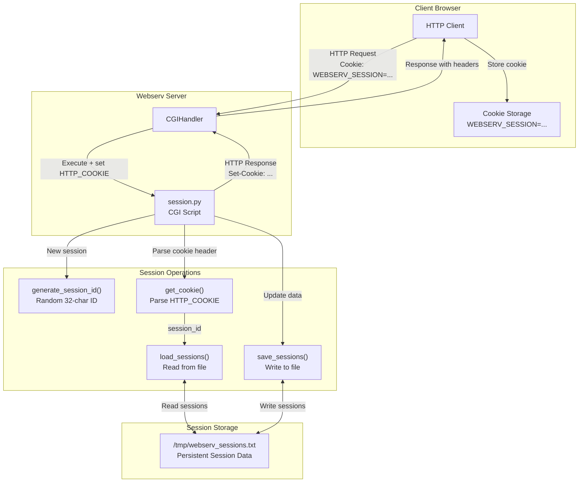
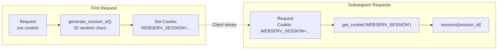
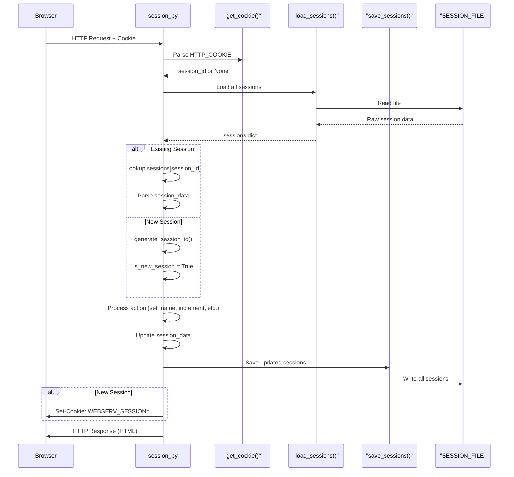
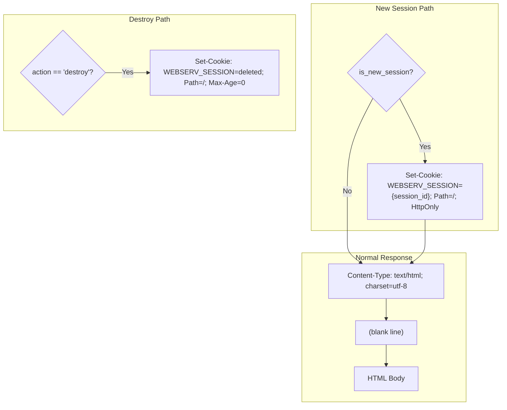
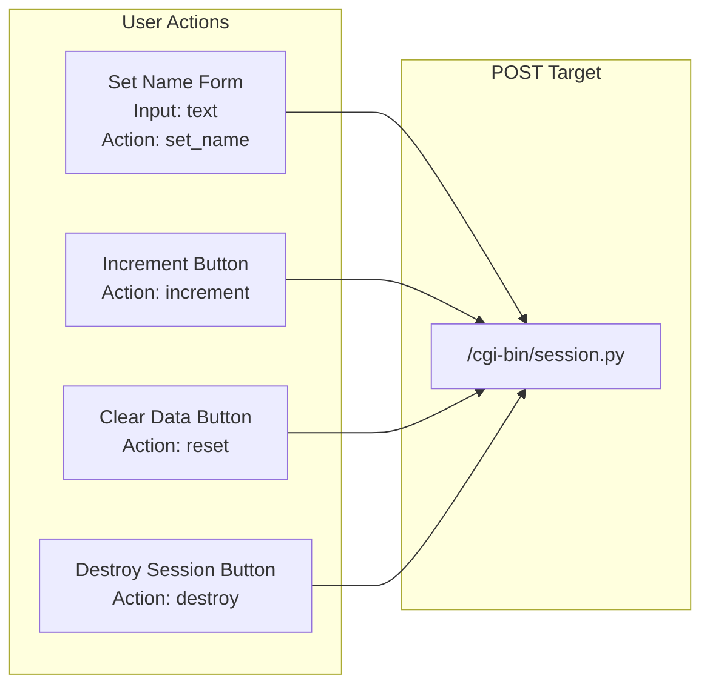

# session.py - Session Management Demo

<details>
<summary>Relevant source files</summary>

The following files were used as context for generating this page:

- [cgi-bin/session.py](cgi-bin/session.py)

</details>


## Purpose and Scope

This document describes the `session.py` CGI script, which demonstrates file-based session management using HTTP cookies. The script illustrates stateful web application patterns within the webserv environment, implementing session creation, data persistence, and lifecycle management.

For information about other CGI demonstration scripts, see:
- Environment variable reporting: [env.py - Environment Variable Reporter](#5.2.1)
- System information display: [info.py - System Information Display](#5.2.2)
- General CGI protocol testing: [test.py - CGI Protocol Tester](#5.2.4)
- File upload handling: [upload.py - File Upload Handler](#5.2.5)

For details on the C++ SessionManager implementation, see [Session Management](#6.1).

Sources: [cgi-bin/session.py:1-241]()

---

## Overview

The `session.py` script implements a complete session management system demonstrating:
- Session ID generation and cookie-based identification
- File-based session persistence across requests
- Session data storage and retrieval
- Session lifecycle operations (create, update, destroy)
- Timeout tracking via timestamp storage

This script serves as both a demonstration of the webserv BONUS session management feature and a testing tool for cookie handling in HTTP responses.

Sources: [cgi-bin/session.py:1-6](), [cgi-bin/session.py:60-240]()

---

## Session Architecture

### Component Interaction



Sources: [cgi-bin/session.py:21-58](), [cgi-bin/session.py:60-120]()

---

## Session Storage Format

### File Structure

The session storage file at `/tmp/webserv_sessions.txt` uses a pipe-delimited format:

```
session_id|timestamp|data
```

| Field | Description | Example |
|-------|-------------|---------|
| `session_id` | 32-character alphanumeric identifier | `abc123...xyz` |
| `timestamp` | Unix timestamp (float) | `1234567890.123` |
| `data` | URL-encoded key-value pairs | `name=John&count=5` |

**Example File Content:**
```
kJ8mN3pQ2rT5vX9aB1cD4eF7gH0iL6oM|1640000000.5|name=Alice&count=3
zY6wV9uT2sR5qP8nM1lK4jH7gF0eD3cB|1640000100.2|name=Bob&count=7
```

Sources: [cgi-bin/session.py:19](), [cgi-bin/session.py:37-58]()

### Storage Functions

#### load_sessions()

Reads and parses the session file into an in-memory dictionary:

```python
sessions = {
    'session_id': {
        'timestamp': float,
        'data': str  # key=value&key=value format
    }
}
```

**Implementation Details:**
- File path: `SESSION_FILE = '/tmp/webserv_sessions.txt'` [cgi-bin/session.py:19]()
- Splits each line by `|` delimiter [cgi-bin/session.py:43]()
- Handles malformed lines gracefully (try/except) [cgi-bin/session.py:40-48]()
- Returns empty dict if file doesn't exist [cgi-bin/session.py:39]()

Sources: [cgi-bin/session.py:37-49]()

#### save_sessions()

Persists the in-memory session dictionary to the file:

**Implementation Details:**
- Overwrites entire file on each save (atomic update) [cgi-bin/session.py:54]()
- Formats: `{sid}|{timestamp}|{data}\n` [cgi-bin/session.py:56]()
- Silent failure (demo purposes) [cgi-bin/session.py:57-58]()

Sources: [cgi-bin/session.py:51-58]()

---

## Session Identification

### Cookie Management



Sources: [cgi-bin/session.py:21-35](), [cgi-bin/session.py:64-86]()

### generate_session_id()

Creates a random session identifier:

**Parameters:** None

**Returns:** String of 32 random alphanumeric characters [cgi-bin/session.py:24]()

**Implementation:**
- Character set: `string.ascii_letters + string.digits` (a-z, A-Z, 0-9) [cgi-bin/session.py:23]()
- Uses `random.choice()` for each character position [cgi-bin/session.py:24]()

Sources: [cgi-bin/session.py:21-24]()

### get_cookie()

Extracts a specific cookie value from the `HTTP_COOKIE` environment variable:

**Parameters:**
- `name`: Cookie name to retrieve (e.g., `'WEBSERV_SESSION'`)

**Returns:** Cookie value as string, or `None` if not found [cgi-bin/session.py:35]()

**Cookie Parsing Logic:**
1. Read `os.environ.get('HTTP_COOKIE', '')` [cgi-bin/session.py:28]()
2. Split by `;` delimiter [cgi-bin/session.py:29]()
3. For each cookie, split by `=` [cgi-bin/session.py:32]()
4. Match cookie name (case-sensitive) [cgi-bin/session.py:33]()
5. Return first matching value [cgi-bin/session.py:34]()

Sources: [cgi-bin/session.py:26-35]()

---

## Session Operations

### Request Processing Flow



Sources: [cgi-bin/session.py:60-115]()

### Supported Actions

The script processes POST form submissions with an `action` parameter [cgi-bin/session.py:62]():

| Action | Parameters | Behavior | Session Impact |
|--------|-----------|----------|----------------|
| `set_name` | `name` | Stores user name in session | Sets `session_data['name']` [cgi-bin/session.py:91]() |
| `increment` | None | Increments visit counter | Increments `session_data['count']` [cgi-bin/session.py:95]() |
| `reset` | None | Clears all session data | Sets `session_data = {}` [cgi-bin/session.py:98]() |
| `destroy` | None | Deletes session and cookie | Removes from sessions dict, expires cookie [cgi-bin/session.py:101-105]() |

Sources: [cgi-bin/session.py:87-110]()

### Action Implementation Details

#### set_name Action

```
Form Input: name="John Doe"
↓
HTML Escape: html.escape(name) [cgi-bin/session.py:91]
↓
Store: session_data['name'] = "John Doe" [cgi-bin/session.py:91]
↓
Persist: Save to SESSION_FILE [cgi-bin/session.py:115]
```

Sources: [cgi-bin/session.py:89-92]()

#### increment Action

```
Read: count = session_data.get('count', 0) [cgi-bin/session.py:94]
↓
Convert: int(count) + 1 [cgi-bin/session.py:94]
↓
Store: session_data['count'] = str(count + 1) [cgi-bin/session.py:95]
↓
Persist: Save to SESSION_FILE [cgi-bin/session.py:115]
```

Sources: [cgi-bin/session.py:93-96]()

#### destroy Action

```
Delete: del sessions[session_id] [cgi-bin/session.py:102]
↓
Persist: save_sessions(sessions) [cgi-bin/session.py:103]
↓
Expire Cookie: Set-Cookie: WEBSERV_SESSION=deleted; Max-Age=0 [cgi-bin/session.py:105]
↓
Redirect: Meta refresh to /cgi-bin/session.py [cgi-bin/session.py:107]
```

**Special Behavior:**
- Immediately returns after sending headers (no further HTML) [cgi-bin/session.py:110]()
- Uses `Max-Age=0` to expire cookie in browser [cgi-bin/session.py:105]()
- Meta refresh redirects to create new session [cgi-bin/session.py:107]()

Sources: [cgi-bin/session.py:100-110]()

---

## HTTP Header Generation

### Set-Cookie Header Format



Sources: [cgi-bin/session.py:104-121]()

### Cookie Attributes

| Attribute | Value | Purpose |
|-----------|-------|---------|
| Name | `WEBSERV_SESSION` | Session identifier cookie name |
| Value | 32-char session ID | Unique session identifier |
| `Path` | `/` | Cookie valid for entire domain [cgi-bin/session.py:120]() |
| `HttpOnly` | (flag) | Prevents JavaScript access (security) [cgi-bin/session.py:120]() |
| `Max-Age` | `0` (destroy only) | Immediate cookie expiration [cgi-bin/session.py:105]() |

Sources: [cgi-bin/session.py:120](), [cgi-bin/session.py:105]()

---

## HTML Interface

### Session Information Display

The generated HTML page displays:

| Section | Content | Data Source |
|---------|---------|-------------|
| Session ID | 32-char identifier | `session_id` variable [cgi-bin/session.py:190]() |
| Status | "New session created" or existing | `is_new_session` flag [cgi-bin/session.py:191]() |
| Name | Current stored name | `session_data.get('name', 'Guest')` [cgi-bin/session.py:198]() |
| Counter | Visit count | `session_data.get('count', '0')` [cgi-bin/session.py:199]() |
| Session Age | Timestamp | `sessions[session_id]['timestamp']` [cgi-bin/session.py:200]() |

Sources: [cgi-bin/session.py:124-237]()

### Form Actions

The interface provides four forms for testing:



Sources: [cgi-bin/session.py:204-226]()

---

## Session Data Encoding

### Storage Format

Session data is stored as URL-encoded key-value pairs:

```
name=Alice&count=5
```

**Encoding Process:**
```python
# Build data string
data_str = '&'.join(f"{k}={v}" for k, v in session_data.items())
```

**Decoding Process:**
```python
# Parse data string
for pair in session_info['data'].split('&'):
    if '=' in pair:
        k, v = pair.split('=', 1)
        session_data[k] = v
```

Sources: [cgi-bin/session.py:113](), [cgi-bin/session.py:76-79]()

---

## Security Considerations

### Implementation Characteristics

| Aspect | Implementation | Security Impact |
|--------|----------------|-----------------|
| Session ID Generation | `random.choice()` from 62-char set [cgi-bin/session.py:24] | Adequate for demo |
| Cookie Security | `HttpOnly` flag set [cgi-bin/session.py:120] | Prevents XSS-based cookie theft |
| Input Sanitization | `html.escape()` on name input [cgi-bin/session.py:91] | Prevents XSS in displayed content |

Sources: [cgi-bin/session.py:21-24](), [cgi-bin/session.py:91](), [cgi-bin/session.py:120]()

---

## Integration with Webserv

### Configuration Requirements

To enable the session.py script, the webserv.conf must include a location block that maps the `/cgi-bin` path to the CGI handler, allowing GET and POST methods.

Sources: [cgi-bin/session.py:1]()

### CGI Environment Variables Used

| Variable | Purpose | Access Method |
|----------|---------|---------------|
| `HTTP_COOKIE` | Read session cookie | `os.environ.get('HTTP_COOKIE', '')` [cgi-bin/session.py:28]() |

Sources: [cgi-bin/session.py:28](), [cgi-bin/session.py:61]()

---

## File Dependencies

### Python Standard Library

| Module | Usage |
|--------|-------|
| `os` | Access CGI environment variables [cgi-bin/session.py:8] |
| `cgi` | Form data parsing via `FieldStorage()` [cgi-bin/session.py:10] |
| `html` | HTML entity escaping [cgi-bin/session.py:11] |
| `time` | Timestamp generation [cgi-bin/session.py:13] |
| `random` | Session ID generation [cgi-bin/session.py:14] |

Sources: [cgi-bin/session.py:8-15]()

### External Dependencies

**File System:**
- `/tmp/webserv_sessions.txt` - Session storage file [cgi-bin/session.py:19]()

Sources: [cgi-bin/session.py:19]()

---
