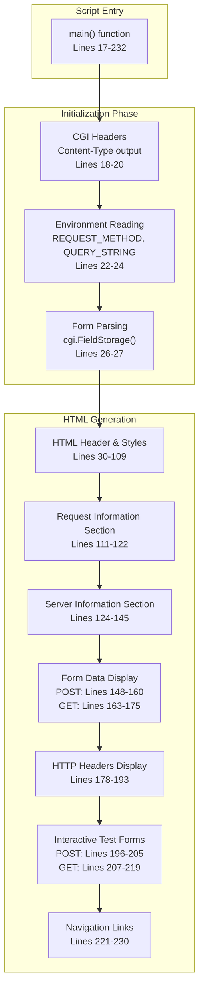
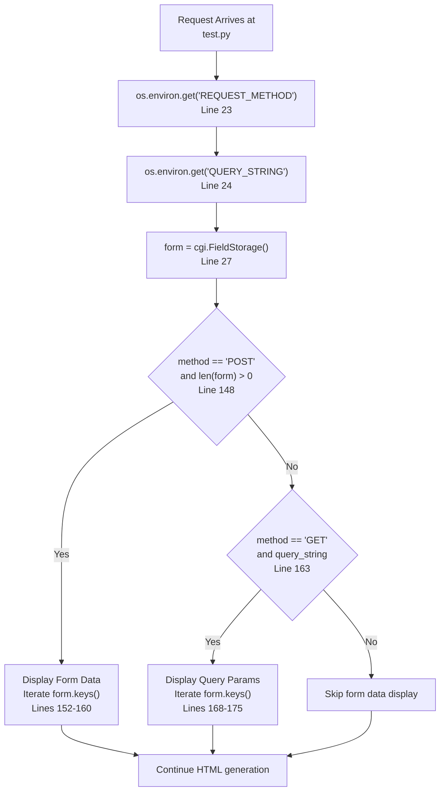
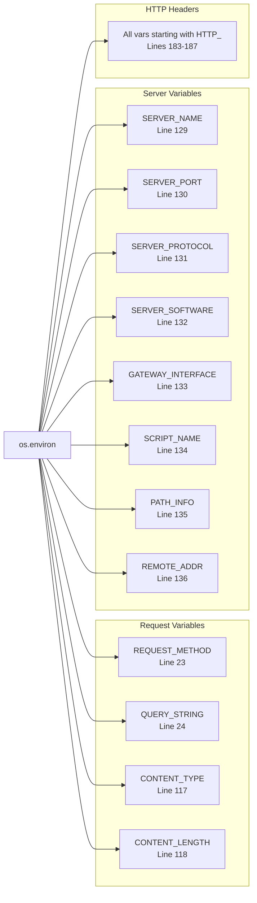
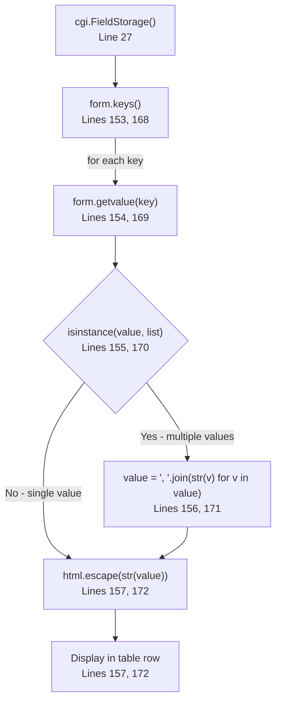
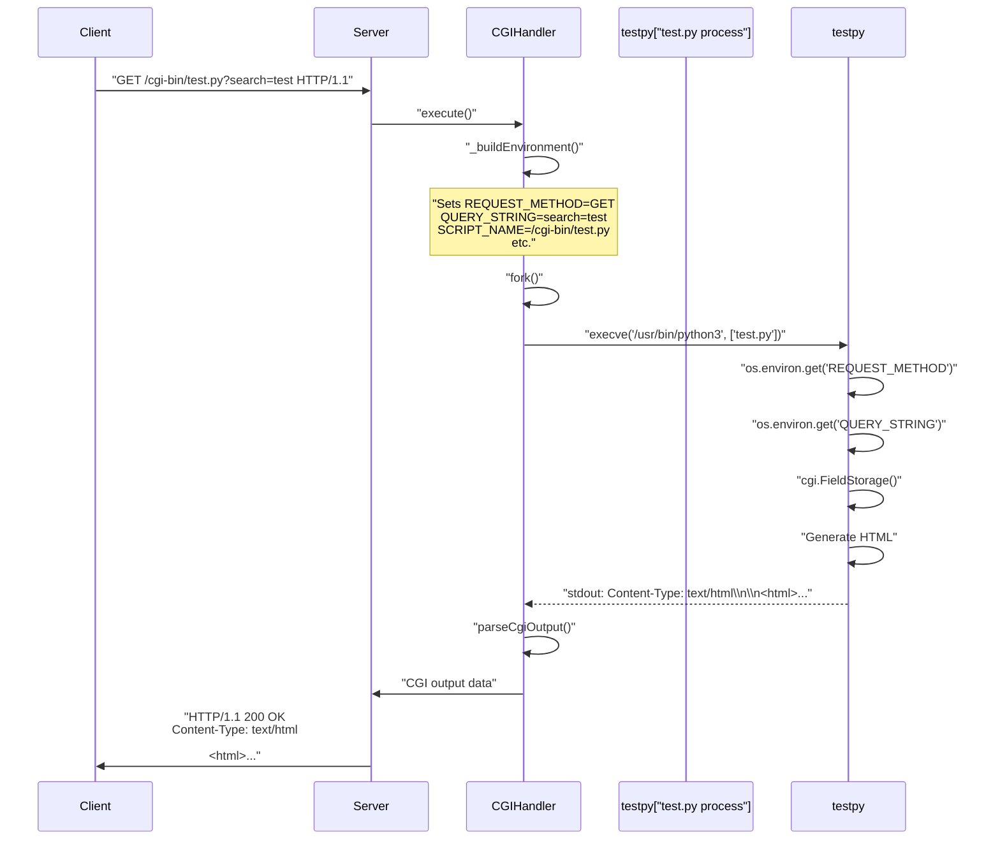

# test.py - CGI Protocol Tester

<details>
<summary>Relevant source files</summary>

The following files were used as context for generating this page:

- [cgi-bin/test.py](cgi-bin/test.py)

</details>


## Purpose and Scope

This page documents `test.py`, a comprehensive CGI demonstration script designed to test and validate CGI protocol implementation in webserv. The script provides interactive testing of GET and POST methods, displays CGI environment variables, and serves as a diagnostic tool for verifying CGI execution.

For information about the CGI execution engine that invokes this script, see [CGI Handler Implementation](5.1). For other CGI demonstration scripts, see [Example CGI Scripts](5.2).

**Sources:** [cgi-bin/test.py:1-10]()

---

## Overview

`test.py` is a Python CGI script that serves multiple purposes:

| Purpose | Description |
|---------|-------------|
| **Protocol Testing** | Validates GET and POST request handling |
| **Environment Inspection** | Displays all CGI environment variables |
| **Form Data Parsing** | Demonstrates `cgi.FieldStorage()` usage |
| **Interactive Testing** | Provides live forms for method testing |
| **Diagnostic Output** | Shows request headers and server information |

The script generates a fully styled HTML interface with interactive forms, making it ideal for both manual testing and debugging CGI implementation issues.

**Sources:** [cgi-bin/test.py:1-236]()

---

## Script Architecture

### Code Structure



**Diagram: Script execution flow through main function sections**

The script follows a linear execution pattern:
1. **CGI Protocol Compliance**: Outputs `Content-Type` header followed by blank line [cgi-bin/test.py:19-20]().
2. **Data Collection**: Reads environment variables and parses form data [cgi-bin/test.py:22-27]().
3. **HTML Generation**: Produces structured output with multiple information sections [cgi-bin/test.py:30-193]().
4. **Interactive Elements**: Renders forms for live testing [cgi-bin/test.py:196-219]().

**Sources:** [cgi-bin/test.py:17-236]()

---

## Request Processing Flow

### Method Detection and Handling



**Diagram: Request method detection and conditional form data display**

The script handles both GET and POST methods:

| Method | Detection | Data Source | Display Condition |
|--------|-----------|-------------|-------------------|
| **POST** | `REQUEST_METHOD` env var | Request body via `cgi.FieldStorage()` | Form has data: `len(form) > 0` |
| **GET** | `REQUEST_METHOD` env var | Query string via `cgi.FieldStorage()` | Query string exists: `query_string` is non-empty |

**Sources:** [cgi-bin/test.py:22-27](), [cgi-bin/test.py:148-175]()

---

## CGI Environment Variables

### Variables Displayed by Script



**Diagram: CGI environment variables accessed by test.py mapped to code locations**

The script accesses three categories of environment variables:

### Request-Specific Variables

```python
method = os.environ.get('REQUEST_METHOD', 'GET')           # Line 23
query_string = os.environ.get('QUERY_STRING', '')          # Line 24
content_type = os.environ.get("CONTENT_TYPE", "(not set)") # Line 117
content_length = os.environ.get("CONTENT_LENGTH", "(not set)") # Line 118
```

### Server Information Variables

The script defines a list of server variables to display:

```python
server_vars = [
    ('SERVER_NAME', 'Server Name'),
    ('SERVER_PORT', 'Server Port'),
    ('SERVER_PROTOCOL', 'Protocol'),
    ('SERVER_SOFTWARE', 'Server Software'),
    ('GATEWAY_INTERFACE', 'CGI Version'),
    ('SCRIPT_NAME', 'Script Name'),
    ('PATH_INFO', 'Path Info'),
    ('REMOTE_ADDR', 'Remote Address'),
]
```

These are iterated and displayed in a table format [cgi-bin/test.py:139-141]().

### HTTP Header Variables

All environment variables prefixed with `HTTP_` are extracted and displayed:

```python
http_vars = [(k, v) for k, v in sorted(os.environ.items()) if k.startswith('HTTP_')]
```

These represent HTTP headers sent by the client, transformed to CGI format (e.g., `HTTP_USER_AGENT` for `User-Agent` header) [cgi-bin/test.py:183-187]().

**Sources:** [cgi-bin/test.py:23-24](), [cgi-bin/test.py:117-118](), [cgi-bin/test.py:128-141](), [cgi-bin/test.py:183-189]()

---

## Form Data Parsing

### Python CGI Module Integration

The script uses Python's `cgi` module for form data parsing:

```python
import cgi  # Line 14

form = cgi.FieldStorage()  # Line 27
```

The `cgi.FieldStorage()` object automatically parses:
- **POST data**: Reads from stdin based on `CONTENT_TYPE` and `CONTENT_LENGTH`.
- **GET data**: Parses `QUERY_STRING` environment variable.

### Data Extraction Pattern



**Diagram: Form data extraction and sanitization process**

The script handles multi-value fields (e.g., checkboxes with same name) by detecting list values and joining them with commas [cgi-bin/test.py:155-156]().

### Security Considerations

All user-provided data is HTML-escaped before display using `html.escape()`:
- Prevents XSS attacks.
- Applied to form keys [cgi-bin/test.py:157, 172]().
- Applied to form values [cgi-bin/test.py:157, 172]().
- Applied to all environment variable displays [cgi-bin/test.py:115-118](), [cgi-bin/test.py:141]().

**Sources:** [cgi-bin/test.py:14](), [cgi-bin/test.py:27](), [cgi-bin/test.py:153-172]()

---

## Interactive Test Forms

### POST Form Structure

```mermaid
graph LR
    POSTForm["<form method='POST'<br/>action='/cgi-bin/test.py'><br/>Lines 199-204"]

    NameInput["<input type='text'<br/>name='name' required><br/>Line 200"]

    EmailInput["<input type='email'<br/>name='email'><br/>Line 201"]

    MessageText["<textarea name='message'<br/>rows='3'><br/>Line 202"]

    SubmitBtn["<button type='submit'><br/>Line 203"]

    POSTForm --> NameInput
    POSTForm --> EmailInput
    POSTForm --> MessageText
    POSTForm --> SubmitBtn
```



**Diagram: POST form elements and structure**

The POST form demonstrates:
- **Text input** with required validation (`name` field) [cgi-bin/test.py:200]().
- **Email input** with built-in browser validation (`email` field) [cgi-bin/test.py:201]().
- **Textarea** for multi-line input (`message` field) [cgi-bin/test.py:202]().
- **Submit button** that triggers POST request [cgi-bin/test.py:203]().

When submitted, the form data is sent in the request body and displayed in the "Form Data Received (POST)" section [cgi-bin/test.py:148-160]().

### GET Form Structure

```mermaid
graph LR
    GETForm["<form method='GET'<br/>action='/cgi-bin/test.py'><br/>Lines 209-218"]

    SearchInput["<input type='text'<br/>name='search'><br/>Line 210"]

    FilterSelect["<select name='filter'><br/>Lines 211-216"]

    Options["<option> elements:<br/>recent, popular,<br/>alphabetical"]

    SubmitBtn["<button type='submit'><br/>Line 217"]

    GETForm --> SearchInput
    GETForm --> FilterSelect
    FilterSelect --> Options
    GETForm --> SubmitBtn
```



**Diagram: GET form elements and structure**

The GET form demonstrates:
- **Text search input** (`search` field) [cgi-bin/test.py:210]().
- **Select dropdown** with multiple options (`filter` field) [cgi-bin/test.py:211-216]().
- **Submit button** that appends data to URL as query string [cgi-bin/test.py:217]().

When submitted, the form data is appended to the URL (e.g., `/cgi-bin/test.py?search=test&filter=recent`) and displayed in the "Query Parameters (GET)" section [cgi-bin/test.py:163-175]().

**Sources:** [cgi-bin/test.py:196-219]()

---

## HTML Response Generation

### Response Structure

The script generates a complete HTML document with several distinct sections:

| Section | Purpose | Lines |
|---------|---------|-------|
| **CGI Headers** | Content-Type declaration | 19-20 |
| **HTML Head** | Meta tags, title, embedded CSS | 30-104 |
| **Introduction Card** | Script description | 106-109 |
| **Request Info** | Method, query string, content headers | 111-122 |
| **Server Info** | CGI environment server variables | 124-145 |
| **POST Data** | Form data from POST requests (conditional) | 148-160 |
| **GET Data** | Query parameters from GET requests (conditional) | 163-175 |
| **HTTP Headers** | Client request headers | 178-193 |
| **POST Test Form** | Interactive POST testing | 196-205 |
| **GET Test Form** | Interactive GET testing | 207-219 |
| **Navigation** | Links to other CGI scripts | 221-230 |

### Styling Approach

The script uses embedded CSS [cgi-bin/test.py:36-103]() with:
- **Responsive design**: Max-width container, flexible layouts.
- **Card-based UI**: Each section in a white card with rounded corners.
- **Gradient background**: Purple gradient (`#667eea` to `#764ba2`).
- **Method badges**: Color-coded indicators for GET (green) and POST (blue).
- **Form styling**: Consistent input/button appearance with focus states.

### Dynamic Content

The script conditionally renders sections based on request state:

```python
# POST data display - only if POST with data
if method == 'POST' and len(form) > 0:  # Line 148
    # Render form data table

# GET data display - only if GET with query string
if method == 'GET' and query_string:  # Line 163
    # Render query parameters table
```

This ensures the interface remains clean and only shows relevant information.

**Sources:** [cgi-bin/test.py:18-20](), [cgi-bin/test.py:30-232]()

---

## Integration with CGIHandler

### Execution Context

When a request matches `/cgi-bin/test.py`, the webserv server's `CGIHandler` class invokes this script. The execution flow is:



**Diagram: Execution sequence from request to response delivery**

### Environment Setup by CGIHandler

The `CGIHandler` class prepares the execution environment by setting CGI-standard variables that `test.py` reads:

| Variable Category | Set by CGIHandler | Read by test.py |
|------------------|-------------------|-----------------|
| **Request Method** | `REQUEST_METHOD` | Line 23 |
| **Query Data** | `QUERY_STRING` | Line 24 |
| **Content Headers** | `CONTENT_TYPE`, `CONTENT_LENGTH` | Lines 117-118 |
| **Server Info** | `SERVER_NAME`, `SERVER_PORT`, etc. | Lines 128-141 |
| **Script Path** | `SCRIPT_NAME`, `PATH_INFO` | Lines 134-135 |
| **Client Info** | `REMOTE_ADDR` | Line 136 |
| **HTTP Headers** | `HTTP_*` variables | Lines 183-189 |

### Script Output Processing

`test.py` outputs to stdout:
1. **CGI header** [cgi-bin/test.py:19](): `Content-Type: text/html; charset=utf-8`
2. **Blank line** [cgi-bin/test.py:20](): Separates headers from body
3. **HTML body** [cgi-bin/test.py:30-232](): Complete document

The `CGIHandler` reads this output, parses the headers, and constructs an HTTP response.

**Sources:** [cgi-bin/test.py:18-20](), [cgi-bin/test.py:23-24](), [cgi-bin/test.py:117-141](), [cgi-bin/test.py:183-189]()

---

## Usage Examples

### Testing GET Requests

To test GET functionality:
1. Navigate to `http://localhost:8080/cgi-bin/test.py`.
2. The script displays current request information with no query parameters.
3. Use the "Test GET Form" section to submit a search query [cgi-bin/test.py:207-219]().
4. Observe the "Query Parameters (GET)" section appear with parsed data [cgi-bin/test.py:163-175]().

Example URL: `http://localhost:8080/cgi-bin/test.py?search=webserv&filter=recent`

### Testing POST Requests

To test POST functionality:
1. Navigate to `http://localhost:8080/cgi-bin/test.py`.
2. Fill in the "Test POST Form" with name, email, and message [cgi-bin/test.py:196-205]().
3. Submit the form.
4. Observe the "Form Data Received (POST)" section with a green success indicator [cgi-bin/test.py:148-160]().

The form data is sent in the request body, parsed by `cgi.FieldStorage()`, and displayed in the response.

### Debugging CGI Issues

Use `test.py` to diagnose CGI problems:
- **Environment variables**: Check if `CGIHandler` sets all required variables [cgi-bin/test.py:128-141]().
- **Header parsing**: Verify `Content-Type` and `Content-Length` are correct [cgi-bin/test.py:117-118]().
- **HTTP headers**: Confirm client headers are passed as `HTTP_*` variables [cgi-bin/test.py:183-189]().
- **Form parsing**: Validate that POST body and GET query strings are accessible [cgi-bin/test.py:148-175]().

**Sources:** [cgi-bin/test.py:1-236]()

---

## Navigation Integration

The script provides links to other CGI demonstration scripts [cgi-bin/test.py:221-230]():

```python
<a href="/">🏠 Home</a>
<a href="/cgi-bin/info.py">ℹ️ System Info</a>
<a href="/cgi-bin/env.py">🔧 Environment</a>
<a href="/cgi-bin/session.py">🍪 Session Demo</a>
<a href="/cgi-bin/upload.py">📤 File Upload</a>
```

| Link | Purpose | page |
|------|---------|-----------|
| `/cgi-bin/info.py` | System and Python environment information | [info.py](5.2.2) |
| `/cgi-bin/env.py` | Complete environment variable dump | [env.py](5.2.1) |
| `/cgi-bin/session.py` | Cookie-based session management demo | [session.py](5.2.3) |
| `/cgi-bin/upload.py` | File upload handling demonstration | [upload.py](5.2.5) |

This navigation structure allows users to explore all CGI capabilities provided by webserv.

**Sources:** [cgi-bin/test.py:221-230]()

---
