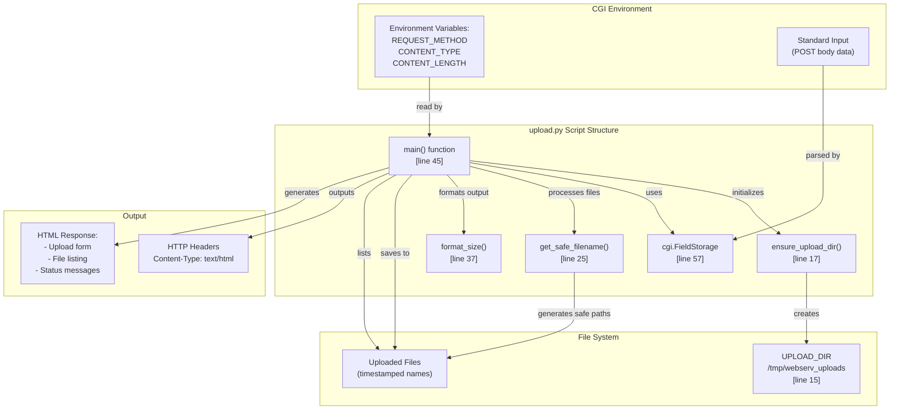
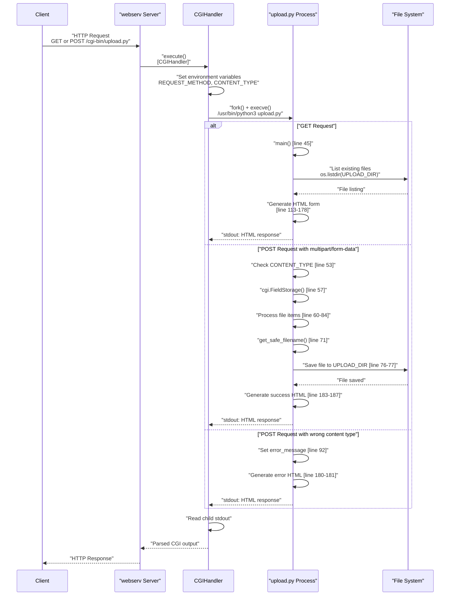
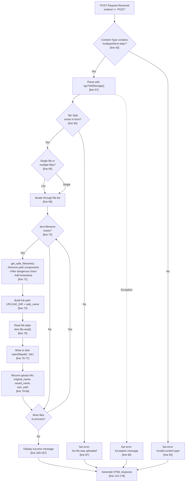
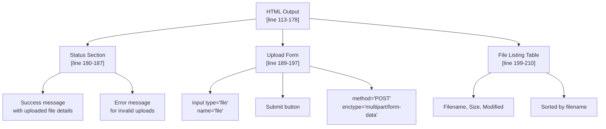
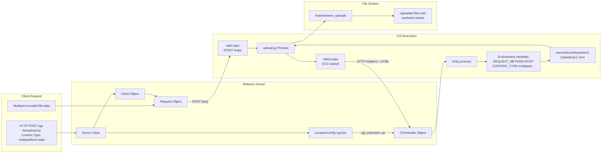
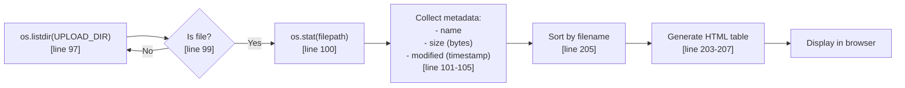

# upload.py - File Upload Handler

<details>
<summary>Relevant source files</summary>

The following files were used as context for generating this page:

- [cgi-bin/upload.py](cgi-bin/upload.py)

</details>


## Purpose and Scope

This document describes the `upload.py` CGI script, which provides file upload functionality for the webserv HTTP server. The script handles multipart form data submissions, sanitizes uploaded files, stores them securely, and provides a web interface for managing uploads.

For general CGI execution architecture, see [CGI Execution Architecture](). For information about CGI handler implementation details, see [CGI Handler Implementation](). For other CGI demonstration scripts, see [Example CGI Scripts]().

**Sources:** [cgi-bin/upload.py:1-6](), [cgi-bin/upload.py:17-23]()

---

## Overview

The `upload.py` script demonstrates practical file upload handling in a CGI environment. It accepts file uploads via HTTP POST requests with `multipart/form-data` encoding, processes the uploaded files, and stores them in a designated directory with sanitized filenames. The script also provides a complete web interface that displays:

- An upload form for selecting and submitting files.
- Success/error feedback for upload operations.
- A listing of previously uploaded files with metadata.
- Relevant CGI environment variables for debugging.

**Sources:** [cgi-bin/upload.py:3-6](), [cgi-bin/upload.py:45-53](), [cgi-bin/upload.py:113-178]()

---

## Script Architecture

The script follows a standard CGI pattern with specialized file handling capabilities:



**Diagram: upload.py Component Architecture**

The script uses Python's built-in `cgi` module to parse multipart form data and standard library functions for file system operations. All file operations are isolated to the `UPLOAD_DIR` constant for security.

**Sources:** [cgi-bin/upload.py:8-13](), [cgi-bin/upload.py:15](), [cgi-bin/upload.py:17-43](), [cgi-bin/upload.py:45-94]()

---

## Request Processing Flow

The script handles both GET and POST requests with different behaviors:



**Diagram: Request Processing Sequence**

The script differentiates between request methods using `os.environ.get('REQUEST_METHOD', 'GET')` at [cgi-bin/upload.py:48](). For POST requests, it validates the content type to ensure multipart encoding before attempting to parse the form data.

**Sources:** [cgi-bin/upload.py:48-93](), [cgi-bin/upload.py:109-111]()

---

## File Upload Workflow

The file upload processing involves several security and reliability steps:



**Diagram: File Upload Processing Logic**

The workflow implements several security measures during file processing at [cgi-bin/upload.py:25-35]():

| Security Feature | Implementation | Purpose |
|-----------------|----------------|---------|
| **Path Traversal Prevention** | `os.path.basename()` | Removes directory components from filename |
| **Character Filtering** | Whitelist of safe characters | Prevents shell injection and filesystem issues |
| **Collision Prevention** | Timestamp suffix | Ensures unique filenames |
| **Extension Preservation** | `os.path.splitext()` | Maintains file type information |

**Sources:** [cgi-bin/upload.py:52-93](), [cgi-bin/upload.py:25-35]()

---

## Key Components

### Upload Directory Management

```python
UPLOAD_DIR = '/tmp/webserv_uploads'

def ensure_upload_dir():
    """Create upload directory if it doesn't exist"""
```

The `ensure_upload_dir()` function at [cgi-bin/upload.py:17-23]() ensures the upload directory exists before any file operations. It uses a try-except block to silently handle permission errors, which is appropriate for CGI scripts that may run with limited privileges.

### Filename Sanitization

The `get_safe_filename()` function at [cgi-bin/upload.py:25-35]() implements a multi-step sanitization process:

| Step | Line | Description |
|------|------|-------------|
| 1. Path removal | 28 | `os.path.basename()` strips directory traversal attempts |
| 2. Character filtering | 30-31 | Whitelist-based character replacement |
| 3. Timestamp addition | 33-35 | Appends Unix timestamp to prevent collisions |

The function returns a safe filename in the format `{name}_{timestamp}{ext}`.

### File Size Formatting

The `format_size()` function at [cgi-bin/upload.py:37-43]() provides human-readable file size representations. It iteratively divides the byte count by 1024 until reaching an appropriate unit (B, KB, MB, GB).

### Form Processing

File upload handling occurs at [cgi-bin/upload.py:56-90]() using Python's `cgi.FieldStorage()` class. The script handles both single and multiple file uploads by checking if the form field is a list at [cgi-bin/upload.py:64]().

**Sources:** [cgi-bin/upload.py:17-23](), [cgi-bin/upload.py:25-35](), [cgi-bin/upload.py:37-43](), [cgi-bin/upload.py:56-90]()

---

## HTML Interface

The script generates a complete HTML interface with sections for status reporting, the upload form, and existing files.



**Diagram: HTML Response Structure**

The interface includes embedded CSS styles at [cgi-bin/upload.py:119-175]() for a modern, responsive design. The form at [cgi-bin/upload.py:192]() correctly specifies `enctype="multipart/form-data"`, which is required for file uploads.

**Sources:** [cgi-bin/upload.py:113-210](), [cgi-bin/upload.py:119-175](), [cgi-bin/upload.py:189-197]()

---

## Integration with Webserv

The script integrates with the webserv server through the CGI execution subsystem:



**Diagram: upload.py Integration with Webserv**

The integration flow follows these steps:

1. **Configuration**: The `LocationConfig` for `/cgi-bin` must define `.py` as a CGI extension.
2. **Handler Selection**: The `CGIHandler` is instantiated when the request matches a CGI extension.
3. **Environment Setup**: The `CGIHandler` sets required CGI environment variables per RFC 3875.
4. **Process Execution**: Python interpreter executes `upload.py` with stdin containing POST body data.
5. **Output Capture**: The handler captures stdout containing CGI headers and HTML body.

**Sources:** [cgi-bin/upload.py:1-2](), [cgi-bin/upload.py:48](), [cgi-bin/upload.py:53]()

---

## Environment Variable Usage

The script relies on standard CGI environment variables:

| Variable | Access Pattern | Purpose | Line Reference |
|----------|----------------|---------|----------------|
| `REQUEST_METHOD` | `os.environ.get('REQUEST_METHOD', 'GET')` | Determines GET vs POST handling | [48]() |
| `CONTENT_TYPE` | `os.environ.get('CONTENT_TYPE', '')` | Validates multipart encoding | [53]() |
| `CONTENT_LENGTH` | Implicit via `cgi.FieldStorage()` | Determines body size to read | [57]() |

**Sources:** [cgi-bin/upload.py:48](), [cgi-bin/upload.py:53](), [cgi-bin/upload.py:57]()

---

## Error Handling

The script implements defensive error handling at multiple levels:

| Error Scenario | Handling Strategy | Location |
|----------------|-------------------|----------|
| **Directory creation failure** | Silent failure with try-except | [cgi-bin/upload.py:20-23]() |
| **Wrong content type** | Display error message | [cgi-bin/upload.py:92]() |
| **No file uploaded** | Display error message | [cgi-bin/upload.py:87]() |
| **Form parsing exception** | Catch general Exception | [cgi-bin/upload.py:89-90]() |
| **Directory listing failure** | Silent failure with try-except | [cgi-bin/upload.py:106-107]() |

Error messages are HTML-escaped using `html.escape()` to prevent XSS attacks at [cgi-bin/upload.py:181]().

**Sources:** [cgi-bin/upload.py:20-23](), [cgi-bin/upload.py:86-92](), [cgi-bin/upload.py:106-107](), [cgi-bin/upload.py:180-181]()

---

## File Listing Display

After handling uploads, the script displays existing files from the upload directory:



**Diagram: File Listing Process**

The listing provides three pieces of metadata per file:
- **Filename**: Displayed using `html.escape()` for security.
- **Size**: Formatted using `format_size()` for readability.
- **Modified time**: Formatted as `YYYY-MM-DD HH:MM:SS`.

**Sources:** [cgi-bin/upload.py:94-107](), [cgi-bin/upload.py:202-209]()

---

## Security Considerations

The script implements several security measures:

### Input Sanitization

1. **Filename sanitization** at [cgi-bin/upload.py:25-35]() prevents:
   - Directory traversal attacks (`../../../etc/passwd`).
   - Shell metacharacters in filenames.
   - Filename collisions via timestamp suffixes.

2. **HTML escaping** at [cgi-bin/upload.py:181](), [cgi-bin/upload.py:186](), and [cgi-bin/upload.py:206]() prevents:
   - Cross-site scripting (XSS) attacks.
   - HTML injection in error messages and filenames.

### File System Isolation

The hardcoded `UPLOAD_DIR = '/tmp/webserv_uploads'` at [cgi-bin/upload.py:15]() ensures all file operations are confined to a single directory. No user input affects the directory path.

### Multipart Validation

The script validates `Content-Type` contains `multipart/form-data` at [cgi-bin/upload.py:55]() before attempting to parse form data, preventing malformed request processing.

### Error Message Safety

Exception messages are escaped before display at [cgi-bin/upload.py:90](), preventing information disclosure of internal paths or system details in a way that could enable attacks.

**Sources:** [cgi-bin/upload.py:15](), [cgi-bin/upload.py:25-35](), [cgi-bin/upload.py:55](), [cgi-bin/upload.py:181](), [cgi-bin/upload.py:186](), [cgi-bin/upload.py:206]()

---
