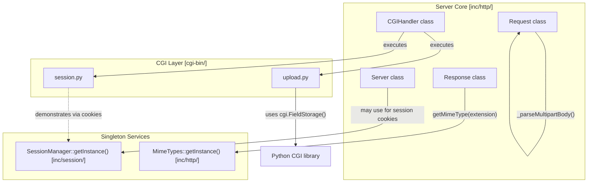
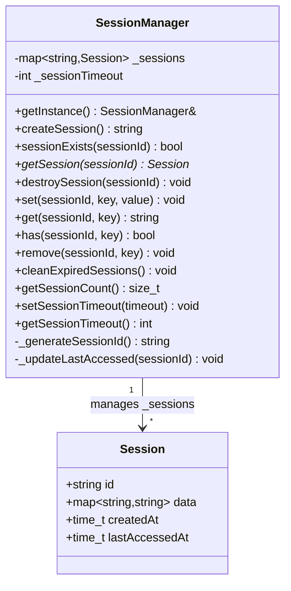
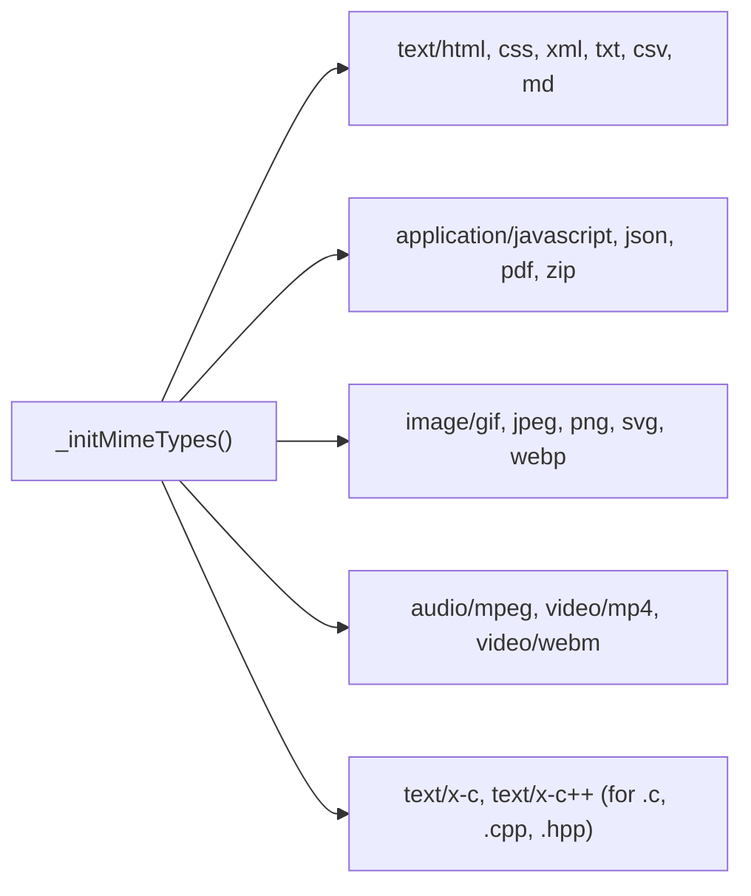
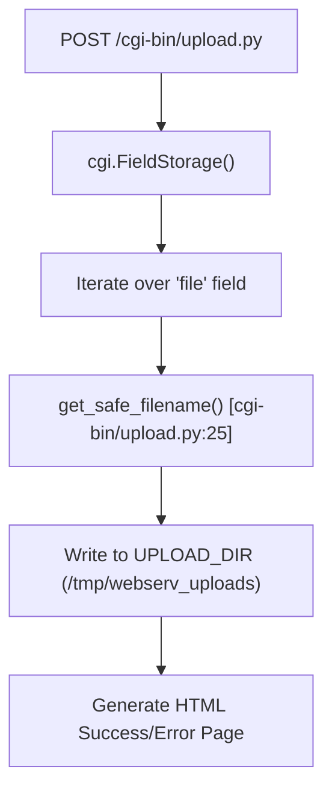
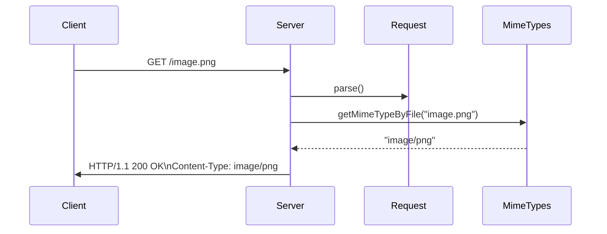

# Advanced Features

Relevant source files

The following files were used as context for generating this page:

- [inc/http/MimeTypes.hpp](inc/http/MimeTypes.hpp)
- [inc/session/SessionManager.hpp](inc/session/SessionManager.hpp)
- [src/http/MimeTypes.cpp](src/http/MimeTypes.cpp)
- [src/http/Request.cpp](src/http/Request.cpp)
- [src/session/SessionManager.cpp](src/session/SessionManager.cpp)

This page documents three specialized subsystems that enhance webserv's functionality beyond basic HTTP serving: the `SessionManager` singleton for server-side session state management, the `MimeTypes` singleton for content type classification and mapping, and the file upload processing pipeline for handling multipart form data. These components provide session persistence, proper content type headers, and secure file storage capabilities.

For core HTTP protocol implementation details, see [HTTP Protocol Implementation](#3.2). For CGI script execution architecture, see [CGI Execution Architecture](#3.4). For examples of session usage in CGI scripts, see [session.py - Session Management Demo](#5.2.3).

---

## Overview of Advanced Subsystems

The three subsystems documented here operate as independent services that other components consume:

| Subsystem | Pattern | Primary Consumers | Key Functionality |
|-----------|---------|-------------------|-------------------|
| `SessionManager` | Singleton | `Server`, CGI scripts | Session creation, data storage, expiration |
| `MimeTypes` | Singleton | `Response` class | Extension→MIME mapping, type classification |
| File Upload | CGI/Internal | `Request`, `upload.py` | Multipart parsing, PUT method, secure storage |

**Subsystem Interaction Diagram**

Sources: [inc/session/SessionManager.hpp:33-43](), [inc/http/MimeTypes.hpp:19-22](), [src/http/Request.cpp:151-154]()

---

## 6.1 Session Management

The `SessionManager` class implements server-side session storage using a singleton pattern. It maintains a map of session IDs to `Session` structs, each containing arbitrary key-value data and access timestamps.

### SessionManager Class Architecture

**Class Structure: SessionManager and Session**

Sources: [inc/session/SessionManager.hpp:24-31](), [inc/session/SessionManager.hpp:33-74](), [src/session/SessionManager.cpp:27-31]()

### Session Lifecycle

Sessions progress through a defined lifecycle managed by the `SessionManager`:

| Phase | Method | Description |
|-------|--------|-------------|
| **Creation** | `createSession()` | Generates random 32-char ID, initializes timestamps [src/session/SessionManager.cpp:89-109]() |
| **Access** | `getSession(sessionId)` | Retrieves session pointer, calls `_updateLastAccessed()` [src/session/SessionManager.cpp:125-132]() |
| **Data Storage** | `set(sessionId, key, value)` | Stores key-value pair in `Session::data` map [src/session/SessionManager.cpp:157-165]() |
| **Data Retrieval** | `get(sessionId, key)` | Returns value for key, or empty string if not found [src/session/SessionManager.cpp:167-179]() |
| **Expiration** | `cleanExpiredSessions()` | Removes sessions where `lastAccessedAt + _sessionTimeout < now` [src/session/SessionManager.cpp:203-221]() |

Sources: [inc/session/SessionManager.hpp:20-22](), [src/session/SessionManager.cpp:61-74]()

---

## 6.2 MIME Type Handling

The `MimeTypes` class provides a centralized registry for mapping file extensions to Content-Type headers. It pre-initializes common MIME types during construction in `_initMimeTypes()`.

### MIME Type Lookup and Classification

The class provides lookup methods and classification logic to distinguish between text and binary content:

| Method | Behavior |
|--------|----------|
| `getMimeType(extension)` | Performs lookup in `_mimeTypes` map; defaults to `application/octet-stream` [src/http/MimeTypes.cpp:17]() |
| `getMimeTypeByFile(filename)` | Extracts extension after last '.' and calls `getMimeType()` |
| `isTextType(mimeType)` | Returns true for `text/*`, `application/json`, `application/javascript`, etc. |
| `isBinaryType(mimeType)` | Returns logical negation of `isTextType()` |

**MIME Initialization Mapping**

Sources: [inc/http/MimeTypes.hpp:25-28](), [src/http/MimeTypes.cpp:57-190]()

---

## 6.3 File Upload Processing

Webserv handles file uploads through two primary mechanisms: internal multipart parsing in the `Request` class and external handling via the `upload.py` CGI script.

### Multipart Parsing in Request Class

The `Request` class contains logic to detect and parse `multipart/form-data` bodies during the `PARSE_BODY` state.

1. **Detection**: In `Request::parse()`, if the `Content-Type` header contains "multipart/form-data", it triggers `_parseMultipartBody()` [src/http/Request.cpp:151-154]().
2. **Boundary Extraction**: The parser identifies the boundary string from the `Content-Type` header.
3. **Field Extraction**: It iterates through parts, extracting filenames and binary content into the `_uploadedFiles` map.

Sources: [src/http/Request.cpp:143-157](), [inc/http/Request.hpp:123]()

### CGI-based Upload (upload.py)

The provided `upload.py` script demonstrates a complete file upload handler using Python's `cgi` module.

**Upload Processing Logic**

**Key Security Features in upload.py**:
- **Path Traversal Protection**: Uses `os.path.basename()` to strip directory paths from user-provided filenames [cgi-bin/upload.py:28]().
- **Filename Sanitization**: Replaces non-alphanumeric characters with underscores [cgi-bin/upload.py:30-31]().
- **Collision Avoidance**: Appends a Unix timestamp to the filename before the extension [cgi-bin/upload.py:33-35]().

Sources: [cgi-bin/upload.py:15-35](), [cgi-bin/upload.py:52-92]()

---

## Integration and Configuration

These features are activated and controlled via the configuration system and the HTTP request lifecycle.

### Configuration for Uploads
The `upload_store` directive in `LocationConfig` specifies where the server should store files uploaded via the `PUT` method or internal handlers.

### MIME and Response Generation
The `Response` class calls `MimeTypes::getInstance().getMimeTypeByFile()` to set the `Content-Type` header for static file delivery.

**Integration Sequence**

Sources: [inc/http/MimeTypes.hpp:26](), [src/http/Request.cpp:121-123](), [inc/session/SessionManager.hpp:20]()

---
