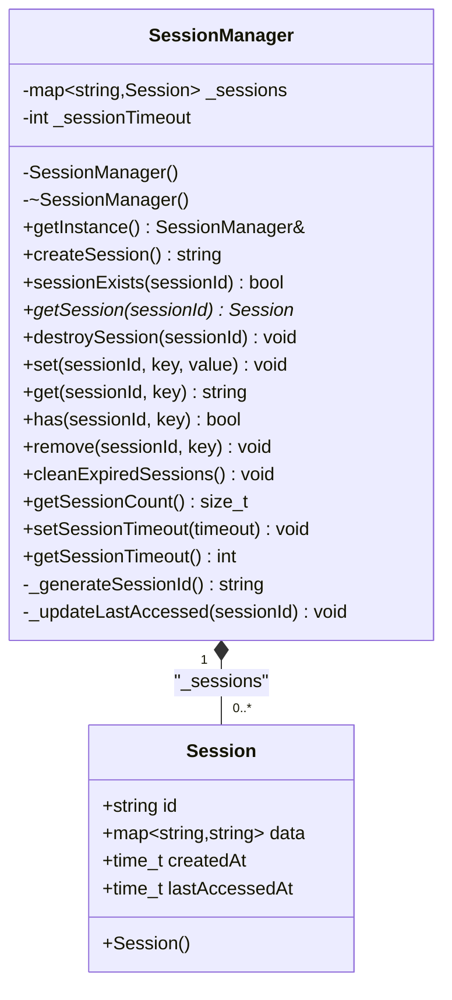
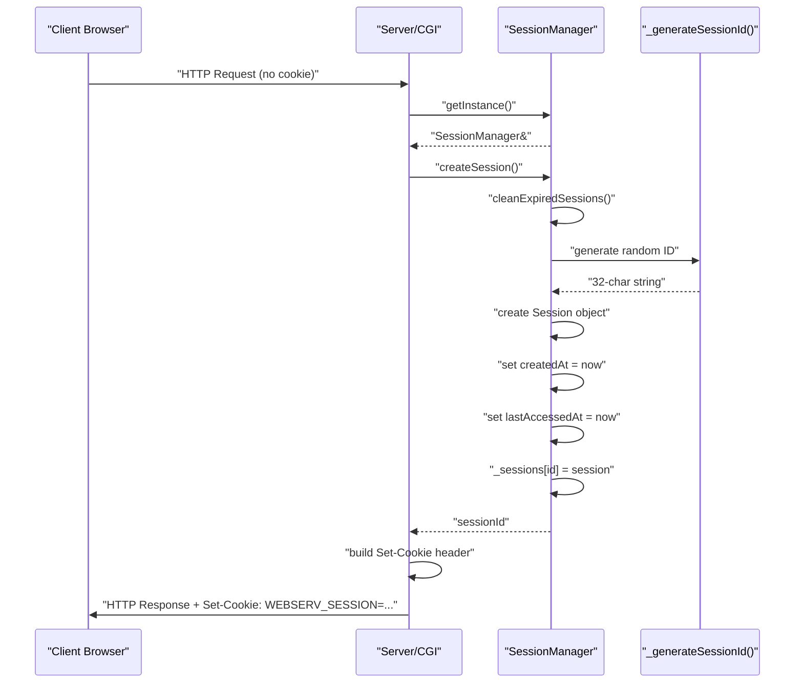
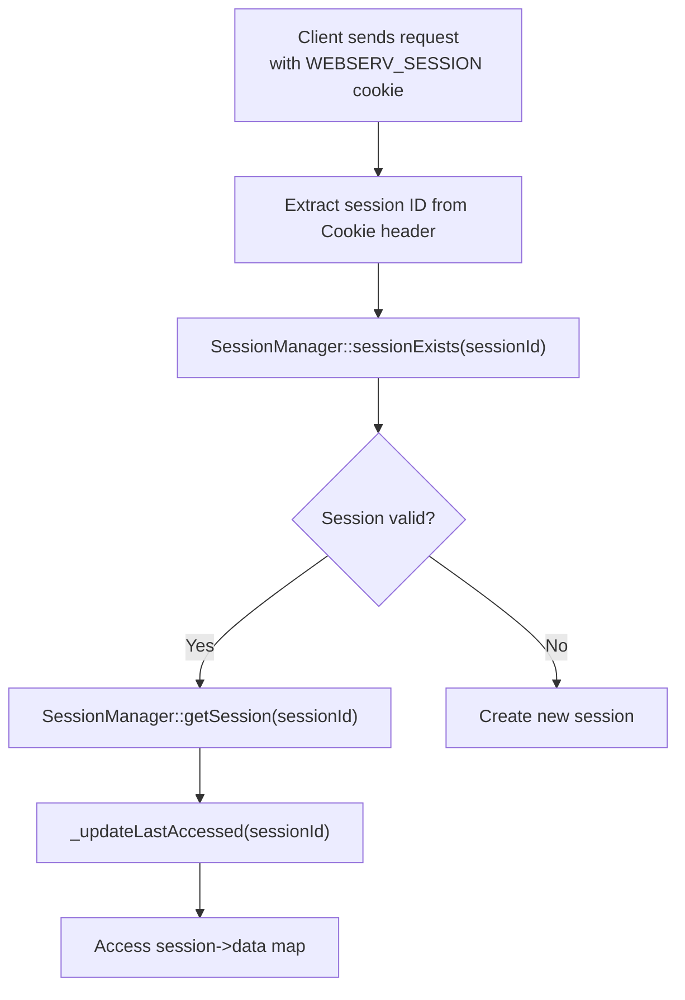
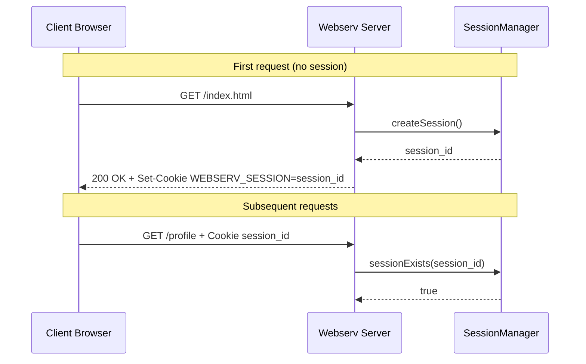
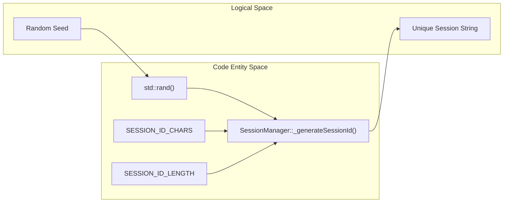

# Session Management

<details>
<summary>Relevant source files</summary>

The following files were used as context for generating this page:

- [inc/session/SessionManager.hpp](inc/session/SessionManager.hpp)
- [src/session/SessionManager.cpp](src/session/SessionManager.cpp)

</details>


## Purpose and Scope

This document explains the session management subsystem in webserv, which provides stateful HTTP interactions through cookie-based session identification. It covers the `SessionManager` singleton implementation in C++, session lifecycle operations (creation, storage, retrieval, expiration, destruction), cookie handling, and integration patterns with CGI scripts.

For information about CGI execution mechanics, see [CGI Execution Architecture](#3.4). For details on the session demonstration CGI script, see [session.py - Session Management Demo](#5.2.3).

---

## Overview

HTTP is a stateless protocol, meaning each request is independent and the server does not inherently maintain client state between requests. Session management addresses this by associating a unique identifier (session ID) with each client, typically transmitted via cookies. The server stores session data indexed by this ID, enabling features like user authentication, shopping carts, and personalized experiences.

The webserv session management system consists of:

| Component | Purpose |
|-----------|---------|
| `SessionManager` | C++ singleton that manages all active sessions in-memory |
| `Session` struct | Data structure holding session ID, key-value data, and timestamps |
| `WEBSERV_SESSION` cookie | HTTP cookie used for session identification |
| Session timeout | Automatic expiration mechanism (default 3600 seconds) |

**Sources:** [inc/session/SessionManager.hpp:20-31](), [inc/session/SessionManager.hpp:33-74]()

---

## SessionManager Singleton Architecture

The `SessionManager` class implements the singleton pattern to provide a single, globally accessible point of control for all session operations. This ensures consistency in session state across the entire server.

### Class Structure



**Sources:** [inc/session/SessionManager.hpp:24-31](), [inc/session/SessionManager.hpp:33-74]()

### Singleton Access Pattern

The `SessionManager` is accessed through the static `getInstance()` method, which returns a reference to the single instance:

```cpp
SessionManager& manager = SessionManager::getInstance();
std::string sessionId = manager.createSession();
```

The constructor, destructor, copy constructor, and assignment operator are private, preventing external instantiation or copying. The constructor initializes the random number generator using `std::srand(std::time(NULL))`.

**Sources:** [src/session/SessionManager.cpp:27-31](), [src/session/SessionManager.cpp:37-40](), [inc/session/SessionManager.hpp:64-67]()

### Data Structures

#### Session Struct

The `Session` struct encapsulates all data associated with a single session:

| Field | Type | Purpose |
|-------|------|---------|
| `id` | `std::string` | Unique 32-character session identifier |
| `data` | `std::map<std::string, std::string>` | Key-value storage for session attributes |
| `createdAt` | `time_t` | Unix timestamp of session creation |
| `lastAccessedAt` | `time_t` | Unix timestamp of most recent access |

**Sources:** [inc/session/SessionManager.hpp:24-31]()

#### Configuration Constants

Session behavior is controlled by compile-time constants:

| Constant | Value | Purpose |
|----------|-------|---------|
| `SESSION_COOKIE_NAME` | `"WEBSERV_SESSION"` | Name of the HTTP cookie containing session ID |
| `SESSION_TIMEOUT` | `3600` | Default session timeout in seconds (1 hour) |
| `SESSION_ID_LENGTH` | `32` | Length of generated session IDs |

**Sources:** [inc/session/SessionManager.hpp:20-22]()

---

## Session Lifecycle

### Session Creation Flow



The `createSession()` method first calls `cleanExpiredSessions()`, then generates a unique session ID using `_generateSessionId()`. It creates a `Session` object with current timestamps, stores it in the `_sessions` map, and returns the ID.

**Sources:** [src/session/SessionManager.cpp:89-109](), [src/session/SessionManager.cpp:61-74]()

### Session Retrieval and Access



When a request arrives with a `WEBSERV_SESSION` cookie, the server:

1. Extracts the session ID from the `Cookie` header.
2. Calls `sessionExists()` which verifies the ID is in `_sessions` and has not exceeded `_sessionTimeout`.
3. Calls `getSession()` which triggers `_updateLastAccessed()` to refresh the `lastAccessedAt` timestamp.
4. Session data is accessed via the `data` map.

**Sources:** [src/session/SessionManager.cpp:111-123](), [src/session/SessionManager.cpp:125-132](), [src/session/SessionManager.cpp:76-83]()

### Session Data Operations

The `SessionManager` provides convenience methods for manipulating session data:

| Method | Implementation Detail |
|--------|-----------------------|
| `set()` | Calls `getSession()` then sets `session->data[key] = value` |
| `get()` | Calls `getSession()` then returns `session->data[key]` or empty string |
| `has()` | Calls `getSession()` then checks `session->data.find(key)` |
| `remove()` | Calls `getSession()` then calls `session->data.erase(key)` |

**Sources:** [src/session/SessionManager.cpp:157-197]()

### Session Expiration and Cleanup

#### Automatic Timeout

Sessions expire after `_sessionTimeout` seconds of inactivity. This is checked in `sessionExists()` and `getSession()` by comparing `std::time(NULL)` against `lastAccessedAt`.

**Sources:** [src/session/SessionManager.cpp:118-120](), [src/session/SessionManager.cpp:141-143]()

#### Manual Cleanup

The `cleanExpiredSessions()` method iterates through the `_sessions` map and removes entries where the timeout has been exceeded. This is automatically called at the start of `createSession()`.

**Sources:** [src/session/SessionManager.cpp:203-221](), [src/session/SessionManager.cpp:92]()

#### Explicit Destruction

Sessions can be explicitly destroyed using `destroySession(sessionId)`, which removes the entry from the internal map.

**Sources:** [src/session/SessionManager.cpp:148-151]()

---

## Cookie-Based Session Identification

### Cookie Transmission Mechanism

The server uses the `WEBSERV_SESSION` cookie for tracking. The session ID is a 32-character string generated from `SESSION_ID_CHARS` (alphanumeric).



**Sources:** [src/session/SessionManager.cpp:18-21](), [src/session/SessionManager.cpp:61-74](), [inc/session/SessionManager.hpp:20-22]()

---

## Integration with CGI Scripts

CGI scripts interact with sessions by reading the `HTTP_COOKIE` environment variable and providing a `Set-Cookie` header in their output.

### Session ID Generation (Code Bridge)

The following diagram maps the logical ID generation to the specific code entities involved.



**Sources:** [src/session/SessionManager.cpp:18-21](), [src/session/SessionManager.cpp:61-74](), [inc/session/SessionManager.hpp:22]()

### CGI Environment Interaction

1.  **Input**: The server populates `HTTP_COOKIE` with the value of the `Cookie` header from the request.
2.  **Processing**: The CGI script parses this string to find `WEBSERV_SESSION`.
3.  **Output**: If a session is created or destroyed, the CGI script outputs a `Set-Cookie` header (e.g., `Set-Cookie: WEBSERV_SESSION=...; Path=/`).

**Sources:** [inc/session/SessionManager.hpp:20](), [src/session/SessionManager.cpp:89-109]()

---

## Summary of Key Functions

| Function | File | Description |
|----------|------|-------------|
| `getInstance()` | [src/session/SessionManager.cpp:27-31]() | Returns the static singleton instance. |
| `createSession()` | [src/session/SessionManager.cpp:89-109]() | Generates ID, cleans expired, and stores new session. |
| `sessionExists()` | [src/session/SessionManager.cpp:111-123]() | Validates ID existence and timeout status. |
| `getSession()` | [src/session/SessionManager.cpp:125-132]() | Retrieves session and updates `lastAccessedAt`. |
| `cleanExpiredSessions()` | [src/session/SessionManager.cpp:203-221]() | Iterates and erases sessions past `_sessionTimeout`. |
| `_generateSessionId()` | [src/session/SessionManager.cpp:61-74]() | Internal helper for random alphanumeric ID generation. |

**Sources:** [src/session/SessionManager.cpp:1-221]()

---
