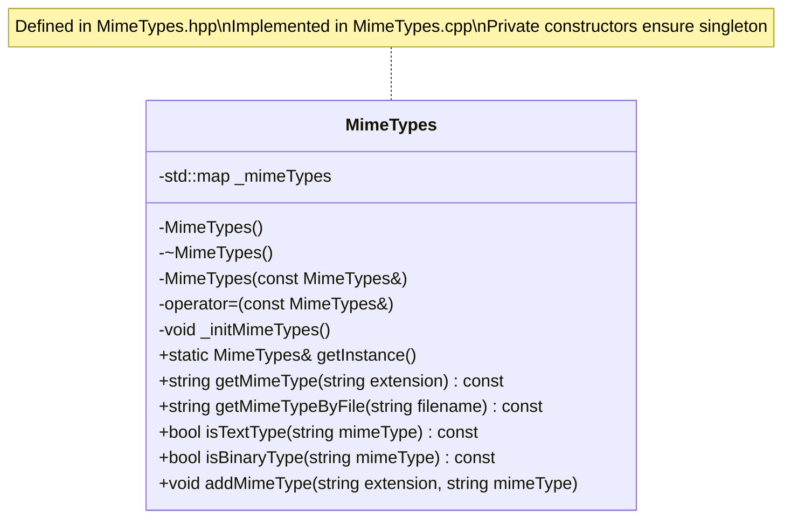
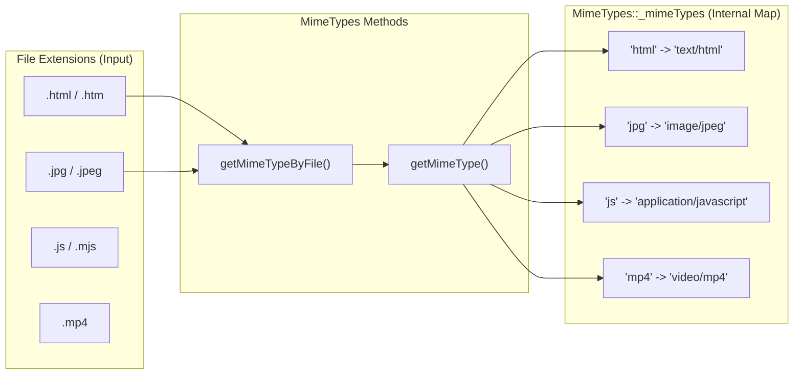
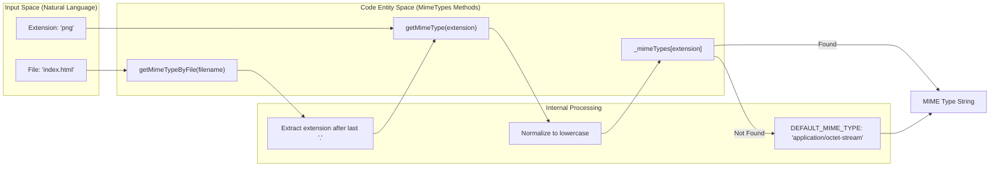
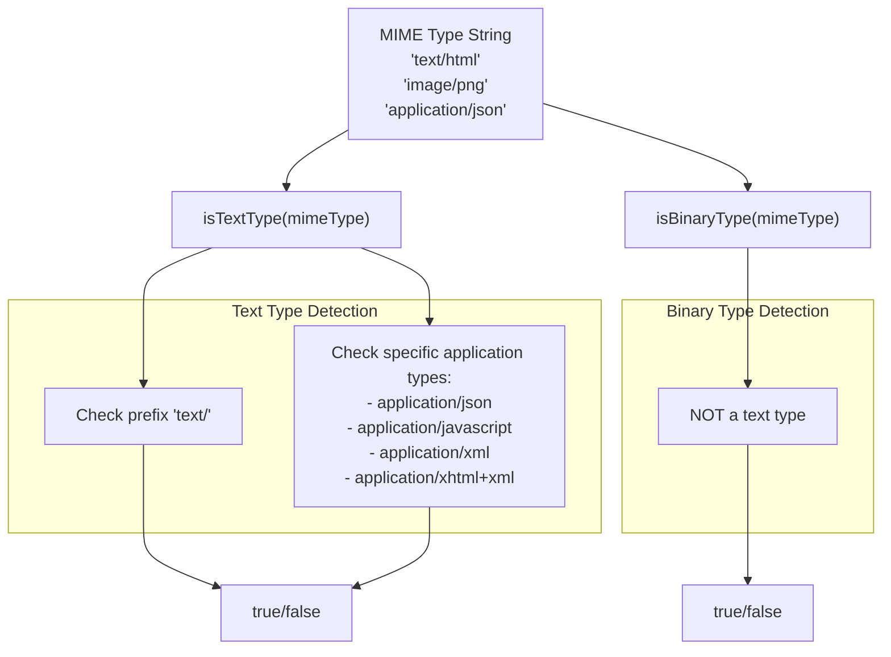
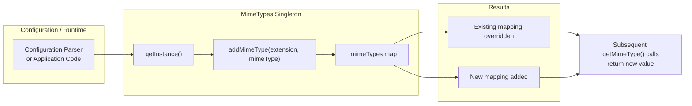

# MIME Type Handling

Relevant source files

The following files were used as context for generating this page:

- [inc/http/MimeTypes.hpp](inc/http/MimeTypes.hpp)
- [src/http/MimeTypes.cpp](src/http/MimeTypes.cpp)

## Purpose and Scope

This page documents the `MimeTypes` singleton class, which provides content-type classification and mapping for HTTP responses. The `MimeTypes` system maps file extensions to appropriate MIME (Multipurpose Internet Mail Extensions) types for the `Content-Type` HTTP header, ensuring clients receive correct metadata about file formats.

The class handles a comprehensive database of mappings including text, images, audio, video, and application-specific formats. It also provides utility methods to classify types as text or binary, which influences how the server processes body data.

**Sources:** [inc/http/MimeTypes.hpp:19-42](), [src/http/MimeTypes.cpp:57-190]()

---

## Singleton Architecture

The `MimeTypes` class implements the singleton pattern to provide a single, globally accessible instance throughout the webserv application. This design ensures consistent MIME type mappings across all requests and responses without redundant initialization.

**Singleton Implementation Details:**

| Aspect | Implementation |
|--------|---------------|
| **Access Method** | `getInstance()` returns a static reference to the local instance [src/http/MimeTypes.cpp:23-27]() |
| **Constructor** | Private, calls `_initMimeTypes()` to populate the map [src/http/MimeTypes.cpp:33-36]() |
| **Copy Control** | Copy constructor and assignment operator are private and disabled [src/http/MimeTypes.cpp:42-51]() |
| **Initialization** | Lazy initialization occurs on the first call to `getInstance()` |

**Sources:** [inc/http/MimeTypes.hpp:19-42](), [src/http/MimeTypes.cpp:23-51]()

---

## MIME Type Database Structure

The `MimeTypes` class maintains an internal `std::map<std::string, std::string>` [inc/http/MimeTypes.hpp:39]() that maps file extensions (without the leading dot) to their corresponding MIME type strings. This database is initialized via the private `_initMimeTypes()` method [src/http/MimeTypes.cpp:57]().

### Extension to Code Entity Mapping

The following diagram illustrates how specific file extensions in the "Natural Language/File Space" map to internal `_mimeTypes` entries.

### Categorized Mappings

The initialization method `_initMimeTypes()` populates the map with several categories of files:

| Category | Examples (Extension → MIME Type) | Source Range |
|:---|:---|:---|
| **Text** | `html` → `text/html`, `css` → `text/css`, `txt` → `text/plain` | [src/http/MimeTypes.cpp:60-75]() |
| **Images** | `png` → `image/png`, `jpg` → `image/jpeg`, `webp` → `image/webp` | [src/http/MimeTypes.cpp:92-104]() |
| **Audio/Video** | `mp3` → `audio/mpeg`, `mp4` → `video/mp4`, `webm` → `video/webm` | [src/http/MimeTypes.cpp:107-134]() |
| **Archives** | `zip` → `application/zip`, `tar` → `application/x-tar`, `gz` → `application/gzip` | [src/http/MimeTypes.cpp:143-152]() |
| **Documents** | `pdf` → `application/pdf`, `docx` → `application/vnd.openxmlformats-officedocument.wordprocessingml.document` | [src/http/MimeTypes.cpp:154-164]() |
| **Binary/Executables** | `bin`, `exe`, `dll`, `so`, `dmg` → `application/octet-stream` | [src/http/MimeTypes.cpp:167-173]() |
| **Source Code** | `c`, `cpp`, `h`, `hpp` → `text/x-c` or `text/x-c++` | [src/http/MimeTypes.cpp:184-190]() |

**Sources:** [inc/http/MimeTypes.hpp:39-41](), [src/http/MimeTypes.cpp:57-190]()

---

## Type Lookup Process

The `MimeTypes` class provides multiple methods for determining the appropriate MIME type for a given file or extension. The lookup process is case-insensitive and returns a default type if no match is found.

### Lookup Methods

**Method Signatures:**

- **`std::string getMimeType(const std::string& extension) const`**
  Performs direct lookup with the provided extension string. Extension should not include the leading dot [inc/http/MimeTypes.hpp:25]().

- **`std::string getMimeTypeByFile(const std::string& filename) const`**
  Extracts the extension from a filename (everything after the last `.`) and calls `getMimeType()` [inc/http/MimeTypes.hpp:26]().

**Default Fallback:** When no mapping exists for an extension, the system returns `application/octet-stream`, the standard MIME type for arbitrary binary data [src/http/MimeTypes.cpp:17]().

**Sources:** [inc/http/MimeTypes.hpp:24-26](), [src/http/MimeTypes.cpp:17]()

---

## Content Type Classification

The `MimeTypes` class provides classification methods to distinguish between text-based and binary content types. This distinction is important for determining transfer encoding, buffer handling, and client-side interpretation.

### Classification Methods

**Method Behavior:**

| Method | Returns `true` for | Returns `false` for |
|--------|-------------------|---------------------|
| `isTextType()` | MIME types starting with `text/`, plus specific application types like `application/json`, `application/javascript`, `application/xml` | Binary types: images, videos, audio, archives |
| `isBinaryType()` | Image, video, audio, and most application types | Text-based MIME types |

**Use Cases:**

- **Response Building:** Determine whether to apply text encoding transformations.
- **Content-Length Calculation:** Binary content requires precise byte counting.
- **CGI Output Parsing:** Text CGI output may need character encoding handling.
- **File Serving:** Inform buffering strategies for static file responses.

**Sources:** [inc/http/MimeTypes.hpp:27-28]()

---

## Custom Type Registration

The `MimeTypes` class supports runtime registration of custom MIME type mappings through the `addMimeType()` method. This allows the webserv configuration or application code to define additional or override existing mappings.

### Custom Type Registration Flow

**Method Signature:**

- **`void addMimeType(const std::string& extension, const std::string& mimeType)`**
  Adds or updates a mapping in the internal `_mimeTypes` map. If the extension already exists, its value is replaced [inc/http/MimeTypes.hpp:31]().

**Use Cases:**

| Scenario | Example |
|----------|---------|
| **Custom Application Types** | Map `.config` to `application/x-config` |
| **Proprietary Formats** | Map `.dat` to `application/x-custom-format` |
| **Override Defaults** | Change `.txt` from `text/plain` to `text/plain; charset=utf-8` |
| **New Standards** | Support emerging MIME types not in initial database |

**Thread Safety Note:** While C++11 guarantees thread-safe singleton initialization, the `addMimeType()` method itself is not protected by mutex. In the webserv architecture, custom types should be registered during initialization before the server starts accepting connections to avoid race conditions.

**Sources:** [inc/http/MimeTypes.hpp:31]()

---

## Implementation Summary

The `MimeTypes` singleton provides essential HTTP protocol support through a centralized MIME type database. Key characteristics of the implementation:

| Aspect | Details |
|--------|---------|
| **Design Pattern** | Singleton with lazy initialization |
| **Storage** | `std::map<std::string, std::string>` for extension → type mapping [inc/http/MimeTypes.hpp:39]() |
| **Lookup Complexity** | O(log n) for map lookup operations |
| **Default Behavior** | Returns `application/octet-stream` for unknown extensions [src/http/MimeTypes.cpp:17]() |
| **Extensibility** | Supports custom type registration via `addMimeType()` [inc/http/MimeTypes.hpp:31]() |
| **Header File** | [inc/http/MimeTypes.hpp]() |
| **Source File** | [src/http/MimeTypes.cpp]() |

The singleton pattern ensures that all components of the webserv system share a consistent view of MIME type mappings, eliminating redundant initialization and memory overhead while providing a clean interface for content-type determination.

**Sources:** [inc/http/MimeTypes.hpp:1-44](), [src/http/MimeTypes.cpp:1-190]()

---
