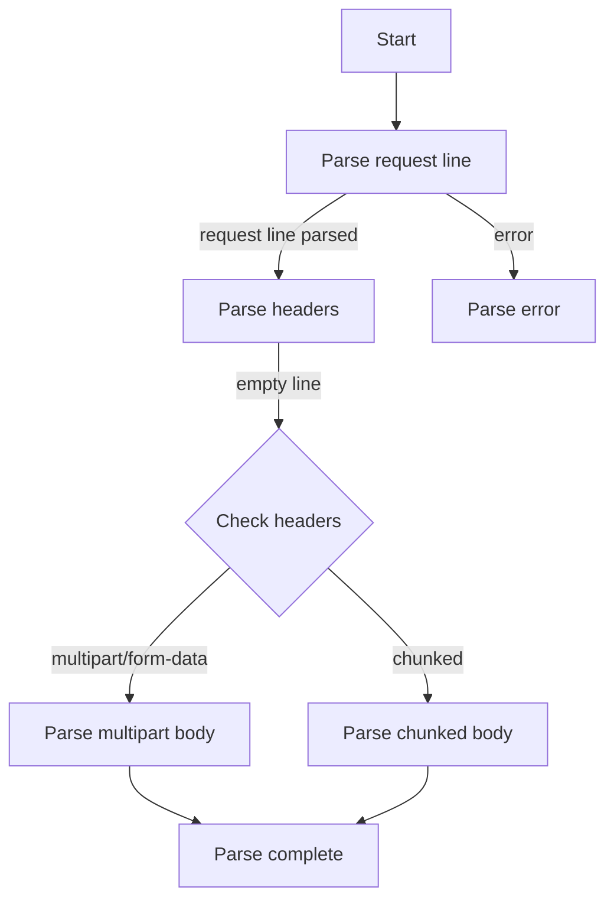
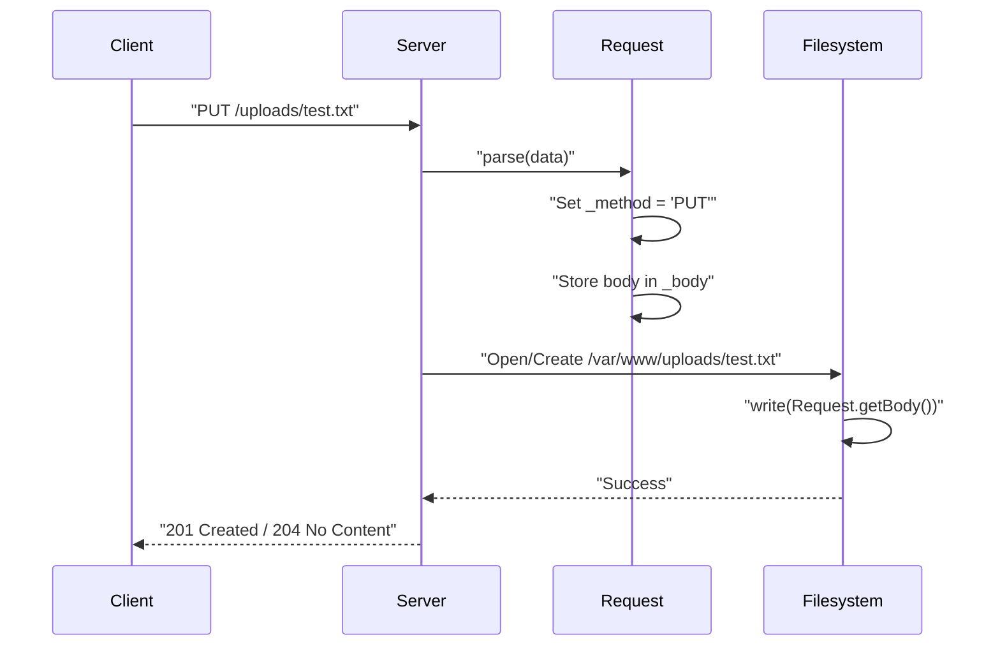
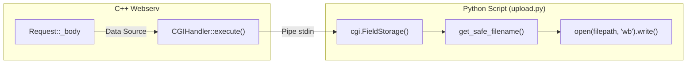

# File Upload Processing

<details>
<summary>Relevant source files</summary>

The following files were used as context for generating this page:

- [cgi-bin/upload.py](cgi-bin/upload.py)
- [inc/http/Request.hpp](inc/http/Request.hpp)
- [src/http/Request.cpp](src/http/Request.cpp)
- [www/put_test/testfile.txt](www/put_test/testfile.txt)
- [www/upload/test_listing.txt](www/upload/test_listing.txt)

</details>


## Purpose and Scope

This document describes how webserv handles HTTP file uploads through multipart form data processing and the `PUT` method. It covers the parsing of `multipart/form-data` requests in the `Request` class, the storage logic for file uploads, and the implementation of the `upload.py` CGI script. For information about CGI script execution mechanics, see [CGI Handler Implementation]().

---

## Upload Data Structures

The webserv system defines a dedicated structure for representing uploaded files within the HTTP request processing layer, specifically for multipart form data.

### UploadedFile Structure

The `UploadedFile` struct encapsulates all metadata and content for a single uploaded file parsed from a multipart body:

```cpp
struct UploadedFile {
    std::string name;          // Form field name (from Content-Disposition)
    std::string filename;      // Original client filename
    std::string contentType;   // MIME type of the part
    std::string data;          // Binary file contents
};
```

This structure is populated during multipart form data parsing and stored in the `Request` object's `_uploadedFiles` vector [inc/http/Request.hpp:101]().

**Sources:** [inc/http/Request.hpp:31-36](), [inc/http/Request.hpp:101]()

---

## Multipart Form Data Parsing

The `Request` class implements a state-machine based parser that handles `multipart/form-data` incrementally.

### Request Parsing State Machine

The parsing process follows the `ParseState` enum [inc/http/Request.hpp:22-29]().



### Implementation Details

1.  **Header Detection**: During the `PARSE_HEADERS` state, the `Request` class checks the `Content-Type` header [src/http/Request.cpp:128-133]().
2.  **Body Processing**: If the type is multipart, the server continues reading the body until `_bodyBytesReceived` matches `_contentLength` [src/http/Request.cpp:143-150]().
3.  **Multipart Extraction**: Once the full body is received, `_parseMultipartBody()` is called [src/http/Request.cpp:153](). This method:
    *   Extracts the boundary string from the `Content-Type` header [inc/http/Request.hpp:120]().
    *   Splits the `_body` into segments based on the boundary.
    *   Parses sub-headers for each segment (e.g., `Content-Disposition`) to extract the `filename`.
    *   Populates the `UploadedFile` structs and pushes them into `_uploadedFiles` [inc/http/Request.hpp:101]().

**Sources:** [src/http/Request.cpp:91-174](), [inc/http/Request.hpp:22-29](), [inc/http/Request.hpp:120](), [inc/http/Request.hpp:101]()

---

## PUT Method File Storage

The server supports file uploads via the `PUT` method, which differs from multipart POST by treating the entire request body as the file content.

### PUT Data Flow



In a `PUT` request, the URI indicates the target destination on the server. The server maps this URI to a physical path using the `root` or `alias` directives in the `LocationConfig`.

**Sources:** [inc/http/Request.hpp:54](), [inc/http/Request.hpp:67](), [www/put_test/testfile.txt:1]()

---

## CGI-Based Upload Implementation

The `upload.py` script serves as a reference implementation for handling multipart uploads via CGI.

### Script Logic and Safety

The script performs several security and organizational tasks:

1.  **Directory Management**: It ensures the target `UPLOAD_DIR` (`/tmp/webserv_uploads`) exists [cgi-bin/upload.py:15-23]().
2.  **Safe Filenaming**: The `get_safe_filename()` function prevents directory traversal and name collisions [cgi-bin/upload.py:25-35]().
    *   Uses `os.path.basename()` to strip path components [cgi-bin/upload.py:28]().
    *   Filters characters against a whitelist [cgi-bin/upload.py:30-31]().
    *   Appends a Unix timestamp to ensure uniqueness [cgi-bin/upload.py:33-35]().
3.  **Parsing**: It uses the Python `cgi.FieldStorage` class to parse the `multipart/form-data` stream provided by the server [cgi-bin/upload.py:57]().

### Upload Execution Code Entity Mapping



**Sources:** [cgi-bin/upload.py:15-35](), [cgi-bin/upload.py:52-85]()

---

## Configuration for Uploads

Upload behavior is controlled via `webserv.conf` directives within `location` blocks.

### Key Directives

| Directive | Description | Implementation Entity |
|-----------|-------------|-----------------------|
| `upload_store` | Defines the directory where uploaded files are saved. | `LocationConfig` |
| `client_max_body_size` | Limits the size of the upload to prevent disk exhaustion. | `LocationConfig` |
| `methods` | Must include `POST` or `PUT` to allow uploads. | `LocationConfig` |

### Example Configuration
```conf
location /upload {
    methods POST;
    cgi .py /usr/bin/python3;
    upload_store /tmp/webserv_uploads;
    client_max_body_size 100M;
}
```

**Sources:** [cgi-bin/upload.py:192-195](), [www/upload/test_listing.txt:1]()

---

## Security Considerations

1.  **Filename Sanitization**: The server and CGI scripts must never trust the `filename` parameter provided in the `Content-Disposition` header. `upload.py` demonstrates this by stripping paths and using a whitelist [cgi-bin/upload.py:25-35]().
2.  **Size Limits**: The `Request` class tracks `_bodyBytesReceived` and compares it against `_contentLength` [src/http/Request.cpp:144-150](). If a `client_max_body_size` is configured, the server should terminate the connection if the limit is exceeded.
3.  **Permissions**: The `upload_store` directory must be writable by the user running the `webserv` process or the CGI script. `upload.py` attempts to create the directory if it is missing [cgi-bin/upload.py:19-23]().

**Sources:** [cgi-bin/upload.py:25-35](), [src/http/Request.cpp:143-157]()

---
