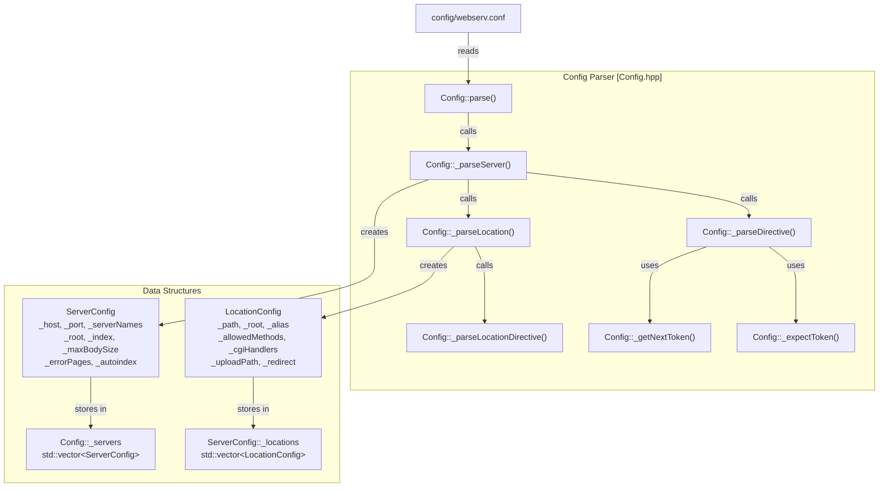
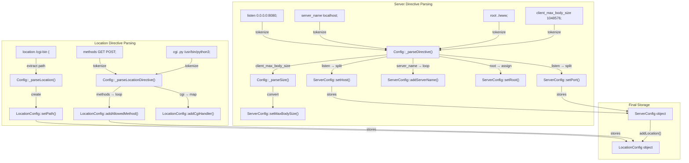

# Configuration Reference

Relevant source files

The following files were used as context for generating this page:

- [config/webserv.conf](config/webserv.conf)
- [inc/config/Config.hpp](inc/config/Config.hpp)
- [inc/config/LocationConfig.hpp](inc/config/LocationConfig.hpp)
- [inc/config/ServerConfig.hpp](inc/config/ServerConfig.hpp)
- [src/config/Config.cpp](src/config/Config.cpp)

## Purpose and Scope

Complete reference for `webserv.conf` syntax covering all directives, contexts, defaults, and validation rules. This page documents the configuration file format parsed by `Config::parse()` and stored in `ServerConfig` and `LocationConfig` objects.

Related pages: [Configuration System (3.3)]() for architecture details, [Configuration Parser (4.5)]() for `Config` class API, [Server Configuration (4.6)]() for `ServerConfig` API, [Location Configuration (4.7)]() for `LocationConfig` API.

For details on server-level settings, see [Server Block Directives](#7.1). For path-specific overrides, see [Location Block Directives](#7.2).

**Sources:** [config/webserv.conf:1-220](), [inc/config/Config.hpp:32-70]()

---

## Configuration File Structure

The `webserv.conf` file uses block-based syntax with two contexts: `server` blocks (virtual hosts) and `location` blocks (path-specific rules). Directives end with semicolons; blocks use curly braces.

### Basic Syntax Rules

| Element | Syntax | Example |
|---------|--------|---------|
| Comments | `# comment text` | `# Main server configuration` |
| Directive | `directive value;` | `root ./www;` |
| Multi-value directive | `directive value1 value2;` | `server_name localhost example.com;` |
| Server block | `server { directives... }` | `server { listen 0.0.0.0:8080; }` |
| Location block | `location path { directives... }` | `location /api { methods GET POST; }` |

### Parsing and Storage Architecture

The following diagram maps the configuration file structure to the internal C++ classes and parsing methods.

Title: Configuration Parsing and Storage Mapping

**Sources:** [inc/config/Config.hpp:32-68](), [inc/config/ServerConfig.hpp:21-67](), [inc/config/LocationConfig.hpp:21-77](), [src/config/Config.cpp:51-132]()

---

## Server Block Directives

Server blocks define virtual hosts. Multiple server blocks can listen on the same port but serve different content based on the `server_name` directive (virtual hosting).

### Server Context Directives Reference

| Directive | Syntax | Default | Description |
|-----------|--------|---------|-------------|
| `listen` | `listen <host>:<port>;` | Required | Binds the server to a specific IP and port. |
| `server_name` | `server_name <name>...;` | Empty | Hostnames for virtual hosting. |
| `root` | `root <path>;` | `./www` | Document root directory. |
| `index` | `index <file>...;` | `index.html` | Default files to serve for directories. |
| `client_max_body_size` | `client_max_body_size <size>;` | 1048576 | Max allowed request body size. |
| `autoindex` | `autoindex on\|off;` | `off` | Enable directory listing. |
| `error_page` | `error_page <code>... <uri>;` | None | Custom error pages for HTTP codes. |

For details on validation and default values, see [Server Block Directives (#7.1)]().

**Sources:** [config/webserv.conf:18-35](), [inc/config/ServerConfig.hpp:28-48](), [src/config/Config.cpp:134-203]()

---

## Location Block Directives

Location blocks define path-specific behavior. They support prefix matching and can override server-level settings or provide unique functionality like CGI and redirection.

### Location Context Directives Reference

| Directive | Syntax | Default | Description |
|-----------|--------|---------|-------------|
| `methods` | `methods <method>...;` | All | Allowed HTTP methods (GET, POST, etc). |
| `alias` | `alias <path>;` | None | Replaces location prefix with a path. |
| `upload_store` | `upload_store <path>;` | None | Path for file uploads. |
| `cgi` | `cgi <ext> <handler>;` | None | Maps extension to CGI interpreter. |
| `redirect` | `redirect <code> <uri>;` | None | HTTP redirection. |

For details on how these override server settings, see [Location Block Directives (#7.2)]().

**Sources:** [config/webserv.conf:38-134](), [inc/config/LocationConfig.hpp:28-62](), [src/config/Config.cpp:205-238]()

---

## Directive Parsing Flow

The following diagram illustrates how raw configuration tokens are transformed into internal object states within the `ServerConfig` and `LocationConfig` classes.

Title: Data Flow from Configuration Tokens to Objects

**Sources:** [inc/config/Config.hpp:59-68](), [src/config/Config.cpp:85-132](), [inc/config/ServerConfig.hpp:39-48](), [inc/config/LocationConfig.hpp:42-54]()

---

## Context Rules and Inheritance

Directives have specific contexts where they are valid. Using a directive in the wrong context results in a `ConfigException`.

### Context Matrix

| Directive | Server | Location | Inheritance |
|-----------|:------:|:--------:|:-----------:|
| `listen` | Yes | No | N/A |
| `server_name` | Yes | No | N/A |
| `root` | Yes | Yes | Overridden by Location |
| `index` | Yes | Yes | Overridden by Location |
| `autoindex` | Yes | Yes | Overridden by Location |
| `methods` | No | Yes | Default: All |
| `cgi` | No | Yes | N/A |

**Sources:** [config/webserv.conf:1-220](), [src/config/Config.cpp:134-238]()

---

## Size Value Syntax

The `client_max_body_size` directive accepts size values with optional suffixes (K, M, G). The `Config::_parseSize()` method handles conversion to bytes.

| Suffix | Multiplier | Example | Result (Bytes) |
|--------|------------|---------|----------------|
| None | 1 | `1024` | 1,024 |
| `K` / `k` | 1,024 | `100K` | 102,400 |
| `M` / `m` | 1,048,576 | `1M` | 1,048,576 |

**Sources:** [inc/config/Config.hpp:66](), [src/config/Config.cpp:174-178](), [config/webserv.conf:27]()

---

## Configuration Validation

Validation occurs in two stages:
1. **Syntactic Validation**: During parsing in `Config::_parseDirective()` and `Config::_parseLocationDirective()`.
2. **Structural Validation**: Post-parsing via `Config::validate()` which ensures every `ServerConfig` is valid.

### Validation Rules

- **Host/Port**: Every server must have a valid `listen` directive [inc/config/ServerConfig.hpp:55]().
- **Braces**: Every block must be correctly opened and closed with `{}` [src/config/Config.cpp:89-101]().
- **Tokens**: Unknown directives throw a `ConfigException` [src/config/Config.cpp:201]().

**Sources:** [inc/config/Config.hpp:48-51](), [src/config/Config.cpp:79-83](), [inc/config/ServerConfig.hpp:55]()

---

## Quick Reference: All Directives

| Directive | Context | Code Member |
|-----------|---------|-------------|
| `listen` | server | `_host`, `_port` |
| `server_name` | server | `_serverNames` |
| `root` | server/location | `_root` |
| `index` | server/location | `_index` |
| `client_max_body_size` | server/location | `_maxBodySize` |
| `autoindex` | server/location | `_autoindex` |
| `error_page` | server | `_errorPages` |
| `methods` | location | `_allowedMethods` |
| `alias` | location | `_alias` |
| `upload_store` | location | `_uploadPath` |
| `cgi` | location | `_cgiHandlers` |
| `redirect` | location | `_redirect`, `_redirectCode` |

**Sources:** [inc/config/ServerConfig.hpp:58-67](), [inc/config/LocationConfig.hpp:65-76]()

---
