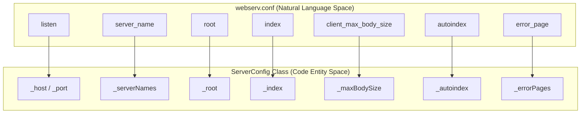
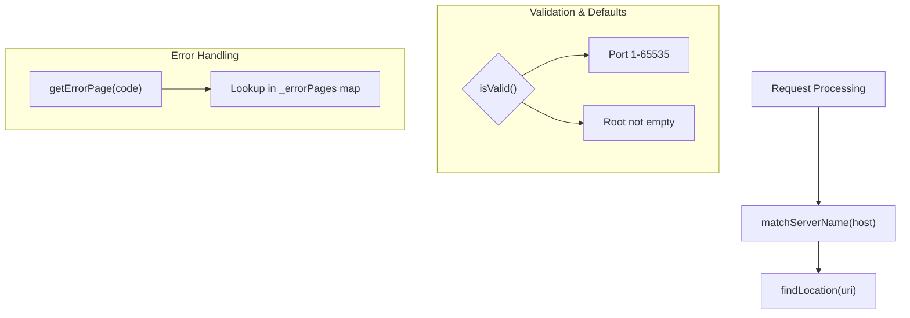

# Server Block Directives

Relevant source files

The following files were used as context for generating this page:

- [config/webserv.conf](config/webserv.conf)
- [inc/config/ServerConfig.hpp](inc/config/ServerConfig.hpp)
- [src/config/ServerConfig.cpp](src/config/ServerConfig.cpp)

This page documents the directives available within a `server {}` block in the `webserv.conf` file. These directives define the global behavior of a virtual server, which can be further refined by specific `location` blocks.

## Overview of Server Directives

Directives in a server block are parsed and stored in the `ServerConfig` class. This class maintains the state for a single virtual server, including its network identity (host/port), default file paths, and resource limits.

### Configuration Storage and Mapping
The following diagram illustrates how configuration directives from the `webserv.conf` file map to the internal `ServerConfig` data members.

**Configuration to Entity Mapping**

**Sources:** [inc/config/ServerConfig.hpp:58-66](), [src/config/ServerConfig.cpp:16-24]()

---

## Directive Reference

### 1. listen
Defines the IP address and port on which the server will accept connections.
- **Syntax:** `listen [address]:port;`
- **Default:** `0.0.0.0:80` [src/config/ServerConfig.cpp:17-18]()
- **Validation:** The port must be between 1 and 65535 [src/config/ServerConfig.cpp:204-205]().
- **Implementation:** Mapped via `setHost()` and `setPort()` [src/config/ServerConfig.cpp:101-107]().

### 2. server_name
Sets the hostnames for a virtual server. This is used during the request dispatching phase to match the `Host` header of an incoming HTTP request to the correct server block when multiple blocks share the same port.
- **Syntax:** `server_name name1 name2 ...;`
- **Default:** Empty (matches any host if no other server matches) [src/config/ServerConfig.cpp:188-189]()
- **Logic:** The `matchServerName(const std::string& host)` function strips the port from the input and compares it against the `_serverNames` vector [src/config/ServerConfig.cpp:174-189]().

### 3. root
Specifies the base directory on the file system where the server looks for files.
- **Syntax:** `root path;`
- **Default:** `./www` [src/config/ServerConfig.cpp:19]()
- **Validation:** Cannot be empty [src/config/ServerConfig.cpp:207]().

### 4. index
Defines the file(s) that will be used as an index if a directory is requested.
- **Syntax:** `index file;`
- **Default:** `index.html` [src/config/ServerConfig.cpp:20]()
- **Note:** Only one index file is currently supported per setter call in the primary implementation [src/config/ServerConfig.cpp:117-119]().

### 5. client_max_body_size
Sets the maximum allowed size of the client request body, specified in bytes. If the size in a request exceeds the configured value, the server returns a `413 Request Entity Too Large` error.
- **Syntax:** `client_max_body_size size;`
- **Default:** `1048576` (1MB) [src/config/ServerConfig.cpp:21]()

### 6. autoindex
Enables or disables the directory listing feature.
- **Syntax:** `autoindex on | off;`
- **Default:** `false` (off) [src/config/ServerConfig.cpp:22]()

### 7. error_page
Defines the URI that will be shown for specific HTTP error codes.
- **Syntax:** `error_page code1 [code2...] uri;`
- **Implementation:** Stored in a `std::map<int, std::string>` where the key is the HTTP status code [inc/config/ServerConfig.hpp:64]().
- **Retrieval:** The `getErrorPage(int code)` method returns the path if found, or an empty string if no custom page is defined [src/config/ServerConfig.cpp:141-146]().

---

## Data Flow: Directive Parsing and Validation

When the server starts, the configuration parser populates `ServerConfig` objects. The following diagram shows the validation and retrieval flow within the `ServerConfig` class.

**ServerConfig Internal Logic Flow**

**Sources:** [src/config/ServerConfig.cpp:141-146](), [src/config/ServerConfig.cpp:148-172](), [src/config/ServerConfig.cpp:174-189](), [src/config/ServerConfig.cpp:203-209]()

## Default Values Summary

| Directive | Default Value | Internal Variable |
| :--- | :--- | :--- |
| `listen` | `0.0.0.0:80` | `_host`, `_port` |
| `server_name` | (Empty) | `_serverNames` |
| `root` | `./www` | `_root` |
| `index` | `index.html` | `_index` |
| `client_max_body_size` | `1048576` (1MB) | `_maxBodySize` |
| `autoindex` | `off` | `_autoindex` |
| `error_page` | (None) | `_errorPages` |

**Sources:** [src/config/ServerConfig.cpp:16-24]()

---
