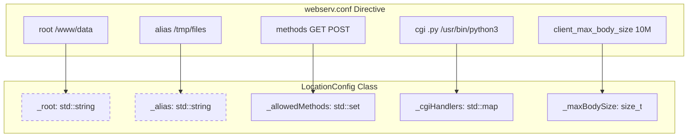
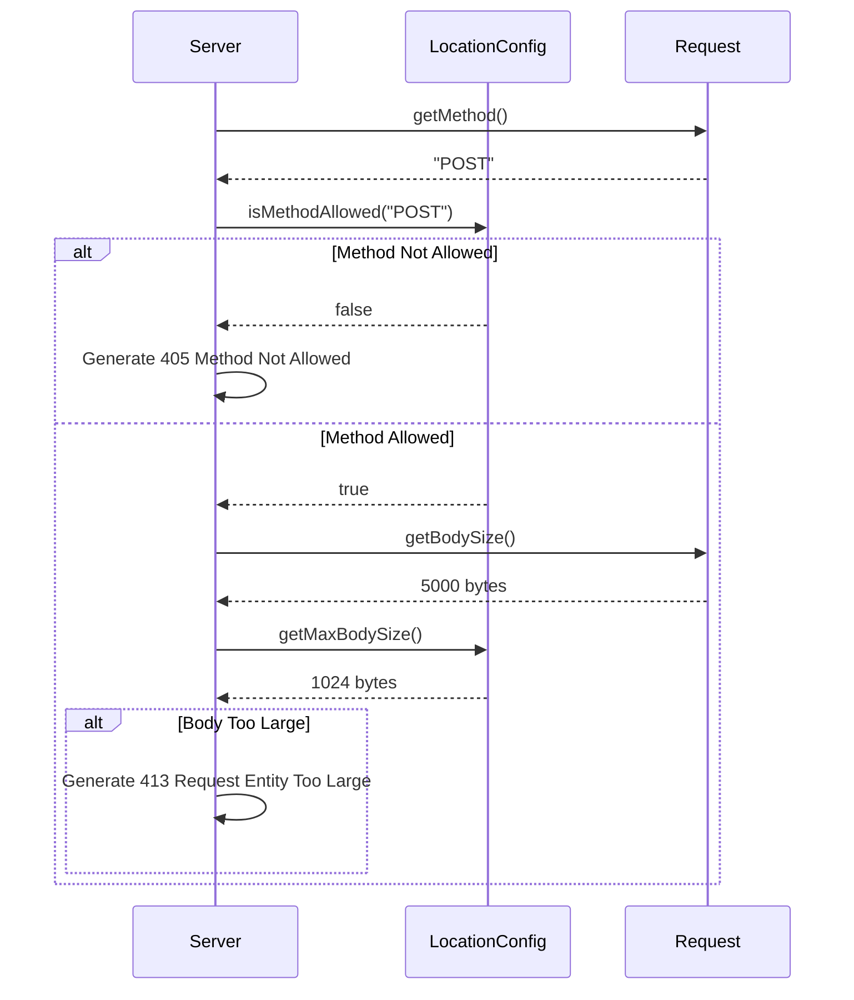

# Location Block Directives

Relevant source files

The following files were used as context for generating this page:

- [config/webserv.conf](config/webserv.conf)
- [inc/config/LocationConfig.hpp](inc/config/LocationConfig.hpp)
- [src/config/LocationConfig.cpp](src/config/LocationConfig.cpp)

Location blocks provide fine-grained control over how the server handles specific URI paths. These directives allow for path-specific behavior such as method restriction, CGI execution, file uploads, and URL redirection. Within the codebase, these settings are encapsulated in the `LocationConfig` class.

## Overview of Location Directives

The `LocationConfig` class stores the configuration state for a specific URI prefix [inc/config/LocationConfig.hpp:21-26](). When a request is processed, the server matches the request URI against the available location blocks to determine which set of directives to apply.

### Inheritance and Overriding
Directives in a `location` block generally override the global settings defined in the `server` block. For instance, if `client_max_body_size` is set to 1MB at the server level but 100MB in a specific `/upload` location, the 100MB limit will apply to requests targeting that path [config/webserv.conf:27-76]().

## Directive Reference

The following table details the directives supported within a `location` block and their corresponding `LocationConfig` member variables.

| Directive | Description | `LocationConfig` Member |
|:---|:---|:---|
| `methods` | List of allowed HTTP methods (e.g., GET, POST, DELETE) | `_allowedMethods` |
| `root` | The directory from which to search for the requested file | `_root` |
| `alias` | Defines a replacement for the specified location | `_alias` |
| `index` | Default file to serve if a directory is requested | `_index` |
| `autoindex` | Enables or disables directory listing | `_autoindex` |
| `cgi` | Maps a file extension to a CGI executable path | `_cgiHandlers` |
| `upload_store` | Directory where uploaded files will be saved | `_uploadPath` |
| `redirect` | HTTP redirection (301/302) to a new URL | `_redirect`, `_redirectCode` |
| `client_max_body_size` | Maximum allowed size for the client request body | `_maxBodySize` |

**Sources:** [inc/config/LocationConfig.hpp:64-77](), [src/config/LocationConfig.cpp:15-31](), [config/webserv.conf:38-135]()

---

## Technical Implementation and Data Flow

The `LocationConfig` class acts as a data container used by the request processing logic to validate and route HTTP requests.

### Configuration Entity Mapping
The following diagram maps the configuration directives to the internal C++ class structure.

**Diagram: Directive to Code Entity Mapping**

**Sources:** [inc/config/LocationConfig.hpp:21-77](), [src/config/LocationConfig.cpp:126-172]()

### Logic Flow for Request Validation
When a request enters the server, the `LocationConfig` methods are used to determine if the request is valid for that specific context.

**Diagram: Location-Based Request Validation**

**Sources:** [src/config/LocationConfig.cpp:178-180](), [inc/config/LocationConfig.hpp:39-57]()

---

## Detailed Directive Behavior

### 1. Methods (`methods`)
Defines which HTTP verbs are permitted. By default, `LocationConfig` initializes with `GET`, `POST`, and `DELETE` [src/config/LocationConfig.cpp:28-30](). If a `methods` directive is present in the config file, the default list is cleared and replaced with the specified values using `addAllowedMethod` [src/config/LocationConfig.cpp:158-160]().

### 2. Root vs Alias
*   **Root:** Appends the request URI to the root path. If `location /data` has `root /var/www`, a request for `/data/file.txt` looks for `/var/www/data/file.txt`.
*   **Alias:** Replaces the location prefix with the alias path. If `location /data` has `alias /var/www`, a request for `/data/file.txt` looks for `/var/www/file.txt` [config/webserv.conf:71]().

### 3. CGI Handling (`cgi`)
Maps file extensions (e.g., `.py`, `.bla`) to specific interpreters or binaries [config/webserv.conf:85-89](). `LocationConfig` stores these in a map and provides `isCgiExtension` to check if a file should be executed rather than served statically [src/config/LocationConfig.cpp:182-187]().

### 4. Upload Store (`upload_store`)
Specifies the directory where files should be saved when using the `PUT` method or `POST` multipart uploads [config/webserv.conf:49](). Setting this directive automatically sets `_uploadEnabled` to true via the configuration parser [inc/config/LocationConfig.hpp:50]().

### 5. Redirection (`redirect`)
Triggers an immediate response with a status code (typically 301 or 302) and a `Location` header [config/webserv.conf:120-125](). The logic is handled by checking `hasRedirect()` during the routing phase [src/config/LocationConfig.cpp:199-201]().

**Sources:** [src/config/LocationConfig.cpp:15-224](), [inc/config/LocationConfig.hpp:21-77](), [config/webserv.conf:1-135]()

---
