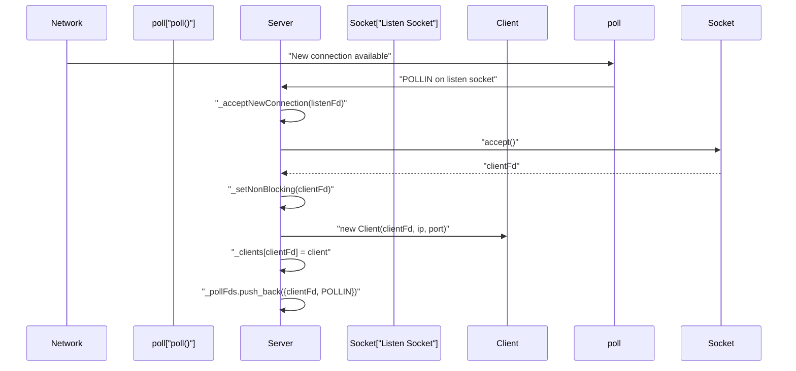
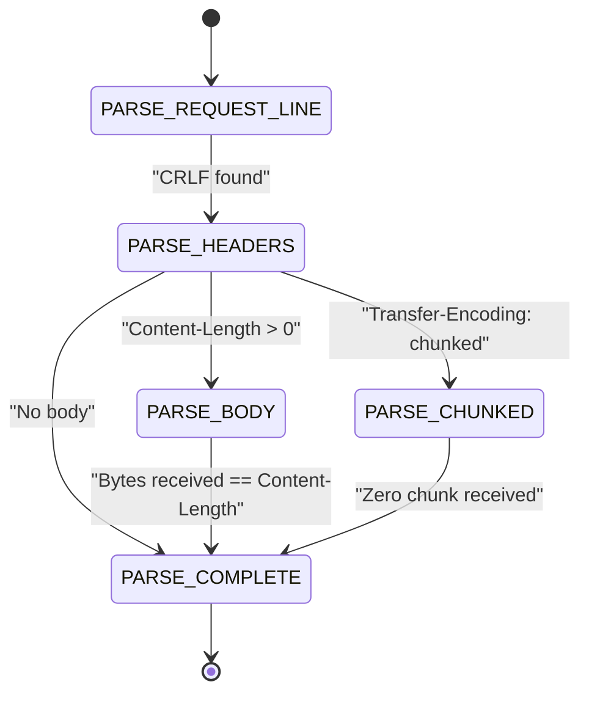
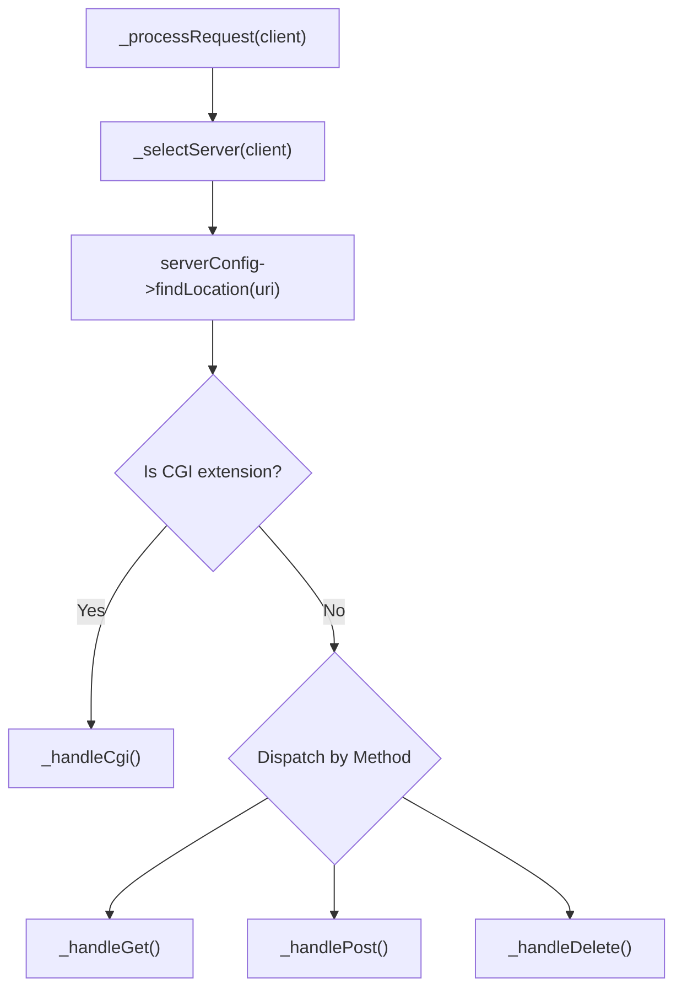
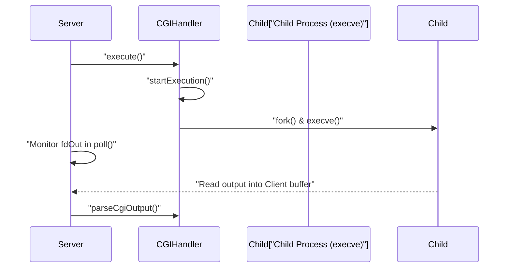
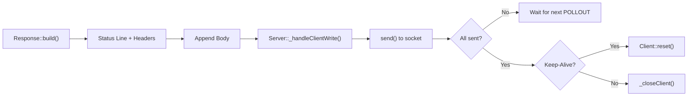

# Request Processing Lifecycle

Relevant source files

The following files were used as context for generating this page:

- [src/cgi/CGIHandler.cpp](src/cgi/CGIHandler.cpp)
- [src/config/Config.cpp](src/config/Config.cpp)
- [src/http/Request.cpp](src/http/Request.cpp)
- [src/http/Response.cpp](src/http/Response.cpp)
- [src/server/Server.cpp](src/server/Server.cpp)

## Purpose and Scope

This document describes the complete end-to-end flow of an HTTP request through the webserv system, from initial socket connection to final response transmission. It covers the state transitions, configuration matching logic, routing decisions, and handler dispatch mechanisms that occur during request processing.

For detailed documentation of individual components involved in this lifecycle:
- Connection Acceptance and Request Reading: see [Connection Acceptance and Request Reading](#8.1)
- Request Routing and Response Dispatch: see [Request Routing and Response Dispatch](#8.2)
- Server and client management implementation: see [Server and Client Management](#3.1)
- HTTP request parsing internals: see [HTTP Request Parsing](#4.3)
- HTTP response generation internals: see [HTTP Response Generation](#4.4)
- CGI execution details: see [CGI Handler Implementation](#5.1)

---

## Lifecycle Overview

The request processing lifecycle consists of seven distinct phases, each managed by different components of the webserv architecture:

| Phase | Primary Component | State | Description |
|-------|------------------|-------|-------------|
| **Connection** | `Server` | N/A | Accept new TCP connection via `_acceptNewConnection` |
| **Reading** | `Client`, `Request` | `CLIENT_READING`, `PARSE_*` | Read data from socket, parse incrementally using `Request::parse` |
| **Matching** | `Server`, `Config` | `CLIENT_PROCESSING` | Match request to server and location configs |
| **Routing** | `Server` | `CLIENT_PROCESSING` | Determine handler (GET/POST/CGI) in `_processRequest` |
| **Execution** | Various handlers | `CLIENT_PROCESSING`, `CLIENT_CGI_RUNNING` | Execute handler (file, CGI, directory listing) |
| **Building** | `Response` | `CLIENT_PROCESSING` | Build HTTP response with `Response::build` |
| **Writing** | `Client` | `CLIENT_WRITING` | Transmit response via `_handleClientWrite` |

Sources: [src/server/Server.cpp:552-563](), [src/http/Request.cpp:18-28](), [src/http/Response.cpp:20-26]()

---

## Phase 1: Connection Acceptance

The `Server` event loop uses `poll()` to detect activity on listening sockets. When a `POLLIN` event occurs on a file descriptor stored in `_listenSockets`, the server accepts the connection.

For details, see [Connection Acceptance and Request Reading](#8.1).

Sources: [src/server/Server.cpp:552-598](), [src/server/Server.cpp:210-216]()

---

## Phase 2: Request Parsing

The `Request` class implements an incremental parsing state machine. As data arrives in the `Client` buffer, `Request::parse` is called to transition through states like `PARSE_REQUEST_LINE`, `PARSE_HEADERS`, and `PARSE_BODY`.

For details, see [Connection Acceptance and Request Reading](#8.1).

Sources: [src/http/Request.cpp:91-174](), [src/http/Request.cpp:179-200]()

---

## Phase 3 & 4: Matching and Routing

Once `Request::isComplete()` returns true, the `Server` selects the most appropriate `ServerConfig` based on the `Host` header and matches the URI against `LocationConfig` blocks using a longest-prefix match algorithm.

For details, see [Request Routing and Response Dispatch](#8.2).

Sources: [src/server/Server.cpp:733-780](), [src/config/ServerConfig.cpp:115-135]()

---

## Phase 5: Execution and CGI

If the request is routed to a static file, the server reads the file from disk. If it matches a CGI extension (e.g., `.py`), the `CGIHandler` forks a child process, sets up the environment variables, and pipes the request body to the script.

For details, see [CGI Handler Implementation](#5.1).

Sources: [src/cgi/CGIHandler.cpp:96-130](), [src/cgi/CGIHandler.cpp:132-214]()

---

## Phase 6 & 7: Response Building and Writing

The `Response` class constructs the HTTP status line, headers, and body. The `Server` then attempts to send this data to the client socket. If the response is large, it is sent in chunks across multiple `poll()` iterations where `POLLOUT` is triggered.

Sources: [src/http/Response.cpp:97-103](), [src/server/Server.cpp:685-731](), [src/http/Response.cpp:166-174]()

---

## Client State Transitions

The `Client` object tracks the progress of a request through the `ClientState` enum.

| State | Transition Trigger |
|-------|--------------------|
| `CLIENT_READING` | Initial state; data being read from socket |
| `CLIENT_PROCESSING` | `Request::isComplete()` is true |
| `CLIENT_CGI_RUNNING` | `CGIHandler::startExecution()` successful |
| `CLIENT_WRITING` | Response is built and ready to send |
| `CLIENT_ERROR` | Error encountered during any phase |

Sources: [src/server/Server.cpp:600-640](), [src/server/Server.cpp:685-710]()

---
