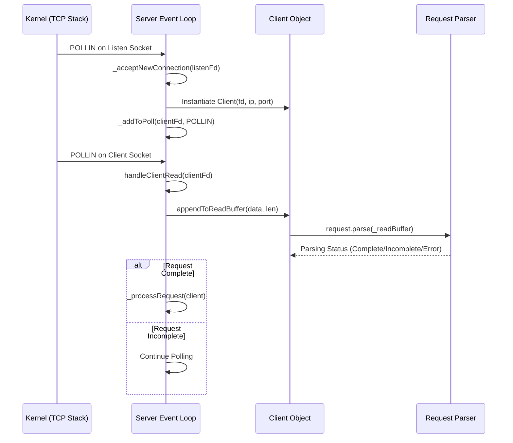
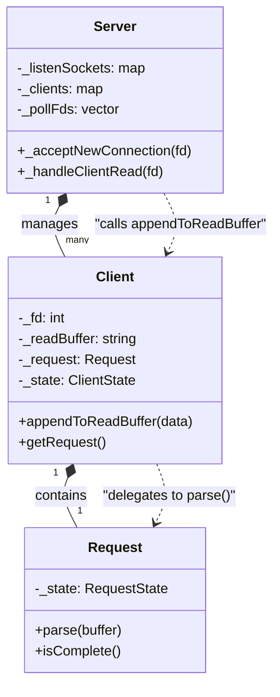

# Connection Acceptance and Request Reading

Relevant source files

The following files were used as context for generating this page:

- [inc/server/Client.hpp](inc/server/Client.hpp)
- [inc/server/Server.hpp](inc/server/Server.hpp)
- [src/server/Client.cpp](src/server/Client.cpp)
- [src/server/Server.cpp](src/server/Server.cpp)

This section details the initial stage of the HTTP request processing lifecycle. It covers how the `Server` class utilizes a `poll`-based event loop to monitor listening sockets, accept incoming TCP connections, and read raw data into client-specific buffers before initiating the parsing process.

## Overview of the Event Loop

The server operates a non-blocking I/O multiplexing loop using `poll()`. This loop is responsible for three primary activities related to the start of a request:
1.  **Monitoring Listen Sockets**: Detecting new connection attempts on configured ports [inc/server/Server.hpp:53]().
2.  **Accepting Connections**: Creating new `Client` objects and adding their file descriptors to the interest list [src/server/Server.cpp:287-320]().
3.  **Reading Data**: Capturing raw bytes from established connections into the `Client`'s internal read buffer [src/server/Server.cpp:322-358]().

### Connection Lifecycle Diagram

The following diagram illustrates the flow from a kernel-level TCP event to the population of the `Client` buffer.

**Diagram: Connection and Data Flow**

**Sources:** [src/server/Server.cpp:287-320](), [src/server/Server.cpp:322-358](), [inc/server/Client.hpp:22-29](), [src/server/Client.cpp:207-209]()

---

## Connection Acceptance

When `poll()` indicates a `POLLIN` event on a file descriptor stored in `_listenSockets`, the `Server` calls `_acceptNewConnection` [src/server/Server.cpp:287]().

### Implementation Details
-   **Accepting**: The server uses `accept()` to obtain a new file descriptor for the connection [src/server/Server.cpp:293]().
-   **Non-blocking**: The new socket is immediately set to `O_NONBLOCK` via `_setNonBlocking()` to ensure the event loop never hangs [src/server/Server.cpp:302]().
-   **Client Tracking**: A new `Client` instance is created and stored in the `_clients` map, keyed by its file descriptor [src/server/Server.cpp:312]().
-   **Poll Registration**: The descriptor is added to the `_pollFds` vector with the `POLLIN` flag [src/server/Server.cpp:315]().

**Sources:** [src/server/Server.cpp:287-320](), [src/server/Server.cpp:210-216](), [inc/server/Server.hpp:51-53]()

---

## Request Reading and Buffering

Once a client is connected, any data sent by the browser triggers a `POLLIN` event on the client's file descriptor, handled by `_handleClientRead` [src/server/Server.cpp:322]().

### Data Ingestion Process
1.  **Read Buffer**: The server reads data in chunks (defined by `BUFFER_SIZE`) using `recv()` [src/server/Server.cpp:333]().
2.  **Storage**: Read bytes are appended to the `_readBuffer` string within the `Client` object [src/server/Client.cpp:207-209]().
3.  **State Update**: The client's `_lastActivity` timestamp is updated to prevent premature timeout [src/server/Client.cpp:182-184]().
4.  **Parsing Trigger**: After every successful read, the server passes the current `_readBuffer` to the `Request::parse()` method [src/server/Server.cpp:348]().

### Client State Transitions
The `Client` object maintains a state machine to track its progress [inc/server/Client.hpp:22-29](). During this phase, the state is typically `CLIENT_READING`.

| State | Description | Transition Condition |
| :--- | :--- | :--- |
| `CLIENT_READING` | Actively receiving bytes from the socket. | Default state upon connection. |
| `CLIENT_PROCESSING` | The `Request` parser has confirmed a complete HTTP request. | `request.isComplete()` returns true. |
| `CLIENT_ERROR` | A parsing error or socket disconnect occurred. | `recv() <= 0` or `request.hasError()`. |

**Sources:** [src/server/Server.cpp:322-358](), [inc/server/Client.hpp:22-29](), [src/server/Client.cpp:158-160]()

---

## Mapping Code Entities to System Logic

The following diagram bridges the high-level logic of accepting and reading to the specific class members and methods in the codebase.

**Diagram: Code Entity Mapping**

### Key Functions and Variables
-   **`_pollFds`**: The central list of descriptors monitored by the `run()` loop [src/server/Server.cpp:264-285]().
-   **`_handleClientRead`**: The primary entry point for moving data from the network into the application layer [src/server/Server.cpp:322]().
-   **`Client::appendToReadBuffer`**: Appends raw bytes to the `_readBuffer` [src/server/Client.cpp:207-209]().
-   **`Request::parse`**: The logic that interprets the `_readBuffer` to identify headers and body [src/server/Server.cpp:348]().

**Sources:** [inc/server/Server.hpp:51-53](), [inc/server/Client.hpp:100-110](), [src/server/Server.cpp:322-358](), [src/server/Client.cpp:207-209]()

---
