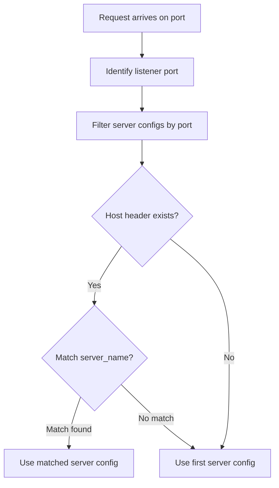
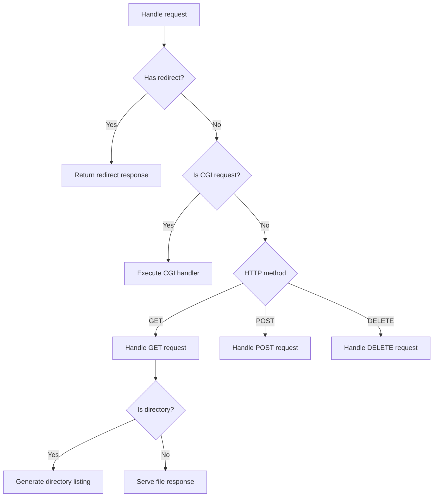

# Request Routing and Response Dispatch

Relevant source files

The following files were used as context for generating this page:

- [src/config/Config.cpp](src/config/Config.cpp)
- [src/config/LocationConfig.cpp](src/config/LocationConfig.cpp)
- [src/http/Response.cpp](src/http/Response.cpp)
- [src/server/Server.cpp](src/server/Server.cpp)

This section detailed the logic used by the server to route an incoming HTTP request to the appropriate virtual server and location block, and the subsequent dispatching of that request to the correct handler (static file, CGI, or redirect).

## Server Selection and Virtual Hosting

Webserv supports multiple virtual servers sharing the same IP and port. The server selection process follows a specific hierarchy based on the `Host` header provided in the request.

1.  **Port Matching**: The server identifies all `ServerConfig` objects that match the port on which the connection was accepted [src/server/Server.cpp:119-141]().
2.  **Host Header Matching**: The server compares the `Host` header against the `server_name` directives defined in the configuration [src/config/Config.cpp:149-153]().
3.  **Default Server**: If no `server_name` matches, or no `Host` header is present, the first server defined in the configuration for that specific port is selected as the default [src/server/Server.cpp:704-718]().

### Server Selection Flow
The following diagram illustrates how a request is mapped to a specific `ServerConfig`.

**Diagram: Server Selection Logic**

Sources: [src/server/Server.cpp:704-725](), [src/config/Config.cpp:149-153]()

## Location Matching Algorithm

Once a server is selected, the server must find the most specific `LocationConfig` for the requested URI.

*   **Prefix Matching**: The algorithm performs a prefix match between the request URI and the `path` defined in each `location` block [src/server/Server.cpp:732-750]().
*   **Longest Prefix Wins**: If multiple locations match, the one with the longest path (the most specific) is chosen [src/server/Server.cpp:743-747]().
*   **Root Fallback**: If no location matches, the server uses the global settings defined at the `ServerConfig` level [src/server/Server.cpp:752]().

Sources: [src/server/Server.cpp:732-755](), [src/config/LocationConfig.cpp:74-76]()

## Request Dispatching and Method Handling

After routing, the server validates the request against the location's constraints and dispatches it to the appropriate processing logic.

### 1. Validation and Redirects
*   **Method Validation**: The server checks if the HTTP method is allowed in the matched `LocationConfig` via `isMethodAllowed()` [src/config/LocationConfig.cpp:178-180](). If not, it returns a `405 Method Not Allowed` [src/server/Server.cpp:767-771]().
*   **Redirects**: If a `return` or `redirect` directive is present, the server immediately generates a redirect response using `Response::makeRedirect()` [src/http/Response.cpp:203-217]().

### 2. CGI Detection
The server determines if a request should be handled by the CGI subsystem by checking the file extension of the requested resource against the `cgi` handlers defined in the configuration [src/config/LocationConfig.cpp:182-187](). If a match is found, the request is dispatched to the `CGIHandler` [src/server/Server.cpp:815-825]().

### 3. Static Method Dispatch
If not a CGI request, the server dispatches based on the HTTP method:

| Method | Implementation Detail |
| :--- | :--- |
| **GET** | Attempts to serve a file or directory listing. If the path is a directory, it looks for `index` files or generates an `autoindex` [src/server/Server.cpp:840-880](). |
| **POST** | Typically used for CGI or file uploads. If `upload_store` is configured, it saves the body to the specified path [src/server/Server.cpp:885-900](). |
| **PUT** | Saves the request body to the specified resource path, creating or overwriting the file [src/server/Server.cpp:910-930](). |
| **DELETE** | Removes the file at the requested path using `unlink()` [src/server/Server.cpp:940-955](). |

### Request Dispatch Flow
This diagram bridges the conceptual routing to the specific class methods in the code.

**Diagram: Method Dispatching in Server class**

Sources: [src/server/Server.cpp:760-800](), [src/server/Server.cpp:840-860](), [src/http/Response.cpp:234-245]()

## Directory Listing and Autoindex

When a GET request targets a directory and no index file is found, the server checks the `autoindex` directive [src/config/LocationConfig.cpp:98-100]().

If `autoindex` is `on`, the `Response::makeDirectoryListing` function is called [src/http/Response.cpp:234](). This function:
1.  Opens the directory using `opendir()` [src/http/Response.cpp:247]().
2.  Iterates through entries with `readdir()` [src/http/Response.cpp:254]().
3.  Formats the file names, sizes, and modification dates into an HTML table [src/http/Response.cpp:260-280]().
4.  Sets the `Content-Type` to `text/html` [src/http/Response.cpp:237]().

Sources: [src/http/Response.cpp:234-290](), [src/server/Server.cpp:865-875]()

---
