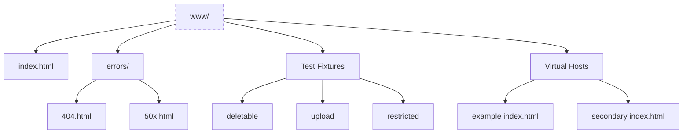
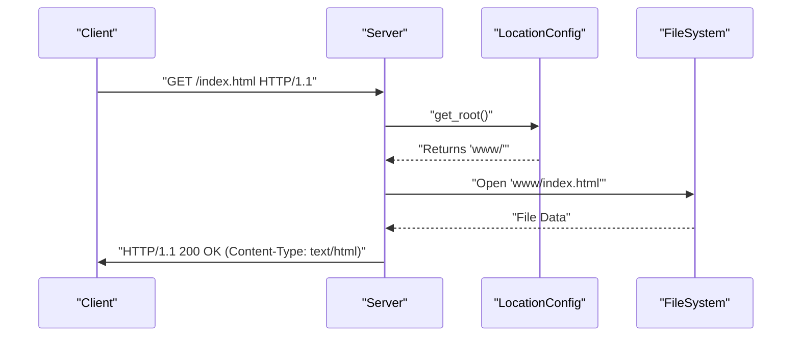

# Web Root and Static Assets

Relevant source files

The following files were used as context for generating this page:

- [www/errors/404.html](www/errors/404.html)
- [www/errors/50x.html](www/errors/50x.html)
- [www/example/index.html](www/example/index.html)
- [www/index.html](www/index.html)
- [www/restricted/index.html](www/restricted/index.html)
- [www/secondary/index.html](www/secondary/index.html)
- [www/static/script.js](www/static/script.js)
- [www/static/style.css](www/static/style.css)

The `www/` directory serves as the default document root for the Webserv project. It contains the static HTML, CSS, and JavaScript files used to demonstrate the server's capabilities, as well as specialized subdirectories designed to test specific HTTP methods and configuration directives.

The server's ability to serve these assets is governed by the `root` and `index` directives defined in the configuration files [www/index.html:1-114](). When a request arrives, the server maps the URL path to a physical file path on the disk relative to the configured root.

### Directory Structure Overview

The following diagram illustrates how the `www/` directory is organized to support different server features:

**Web Root Organization**

Sources: [www/index.html:1-114](), [www/errors/404.html:1-60](), [www/example/index.html:1-41](), [www/secondary/index.html:1-41]()

### Static File Serving

Webserv handles static assets by reading files from the filesystem and determining the appropriate `Content-Type` header based on the file extension.

*   **Default Index**: The `index.html` file in the root directory serves as the primary landing page, providing a dashboard to test CGI, POST forms, and DELETE requests [www/index.html:118-172]().
*   **Supporting Assets**: Static resources like `www/static/style.css` and `www/static/script.js` are used to verify the server's ability to handle different MIME types and concurrent resource loading [www/static/style.css:1-2](), [www/static/script.js:1-2]().
*   **Virtual Hosting**: Directories like `www/example/` and `www/secondary/` are used to demonstrate name-based and port-based virtual hosting. For instance, `www/example/index.html` is served when the `Host: example.com` header is present [www/example/index.html:33-37](), while `www/secondary/` is mapped to port 8081 [www/secondary/index.html:33-36]().

### Request to File Mapping

The server maps incoming `HttpRequest` objects to the filesystem using the `LocationConfig` associated with the request URI.

**Entity Mapping: Request to Static Asset**

Sources: [www/index.html:1-114](), [www/example/index.html:33-37]()

---

### Sub-Topic Details

#### [Test Fixture Directories](#9.1)
The `www/` directory includes several folders specifically designed to trigger and validate different HTTP methods and server behaviors. These include `deletable/` for testing the `DELETE` method, `upload/` for `POST` and `PUT` file storage, and `restricted/` for verifying access control and forbidden method configurations.
For details, see [Test Fixture Directories](#9.1).

#### [Custom Error Pages](#9.2)
Webserv supports user-defined error pages located in `www/errors/`. These pages, such as `404.html` and `50x.html`, provide a branded experience when a request fails. The server is configured to serve these via the `error_page` directive, falling back to internal hardcoded responses if the custom files are missing.
For details, see [Custom Error Pages](#9.2).

---
