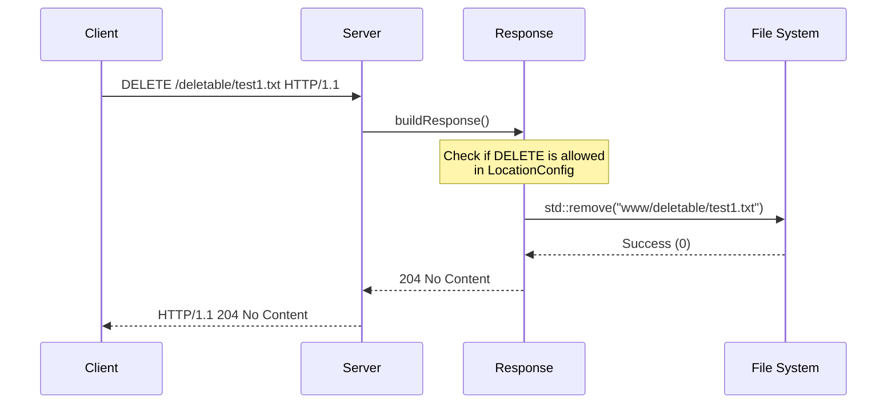
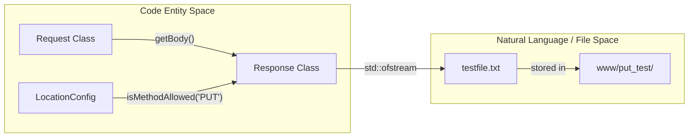

# Test Fixture Directories

Relevant source files

The following files were used as context for generating this page:

- [www/deletable/delete_me.txt](www/deletable/delete_me.txt)
- [www/deletable/test1.txt](www/deletable/test1.txt)
- [www/deletable/test2.txt](www/deletable/test2.txt)
- [www/dir_test/test_listing.txt](www/dir_test/test_listing.txt)
- [www/put_test/testfile.txt](www/put_test/testfile.txt)
- [www/restricted/deletable/file1.txt](www/restricted/deletable/file1.txt)
- [www/restricted/deletable/file2.txt](www/restricted/deletable/file2.txt)
- [www/upload/test_listing.txt](www/upload/test_listing.txt)

The `www/` directory serves as the default web root for the Webserv project. Within this directory, several subdirectories are specifically structured to facilitate automated and manual testing of HTTP methods, directory listing logic, and access control configurations. These "test fixtures" provide a predictable state for verifying the server's compliance with HTTP/1.1 standards.

## Overview of Test Directories

The test fixture directories are mapped to specific `LocationConfig` blocks in the server configuration to test different functional modules of the server, such as the `DELETE` handler, `PUT` handler, and the `autoindex` (directory listing) generator.

| Directory | Primary Test Purpose | Key HTTP Methods |
|:---|:---|:---|
| `www/deletable/` | Verification of file removal logic | `DELETE` |
| `www/put_test/` | Verification of file creation/replacement | `PUT` |
| `www/dir_test/` | Verification of directory listing generation | `GET` |
| `www/upload/` | Verification of multipart and CGI-based uploads | `POST`, `GET` |
| `www/restricted/` | Verification of method restrictions and access control | All |

---

## Deletable Fixtures (`www/deletable/`)

The `deletable/` directory contains non-critical text files intended to be targets for `DELETE` requests. During integration testing, the server's `Response` class processes these requests by verifying permissions and then invoking file system unlinking.

### Implementation and Data Flow

When a `DELETE` request is received for a file in this directory, the `Server` identifies the target via the `LocationConfig` associated with the path.

**DELETE Request Flow**

**Fixture Contents:**
- `www/deletable/delete_me.txt`: [www/deletable/delete_me.txt:1-1]()
- `www/deletable/test1.txt`: [www/deletable/test1.txt:1-1]()
- `www/deletable/test2.txt`: [www/deletable/test2.txt:1-1]()

**Sources:** [www/deletable/delete_me.txt:1-2](), [www/deletable/test1.txt:1-2](), [www/deletable/test2.txt:1-2]()

---

## PUT Test Fixtures (`www/put_test/`)

The `put_test/` directory is used to validate the server's ability to handle `PUT` requests, which involve either creating a new resource or replacing an existing one with the request body content.

### Entity Mapping

The following diagram shows how the server entities interact with the file system during a `PUT` operation.

**PUT Implementation Mapping**

**Fixture Contents:**
- `www/put_test/testfile.txt`: [www/put_test/testfile.txt:1-1]()

**Sources:** [www/put_test/testfile.txt:1-1]()

---

## Directory Listing Fixtures (`www/dir_test/`)

The `dir_test/` directory is specifically configured with `autoindex on` in the `webserv.conf`. It is used to test the `Response::generateDirectoryListing()` logic, which dynamically builds an HTML page listing all files in the directory.

### Listing Logic
The server uses `opendir()` and `readdir()` to iterate through the contents of `www/dir_test/`. For every entry found, such as `test_listing.txt`, the server generates an `<a>` tag in the resulting HTML.

**Fixture Contents:**
- `www/dir_test/test_listing.txt`: [www/dir_test/test_listing.txt:1-1]()

**Sources:** [www/dir_test/test_listing.txt:1-2]()

---

## Upload and Restricted Fixtures

### Upload Directory (`www/upload/`)
The `www/upload/` directory serves as the default destination for the `upload_store` directive. It is used to verify:
1.  **CGI Uploads**: Handled by `upload.py`, which parses multipart/form-data.
2.  **Direct Uploads**: Handled via `PUT` if the location is configured to store files directly in this path.

**Sources:** [www/upload/test_listing.txt:1-2]()

### Restricted Directory (`www/restricted/`)
The `restricted/` directory contains sub-structures like `www/restricted/deletable/`. This is used to test nested `LocationConfig` blocks where different permissions (e.g., `methods GET`) might override the parent directory's settings, or where authentication/access control is simulated.

**Fixture Contents:**
- `www/restricted/deletable/file1.txt`: [www/restricted/deletable/file1.txt:1-1]()
- `www/restricted/deletable/file2.txt`: [www/restricted/deletable/file2.txt:1-1]()

**Sources:** [www/restricted/deletable/file1.txt:1-2](), [www/restricted/deletable/file2.txt:1-2]()

---
