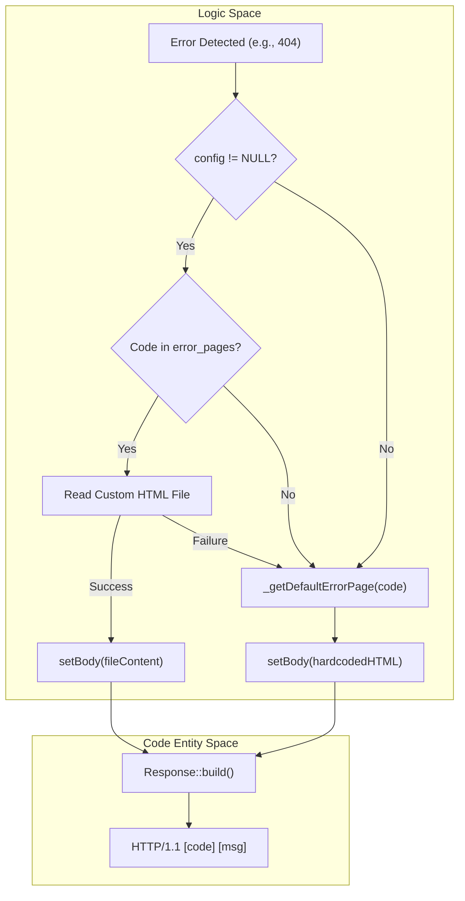
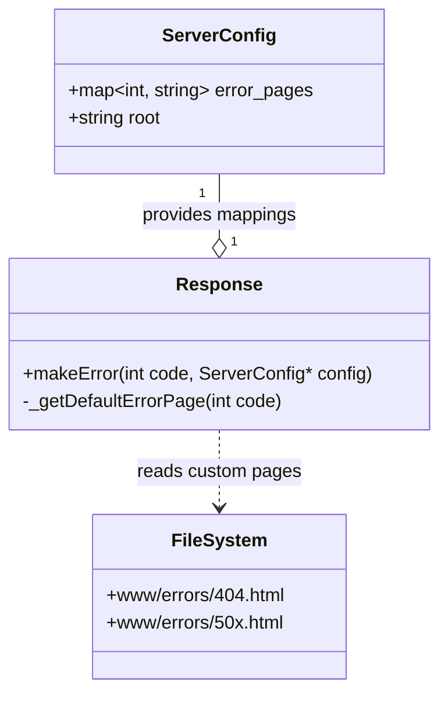

# Custom Error Pages

<details>
<summary>Relevant source files</summary>

The following files were used as context for generating this page:

- [config/webserv.conf](config/webserv.conf)
- [inc/http/Response.hpp](inc/http/Response.hpp)
- [www/errors/404.html](www/errors/404.html)
- [www/errors/50x.html](www/errors/50x.html)

</details>


This page documents the implementation and configuration of custom HTML error pages in Webserv. It covers how the server resolves error status codes to specific HTML files, the directory structure for these assets, and the fallback mechanism to hardcoded internal error pages.

## Overview

Webserv allows administrators to define custom HTML pages for specific HTTP error codes using the `error_page` directive. These pages provide a branded or user-friendly interface when requests fail due to client errors (4xx) or server-side issues (5xx).

### Key Components
*   **Storage**: Custom HTML files are stored in `www/errors/` [www/errors/404.html:1-60]() [www/errors/50x.html:1-60]().
*   **Configuration**: Defined in `webserv.conf` via the `error_page` directive [config/webserv.conf:31-32]().
*   **Logic**: Handled by the `Response` class via the `makeError` static factory method [inc/http/Response.hpp:57]().

## Configuration

The `error_page` directive maps one or more HTTP status codes to a URI path. This directive is scoped to the `server` block.

### Example Configuration
In the standard configuration, 404 errors are mapped to a specific file, while multiple 5xx errors share a single generic error page:

```nginx
server {
    listen 0.0.0.0:8080;
    root ./www;

    # Single code mapping
    error_page 404 /errors/404.html;

    # Multiple codes mapping to one file
    error_page 500 502 503 504 /errors/50x.html;
}
```
[config/webserv.conf:18-33]()

### Resolution Logic
1.  When an error occurs, the server identifies the `ServerConfig` associated with the request.
2.  The server checks if the status code is present in the `error_pages` map of the configuration.
3.  If a mapping exists, the server attempts to read the file at the resolved path (combining `root` + URI).
4.  If the file is missing or unreadable, or if no mapping exists, the server falls back to a built-in default page.

## Implementation Details

The generation of error responses is centralized in the `Response` class.

### The `Response::makeError` Method
The static method `Response::makeError(int code, const ServerConfig* config)` is the entry point for error generation [inc/http/Response.hpp:57]().

**Data Flow: Error Page Resolution**
The following diagram illustrates how the system transitions from a detected error code to a final HTTP response.

Title: Error Response Generation Flow

Sources: [inc/http/Response.hpp:57-72](), [config/webserv.conf:31-32]()

### Default Fallback
If custom pages are not configured or are unavailable, `Response::_getDefaultErrorPage(int code)` generates a minimal HTML string [inc/http/Response.hpp:71](). This ensures the client always receives a valid HTML body even if the filesystem is compromised.

## Error Page Assets

The project includes two primary custom error templates in the `www/errors/` directory. These files use embedded CSS for styling to remain self-contained.

### 404 Not Found
*   **Path**: `www/errors/404.html`
*   **Purpose**: Displayed when a requested resource does not exist.
*   **Features**: Includes a "Back to Home" link and a blue/purple gradient background [www/errors/404.html:10-56]().

### 5xx Server Error
*   **Path**: `www/errors/50x.html`
*   **Purpose**: Displayed for internal server errors, gateway timeouts, or bad gateway responses.
*   **Features**: Includes a red gradient background to signify a critical error [www/errors/50x.html:10-56]().

## Technical Reference

### Response Class Interface
The following members of the `Response` class manage error state:

| Member | Type | Description |
| :--- | :--- | :--- |
| `makeError(int, const ServerConfig*)` | `static Response` | Factory method to create an error response with config lookup [inc/http/Response.hpp:57](). |
| `_getDefaultErrorPage(int)` | `static std::string` | Generates hardcoded HTML for a given status code [inc/http/Response.hpp:71](). |
| `setStatusCode(int)` | `void` | Sets the numeric HTTP status [inc/http/Response.hpp:30](). |

### Entity Mapping
The following diagram maps configuration directives to the internal data structures and file system.

Title: Configuration to Entity Mapping

Sources: [inc/http/Response.hpp:22-72](), [config/webserv.conf:18-33]()

## Sources:
* [config/webserv.conf:18-33]()
* [inc/http/Response.hpp:22-72]()
* [www/errors/404.html:1-60]()
* [www/errors/50x.html:1-60]()

---
