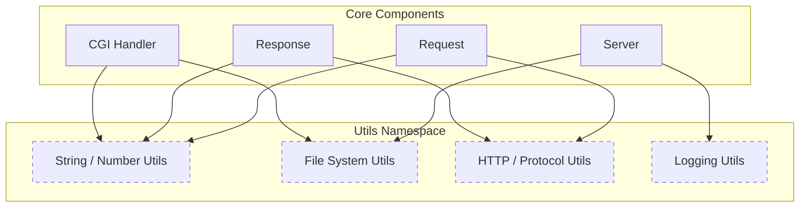
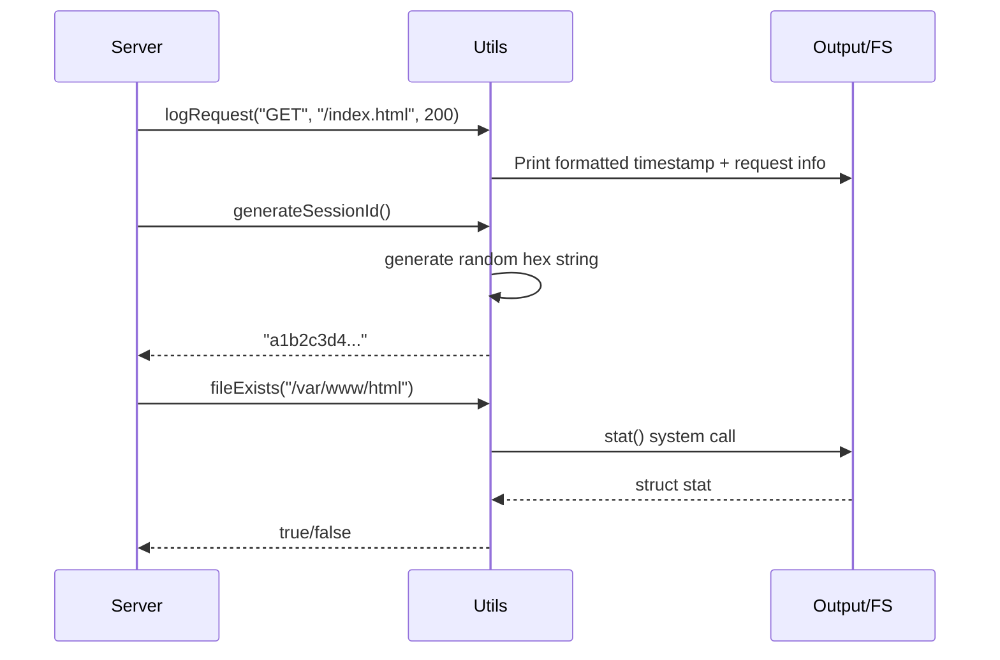

# Utilities and Helpers

Relevant source files

The following files were used as context for generating this page:

- [inc/utils/Utils.hpp](inc/utils/Utils.hpp)
- [src/utils/Utils.cpp](src/utils/Utils.cpp)

The `Utils` namespace provides a comprehensive suite of helper functions designed to simplify common tasks across the Webserv codebase. These utilities handle everything from low-level string manipulation and file system interactions to high-level HTTP protocol requirements and server logging. By centralizing these functions, the project ensures consistent behavior and reduces code duplication in core components like the `Server`, `Request`, and `CGIHandler` classes.

### Utility Categories Overview

The utilities are logically grouped into five main categories:

| Category | Primary Purpose | Key Entities |
|:---|:---|:---|
| **String & Number** | Text processing and type conversion | `trim`, `split`, `toLower`, `hexToSizeT` |
| **File System** | Disk I/O and path management | `fileExists`, `readFile`, `normalizePath` |
| **HTTP** | Protocol-specific formatting | `urlDecode`, `getHttpDate`, `getStatusMessage` |
| **Logging** | Server status and error reporting | `logInfo`, `logError`, `logRequest` |
| **Random** | Unique identifier generation | `generateSessionId`, `generateBoundary` |

### System Integration Diagram

The following diagram illustrates how different server components rely on the `Utils` namespace to perform their duties.

**Utility Dependency Mapping**

**Sources:** [inc/utils/Utils.hpp:27-80](), [src/utils/Utils.cpp:17-310]()

---

### String and Number Utilities
The string utilities facilitate the parsing of HTTP headers and configuration files. They include functions for whitespace removal (`trim`), case conversion (`toLower`, `toUpper`), and complex string splitting using both character and string delimiters. Number conversion utilities like `hexToSizeT` are specifically critical for handling HTTP chunked transfer encoding.

For details, see [String and Number Utilities](#10.1).

**Sources:** [inc/utils/Utils.hpp:29-43](), [src/utils/Utils.cpp:23-126]()

---

### File System and HTTP Utilities
The file system utilities wrap standard C functions to provide a safer interface for checking file properties (`fileExists`, `isReadable`), managing paths (`joinPath`, `normalizePath`), and performing basic I/O (`readFile`, `writeFile`).

The HTTP utilities provide protocol-specific logic, such as encoding/decoding URLs, generating RFC-compliant date strings for headers, and mapping HTTP status codes to their respective reason phrases (e.g., 404 to "Not Found").

For details, see [File System and HTTP Utilities](#10.2).

**Sources:** [inc/utils/Utils.hpp:46-68](), [src/utils/Utils.cpp:132-280]()

---

### Logging and Random Generation
The logging system provides a standardized way to output server activity to the console. It supports different severity levels (`logInfo`, `logWarning`, `logError`, `logDebug`) and a specialized `logRequest` function for access logging.

Random generation utilities are used for security and protocol compliance, such as creating unique session IDs for the `SessionManager` or generating multipart boundaries for form-data responses.

**Utility Logic Flow**

**Sources:** [inc/utils/Utils.hpp:71-79](), [src/utils/Utils.cpp:284-310]()

---
