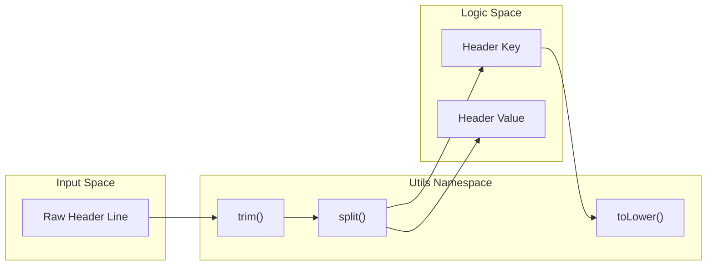
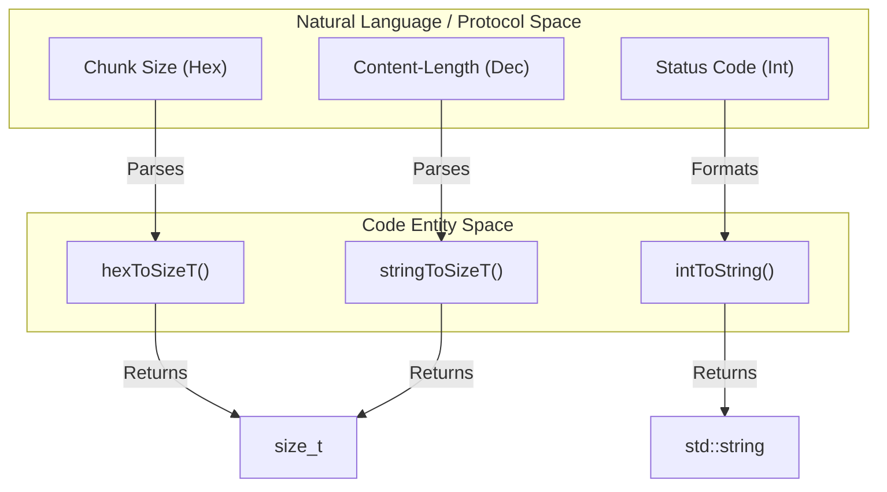

# String and Number Utilities

Relevant source files

The following files were used as context for generating this page:

- [inc/utils/Utils.hpp](inc/utils/Utils.hpp)
- [src/utils/Utils.cpp](src/utils/Utils.cpp)

The `Utils` namespace provides a comprehensive suite of helper functions designed to handle common string manipulations and numeric conversions required for HTTP protocol parsing and server logic. These utilities abstract standard C++ boilerplate and provide specialized functions for tasks like hex-to-decimal conversion (essential for chunked transfer encoding) and case-insensitive string comparisons.

### String Manipulation Utilities

The string utilities focus on cleaning, transforming, and analyzing string data. These are used extensively during the parsing of HTTP headers and configuration files.

| Function | Description | Implementation Detail |
| :--- | :--- | :--- |
| `trim` | Removes whitespace from both ends. | Uses `find_first_not_of` and `find_last_not_of` with `" \t\r\n"` [src/utils/Utils.cpp:23-29](). |
| `toLower` | Converts string to lowercase. | Iterates through the string applying `std::tolower` [src/utils/Utils.cpp:31-36](). |
| `toUpper` | Converts string to uppercase. | Iterates through the string applying `std::toupper` [src/utils/Utils.cpp:38-43](). |
| `split` (char) | Splits string by a character. | Uses `std::istringstream` and `std::getline` [src/utils/Utils.cpp:45-54](). |
| `split` (string)| Splits string by a substring. | Uses `std::string::find` and `substr` in a loop [src/utils/Utils.cpp:56-67](). |
| `startsWith` | Checks prefix existence. | Uses `std::string::compare` [src/utils/Utils.cpp:69-73](). |
| `endsWith` | Checks suffix existence. | Calculates offset and uses `std::string::compare` [src/utils/Utils.cpp:75-79](). |
| `replaceAll` | Replaces all occurrences. | Uses `std::string::replace` within a `find` loop [src/utils/Utils.cpp:81-89](). |

#### Data Flow: String Transformation
The following diagram illustrates how raw input from an HTTP request might be processed by these utilities.

**String Utility Data Flow**

**Sources:** [inc/utils/Utils.hpp:27-36](), [src/utils/Utils.cpp:23-89]()

### Number Conversion Helpers

The server frequently converts between string representations and numeric types, particularly for `Content-Length` headers, port numbers, and hex-encoded chunk sizes.

*   **`stringToInt` / `stringToSizeT`**: These functions utilize `std::istringstream` to extract numeric values from strings [src/utils/Utils.cpp:95-107]().
*   **`intToString` / `sizeTToString`**: These utilize `std::ostringstream` to format integers into strings for response headers or logging [src/utils/Utils.cpp:109-119]().
*   **`hexToSizeT`**: Specifically designed for HTTP Chunked Transfer Encoding. It uses the `std::hex` manipulator on an input stream to convert hexadecimal strings into `size_t` values [src/utils/Utils.cpp:121-126]().

**Numeric Conversion Mapping**

**Sources:** [inc/utils/Utils.hpp:39-43](), [src/utils/Utils.cpp:95-126]()

### Implementation Details

#### Split Logic
The `Utils::split` function is overloaded to handle different use cases:
1.  **Character Delimiter**: Efficiently handles simple delimiters (like spaces in configuration files) by skipping empty tokens [src/utils/Utils.cpp:45-54]().
2.  **String Delimiter**: Used for complex boundaries, such as the `\r\n\r\n` separator between HTTP headers and bodies [src/utils/Utils.cpp:56-67]().

#### Path Normalization
While primarily a file utility, `normalizePath` relies heavily on string utilities. It uses `split` to break a path into segments, processes `.` and `..` components using a `std::vector` as a stack, and then re-assembles the string [src/utils/Utils.cpp:209-242]().

#### Hexadecimal Handling
The `hexToSizeT` function is critical for the `Request` class's chunked encoding state machine. It ensures that the hex string provided at the start of an HTTP chunk is correctly interpreted as the number of bytes to read next [src/utils/Utils.cpp:121-126]().

**Sources:** [src/utils/Utils.cpp:45-67](), [src/utils/Utils.cpp:121-126](), [src/utils/Utils.cpp:209-242]()

---
