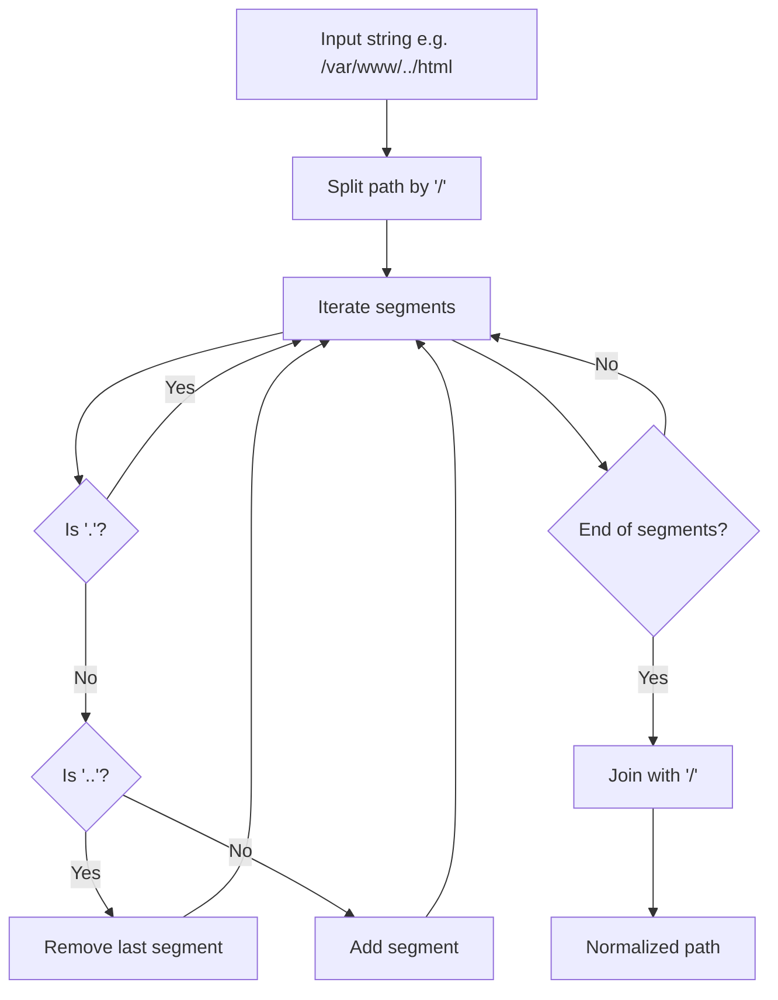
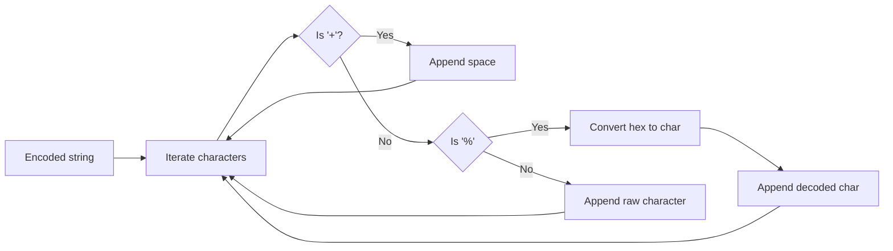

# File System and HTTP Utilities

Relevant source files

The following files were used as context for generating this page:

- [inc/utils/Utils.hpp](inc/utils/Utils.hpp)
- [src/http/MimeTypes.cpp](src/http/MimeTypes.cpp)
- [src/utils/Utils.cpp](src/utils/Utils.cpp)

This page documents the utility functions within the `Utils` namespace that provide essential support for file system operations, HTTP protocol adherence, and system logging. These utilities are used across the codebase to ensure consistent behavior in path manipulation, status reporting, and diagnostic output.

## File System Utilities

The file system utilities wrap standard C library calls (such as `stat`, `access`, and `mkdir`) to provide a more idiomatic C++ interface for the server's resource management.

### Path Manipulation and Validation

The server relies on `normalizePath` and `joinPath` to prevent directory traversal attacks and ensure consistent resource mapping.

| Function | Description | Implementation Detail |
| :--- | :--- | :--- |
| `fileExists` | Checks if a file or directory exists. | Uses `stat()` [src/utils/Utils.cpp:132-135](). |
| `isDirectory` | Checks if the given path is a directory. | Uses `S_ISDIR` on `stat` results [src/utils/Utils.cpp:137-142](). |
| `isReadable` | Checks for read permissions. | Uses `access(path, R_OK)` [src/utils/Utils.cpp:144-146](). |
| `normalizePath` | Resolves `.` and `..` segments in a path. | Splits path by `/`, resolves segments into a vector, and rebuilds the string [src/utils/Utils.cpp:209-242](). |
| `joinPath` | Safely joins two path segments. | Ensures exactly one `/` between segments [src/utils/Utils.cpp:245-256](). |

### Path Normalization Logic

The following diagram illustrates the data flow within `normalizePath`, which is critical for security and URI-to-file mapping.

**Path Normalization Data Flow**

**Sources:** [src/utils/Utils.cpp:209-242](), [src/utils/Utils.cpp:45-54]()

---

## HTTP Protocol Utilities

These functions handle the specific formatting and encoding requirements of the HTTP/1.1 protocol, including URL percent-encoding and date formatting.

### Status Messages and Dates

The server uses `getStatusMessage` to map integer HTTP codes to their RFC-compliant reason phrases and `getHttpDate` to generate headers like `Date` or `Last-Modified`.

*   **`getStatusMessage(int code)`**: Returns strings such as "200 OK" or "404 Not Found" based on a large switch statement [src/utils/Utils.cpp:333-400]().
*   **`getHttpDate()`**: Formats the current system time into the IMF-fixdate format (e.g., `Sun, 06 Nov 1994 08:49:37 GMT`) using `strftime` [src/utils/Utils.cpp:313-324]().

### URL Encoding/Decoding

To handle special characters in URIs (like spaces or non-ASCII characters), the server provides encoding and decoding logic.

*   **`urlDecode`**: Converts `%XX` hex sequences back to characters and replaces `+` with spaces [src/utils/Utils.cpp:265-288]().
*   **`urlEncode`**: Converts non-alphanumeric characters into `%XX` format, except for a specific set of safe characters (`-_.~`) [src/utils/Utils.cpp:290-311]().

**URL Decoding Logic**

**Sources:** [src/utils/Utils.cpp:265-288](), [src/utils/Utils.cpp:121-126]()

---

## Logging System

The logging utilities provide a standardized way to output information to `std::cout` and `std::cerr` with severity levels and timestamps.

### Log Levels

| Function | Output Stream | Prefix | Purpose |
| :--- | :--- | :--- | :--- |
| `logInfo` | `std::cout` | `[INFO]` | General server events (startup, shutdown) [src/utils/Utils.cpp:409-411](). |
| `logWarning` | `std::cerr` | `[WARNING]` | Non-critical issues [src/utils/Utils.cpp:413-415](). |
| `logError` | `std::cerr` | `[ERROR]` | Critical failures or request errors [src/utils/Utils.cpp:417-419](). |
| `logDebug` | `std::cout` | `[DEBUG]` | Detailed execution flow (if enabled) [src/utils/Utils.cpp:421-423](). |

### Request Logging

The `logRequest` function specifically formats HTTP request summaries, combining the method, URI, and resulting status code into a single line for access logs [src/utils/Utils.cpp:425-427]().

---

## Summary of File Utility Implementation

| Function | Source Reference | Description |
| :--- | :--- | :--- |
| `getFileSize` | [src/utils/Utils.cpp:156-161]() | Returns file size in bytes using `stat.st_size`. |
| `getFileExtension` | [src/utils/Utils.cpp:163-168]() | Extracts the string after the last dot in a filename. |
| `readFile` | [src/utils/Utils.cpp:184-191]() | Reads entire file into a `std::string` using `rdbuf()`. |
| `writeFile` | [src/utils/Utils.cpp:193-199]() | Writes `std::string` to a file in binary mode. |
| `deleteFile` | [src/utils/Utils.cpp:201-203]() | Deletes a file using `unlink()`. |

**Sources:** [inc/utils/Utils.hpp:1-83](), [src/utils/Utils.cpp:1-427]()

---
