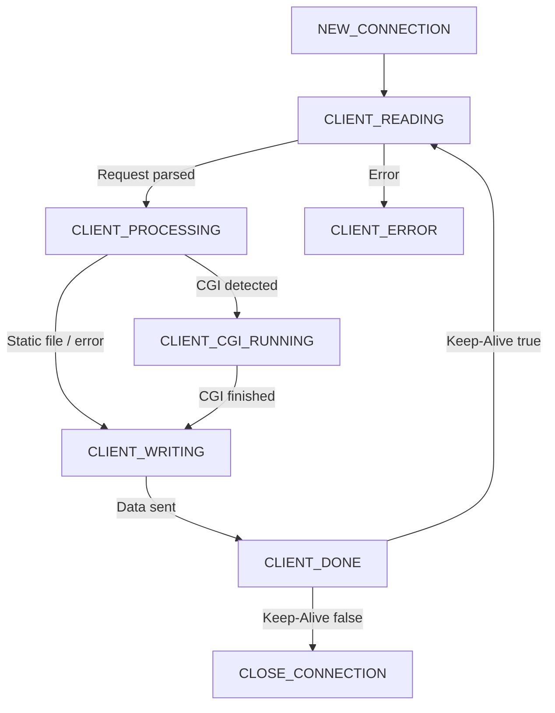
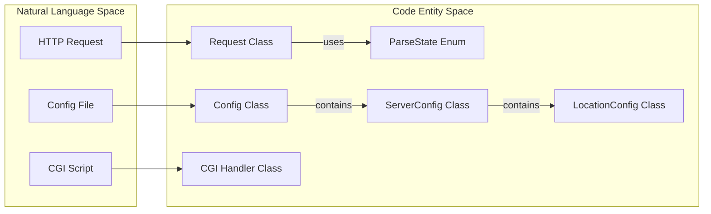
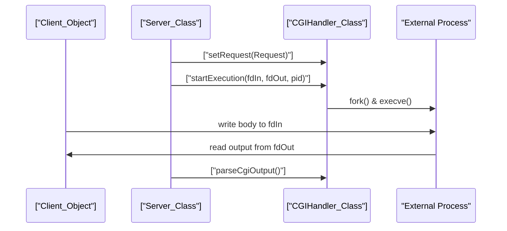
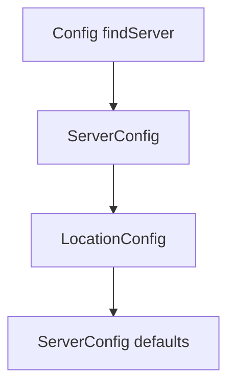

# Glossary

Relevant source files

The following files were used as context for generating this page:

- [inc/cgi/CGIHandler.hpp](inc/cgi/CGIHandler.hpp)
- [inc/config/Config.hpp](inc/config/Config.hpp)
- [inc/http/Request.hpp](inc/http/Request.hpp)
- [inc/http/Response.hpp](inc/http/Response.hpp)
- [inc/server/Client.hpp](inc/server/Client.hpp)
- [inc/server/Server.hpp](inc/server/Server.hpp)
- [inc/session/SessionManager.hpp](inc/session/SessionManager.hpp)
- [inc/webserv.hpp](inc/webserv.hpp)

This glossary defines technical terms, domain-specific concepts, and internal class names used within the Webserv project. It serves as a reference for onboarding engineers to understand the nomenclature used in the source code and configuration.

## Core Server Concepts

| Term | Definition | Code Reference |
| :--- | :--- | :--- |
| **Multiplexing** | The technique of monitoring multiple file descriptors to see if any of them are ready for I/O. Webserv uses `poll` for this. | [inc/server/Server.hpp:51-51](), [inc/webserv.hpp:42-42]() |
| **Keep-Alive** | A persistent connection mechanism that allows multiple HTTP requests/responses to be sent over the same TCP connection. | [inc/server/Client.hpp:92-96](), [inc/webserv.hpp:68-68]() |
| **Non-Blocking** | An I/O mode where system calls (like `read` or `write`) return immediately instead of waiting for data. | [inc/server/Server.hpp:62-62]() |
| **Backlog** | The maximum length of the queue of pending connections for a listen socket. | [inc/webserv.hpp:71-71]() |

### Connection State Machine
The server manages client connections through a series of states defined in the `ClientState` enum.

**Client Lifecycle Diagram**

**Sources:** [inc/server/Client.hpp:22-29](), [inc/server/Server.hpp:72-75]()

---

## HTTP Implementation Terms

### Request Parsing
The `Request` class implements a state machine to handle the segmented nature of TCP data streams.

*   **Chunked Encoding**: A data transfer mechanism in HTTP/1.1 where data is sent as a series of "chunks" with explicit sizes. [inc/http/Request.hpp:26-26](), [inc/http/Request.hpp:121-121]()
*   **Multipart/Form-Data**: A MIME type used for uploading files via POST requests. [inc/http/Request.hpp:31-36](), [inc/http/Request.hpp:120-120]()
*   **Request Line**: The first line of an HTTP request (e.g., `GET /index.html HTTP/1.1`). [inc/http/Request.hpp:23-23](), [inc/http/Request.hpp:114-114]()

### Response Generation
*   **MIME Types**: Mappings from file extensions to internet media types (e.g., `.html` -> `text/html`). [inc/http/MimeTypes.hpp:57-57]()
*   **Status Codes**: 3-digit integers indicating the result of the request (e.g., `200 OK`, `404 Not Found`). [inc/webserv.hpp:74-97]()

**Request to Code Entity Mapping**

**Sources:** [inc/http/Request.hpp:22-29](), [inc/config/Config.hpp:32-32](), [inc/cgi/CGIHandler.hpp:26-26]()

---

## CGI (Common Gateway Interface)

CGI allows the server to execute external scripts (like Python) to generate dynamic content.

*   **CGI Queue**: A mechanism to limit the number of concurrent CGI processes to prevent resource exhaustion. [inc/server/Server.hpp:56-56](), [inc/webserv.hpp:67-67]()
*   **Environment Variables**: A set of key-value pairs passed to the CGI script (e.g., `QUERY_STRING`, `PATH_INFO`). [inc/cgi/CGIHandler.hpp:70-71]()
*   **I/O Redirection**: The process of piping the request body to the script's `stdin` and capturing its `stdout` as the response. [inc/cgi/CGIHandler.hpp:43-43]()

**CGI Data Flow**

**Sources:** [inc/cgi/CGIHandler.hpp:34-54](), [inc/server/Server.hpp:87-88](), [inc/server/Server.hpp:74-74]()

---

## Session Management

Webserv provides a built-in session tracking system to maintain state across multiple requests.

*   **Session ID**: A unique 32-character string generated for each user session. [inc/session/SessionManager.hpp:22-22]()
*   **Session Cookie**: A cookie named `WEBSERV_SESSION` used to store the Session ID on the client side. [inc/session/SessionManager.hpp:20-20]()
*   **Session Timeout**: The duration (default 3600s) after which an inactive session is purged. [inc/session/SessionManager.hpp:21-21]()
*   **SessionManager**: A singleton class that manages the lifecycle of all active sessions. [inc/session/SessionManager.hpp:33-36]()

---

## Configuration Hierarchy

The configuration system is structured in three tiers to allow for granular control:

1.  **Config**: The top-level object representing the entire configuration file. [inc/config/Config.hpp:32-32]()
2.  **ServerConfig**: Settings for a specific virtual server (defined by host/port). [inc/config/ServerConfig.hpp:21-21]()
3.  **LocationConfig**: Settings for a specific URI prefix within a server. [inc/config/LocationConfig.hpp:21-21]()

**Configuration Resolution Diagram**

**Sources:** [inc/config/Config.hpp:46-46](), [inc/server/Server.hpp:80-80](), [inc/server/Server.hpp:95-96]()
